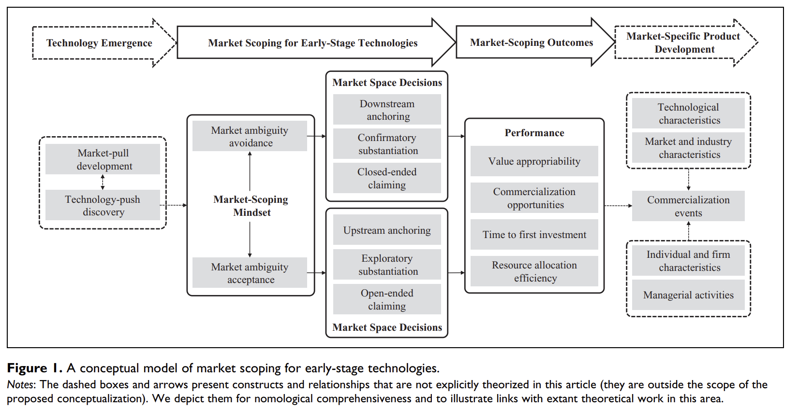
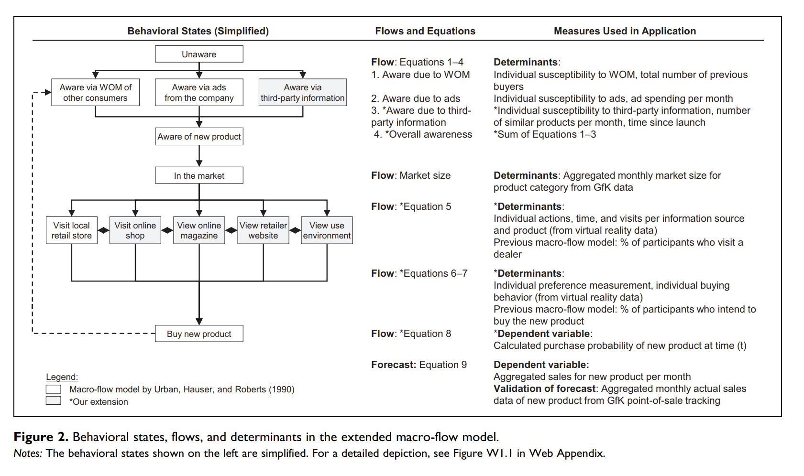
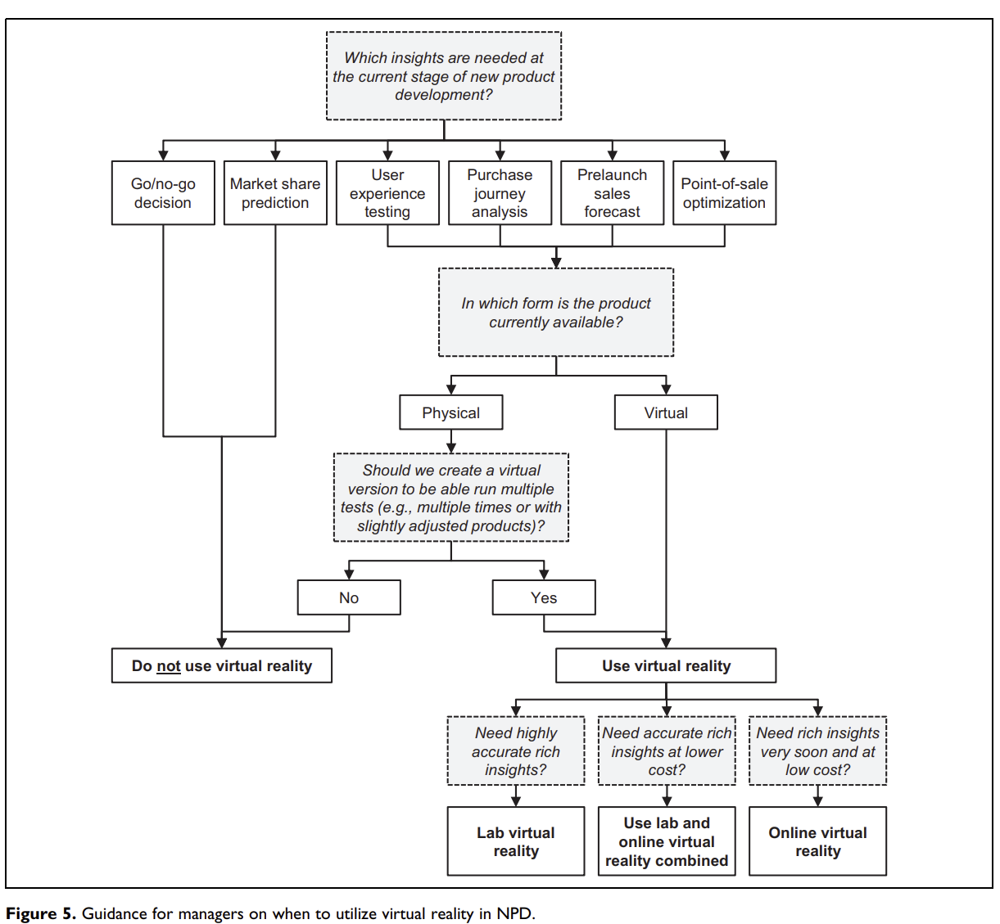

# Innovation

[@Chandrasekaran_2020] introduce a model for successive technologies adoption that accounts for:

-   Different rate of technology disengagement
-   Different rate of technology adoption

Diffusion

Bass Model [@Bass_1969]

$$
h(t) = p + qF(t)
$$

where

-   $h(t)$ = rate of adoption, given not adopted so far

-   $F(t)$ = cumulative fraction of adopters

-   p = coefficient of innovation, tendency to adopt independent social contagion

-   q = coefficient of imitation tendency to adopt due to social contagion

-   m = market size

After going public, firms increase their innovation levels (i.e., have more innovation), but those innovation are less risky (i.e., fewer breakthrough). [@Wies_2015]

There is an inverted U-shape relationship between product market competition and innovation [@aghion2005]

A way to track technology adoption life cycle [@meade2004]

[@amabile1990] found evaluation expectation lowers creativity

[@srinivasan2009a]

-   An empirical study that provides evidence for the link between product innovation and marketing investments on stock returns

-   Investors react favorably to pioneering innovation as compared to minor updates (7 times greater), and their associated advertising support is 9 times more effective

-   Perceived quality of the new product also affect stock returns

-   Price promotions have a negative impact on stock returns, which be interpreted that it signals weak demand.

[@slotegraaf2008] found that Permanent and cumulative sales effects are greater for brands with higher equity and more product releases, while brands with less equity benefit more from product introductions.

[@you2020] found that CEO and CMO characteristics (e.g., personalities, demographics, experiences, values) can affect innovation and stock returns

[@hitt1991]

-   Acquisition activity has a negative impact in R&D inputs and outputs (e.g., number of patents).

[@sorescu2003sources]

-   Dominant firms introduce fewer radical innovations than non-dominant firms.

-   Financial rewards for radical innovations vary greatly across firms and are tied closely to a firm's resource base.

-   Firms that provide higher levels of marketing and technology support and have greater depth and breadth in their product portfolio gain more from their radical innovations.

[@cao2022express]

-   Firms can use their innovation potential as a credible signal of their quality at the time of an initial public offering (IPO).

-   Innovation potential is positively associated with the initial value of the IPO and with first-day IPO returns, and negatively associated with the extent to which insiders sell their shares at the time of the IPO.

-   Patents have a stronger impact on insider sales than preannouncements and generic references to future innovation, while preannouncements have the strongest impact on first-day IPO returns.

[@mishra2013building] Acquisitions and Their Impact on a Firm's Innovation Base

-   **Research Context:**

    -   Innovation is key to sustainable competitive advantage.

    -   Firms aim to establish an innovation base: a collection of inventions, ideas, and discoveries to propel future innovations.

    -   Acquisitions as a strategy to build this innovation base.

-   **Literature Gap:**

    -   Mixed findings on the influence of acquisitions on post-acquisition inventions.

-   **Research Focus:**

    -   The impact of the type of acquisition, acquisition behavior over time, and characteristics of inventions on post-acquisition innovation outcomes.

-   **Methodology:**

    -   Analysis of 352 firms spanning five industries over a 17-year period.

-   **Key Findings:**

    1.  Firms that engage in acquisitions tend to create a more robust innovation base compared to firms that don't.

    2.  Type of acquisition matters:

        -   **Vertical Acquisitions:** Integrating firms from different stages of the same industry supply chain.

        -   **Horizontal Acquisitions:** Integrating firms from the same stage of similar industry supply chains.

    3.  The breadth of knowledge within the acquiring firm is pivotal in determining the success of either acquisition type in enhancing the innovation base.

[@mallapragada2017innovativeness] Franchising Impact on Innovation

-   **Context:** Increasing trend to improve innovation by extending firms' boundaries through franchising.

-   **Objective:** Explore the effects of:

    -   Franchising on organizational innovativeness.

    -   Interactions with firm characteristics: franchising experience, firm size, financial leverage, and slack resources.

-   **Data Source:**

    -   Panel data from 38 U.S. restaurant chains (1992-2005).

-   **Methodology:**

    -   Nonlinear seemingly unrelated regression model.

-   **Core Findings:**

    -   Positive relationship between franchising emphasis and product innovativeness.

    -   This effect intensifies for firms with high financial leverage but weakens for those with high slack resources.

    -   For process innovativeness, the effect strengthens for firms with high financial leverage. It weakens for large firms, firms with high franchising experience, and high slack resources.

-   **Significance:**

    -   Franchising has a conditional impact on product and process innovation outcomes.

    -   It acts as an alternative method to alliances and joint ventures in influencing organizational innovativeness.

## Innovation Measure

[@chang2021board]

1.  Obtain information on patenting activities from the National Bureau of Economic Research (NBER) patent database, which provides detailed information for patents granted by the U.S. Patent and Trademark Office (USPTO) from 1976 to 2006.
2.  Use the patent data provided by Kogan et al. (2017) to update patent information through 2010.
3.  Use patent-based metrics to proxy for firms' innovative activity, as they measure innovation output that incorporates the effectiveness of firms' use of innovation input following Chemmanur et al. (2014).
4.  Measure a firm's patenting activity using two measures:
    1.  Number of patents applied for and ultimately granted by the USPTO in a given year, using the application year rather than the grant year to measure a firm's innovation in a given year.

    2.  Number of subsequent citations received by all patents filed in a given year that captures the quality and influence of innovation.
5.  Correct for two types of truncation problem as follows:
    1.  End the sample period in 2008 to mitigate the potential truncation issue on the lag between patent application and grant date.

    2.  Correct for truncation bias in patent citations using the technology class-year fixed effect approach in Hall et al. (2001, 2005).
6.  Use the natural logarithm form of each measure to mitigate bias introduced by outliers.
7.  In extended analysis, obtain results based on alternative measures of innovation activities, such as R&D expenses, innovation efficiency originality, and generality to provide a complete picture.
8.  In untabulated tests, use raw citations, citations excluding self-citations, adjusted citations based on a weighting index, and the economic value of patents following Kogan et al. (2017).
9.  Reach the same conclusion using these alternative measures of patent quality.

## New Product Development

[@moorman1999contingency] The Contingency Value of Complementary Capabilities in Product Development

-   **Objective:** Revisit and advance the interdisciplinary discourse on the direct relationship between organizational capabilities and firm performance by introducing a contingency-based approach centered on the role of external environmental information.

-   **Conceptual Premise:** The paper posits that the external environment's informational content modulates how firms utilize their inherent technological and marketing capabilities, particularly concerning their product development efforts -- both in magnitude and pace.

-   **Methodology:**

    -   Conducted a longitudinal quasi-experiment to insulate and discern the interplay between external information cues, organizational capabilities, and product development outcomes.

-   **Key Findings:**

    -   Data analysis corroborates the proposed framework. Specifically, external environmental information acts as a catalyst, prompting firms to deploy their capabilities in ways that influence their product development trajectories.

    -   The nuanced relationship uncovered underscores the flexibility of organizational capabilities, suggesting their primary value might not be in their sheer existence, but in their adaptive deployment in alignment with external cues.

[@sethi2001cross] Cross-functional product development teams, creativity, and the innovativeness of new consumer products

-   Using survey from cross-functional teams in new product development.

-   **Objective:** The study examines the impact of cross-functional team characteristics and contextual influences on product innovativeness, given its crucial role in preventing new product failure.

-   **Main Findings:**

    1.  **Primary Cause of Product Failure:** A lack of innovativeness is the main reason for new product failure. Innovativeness is defined as providing uniquely meaningful benefits.

    2.  **Factors Positively Affecting Innovativeness:**

        -   Strong superordinate identity within the team.

        -   Encouragement to take risks.

        -   Influence from customers.

        -   Active project monitoring by senior management.

    3.  **Social Cohesion:** While beneficial up to a point, high levels of social cohesion among team members decrease innovativeness.

    4.  **Interactions Between Factors:**

        -   The positive effect of superordinate identity on innovativeness is amplified when teams are encouraged to take risks.

        -   This positive effect is reduced with increased social cohesion.

    5.  **Functional Diversity:** This doesn't significantly influence innovativeness.

-   **Implications:** The authors highlight the importance of understanding these dynamics for both management practice and future research on product development teams.

[@luo2007new] NPD Under Channel Acceptance

[@slotegraaf2011product] Value of Stability in New Product Development (NPD) Teams

-   **Background:**

    -   The significant role of cross-functional teams in innovation.

    -   Despite firms adopting cross-functional setups for NPD teams, they encounter challenges.

-   **Research Gap:**

    -   Understanding the role of stability in NPD teams, especially its effect on decision-making processes.

-   **Objective:**

    -   To decipher how stability within NPD teams impacts decision-making processes, and consequently, the success of new products.

-   **Methodology:**

    -   A process-based model to investigate the influence of team stability.

    -   Sample: Cross-functional NPD project teams from 208 high-tech firms.

-   **Key Findings:**

    1.  **Stability and its Impact**: The relationship between NPD team stability and team-level debate & decision-making comprehensiveness is curvilinear (i.e., having a turning point).

    2.  **Decision-Making Dynamics**: Team-level debate positively influences decision comprehensiveness.

    3.  **Product Success**: Decision comprehensiveness positively impacts new product advantage, but this is particularly pronounced at high levels of comprehensiveness.

[@grewal2013environments] Environments, Unobserved Heterogeneity, Effect of Market Orientation on Outcomes for High-TechFirms

-   **Context:**

    -   Studying the interaction between market orientation and environment facets is a key focus in market orientation literature.

    -   Previous empirical studies have shown mixed findings regarding this interaction.

-   **Main Proposition:**

    -   The inconsistency in findings might be due to unaccounted unobserved heterogeneity that potentially hides the true relationships.

    -   Unobserved heterogeneity might arise from higher order interactions involving factors like firm size and innovativeness.

-   **Methodology:**

    -   Two studies presented focusing on firm performance or new product performance as the outcome.

    -   Studies consider:

        1.  Market orientation, technological turbulence, market dynamism, and their interactions as explanatory variables.

        2.  Use finite mixture regression models to estimate relationships while factoring in unobserved heterogeneity in the form of latent regimes (segments).

        3.  Incorporate firm size and innovativeness as profiling variables in the model.

-   **Core Findings:**

    -   Disaggregate models (multi-regime solutions) provide the best fit in both studies.

    -   The effects vary across latent regimes, suggesting that potential aggregation bias might be present in previous empirical studies.

    -   There's a need for disaggregated analyses to study marketing phenomena accurately.

-   **Theoretical Implications:**

    -   The findings hint towards the possibility of forming theories that take into account unobserved heterogeneity and potentially higher order interaction effects.

[@wu2015sleeping] Stock Market Reactions to Horizontal Collaborations in New Product Development (NPD)

-   **Background:**

    -   Rising trend of firms partnering with competitors for NPD.

    -   Limited research on how the stock market perceives these collaborations.

-   **Objective:**

    -   Analyze stock market reactions to horizontal collaborations across various NPD phases: initiation, development, and commercialization.

-   **Methodology:**

    -   Analysis of a unique dataset containing 831 NPD announcements related to horizontal collaborations over a span of 12 years.

-   **Key Findings:**

    1.  **Initiation Phase**: Stock market typically reacts positively to horizontal collaborations in the NPD initiation phase.

    2.  **Development and Commercialization Phases**: The reaction is generally negative during the development and commercialization phases of NPD.

    3.  **Asymmetrical Moderation**: The innovativeness of the new product and the relative market and technological strengths of the collaborating competitor moderate these effects.

[@kim2016brand] Enhancing New Product Development Through Consumer Co-Creation and Brand-Embedded Interaction

-   **Research Context:**

    -   Emphasizes the importance of accessing market knowledge promptly for effective new product development (NPD).

    -   Previous research promotes consumer co-creation during the NPD process, typically viewing consumer input as static.

-   **Study Proposition:**

    -   Challenging the notion of consumer-generated content as fixed, the study explores how firms can elevate the quality of consumer suggestions by promoting relevant information exchange during co-creation.

-   **Concept Introduction:**

    -   **Brand-Embedded Interaction:** A process encouraging consumers to generate NPD ideas that satisfy both consumer needs and are in line with the brand's aspirations and abilities.

-   **Methodology:**

    -   Two quasi-field experiments on Twitter.

-   **Key Findings:**

    1.  Dynamic interaction and personalized engagement during co-creation are instrumental.

    2.  Such interactions enable consumers to produce more "constructive" NPD ideas -- ideas beneficial for both the consumer and the firm.

[@srinivasan2018corporate] Corporate board interlocks and new product introductions

-   **Context:**

    -   Firms' boards of directors influence various strategic outcomes.

    -   However, the impact of boards on new products, a pivotal aspect of organizational adaptation, hasn't been deeply studied.

-   **Core Propositions:**

    -   The study focuses on "board interlock centrality", which denotes how connected a firm's board members are to boards of other companies.

    -   The central argument is that this centrality provides firms with enhanced market intelligence, thus facilitating the introduction of incremental new products.

    -   The motivation-opportunity-ability theory is used to suggest that two facets of board leadership can moderate this effect:

        -   **Internal vs. External Leadership:** How the leadership of the board is oriented.

        -   **Marketing Leadership:** The presence and influence of marketing expertise in leadership roles.

-   **Methodology:**

    -   The hypotheses are tested using data from publicly-listed US consumer packaged goods firms. This sector is chosen because it frequently sees incremental product innovations.

-   **Core Findings:**

    -   Board interlock centrality indeed boosts new product introductions.

    -   This effect is magnified when:

        -   There's strong internal leadership.

        -   The board has internal marketing leadership.

        -   The firm's CEO has a marketing background.

    -   Conversely, the effect diminishes when there's a pronounced intra-industry external leadership presence.

    -   These results underscore the importance of board interlocks on innovation outcomes, enriching the discourse on marketing leadership, board interlocks, and social networks.

[@molner2018] Market Scoping

-   Managers' market-scoping mindset (manifest as market ambiguity avoidance or acceptance) can shape market space decisions and outcomes

-   Avoidance leads to managers' downstream orientation toward end users, leading to technology commercialization failure

-   Acceptance leads to managers' upstream orientation, and helps uncover viable market spaces.

{width="90%"}

[@ho2020using] Marketing Continuous Improvement Products (CIPs): The Role of Development Information

-   **Introduction:**

    -   **Continuous Improvement Products (CIPs)**: Products designed for post-purchase improvements without the need for full replacement.

    -   **Challenge**: Securing customer adoption of CIPs.

-   **Research Design:**

    -   Employed multimethod research across two different types of studies to examine factors influencing CIP adoption.

-   **Key Findings:**

    1.  **Development Progress Information**: Sharing updates or information about the progress of a product's development increases the adoption of the current version of the CIP.

    2.  **Perceived Commitment**: The relationship between sharing development information and increased adoption is mediated by customers perceiving a stronger commitment from developers toward continuous improvement of the product.

    3.  **Role of Product Familiarity**: The influence of development information on adoption, through perceived developer commitment, is stronger for individuals familiar with the product. In other words, the more familiar customers are with a product, the more they value and trust the developer's commitment based on the shared development progress.

[@harz2021] Virtual Reality in NPD: durable goods

-   Prelaunch sales forecasting approach

-   Virtual reality support behavioral consistency between participant's info search, preferences, and buying behaviors

-   Research questions

    -   Does virtual reality improve pre-launch sales forecasting?

    -   Why do VR simulations (vs. traditional studio tests) lead to advantage in forecasting?

-   Data:

    -   GfK sales data

-   Virtual Reality:

    -   Visualization capability: "the ability to simulate new products, customer touchpoints, and environments in a comprehensive, realistic, and engaging manner." (p. 158)

        -   Simulation scope

        -   Similarity to reality

        -   Immersion

    -   Automated-tracking capability: Tracking of behavior

        -   Interactivity

-   Virtual reality types

    -   Lab virtual reality

    -   Online virtual reality

-   Extended Macro-Flow Model

    -   models forecast the sales of new products over time before market launch [@urban1990]

    -   Need 3 states

        -   Behavioral states: attitudes and actions through which consumers flow in their purchase journal

        -   the flows between these states

        -   determines of these flows

{width="90%"}

-   Studies 1a and 1b: 2 durables' products, use GfK for data collection. lab virtual reality, online virtual reality. (good prediction after adjusting for advertising).

    -   Benchmark macro-flow model: info acceleration.

    -   Conjoint analysis, survey on purchase intentions.

    -   Better forecasting accuracy comes from virtual purchases with preferences in the purchase decision stage, adding awareness via third-party information

    -   At the aggregate and individual levels, this model has better prediction performance

-   Study 2: a lab vs. an online virtual reality purchase journey simulation vs. a traditional studio test with real products.

    -   VR mechanisms: presence ("the phenomenon of the participant feeling as if they are actually in the simulation" p. 169) and vividness ("the extent to which consumers feel that a simulation is lively and detailed as well as easy to imagine and remember" p. 169).

{width="90%"}

## Research and Development

[@king2008performance] Exploring Resource Interactions in Acquisitions and Firm Performance

-   **Objective**:

    -   Investigate the role of resource interactions between acquiring and target firms in determining post-acquisition performance.

-   **Key Findings**:

    1.  **Average Acquisition Impact**: Acquisitions, in general, do not automatically lead to higher firm performance.

    2.  **Complementary Resources**: Complementary resource profiles between target and acquiring firms can lead to positive abnormal returns.

        -   **Marketing-Technology Complementarity**: If the acquiring firm has strong marketing resources and the target firm has robust technology resources, these tend to complement each other, leading to enhanced performance.

        -   **Technology-Technology Substitution**: If both the acquiring and target firms have strong technology resources, they can substitute for each other, which may not yield the expected synergistic benefits and might even harm performance.
