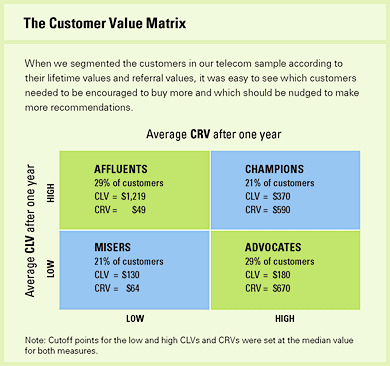

# CLV

"A year’s projected business gives a number that is normally about half of a customer’s full lifetime value, although that can vary by industry." [@kumar_2007]

[@Kumar_2008] CLV model


$$
CLV_i = \sum_{j = T+1}^{T+N} \frac{p(Buy_{ij}=1)\times \hat{CM}_{ij}}{(1+r)^{j-T}} - \frac{\hat{MC}_{ij}}{(1-r)^{j-T}}
$$

where  

 * $CLV_i$ = lifetime value for customer i,  
 * $p(Buy_{ij})$ = predicted probability that customer i will purchase in period j,  
 * $CM_{ij}$ = predicted contribution margin provided by customer i in period j,  
 * $MC_{ij}$ = predicted marketing costs directed toward customer i in period j,   
 * $j$ = index for time periods (semiannual or annual)  
 * $T$ = the end of the calibration or observation time frame (usually 1 year projection),  
 * $N$ = total number of prediction periods,  
 * $r$ = semiannual discount factor (e.g., 0.07238 [@Kumar_2008] = 15% annual rate)

## Referral value (CRV)

"Referrals made by customers after a referral-incentive marketing campaign can be attributed to that campaign for about a year." [@kumar_2007]. Hence, we usually count those referrals made after one year of a campaign.  

2 types of referral:  

 * Type-one referral: Would not join without referral.  
 * Type-two referral: still join without referral.  


[@kumar_2007] estimated that each customer made about half type-one and half type-two referrals. 

Referral value = PV(Type-one referrals) + PV(Type-two referrals)  

where  

 * PV(type-two referrals) = the prevent value of the savings in acquisition costs. 

$$
CRV_i = \sum_{t =1}^{T} \sum_{y = 1}^{n1} \frac{A_{ty} - a_{ty} - M_{ty} + ACQ1_{ty}}{(1+r)^t} + \sum_{t=1}^{T} \sum_{y = n1+1}^{n2} \frac{ACQ2_{ty}}{(1+r)^t}
$$

where  

 * T = the number of periods that will be predicted into the future (e.g., typically 1 year)  
 * $A_{ty}$ = the gross margin contributed by customer y who other otherwise would not have bought the product,  
 * $a_{ty}$ = the cost of the referral for the customer y (this is what you set up)  
 * $n1$ = the number of customers who would not join without the referral,  
 * $n2-n1$ = the number of customers who would have joined anyway,  
 * $M_{ty}$ = the marketing costs needed to retain the referred customers,  
 * r = semiannual discount factor ([@Kumar_2008] used .07238 = 15% annual rate)  
 * $ACQ1_{ty}$ = the savings in acquisition costs from customers who would not join without the referral,  
 * $ACQ2_{ty}$ = the savings in acquisition cost from customers who would have joined anyway.  


Customers with high CLV does not guarantee high CRV [@kumar_2007]. Hence, [@kumar_2007] proposed the customer value matrix  


```{r fig.align='center', echo=FALSE}
library("jpeg")

```