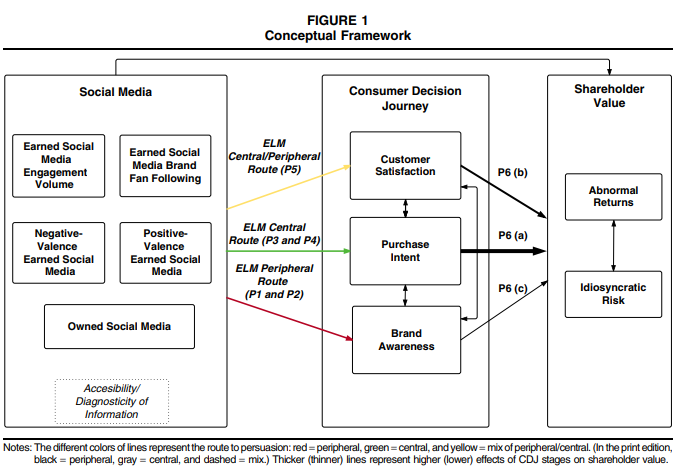
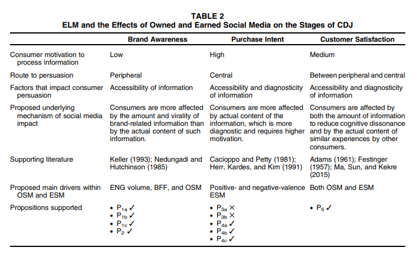

# Virtual Environment

API and webscraping can be used to [@boegershausen2022] (for technical tutorials, see table W2)

-   Study new phenomena in marketing

-   Boosting ecological value

-   Help advance method to deal with this new type of data

-   Improve measurement

Researchers should not create fake accounts to scrape

Threat to internal validity:

-   Algorithmic interference [@xu2019] (e.g., sorting or recommendation system)

-   Inter-temporal stability: changes to data sources

Documenting data

-   Logbook: note important events

-   Write documentation for the data collection process: following [@gebru2021]

-   Consider long-term data archival space: [Zenodo](https://zenodo.org/), [dataverse](https://dataverse.org/), [Harvard Dataverse](https://dataverse.harvard.edu/), [DataCite](https://datacite.org/), [re3data](https://www.re3data.org/)

-   Let others use your data: following Creative Commons License

Review papers:

[@kannan2017] Digital Marketing Framework

[@sridhar2019]: Digital, data--rich, and developing market (D3)

[@verhoef2019]: Digital business models

[@lamberton2016]

-   look at at changes in academic on digital, social media, and mobile (DSMM) marketing themes from 2000 2015

-   DSMM as

+-------------------+---------------------------------------------------------------------------------------------------------------------------+----------------------------------------------------------------------------------------------------------------------------------------------------+----------------------------------------+
|                   | Theme 1: facilitator of individual expression (self-expression and communication)                                         | Theme 2: decision support tools                                                                                                                    | Theme 3: market intelligence source    |
+===================+===========================================================================================================================+====================================================================================================================================================+========================================+
| Era 1 (2000-2005) | with online communities                                                                                                   | recommendation agents and comparison matrices                                                                                                      | help firms predict consumer behaviors. |
|                   |                                                                                                                           |                                                                                                                                                    |                                        |
|                   |                                                                                                                           | -   [@häubl2000] found that with decision aids, consumers enjoy higher-quality alternatives, lower search cots, better choices.                    |                                        |
|                   |                                                                                                                           |                                                                                                                                                    |                                        |
|                   |                                                                                                                           | -   [@brynjolfsson2003a]online retailers have to respond to a stronger price competition than offline retailers.                                   |                                        |
|                   |                                                                                                                           |                                                                                                                                                    |                                        |
|                   |                                                                                                                           | -   Internet boom does not mean price war or choice overload for consumers                                                                         |                                        |
+-------------------+---------------------------------------------------------------------------------------------------------------------------+----------------------------------------------------------------------------------------------------------------------------------------------------+----------------------------------------+
| Era 2: 2005-2010  | Online WOM                                                                                                                | Theme 2 and 3 merged together.                                                                                                                     | [@katona2008]                          |
|                   |                                                                                                                           |                                                                                                                                                    |                                        |
| 50% penetration   | WOM referred customers have greater long-term value than traditionally acquired customers [@villanueva2008] [@trusov2009] | Who drives diffusion: audience + influencers                                                                                                       | [@katona2010]                          |
|                   |                                                                                                                           |                                                                                                                                                    |                                        |
|                   |                                                                                                                           | [@trusov2010] found a way to identify influential users in online social networks                                                                  |                                        |
+-------------------+---------------------------------------------------------------------------------------------------------------------------+----------------------------------------------------------------------------------------------------------------------------------------------------+----------------------------------------+
| Era 3: 2011- 2015 | People are more expressive                                                                                                | UGC as a marketing tool                                                                                                                            |                                        |
|                   |                                                                                                                           |                                                                                                                                                    |                                        |
| 80% penetration   |                                                                                                                           | Consumption and production are tradeoffs (people consume more content will produce less content, and vice versa) at individual level [@ghose2011a] |                                        |
+-------------------+---------------------------------------------------------------------------------------------------------------------------+----------------------------------------------------------------------------------------------------------------------------------------------------+----------------------------------------+

-   Papers usually include methodological keywords which suggests that the new paradigm new methods to play with new data types (click stream, online chat, etc.)

-   During this period DSMM in both worlds (academia and practice) correspond well.

@tonietto2020 show that generating content during an experience increases feelings of immersion and accelerate perceived time, which in turn enhances enjoyment of the experience. Moreover, consumers who are incentivized or motivated by social norms to generate content have the same experiential benefits as those who create content organically.

@lacka2021 define price impact as" the impact on the variance of stock price." They estimate the permanent and temporary price impacts of the firm-generated Twitter content of S&P 500 IT firms: firm-generated tweets induce both permanent and temporary price impacts, depending on valence and subject matter. Tweets reflecting **only valence or subject matter** concerning consumer or competitor orientation onlly have **temporary** price impacts, while those with both attributes generate permanent price impact. Moreover, negative valence tweets about competitors generate the largest permanent price impacts.

@golmohammadi2021 show that firm responses to complaints on social media increase the potential public exposure of complaints. This negative effect can outweigh any positive customer care--signaling impact from firm responses. More specifically, a response strategy that has a high level of complaint publicization (e.g., detailed responses through multiple communication exchanges) could decrease **perceived quality** and **firm value**, diminish the positive impact of a firm's own posts, and increase the volume of future complaints. These adverse impacts are stronger for firms that are targeted by retail investors.

@miao2021 define avatars as "digital entities with anthropomorphic appearance, controlled by a human or software, that are able to interact." (p. 5). The authors also offer a 2x2 typology of avatars (behavioral realism and form realism) from low to high.

@bharadwaj2021 extracted emotions from salespeople using their livestream videos. In one-to-many screen-mediated communications, salespeople should not display emotions.

@jia2020 found that there is an inverse size-speed association (i.e., speed-based scaling effect induces people to estimate the size of an object to be smaller when it is animated to move faster) when they see digital ads (because they learned from other animate agents such as animals). To mitigate this effect, ad creator can (1) reduce the similarity between the movement of object in the ads with objects in other domains (e.g., human, animals), (2) give consumers more knowledge about the domain, (3) highlight product size information. Interestingly, the effect can be reserved when a positive size-speed association in the base domain is made accessible.

@koukova2008 found evidence from experiments that consumers' content consumption preferences (e-book, books, etc) vary across platforms

[@yadav2014] reviews marketing in computer-mediated environments

[@grewal2021] Multimedia Medium (Twitter, Facebook, Instagram) and Modality (auditory, tone, visual, olfactory, gustatory, haptic systems, visual)

1.  Data Gathering

-   Consumer privacy

-   Legal and ethical concerns regarding web scraping

2.  Data Analysis

-   Feature extraction

-   Dimensionality reduction

3.  Interpretation

Substantive Challenges

-   Sentiment-based targeting

-   Location-sensitive targeting

-   Computers as Consumers

-   Privacy Risk

## Email

[@munz2020]

-   Having donation receivrs with similar names can encourage donors to open and donate more.

-   Potential donors with similar surname first letter with donation receivers can also increase generosity

[@sahni2018]

-   personalizing the emails by adding consumer-specific information (e.g., recipient's name) benefit advertisers.

-   Personalization increases opening, sales, and reduces unsubscribing probability.

## Social Media

To find relevant hashtags to an issue, consult with

-   <http://best-hashtags.com/>

-   <https://ritetag.com/>

Review

-   B2B: [@salo2017]

Social Media Metrics and Dashboards [@peters2013social]

[@pelletier2020]

-   Consumer usage motivation for Facebook, Twitter, and Instagram and understanding which platforms consumers prefer to use to co-create with brands
-   Types of customer response:
    -   Social purpose: interact with others and share content with others

    -   Information purpose: seeking out info, news, events, professional business purposes

    -   Entertainment purposes: have fun or follow their favorite celeb and pop culture events

    -   Convenience purposes just to browse and observe when they are bored
-   Uses and gratification theory: benefits extracted from a media source vary based on the different purposes for which a person chooses to consume media. [@severin1997communication]
    -   Social motivation: people use platforms with more broad ways of communications for social motivation (e.g., Facebook)

    -   Informational motivation: users with informational purpose usage will come to the platform with an emphasis on real-time information (Twitter)

    -   Entertainment motivation: Hedonic purpose is to escape and enjoy experiences (Instagram). Users with entertainment purposes will go to a platform with an emphasis on hedonic experiences (Instagram)

    -   convenience motivation: a source of convenience or distribution (to pass the time). Easy browsing to scroll content (e.g., Instagram). Users will go to the platform with visual content and minimal text (Instagram). People find all platforms (Instagram, Facebook, and Twitter) convenient.
-   Users who desire to engage in co-creation will go to a platform with a broader array of communications mechanisms.
-   With social media, consumers co-create brand stories and share personal experiences, which can enhance or destroy brand equity
-   Findings:
    -   For informational purpose, consumer use twitter

    -   For social purposes, people like to use Twitter and Instagram

    -   Instagram is a primary platform for entertainment motivation and co-creating with brands

    -   Facebook has the lowest usage intentions and co-creation (despite being the largest platform and network most widely used by marketers) Even though practitioners have a strong bias toward Facebook as a social media promotional platform, but then one size does not fit all.

[@schweidel2014listening] Listening in on Social Media:

-   Joint modeling of sentiment in social media posts and venue format.

-   The content of the post and sentiment towards the brand affects both processes.

-   Common monitoring approaches can lead to misleading brand sentiment metrics.

-   Model-based measure of brand sentiment serves as a leading indicator of external performance measures

[@appel2020future]

Social media:

-   "a collection of software-based digital technologies---usually presented as apps and websites---that provide users with digital environments in which they can send and receive digital content or information over some type of online social network" (p. 80)

-   "social media to be a technology-centric---but not entirely technological---ecosystem in which a diverse and complex set of behaviors, interactions, and exchanges involving various kinds of interconnected actors (individuals and firms, organizations, and institutions) can occur" (p. 80)

Social media at present

1.  Platform: major and minor, established and emerging the at providing the underlying tech and business model

2.  Use cases: How various kinds of people and orgs are using this tech and for what purpose

This paper categorizes social media as

1.  Communication between known others (e.g., family friends)
2.  Communication between unknown but share common interests
3.  Access and contribute to digital content (e.g., news, gossip, and product reviews)

Future of social media in marketing

1.  Immediate future:
    1.  Omni-social presence: sharing is embedded on every social platform, embedded in every digital tool. Platforms broaden their platform to encompass the Omni-social world. Affect consumer decision-making process (beginning to end). Social media is shaping the cultural world.

    2.  The rise of influencers: increase accessibility and appeal of social media. Micro influencer (more authentic and credible), virtual influencer (i.e., non-human, CGI).

    3.  Privacy concerns on social media: no hard privacy definition., more and more people delete social media.
2.  Near future
    1.  Combating loneliness and isolation: on the rise

    2.  Integrated customer care: social-media-based customer care., reduced customer service using humans.

    3.  Social media as a political tool:
3.  Far future
    1.  Increased sensory richness: AR, VR

    2.  Online, offline integration and complete convergence: omni channel approach (e.g., mobile app to do AR) online and offline self (self presentation)

    3.  Social media by non-humans: AI, social bots, hard to do attribution model, buy likes and shares, erode consumer trust,

[@kietzmann2011social]

Seven functional building blocks:

1.  Identity: self-disclosure
2.  Conversation
3.  Sharing
4.  Presence
5.  Relationships
6.  Reputation: not only people but also content
7.  Groups

Differences Matter: the 4 Cs the 4 Cs: cognize, congruity, curate, and chase - relate how firms should develop strategies for monitoring, understanding, and responding to different social media activities

-   Cognize: firms should recognize and understand their social media landscape

-   Congruity: develop strategies that are congruent with different social media functionality

-   Curate: firms should be the curator of social media interactions and content.

-   Chase: firms should understand the conversation and info flow of social media content.

[@srinivasan2015]consumer journey (know-feel-do pathway)

-   Studied low-involvement product (fast moving consumer good)

-   Earned media drive sales

-   higher consumer activity on earned and owned media lead to consumer disengagement (e.g., unlikes)

-   On top of traditional marketing sales drivers (distribution, price), earned and owned social media can also explain part of the path to purchase.

[@zhang2017] Correlation between online shopping and social media

-   In the long run, social media usage is positively correlated with shopping activity

-   In the short run, immediately after social media usage, online shopping activity is lower.

[@buratti2018]

-   SMM is an accessible and low-cost way to create a competitive advantage even in conservative sectors - B2B services (e.g., tanker shipping companies and ocean carriers).

[@Karkkainen2010]

-   B2B businesses utilized social media less than B2C businesses.

-   The front-end phase of the new product development (NPD) process and the launch/commercialization phase provide the highest social media innovation potential for B2B businesses.

[@herhausen2022]

-   Active listening and empathy in the firm's response evokes gratitude in high-arousal customers, even if the actual failure is not (yet) recovered.

[@colicev2018b] Owned Social Media (OSM) vs. Earned Social Media (ESM)

-   The volume of ESM engagement influences brand awareness and purchase intent, but not customer satisfaction.

-   Positive and negative valence of the ESM has the greatest influence on customer satisfaction.

-   OSM boosts brand recognition and customer happiness, but not purchase intent, demonstrating its nonlinear influence.

-   OSM enhances purchase intent for high participation utilitarian brands and for brands with higher repute, suggesting that socially responsible business practices provide OSM greater legitimacy.

-   Purchase intent and customer satisfaction impact shareholder value positively.

Definitions:

-   Brand-controlled social media: Owned social media (OSM)

-   Social media exposure via voluntary, user-generated brand mentions, recommendation, and so on that are not directly generate or control by a company is earned social media (ESM)

Background

-   Research (see table 1 - p. 38) has shown positive impact of social media on consumer mindset metrics (e.g., brand awareness, purchase intent, customer satisfaction) which lead to higher firm performance, but no explicit mediation path.

{width="90%"}

{width="90%"}

Data

-   Sampling steps

    -   obtain detailed OSM and ESM data from a third-party data provider

    -   obtain data on consumer mindset metrics

    -   Sample brands that follow a coporate branding strategy

    -   brand must be listed on the US stock exchange.

-   Social Media Measures

    -   OSM: From Facebook, Twitter, but not YouTube.

    -   Earned Social Media:

        -   Brand fan following: Cumulative daily numbers of FB likes, Twitter followers, YouTube subscribers.

        -   ENG volume: Daily cumulative number of people talking about this (PTAT) on Facebook, Twitter user re-tweets, YouTube video views

        -   positive and negative-valance: based on a composite volume -valence metric that captures the number and popularity of the user posts based on naive Bayes algorithms.

    -   Apply factor analysis with Varimax rotation on all metrics within each construct to obtain a one-factor solution for each.

    -   Consumer mindset metrics from YouGov.

    -   Missing product and brand level heterogeneity (in the Web appendix mentioned that brand's rating on hedonic-utilitarian scale and product purchase involvement), but likely used human coders following [@bart2014]

Methodology

-   Persistence-modeling framework [@dekimpe1995]

[@trusov2009effects]

-   WOM referrals have stronger and longer carryover effects than traditional marketing

-   WOM referrals result in higher response elasticities

-   Monetary value of WOM referrals can be calculated through revenue from advertising impressions

-   This calculation provides an upper-bound estimate for financial incentives a company may offer to encourage WOM.

## Who-Generated Content

Observational and experimental work on Negative WOM [@sen2007]

Differences between Firm and User-generated content can be found in @colicev2019

@colicev2019 propose a framework of how FGC and UGC (based on information processing and source credibility) match on marketing funnel stages and related studies. UGC has a strong correlation with **awareness** and **satisfaction** while FGC (specifically vividness) are more effective for **consideration** and purchase intent. While UGC valence dominates UGC volume for these stages. Brands with higher corporate reputation have stronger relationships between dimensions of FGC and the marketing funnel stages.

["){style="display: block; margin: 1em auto" width="80%"}](https://ars.els-cdn.com/content/image/1-s2.0-S0167811618300508-gr1_lrg.jpg)

[@hewett2016]

-   Brand Buzz in the Echoverse

-   Echoverse: "the entire communication environment in which a brand/firm operates, with actors contributing and being influenced by each other's actions." (p. 1)

    -   Actors

        -   Firms: advertising, press releases

        -   Consumers: online WOM, attitudes, and behaviors

    -   Sources of actions: firms, news media, online WOM, consumer sentiment, and business outcomes

-   Data: longitudinal US financial services

-   Use: Vector Autoregressive Model with Granger causality

-   Can view table 1 for review on echoverse components

-   Symmetric echo between traditional media and online WOM.

-   Firm communications influence the traditional media, consumer sentiment, business outcomes (e.g., deposits)

-   Negative news spiral: Bad news can spread fast

    -   Solution: Twitter and press releases can save the day

-   Advertising do not directly affect traditional media, online WOM, or consumer sentiment, but directly affect firm outcome.

-   Firms care more about online WOM as compared to consumer sentiment (measured by survey)

-   Online WOM can affect consumer sentiment, but not the other way around.

-   Online WOM affects business outcome., but not the other way around.

-   Twitter gone from positive spiral to negative spiral overtime.

-   Even though firms counteract negative WOM with positive tweets, the volume of their tweets stay limited.

-   At first, Twitter has no impact on business outcome, but later they do have more significant impact on firm performance (p. 15)

-   Wells Fargo extremely positive tone backfire in negative firestorm, while consistent (i.e., large volume) of moderate tweets are better.

## Images

-   related to \@ref(brand-image)

Potential Variables:

-   Structural Complexity: complexity due to visual features [@pieters2010]. Measured by the Canny Edge Detection technique [@forsythe2003], because edge information is highly correlated with observed complexity

-   Color Complexity: complexity due to variety of colors within an image [@reinecke2013]. Measured by the color variety algorithm [@bingzhou2015]

    -   $C = \sum_{i = 0}^m n_i \log(\frac{n_i}{N})$ where

        -   $m$ is the number of distinct colors

        -   $n_i$ the number of pixels of the i-th color

        -   $N$ is the total number of pixels

-   Image Permanence: how adept images are at remaining in users' memory (after users are no longer looking at them) [@khosla2012; @khosla2015]. Measured based on AMNet memorability index [@fajtl2018], which has been verified by [@leyva2021video] (achieved near human consistency in predicting image memorability).

-   Number of faces: based on Google Vision API

-   Aspect ratio: height divided by width

-   Average HSV value: Average HSV values across all pixels within an image

-   Themes: LDA based on keywords (labels) from Google Vision API

@pieters2007 found that optimal feature design of ads (e.g., brand, text, pictorial, price, and promotion) can be achieved without increased costs. Moreover, the authors also propose two entropy-based measures of clutter effects, where they characterize the salience of feature ads based on Attention Engagement Theory.

@wedel2016 is a review on marketing analytics for data-rich environments. And competition for attention in these environments are more fierce.

@Li_2019 found a significant and robust positive mere presence effect of image content on user engagement in both product categories on Twitter, and high-quality and professionally shot pictures consistently lead to higher engagement on both platforms (e.g., Twitter and Instagram) for both product categories. However, the effect of colorfulness varies by product category, while the presence of human face and image--text fit can induce higher user engagement on Twitter but not on Instagram. And the fit between the image and the accompanying message matters

@Jalali_2016 study visual UGC. Where color compositions were operationalized as combinations level of hue, chroma, and brightness. Consumer engagement (i.e., click rate) is higher for photos that have higher proportions of green and lower proportions of red and cyan, as well as higher chroma of red and blue.

## Mobile and Smartphone

[@rangone2006] offers a framework in the domain mobile advertising

[@boyd2019branded] Influence of Branded Mobile Apps on Firm Value

-   **Context:**

    -   Increasing trend of firms launching branded mobile apps.

    -   Limited knowledge on how these apps influence firm value.

-   **Research Method:**

    -   Used stock market returns to measure firm value.

    -   Assessed the impact of announcements related to branded mobile app launches on firm value.

-   **Research Focus:**

    -   Investigate the influence of mobile app design on firm value, considering the various touchpoints apps introduce in the customer journey.

    -   Examined app features emphasizing:

        1.  Peer-to-peer interactions regarding the brand.

        2.  Personal-oriented interactions between the customer and the brand.

        3.  The purchase phase.

-   **Key Findings:**

    1.  Announcing the launch of a mobile app positively impacts firm value.

    2.  The features highlighted in the app design significantly influence this value creation.

[@cao2023free] Monetizing Free Mobile Apps

**Objective:**

-   Address the challenges faced by non-advertising-based mobile apps when attempting to monetize free services.

-   Investigate the effectiveness of different pricing strategies and aspects of product design.

**Strategies Evaluated:**

1.  **Pricing Strategies:**

    -   **Hard Landing:** A "pay or churn" approach where users face a paywall.

    -   **Soft Landing:** Users continue to access limited free services even after monetization.

2.  **Product Design:**

    -   Decision to provide exclusive secondary offerings to those users who subscribe.

**Methodology:**

-   A large-scale randomized field experiment with a mobile app firm.

-   Assessments of user behavior in response to implemented strategies.

-   Customer survey and a separate experiment on the Prolific platform to validate the mechanisms at play.

-   A follow-up field experiment to test generalizability.

**Key Findings:**

1.  **Soft Landing:** This approach reduced the willingness of existing users to subscribe.

2.  **Exclusive Secondary Offerings:** Offering exclusive benefits to paying users also decreased the willingness to subscribe.

3.  **Positive Interaction:** There's a beneficial interaction between the soft landing approach and exclusive secondary offerings, which positively influences subscriptions.

4.  **Generalizability:** The results from the second field experiment were consistent with the primary experiment.

**Theoretical Mechanisms:**

-   The findings suggest that users might perceive soft landing strategies as a less aggressive monetization method, which might reduce the immediate perceived need to subscribe.

-   Exclusive offerings, while appealing, might create a sense of divide among users. However, when paired with the soft landing strategy, users might view it as a fair trade-off, leading to increased subscriptions.

**Managerial Implications:**

-   While both soft landing and exclusive secondary offerings individually deter subscriptions, their combined application may be beneficial.

-   Firms should consider the interplay between pricing strategies and product design features when planning monetization.

@melumad2020 found that consumers derive not only function benefits, but also **emotional benefits** from their smartphones. Under stress, consumers want their smartphones, because smartphones give users greater stress relief. Moreover, this pacifying effect is greater for one's own smartphone than other's smartphones.

## Review

@finkelstein2012 found that as people gain more expertise, they are more likely to respond to negative reviews (i.e., feedback), which is robust for many domains (e.g., language acquisition, environment, marketing). novices are more likely to respond to positive feedback while experts seek and respond to negative feedback

[@buschken2016sentence] Sentence-based text analysis for customer reviews

-   Challenge in analyzing unstructured consumer reviews: making sense of topics expressed

-   Proposed a new model for text analysis using sentence structure in the reviews

-   Model leads to improved inference and prediction of consumer ratings

-   Sentence-based topics found to be more distinguished and coherent than word-based analysis

-   Data used from www.expedia.com and www.we8there.com to support findings.

@folse2016 defines negatively valenced emotional expressions as having intense language, all caps, exclamation points, emoticons in online reviews. Reviews with negatively valenced emotions are viewed as more helpful and damage attitude toward the product when used by experts, but when sued by novices, a negative self-reflection is observed and attitude towards the product is unchanged. Language complexity moderates the adverse effect of expertise on trustworthiness.

[@yazdani2018preaching] Effect of Reviews by Rank on Product Sales

-   **Objective**:

    -   Examine how reviews by top-ranked and bottom-ranked reviewers influence product sales.

-   **Data Source**:

    -   Sales data from 182 new music albums released over approximately three months.

    -   User review data sourced from Amazon.com.

-   **Methodology**:

    -   Use of instrumental variables to account for potential confounding factors in the measurement of online word-of-mouth impacts.

-   **Key Findings**:

    1.  **Greater Impact by Bottom-Ranked Reviewers**: Reviews from bottom-ranked reviewers have a more pronounced effect on sales than those from top-ranked reviewers.

    2.  **Influence of Top-Ranked Reviewers**: While they can act as opinion leaders, their effect on sales is predominantly seen in specific cases such as:

        -   New product releases.

        -   Products with high variability in existing reviews.

    3.  **Driving Factors for Differences in Influence**: The disparity in the influence of top- and bottom-ranked reviewers can be attributed to:

        -   **Content**: The nature and quality of the review written.

        -   **Identity**: The credibility and reputation of the reviewer.

    4.  **Robustness of Results**: The findings remain consistent across:

        -   Different product categories like music albums and cameras.

        -   Various metrics like sales and sales rank.

-   **Implications**:

    -   **For Businesses**: It's crucial for businesses to understand that not all reviews have equal impact. While top-ranked reviewers can have authority, it's the bottom-ranked reviewers that can potentially sway a larger audience.

    -   **For Consumers**: When making purchasing decisions, consumers should consider the content of reviews and not just the rank of the reviewer.

    -   **For Platforms**: Online platforms might consider re-evaluating their reviewer ranking systems or highlighting reviews that can provide the most accurate and influential information to potential buyers.

@dai2019

-   Based on Amazon reviews and experiments, Consumer reviews are less likely to be trusted for experiential purchases than they are for material ones.

-   This impact stems from the idea that ratings of experiences are less representative of the purchase's objective quality than reviews of actual objects. These findings reveal not only how **word of mouth** influences different types of purchases, but also the psychological mechanisms that underpin customers' reliance on consumer reviews. Furthermore, these findings imply that people are less responsive to being instructed what to do than what to have, as one of the first examinations into how people choose among numerous experience and material buying possibilities. [@wang2021]

-   extract and monitor products and attributes info from consumer reviews using machine learning and NLP (to create embedded representation)

    -   In customer evaluations, embedded representation characterizes (represents) textual data like particular product features by employing the words that surround such textual data (i.e., the contextual information). Neural networks are used to measure how similar different product attributes are based on what people say about them (i.e., contextual information), which shows similarities and differences in how people use the attributes. From this embedded representation, the model then picks out multi-level clusters of product attributes that show how abstract the product benefits are at different levels.

-   Close the gap between engineered attributes (i.e., concrete attributes) and meta-attributes (abstract attributes)

-   Survey can be inconsistent and time consuming.

[@sunder2019drives] Drivers of Herding Behavior in Online Ratings

-   **Objective:** Investigate how herding effects, driven by reference groups (crowd and friends), impact online ratings.

-   **Background:** While post-purchase evaluations are known to influence sales, the nuances of herding in online ratings remain underexplored.

-   **Key Insights:**

    1.  **Herding Significance:** Herding effects in online ratings are substantial, calling for a detailed understanding of its dynamics.

    2.  **Rater Experience:** As raters become more experienced, the impact of the crowd diminishes, while friends' influences grow.

    3.  **Divergent Opinions:** Differences in opinions among reference groups lead to varied herding effects based on the reference group and the rater's experience.

    4.  **Firm Product Portfolio's Role:** A diverse product range not only boosts perceived quality but also lessens the sway of social influence on ratings.

@nguyen2020 found that more expertise leads to less extreme evaluations. Reviewing experts have less impact on a brand valence metric (which affects page rank and consumer evaluation). And experts do benefit and harm service providers with their ratings. Hence, excellent experiences may lead to lower ratings from experts (than from novices)

Observational data show that experts are more likely to post negative reviews.

[@schoenmueller2020] found Polarity self-selection of online reviews and it reduces the informativeness of online reviews

[@banerjee2021] Q&A section (answered by other consumers and sellers) improve fit and match between products and consumers and reduce negative reviews regarding mismatch.

[@nishijima2021] interestingly found that Rotten Tomatoes ratings has no affect on box office performance using the categorization of "fresh" or "rotten." They obtain box office performance data from [boxofficemojo](https://www.boxofficemojo.com/)

[@park2021] The Fateful First Consumer Review

-   valence and volume are not independent

-   Positive first review can create long-term advantage in future WOM valance and volume, while negative first reveiw suffers long-term disadvantage in future WOM valance and volume.

-   Because of information-availability bias, consumers are entrenched with either positive or negative first reviews which renders difficulty for firms to correct their first negative review.

[@hoskins2021influence] Online Review Ratings: Differences Between Niche and Mainstream Brands

-   **Objective**:

    -   Explore the differences in the drivers of online review ratings between niche and mainstream brands.

-   **Data Source**:

    -   A unique dataset on the U.S. beer product category.

-   **Key Factors Examined**:

    1.  **Customer Review Valence**: The overall positive or negative sentiment of customer reviews.

    2.  **Professional Critics Review Valence**: Sentiment analysis of reviews by professional critics.

    3.  **Community Characteristics**: The nature and characteristics of the online community reviewing the product.

    4.  **Location Similarity**: How similar or close in location a reviewer is to a brand or other reviewers.

    5.  **Reviewer Characteristics**: Traits, behaviors, and preferences of individual reviewers.

-   **Major Findings**:

    1.  **Niche Brand Influence**: Niche brands are generally more affected by Online Word of Mouth (OWOM) because consumers typically have less established brand awareness and pre-formed brand imagery.

    2.  **Local Preference for Niche**: Reviewers tend to rate a local niche brand more favorably compared to non-local niche brands.

    3.  **Professional Critics vs. Online Community**: For the average reviewer, the online community's sentiment has a more profound influence than professional critics.

    4.  **Influence of Prior Reviews**: A review from the online community gains more traction when:

        -   The reviewer's expertise is high.

        -   The prior reviewer shares geographic traits with the subsequent reviewer.

    5.  **Alignment of Reviewer Sentiments**:

        -   Reviewers engaging more with products/brands tend to have sentiments that align with professional critics.

        -   Reviewers engaging more with the online community tend to resonate with that community's sentiment.

[@li2022history] Online Reviews on Intergenerational Product Sales

-   **Objective**:

    -   Investigate how online customer reviews of one product generation influence the sales of another generation within the same product series.

-   **Data Source**:

    -   Data from intergenerational pairs of point-and-shoot cameras sold on Amazon.com.

-   **Methodology**:

    -   Joint estimation of the current and previous generation models, with errors clustered at both daily and product levels.

    -   Use of instrumental variables to address potential endogeneity concerns related to online word-of-mouth measures.

-   **Key Findings**:

    1.  **Positive Influence of Previous Generation Reviews**: The valence (or tone) of reviews for the previous product generation positively impacts the sales of the current generation.

    2.  **Negative Impact on Previous Generation Sales**: Interestingly, the valence of current generation reviews negatively affects the sales of the previous generation.

    3.  **Factors Amplifying the Impact of Previous Generation Valence**: The positive effect of previous generation valence on current generation sales intensifies when:

        -   Uncertainty (as measured by the standard deviation) in reviews for the current generation is high.

        -   The current generation product receives favorable reviews (high valence).

    4.  **Factors Mitigating the Impact of Previous Generation Valence**: The positive effect weakens when:

        -   There's higher uncertainty in reviews for the previous generation.

        -   The current generation product has been available in the market for a more extended period.

-   **Implications**:

    -   **For Marketers**: The legacy of a product series plays a crucial role in shaping consumer perceptions and sales of newer versions. Ensuring consistent quality and addressing issues in earlier generations can bolster the success of future releases.

    -   **For Online Retailers**: Highlighting positive reviews of previous generations, especially when there's uncertainty around a newer product, can help boost sales.

    -   **For Consumers**: Evaluating reviews of earlier versions of a product can provide valuable insights into the expected performance and reliability of the current generation.

[@ordabayeva2022]

-   Negative internet reviews from socially distant (but not socially close) individuals may not be as harmful to identity-relevant brands. Because a negative review of an identity-relevant brand can threaten a client's identity, the consumer will seek to strengthen their relationship with the brand.

-   They show that this effect does not appear when the review is positive or when the brand is irrelevant.

[@chen2022] Order between rating and tipping matters

-   If customers rate a service professional before tipping, they will tip less

-   If customers tip before rating, the tipping amount is unchanged.

-   This negative effect is because customers think that they reward service providers already by reviewing, so they only need to tip a smaller amount

-   This negative effect is more pronounced when customers

    -   tip from their own pocket

    -   have higher categorization flexibility (i.e., considering rating as reward like tipping)

    -   think service professionals benefit from rating

-   To mitigate this effect, service professionals can highlight the consistency motivation between the rating and tipping sequence.

[@he2022]

-   There is a big online market where fake online reviews are sold and bought.

-   Fake internet reviews do help product vendors get better ratings and make more sales.

-   Most big companies don't buy fake reviews.

-   Online marketplaces try to stop fake reviews, but they can't always do it right away.

-   Fake reviews (bought on Facebook private groups) is correlated with short-term increase in average rating and number of reviews

-   When firms stop purchasing fake views, their average ratings decrease (due to share of one-star reviews), especially for young and low-quality products.

## Slacktivism

Supporting a political or social cause through social media or online petitions, with minimal work or commitment.

## e-Marketplace

[@dholakia1998makes] Analyzing Marketing Information and Hit-Rates on Commercial Home-Pages

**Objectives:**

1.  To comprehensively and rigorously document the types and nature of marketing information presented on commercial home-pages, aiming to uncover the primary objectives of prevalent commercial websites.

2.  To empirically identify key factors of commercial home-pages that contribute to higher visits or hit-rates.

**Framework & Methodology:**

-   The study draws inspiration from Resnik and Stern's "information content" paradigm to assess the informativeness of commercial home pages.

-   This approach aims to evaluate how much relevant and valuable information is being provided to visitors of these home pages.

**Potential Findings and Implications:**

1.  **Nature of Information:** The research may unveil specific types of marketing information that are predominant on commercial websites, which can shed light on the marketing priorities and strategies of companies on the web.

2.  **Informativeness Evaluation:** By using the "information content" paradigm, it's possible to determine how beneficial and valuable commercial home-pages are from a user's perspective.

3.  **Key Determinants of Hit-Rates:** By understanding which factors lead to increased visits, companies can optimize their websites to attract more visitors. This could include insights on website design, content prioritization, user experience, interactive elements, and more.

4.  **Value to Stakeholders:** The findings are particularly beneficial for:

    -   **Web Page Designers:** Insights can inform best practices in design and content placement to drive user engagement and hit-rates.

    -   **Businesses:** Especially for those looking to enhance their online presence, understanding what resonates with online audiences can be pivotal in shaping their online strategies.

[@burke2002technology] Consumer Value of Technology in Shopping

**Objective**:

-   To comprehend the value consumers attribute to innovations in customer interface technology during the shopping process.

**Methodology**:

-   A large-scale national survey involving 2,120 online consumers.

-   Exploration of consumer preferences in both online and brick-and-mortar shopping contexts.

-   Examination of 128 varied facets of the shopping journey, ranging from traditional elements to novel technological innovations.

**Key Findings**:

1.  **General Satisfaction**:

    -   **High Satisfaction**: Consumers generally find current retail offerings satisfactory in terms of convenience, product quality, selection, and perceived value for money.

    -   **Areas of Dissatisfaction**:

        -   **Service Levels**: Consumers are not entirely pleased with the quality of service they receive.

        -   **Product Information**: There's a felt need for better, more detailed product information.

        -   **Shopping Speed**: Consumers desire a more swift and seamless shopping experience.

2.  **Potential of New Technologies**:

    -   **Enhancing Experience**: Emerging technologies have the capability to augment the overall shopping experience.

    -   **Customization is Crucial**: However, the deployment of these technologies should be strategically tailored to:

        -   Cater to distinct consumer segments.

        -   Address the specific needs and dynamics of various product categories.

3.  **Synergy of Media**: The study hints at the combined strength of both interactive and conventional media in steering consumers through their buying journey.

[@rohm2004]

-   based on shopping motives (e.g., convenience, physical store orientation, information use in planning and shopping, variety seeking), there are 4 types of shoppers

    -   convenience shoppers

    -   variety seekers

    -   balanced buyers

    -   store-orientated shoppers

[@montgomery2004modeling] Modeling Online Browsing and Path Analysis Using Clickstream Data

-   **Background:**

    -   Clickstream data offers insights into users' navigation patterns on websites by capturing the sequence or path of pages they view.

-   **Research Objective:**

    -   This study aims to classify and model path information using a dynamic multinomial probit model of Web browsing.

    -   The goal is to ascertain if and how path data can enhance predictions about users' future moves on a website.

-   **Methodology:**

    -   The research utilized data from a prominent online bookseller.

    -   The dynamic multinomial probit model was compared against traditional multinomial probit models and first-order Markov models to gauge its predictive accuracy.

-   **Key Findings:**

    -   The memory component in the dynamic model is vital for accurately predicting users' paths.

    -   Traditional models (multinomial probit and first-order Markov) fall short in predicting paths effectively.

    -   The results hint that users' paths may be indicative of their goals on the website, which could aid in forecasting their subsequent movements.

    -   When applied to anticipate purchase conversions, the dynamic model demonstrates that purchasers can be predicted with over 40% accuracy after just six page viewings. This is notably superior to the baseline 7% purchase conversion prediction rate achieved without leveraging path information.

-   **Relevance:**

    -   The findings underscore the potential of clickstream data in personalizing web designs and product suggestions based on users' navigation paths.

    -   Businesses can benefit from this approach by offering a more tailored online experience, potentially increasing conversion rates.

[@li2005cross] Cross-Selling Sequentially Ordered Products: in Consumer Banking Services

-   **Premise:**

    -   Customers' buying behaviors follow predictable life cycles. Recognizing these life cycles, firms observe that some products or services are typically bought before others.

-   **Research Objective:**

    -   This study aims to understand how customer demand for multiple products changes over time and the resulting patterns of sequential product acquisitions when these products have a natural order.

    -   The objective is to utilize these insights to enhance cross-selling strategies for firms.

-   **Methodology:**

    -   A structural multivariate probit model was employed to study customer purchasing behaviors.

    -   The research used data from a major bank in the Midwest, focusing on customer purchase patterns of its marketed products.

-   **Key Findings:**

    -   There exists a discernible pattern in which customers buy certain bank products before moving on to others.

    -   Gender and age play roles in influencing purchase decisions:

        -   Women and older customers are more influenced by their overall satisfaction with the bank when deciding on acquiring additional services than younger customers and men.

        -   Households led by more educated individuals or males tend to progress more rapidly along the financial maturity continuum compared to those led by less educated individuals or females.

-   **Implications:**

    -   By understanding these buying patterns, firms can tailor their cross-selling strategies more effectively.

    -   Recognizing the significance of satisfaction for certain demographic groups (like women and older customers) can help in customizing service delivery to retain and upsell to these segments.

    -   Addressing the diverse financial maturity progression rates across demographics allows for better timing and targeting of product offerings.

-   **Overall Importance:**

    -   Recognizing and acting upon the sequential purchasing behaviors of customers, based on their life cycles, can enhance a firm's ability to successfully cross-sell, ultimately boosting revenue and customer loyalty.

[@li2009internet] Internet Auction Features as Quality Signals

-   **Background:**

    -   Due to the inherent risks and uncertainty of online auctions, companies have introduced tools to help sellers showcase their credibility and the quality of their products to tackle the "lemons" problem (where buyers risk purchasing low-quality or misrepresented goods).

-   **Research Objective:**

    -   The authors aim to:

        1.  Develop a categorization for Internet auction quality and credibility markers based on signaling and auction theories.

        2.  Modify and employ Park and Bradlow's 2005 model to study the effectiveness of these indicators on eBay.

        3.  Analyze how these indicators influence consumer participation and bidding decisions.

-   **Empirical Findings:**

    -   The research investigates how certain auction features affect user engagement and choices.

    -   It delves into factors that can influence the perceived reliability of these quality markers and also studies the varied responses of different buyer segments to these indicators.

-   **Key Contributions:**

    -   The research confirms the importance of signaling in influencing consumers' bidding behavior in online auctions.

    -   It is the first empirical study of its kind to assess the role of extensive Internet auction institutional tools in tackling the adverse selection issue, enhancing the understanding of the economic rationale behind novel online auction designs.

    -   The findings underline the significance of credible signaling in online auctions. By understanding and leveraging these indicators, auction platforms and sellers can instill greater trust, encourage participation, and optimize bidding outcomes.

[@li2011cross] Cross-Selling the right Product to the right Customer at the right time

-   **Challenge:**

    -   Companies seek to enhance the success rate of their cross-selling campaigns.

-   **Research Objective:**

    -   The authors aim to formulate a customer-response model addressing:

        1.  The evolving customer demand for diverse products.

        2.  Multiple potential roles of cross-selling solicitations, such as for promotion, advertising, and education.

        3.  Varied customer preferences concerning communication channels.

-   **Methodological Approach:**

    -   The authors employ a stochastic dynamic programming framework.

    -   This approach is designed to maximize long-term profits from existing customers by considering the progressive nature of customer demand and the varied functions of cross-selling promotion.

    -   The end goal of the model is to determine the best strategies for presenting the right product to the apt customer at the optimal time through the preferred communication channel.

-   **Key Insights from a National Bank Data:**

    -   Households display different preferences and responsiveness towards cross-selling solicitations.

    -   Beyond immediate sales, cross-selling solicitations accelerate households' progression along the financial maturity curve (indicating an educational role) and also foster goodwill (indicating an advertising role).

    -   A breakdown analysis reveals that the educational role of solicitations (83%) far outweighs its advertising (15%) and instant promotional (2%) roles.

-   **Model's Efficacy and Benefits:**

    -   Applying the formulated model leads to tailor-made and dynamic cross-selling campaigns.

    -   The outcomes include:

        1.  A 56% boost in immediate response rate.

        2.  A 149% increase in long-term response rate.

        3.  A significant 177% improvement in long-term profitability.

-   **Overall Implication:**

    -   Adopting the proposed framework enables firms to better understand and cater to their customers, significantly enhancing the efficiency and impact of their cross-selling campaigns. The educational aspect, in particular, plays a dominant role in influencing customer behavior and driving long-term value.

[@zhang2014examination] Social Influence on Shopper Behavior Using Video Tracking Data

-   **Objective:**

    -   The study delves into understanding the role social factors play during a retail shopping experience and how these factors influence a shopper's likelihood to interact with products and make a purchase.

-   **Methodology:**

    -   A bivariate model is utilized to examine both the behavioral drivers leading to product interaction and purchase simultaneously. This model, implemented within a hierarchical Bayes framework, takes into account both individual shopper characteristics and the broader shopping context.

    -   An innovative video tracking system is used to monitor each shopper's journey and actions throughout the store.

-   **Key Findings:**

    1.  Direct social interactions, such as those with salespeople or conversations with other shoppers, lead to:

        -   Longer shopping durations.

        -   Enhanced product interaction.

        -   An increased probability of making a purchase.

    2.  When shoppers are in larger groups, their buying behaviors are more influenced by discussions with their group members than interactions with strangers.

    3.  A store that has a moderate number of customers encourages more product interaction. However, beyond a certain threshold of crowd density, the shopping experience becomes less enjoyable and efficient.

    4.  The impact of social influences is also determined by factors like:

        -   The similarity in demographics between a salesperson and the shopper.

        -   The specific type of product category being considered.

    5.  There are particular behavioral signs that indicate when a shopper might be more inclined to make a purchase.

-   **Implication:**

    -   Understanding these social dynamics can help retailers strategize their in-store experiences. By optimizing salesperson interactions, understanding group dynamics, and managing store traffic, retailers can enhance the shopping experience and potentially boost sales.

[@ding2015learning] Learning User Real-Time Intent for Optimal Dynamic Web Page Transformation

-   **Objective:**

    -   The study aims to explore how understanding and adapting to online users' real-time intentions and cart choices can help e-commerce websites increase their conversion rate of visitors into buyers.

-   **Methodology:**

    -   A dynamic model is introduced which simultaneously learns a user's real-time, unobserved intent from their cart actions and then instantaneously adapts the website page accordingly to improve the chances of a sale.

    -   The model tailors its strategies based on:

        1.  Individual user's browsing behavior.

        2.  Effectiveness of different marketing and web prompts.

        3.  Users' comparison shopping activities on other sites.

    -   The approach involves not only learning from the user's behavior but also implementing optimal web page changes in real time.

    -   Data was sourced from an online retailer and a controlled lab experiment to validate the model's efficacy.

-   **Key Findings:**

    1.  Real-time learning and adapting to a user's unobserved purchasing intent can significantly lower shopping cart abandonment rates and boost purchase conversions.

    2.  By starting optimal page adaptations based on intent after the user's first page view, the shopping cart abandonment rate drops by 32.4%, and the purchase conversion rate rises by 6.9%.

    3.  The most efficient time to intervene and make web adaptations is after a user has viewed three pages. This balance ensures that the site has learned enough about the user's intent while also intervening early enough to influence the purchase decision.

-   **Implications:**

    -   E-commerce platforms can benefit from implementing dynamic models that not only understand but also react in real time to users' purchase intentions. By doing so, they can significantly improve their chances of converting visitors into buyers, optimizing their user experience, and boosting sales.

[@mallapragada2016exploring] Impact of Product and Website Context on Online Shopping Basket Value

-   **Background:**

    -   Managing consumer relationships and understanding the determinants of online shopping behavior pose challenges given the numerous influencing factors.

    -   The factors of interest include the nature of the product being shopped for (the "what") and the specific context or attributes of the website where shopping takes place (the "where").

-   **Research Objective:**

    -   This study delves into the effects of these characteristics on the value of an online transaction's basket.

    -   Additionally, the study considers the influence of other facets of online browsing, such as the number of page views and the duration of the visit.

-   **Methodology:**

    -   A multivariate mixed-effects Type II Tobit model is used, featuring a system of equations to elucidate the variance in shopping basket value.

    -   The dataset used consists of 773,262 browsing sessions that led to 9,664 transactions. These transactions span 43 product categories and come from 385 distinct websites.

-   **Key Findings:**

    -   Contextual factors play a crucial role in online browsing.

    -   A website's product variety breadth is:

        -   Positively related to both the length of visits and the basket values.

        -   Negatively linked with the number of page views.

    -   The ability of a website to communicate or its communication functionality elevates the basket value, particularly when shopping for hedonic or pleasure-driven products.

-   **Relevance:**

    -   The research offers actionable insights for online retailers, emphasizing the importance of tailoring product offerings and website strategies based on the observed influences on basket value.

[@zhang2018modeling] Group Interaction on Shopper Behavior

-   **Objective:**

    -   To understand how social interactions and group discussions influence shopper behavior in retail contexts.

-   **Methodology:**

    -   Creation of a dynamic linear model in three stages, analyzing the effects of group discussions on shopper choices and purchases.

    -   Empirical study using a unique video tracking and transaction dataset obtained from a specialty apparel store.

-   **Key Findings:**

    1.  **Influence on Shopper Decisions:** Group conversations profoundly impact where shoppers decide to browse (department or "zone" choice), their likelihood to make a purchase, and the amount they spend over time.

    2.  **Size Matters:** The size of the shopping group amplifies the influence, especially when deciding where to browse and the conversion from browsing to buying.

    3.  **Group Dynamics:** Group composition and how cohesive the group is (whether they stick together or split up) moderate the effects of group discussions on shopping behavior.

        -   *Mixed-Age vs. Adult Groups:* Mixed-age group discussions tend to influence shopping behavior more strongly across all stages, while adult groups show a slight lingering effect on the final purchase decision.

        -   *Repeated Discussions:* Shoppers who engage in multiple conversations in a specific department tend to revisit and buy from that department.

        -   *Cumulative Discussions:* The more discussions held store-wide, the higher the overall spending.

    4.  **Comparing Group vs. Solo Shoppers:** Group shoppers tend to visit more departments than those shopping alone. Mixed-age groups and solo shoppers show a higher buying propensity than groups of just adults or teens.

-   **Implications for Retailers:**

    -   **Engagement Strategy:** Retailers can create zones or areas designed to promote group interactions, given the observed influence on shopping behavior.

    -   **Store Layout:** Recognizing that group shoppers tend to explore more, store layouts can be optimized to encourage group wanderlust and engagement.

    -   **Targeting Strategy:** Since mixed-age groups and solo shoppers are more inclined to make a purchase, promotional efforts or assistance can be tailored for these segments.

[@ding2019herding] Rational Herding in Digital Goods Consumption and Purchase

-   **Objective:**

    -   Understand whether users display herding behavior in the consumption and purchase of serialized digital goods and identify the factors influencing this behavior.

-   **Background:**

    -   With the rise of digital goods, average individuals increasingly produce serialized content.

    -   There's uncertainty regarding the presence and degree of herding behavior in the consumption and purchase of these digital goods.

-   **Methodology:**

    -   A simultaneous equations model, rooted in herding theory, was designed.

    -   The model assesses two competing effects:

        1.  **Private Signal Effect:** Impact of individual private signals on quality inference.

        2.  **Sequential Actions Effect:** Influence of observed sequential actions of others on herding.

    -   The model utilizes a hierarchical Bayes framework.

    -   Data from China's leading literature website was used for empirical analysis.

-   **Key Findings:**

    1.  **Presence of Rational Herding:** Users display rational herding in both the consumption and purchase of digital books on the platform.

    2.  **Herding in Purchase:** The tendency to herd is notably stronger when purchasing than when merely consuming.

    3.  **Factors Affecting Herding:**

        -   **Product Features:** These reduce the herding bias.

        -   **Reputation of the Producer:** Amplifies the herding effect.

        -   **Competition:** Intensifies the herding behavior.

[@costello2020]

-   P2P platforms (e.g., Uber, Lyft, Airbnb): mediate good and service flow between providers and consumers.

-   When P2P platforms focus on providers, then consumers will increase purchase-related outcomes because of increased "empathy lens" (tendency to think about how one's purchase affects the provider), in contrast to "exchange lens" (the reciprocal exchange of money with a firm in return for a good or service).

-   4 pilot studies confirm the prediction that P2P firms are perceived to have greater provider-firm independence.

-   Study 1: Field study with a P2P firm (Borrow'd)

-   Study 2:

    -   a\. mediation step via increased perceptions that a purchase helps an individual (P2P - Reliable ride vs. traditional - Reliable Cab).

    -   b\. the mediation step and outcome do not occur in traditional business model (whether a service provide was an employee or independent contractor)

-   Study 3: how study 1 continues to affect willingness to pay for a gift card for a P2P ride service.

-   Study 4: compare the prototypical for-profit matchmaker P2P model to (a) P2P forums and (b) cooperatives.

## Social Listening Platforms

According to Forrester Wave's report by Jessica Liu and Sara Dawson (2020), the top 10 social listening platforms (SLPs) are

1.  [Brandwatch](https://www.brandwatch.com/)
2.  [Digimind](https://www.digimind.com/)
3.  [Linkfluence](https://www.linkfluence.com/)
4.  [ListenFirst](https://www.listenfirstmedia.com/)
5.  [Meltwater](https://www.meltwater.com/en)
6.  [NetBase Quid](https://netbasequid.com/)
7.  [Sprinklr](https://www.sprinklr.com/)
8.  [Synthesio](https://www.synthesio.com/)
9.  [Talkwalker](https://www.talkwalker.com/)
10. [Zignal](https://zignallabs.com/)

### Fake Check Platform

-   <https://mightyscout.com/influencer-lookup>

-   <https://socialauditor.io/>

-   <https://analisa.io/>

-   <https://hypeauditor.com/free-tools/instagram-audit/>

-   <https://www.inbeat.co/fake-follower-checker/>

-   <https://grin.co/influencer-marketing-tools/fake-influencer-tool/>

-   <https://www.fakecheck.co/>

-   <https://www.modash.io/fake-follower-check/>

## Live Streaming

[@lin2021]: found that happy streamers can make audience happier and tip more. This effect is bigger for broadcaster with more experience, receive more tips, and popular.

## Augmented Reality

@yim2017

-   When compared to web-based product presentations, AR provides effective communication benefits by providing better novelty, immersion, enjoyment, and utility, leading to better attitudes regarding medium and purchase intention.

-   In the AR condition, immersion mediates the relationship between interactivity/vividness and two performance outcomes: usefulness and enjoyment, whereas on the web, no significant routes between interactivity and immersion, nor between previous media exposure and media novelty are found.

-   Two schools define **Interactivity** (p. 91)

    -   Technological outcome: focus on speed, mapping, range (i.e., the extent to which one can manipulate content).

    -   Users' subjective perceptions: very much related to **motivation** (then what is the contribution of this school of thought?)

-   Vividness (i.e., realness, realism, or richness) is "the ability of a technology to produce a sensorially rich mediated environment" $$@steuer1992, p. 80$$ (which is very similar to the mapping aspect of Interactivity, then wouldn't it be hard to operationalize these two constructs).

    -   Technological perspective: vividness increases depth and breadth of the usage experience

-   Model (p.94): it makes sense that media usefulness and enjoyment directly affect attitude toward medium. However, immersion could potentially directly affect purchase intention via the path of attitude toward the product.

## Artificial Intelligence

[@garvey2021]

-   When engaging with an AI agent, consumers respond better in terms of increased purchase likelihood and satisfaction when a product or service offer is poorer than expected.

-   Consumers are more likely to respond positively to a human representative if the offer is better than expected.

-   When administering offers, AI agents are regarded to have weaker intentions than human agents, which explains for this result

-   Marketers may anthropomorphize AI agents to reinforce their perceived intentions, giving them a way to get credit from customers when they make a better offer and avoid blame when they make a bad one.

## Search Engine

[@guan2007] found the Google golden triangle where people pay attention the the top 3 organic results and spill over to the fourth one (paid).

[@johnson2004depth] On the Depth and Dynamics of Online Search Behavior

-   Examination of search behavior across competing e-commerce sites

-   Study based on panel data from over 10,000 households and 3 products (books, CDs, air travel)

-   On average, households visit 1.2 book sites, 1.3 CD sites, and 1.8 travel sites per active month

-   Characterization of search behavior in terms of depth, dynamics, and activity

-   Search modeled as a logarithmic process, with limited search across few sites

-   Model allows for time-varying dynamics, with only mild evidence of decreasing search over time in one product category

-   Results suggest more-active online shoppers tend to search across more sites, driving the dynamics of search.

[@kulkarni2012using] Using online search data to forecast new product sales

-   Data on consumer search terms provides valuable measures and indicators of consumer interest

-   Can be useful to managers in gauging product interest in a new product launch or consumption interest post-release

-   Model of pre-launch search activity developed and linked to early sales

-   Model applied to motion picture industry and found to provide significant forecasting power for release week sales

-   Advertising data included in model increases explanatory and forecasting power

-   Managerial insights offered on how search volume data and the model can be used for new product release planning.

## Customer Engagement

[@harmeling2016] visualize the mechanism of how customer engagement affects firm performance

[@kumar2010] categorize 4 components of a customer's engagement value:

-   Customer lifetime value (the customer's purchase behavior)

-   Customer referral value (incentivized referral of new customers)

-   Customer influencer value (customer's behavior to influence other customers)

-   Customer knowledge value (value added to the firm by feedback from the customer)

[@bucklin2003]

-   browsing behavior modeled form clickstream data

-   visitors' propensity to browse is a function of the depth of a site's visit and the number of repeat visits.

-   aggregate site metrics cannot capture the individual browsing behavior.

[@reimer2014]

-   Different customer segments respond differently to marketing activities (e.g., coupon promotions, TV, radio, print, Internet ads)

-   Different from consumer packaged goods, heavy users of digital music products are less sensitive to price and more sensitive to TV ads, while light users are price sensitive and more likely to opt out of targeted communication.

## Wisdom of the Crowds

[@grewal2006location] Network Embeddedness and Open Source Project Success

-   **Background:**

    -   Open source environments, where software development relies on a community-driven model, are emerging as credible alternatives to conventional, firm-based models of software development.

    -   Within open source environments, the relationships (or network connections) between projects and developers play a crucial role.

-   **Research Objective:**

    -   This study aims to explore the concept of network embeddedness, which refers to the nature of interconnections among projects and developers.

    -   The goal is to determine how various degrees and types of network embeddedness impact the success of open source projects.

-   **Methodology:**

    -   The research highlights the existence of significant variability in how open source projects and their managers are embedded in networks.

    -   The study employs both visual depictions of the affiliation networks and rigorous statistical analysis to:

        -   Demonstrate this variability.

        -   Investigate the differing network structures across various projects and their managers.

    -   A latent class regression analysis is applied to uncover distinct regimes or patterns within the data.

-   **Key Findings:**

    -   Network embeddedness exerts a profound influence on both the technical and commercial outcomes of projects. However, these influences are intricate.

    -   Multiple patterns or regimes of effects are detected. In some of these regimes, network embeddedness promotes project success, while in others, it may be detrimental.

    -   Project age and the number of page views offer additional insights into how network embeddedness might steer project outcomes.

[@mallapragada2012user] User-generated open source products: Founder's social capital and time to product release

-   **Context:**

    -   Open source products are developed using collaborative Internet technologies, often by volunteer users.

    -   The timeframe to product release is a key metric for the success of such projects.

    -   Open source communities are often bifurcated:

        -   **Developer Users:** Contribute to product development.

        -   **End Users:** Collaborative testers providing feedback.

-   **Core Propositions:**

    -   The study explores the influence of:

        -   The position of project founders within the developer users' social network.

        -   The dynamics between developer users and end users.

        -   Certain project and product attributes.

    -   The central aim is to understand how these factors impact the time taken for product release.

-   **Methodology:**

    -   Hypotheses are developed, informed by the two-community structure of the open source space.

    -   Data from 817 development projects on SourceForge, a notable open source platform, is used.

    -   A split hazard model is employed to assess the hypotheses.

-   **Core Findings:**

    -   Results affirm the dual-community concept.

    -   A founder's significant position in the developer user community can expedite product release by up to 31%.

    -   Projects where end users are highly engaged tend to witness an 11% reduction in release time compared to less engaged projects.

[@mahr2015enhancing] Crowdsourcing and Problem-Solving Styles

-   **Context:**

    -   Surge in firms leveraging crowdsourcing platforms for innovation-related challenges.

    -   Mixed results from crowdsourcing due to limited successful contributions from external experts.

-   **Research Objective:**

    -   Understand why certain external solvers are more successful than others in crowdsourcing contexts.

-   **Theoretical Framework:**

    -   **Dual-Processing Theory:** Analyzes two distinct cognitive processes in decision-making.

-   **Methodology:**

    -   Combination of survey and archival data.

-   **Problem-Solving Styles Investigated:**

    1.  **Creative Style:** Spontaneous and intuitive.

    2.  **Deliberate Style:** Systematic and analytical.

-   **Key Findings:**

    1.  Both creative and deliberate styles can lead to successful problem-solving, but their effectiveness varies based on two key conditions:

        -   **Contextual Familiarity:** Understanding of the problem's context.

        -   **Time Investment:** The duration spent on crafting a solution.

    2.  **Creative Style:** More effective under high contextual familiarity and shorter time investments.

    3.  **Deliberate Style:** More effective under low contextual familiarity and longer time investments.

    4.  Using both styles simultaneously results in decreased problem-solving success.

[@herd2022backer] Backer Affiliations Effects on Crowdfunding Success?

-   **Context:** The rise of crowdfunding as a tool to raise funds for entrepreneurial ventures.

-   **Focus:** Examining how affiliations (backers funding the same idea) on crowdfunding platforms affect funding behavior.

-   **Core Findings:**

    -   Increased total number of backers has a positive effect on funding.

    -   Affiliation among backers negatively impacts:

        -   Funding amounts.

        -   Overall funding success.

    -   When affiliated others fund an idea, potential backers may feel less inclined to fund due to "vicarious moral licensing."

-   **Data Source:**

    -   Data from 2,021 ideas on a major crowdfunding platform.

-   **Moderators:**

    -   Creator engagement (description & updates) and backer engagement (Facebook shares) reduce the negative effect of affiliation.

-   **Robustness:**

    -   Effect remains consistent across various instrumental variables, model types, measures of affiliation, and crowdfunding outcomes.

-   **Additional Evidence:**

    -   Three experiments, a survey, and interviews validate the negative effect of affiliation and its explanation through vicarious moral licensing.

-   **Practical Implications:**

    -   Creators can counteract negative effects of affiliation through specific language in descriptions and updates.
