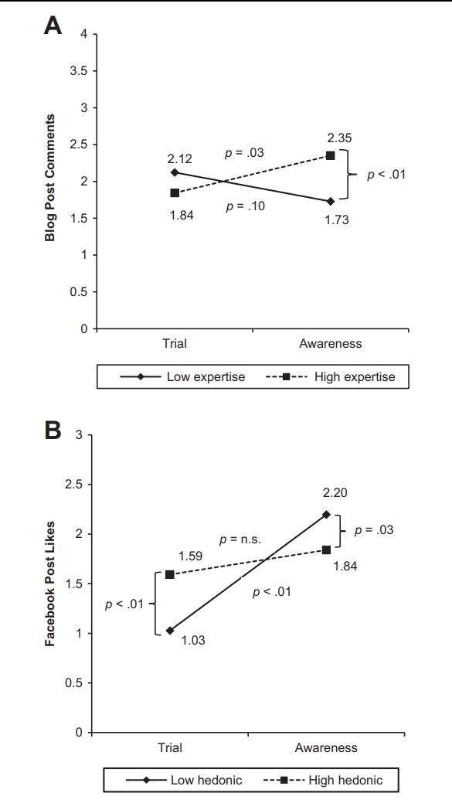

# Influencer Marketing

Platforms:

-   [Impact](https://impact.com/partners/influencer-partners/)

-   [Later](https://later.com/pricing/)

-   [Traakr](https://leaderboard.traackr.com/us/top)

-   [Grin](https://grin.co/?utm_medium=referral&utm_source=IMH&utm_campaign=imh)

-   [Klear](https://klear.com/)

-   [Creator](https://brands.creator.co/pricing)

-   [Influencity](https://influencity.com/pricing)

-   [ListenFirst](https://www.listenfirstmedia.com/competitive-industry-benchmarks/)

-   [themotherhood](https://www.themotherhood.com/)

See [@leung2022a] for a review on influencer marketing

-   Online influcer marketing is "leveraging influencer resources (including follower networks, personal positioning, communication content, and follower trust) to enhance a firm's marketing communication effectiveness"

From the industry perspective, [McKinsey](https://www.mckinsey.com/business-functions/growth-marketing-and-sales/our-insights/getting-a-sharper-picture-of-social-medias-influence) found that only a small number of influencers accounted for a large share of total recommendations. For example, in the shoes and clothing categories, only "5 percent of the recommenders accounted for 45 percent of the social influencer generated."

-   person brand [@fournier2019], human brand [@thomson2006], celebrity brand[@kerrigan2011]

[@hughes2019]: Driving Brand Engagement Through Online Social Influencers

-   Sponsored blogging affects online engagement (e.g., posting comments, linking) differently depending on blogger characteristics and blog post content.

    -   This effect is moderated by social media platform type and campaign advertising intent.

-   Sponsored blogging = Paid + Earned media [@colicev2018b]

-   Contributions:

    -   How social influencers (specifically, sponsored bloggers) influence consumers at different stages of purchase (awareness vs. trial)

    -   Campaign intent and platform type as a moderator of the impact of blogger and content characters on social media engagement

-   Based on the Elaboration likelihood model

-   Blogger expertise influences awareness more than trial campaign.

-   Dependent on blogger characteristics and blog post content, sponsored blogging can affect online engagement differently.

-   This effect is moderated by social media platform type and campaign advertising intent

-   When the ad intent is to raise awareness, higher blogger expertise is more effective than when the ad intent is to increase trial

-   When the sponsored is on Facebook, there is no effect of source expertise on engagement

-   When there is a sponsored post on Facebook, posts with a lot of hedonic content work better when the goal of the ad is to get more people to try the product instead of just raise awareness.

-   Depending on the type of platform, campaign incentives can make people more (or less) likely to participate in blogs (Facebook)

-   Heckman selection model: variables are selected so that they affect blogger selection for a campaign but not directly affect the engagement generated by the blogger

    -   Varimax factor rotation was used to create a psychographic index score based on the bloggers' profile descriptions and psychographic categories that were not directly related to the outcome of engagement: travel/foodie, persona, lifestyle, and values.

-   On Facebook, hedonic value exerts a positive impact, and trial campaign benefit more from the use of hedonic content

-   Campaign freebies have an adverse effect, underscoring the possible cannibalizing function of one platform over another (blog vs. Facebook)

-   Engagement is defined as [@hollebeek2011, p. 555] "a customer's cognitive, emotional, and behavioral activities"

-   Influencer Marketing

    -   Platform differences: High vs. low involvement (blog vs. Facebook)

    -   Campaign intent: increase awareness vs. encourage trial.

    -   Blogger expertise: level of credibility of a source.

    -   Interaction effect of campaign intent and involvement on blogger expertise:

        -   expertise is high , awareness is more effective in generating brand engagement

        -   expertise is low, trial campaign is more effective in generating brand engagement

    -   Hedonic value of post: positively affect engagement

    -   Campaign incentives: freebies can positively affect engagement.

-   Influencer Marketing on Facebook

    -   Campaign intent on Facebook: awareness is better than trial in generating engagement

    -   Hedonic value: More positive

    -   Interaction effect of campaign intent and hedonic value

        -   High hedonic value affects trial campaigns more than awareness marketing.

-   Data:

    -   from The Motherhood

    -   1830 sponsored posts by 595 bloggers from Sep 2012 to Dec 2016. (small sample)

-   Variables:

    -   \# of blog post comments (could be influenced by the commenters' post, not by bloggers' post).

    -   \# of Facebook likes:

    -   Campaign intent: Awareness vs. trial

    -   Campaign incentives: giveaways or not

    -   Blogger average \# followers: social media presence and strength. (also have alternative measure)

    -   Blogger psycho-graphic profile factor: based on coders and then use varimax rotation to have 5 characteristics of bloggers.

    -   Blogger expertise: educational affiliation and credentials.

-   Post variables

    -   Weekend post: 1 vs. 0

    -   \# of Fb posts:

    -   Hedonic vs. informational value: 3 coders each blog post on Amazon MTurk to code 20-item and use Shrout-Fleiss single intraclass correlation score.

    -   Sentiment variables: based on factor analysis with varimix rotation to have 2 factors (functional and hedonic)

-   Selection Model: Heckman with variables from Varimax factor rotation was used to construct a psychographic index score using travel/foodie, persona, lifestyle, and values. (not sure about the blogger-by-blogger matrix)

-   Estimation model: Negative binomial model because of over-dispersion.

-   Results:

{width="90%"}

Study 2:

-   replicate the blogger expertise' s interaction with campaign intent interaction on the blog platform.

-   Campaign intent affects purchase likelihood differently for high-expertise and low-expertise bloggers (high \> low).

-   Expertise and campaign pretest (Qualtrics panel)

-   Awareness initiatives benefit more from blogger expertise than trial campaigns.

[@leung2022] Influencer marketing effectiveness

-   See table 1 for a review of influencer marketing literature
-   Influencer originality, follower size and sponsor salience increase influencer marketing effectiveness
-   Product-launch post decreases influencer marketing effectiveness
-   Influencer activity, follower-brand fit, and postivity show inverted U-shaped moderating effects on influencer marketing effectiveness.
-   Different from celebrities who are credentialed in institutional setting, influencers are not [@mcquarrie2013]
-   Engagement elasticity: the percentage change in consumer engagement due to a 1% increase in influencer marketing spend (p. 4)
    -   A 1% increase in influencer marketing spend increases engagement by .457% (p. 6)
-   Based on communication models [@weaver1963mathematical], there are 3 components
    -   sender (influencer): source trustworthiness [@wilson1993]

    -   receiver (followers): how involved they will be with the message [@boerman2015]

    -   message (post): content value [@lou2019] [@ducoffe1996advertising]
-   Measuring engagement up to 24hr is in accordance with the industry standard (p. 18)
-   Following [@humphreys2017], the authors created dictionary-based text analysis to identify whether a post is related to a new product launch or promotion.
-   Following [@lovett2013], two coders coded service/product, premium/ value, foreign/local
-   Using Heckman selection model using variables that do not directly affect engagement, but only the influencer selection by brands.
    -   selection of the second most similar influencer to the focal influencer by the focal brand (following [@hughes2019]

    -   Influencer activity's trends

[@valsesia2020]

-   Not following others, and having substantial followers positively influence social media user's perceived influence, which later impact engagement

-   Data: Twitter, Instagram (field + lab)

[@yang2021first] Engagement that Sells: Influencer Video Advertising on TikTok

-   Ads can be engaging but may not focus on the product, a significant concern in influencer marketing.

-   An algorithm has been created to measure product-focused engagement, predicting sales lift from influencer video ads.

-   The "Product Engagement Score" (PE-score) assesses a product's engagement within videos using advanced neural networks and object detection.

Compute the PE-score:

1.  A deep 3D convolutional neural network is trained to create an engagement heatmap, which evaluates the significance of each pixel in a video for viewer engagement.

2.  A product heatmap is generated using the same dimensions as the engagement heatmap to identify where in each frame the product appears, using object detection (SIFT).

3.  The PE-score is calculated by combining the engagement and product heatmaps, reflecting the level of engagement over the product's presence in the video.

-   The effectiveness of the PE-score was tested using a dataset from TikTok influencer video ads and corresponding product sales on Taobao from May to November 2019.

    -   No significant correlation between traditional engagement metrics and sales, supporting criticisms that engagement does not necessarily predict sales.

-   An additional dataset showed that influencers' PE-scores were higher when promoting their own products, suggesting incentive misalignment affects content engagement.

-   The main analysis used the DiD method, considering video posting time to assess the causal impact of ads on sales.

-   The PE-score was a significant predictor of sales lift, while traditional engagement metrics and product-placement intensity were not.

-   Effective sales lift is driven by product engagement in the video, not just by general engagement or product presence.

-   Contrary to popular belief, influencer popularity and price were not predictive of sales lift.

-   Factors like human presence, emotional facial expressions, and novel activities in videos can increase pixel-level engagement and, when aligned with product placement, may enhance sales conversion.

Takeways:

-   The PE-score is user-friendly, requiring only the ad and product image to assess the potential effectiveness of video ads.

-   Influencers, sellers, and platforms can use the PE-score for pre-release testing, contract creation, and improved sales attribution.

To mitigate overfitting:

1.  Training on a large dataset of videos to ensure a broad learning base.

2.  Utilizing transfer learning to minimize the number of free parameters.

3.  Implementing regularization techniques such as dropout.

4.  Applying early-stopping during training to prevent overfitting.

Data:

-   Data compiled from two sources: TikTok influencer video ads and corresponding product sales data from Taobao, linked by product ID.

-   The final dataset includes 2,685 influencer video ads with full data on influencer characteristics and matching sales data.

-   Engagement metrics (likes, comments, shares) of videos are included, with the last observed values used to assess overall engagement.

Issues:

-   Compressing the data input might not be ideal; it would be more informative to have data on frame-by-frame engagement rather than aggregating it at the video level. In other words, instead of having one dependent variable for each video, respondents could indicate at which frame they hit like or share.

-   Since they have monthly sales (i.e., 30-day sales revenue), they impute each day by diving by 30.

-   Reverse causality argument: use search index to control. Still can't control for other channels promotions being implemented at the same time.

-   Could also use PE directly in DiD model

Interesting:

-   Before taking engagement (i.e., the number of shares) as the dependent variable in training the neural network, the authors consider only the residuals after accounting for influencer fixed effects, product fixed effects, acoustic features, and transcript embedding.

-   Saliency maps highly correlate with actual gaze maps based on eye-tracking data, confirming their validity.

[@rajaram2020video] Video Influencers

-   The study focuses on the effectiveness of various elements in influencer videos on YouTube, using a novel "interpretable deep learning" framework for both prediction and interpretation of unstructured video data (text, audio, images).

-   Findings reveal that the textual content ("what is said") in videos has a greater impact on engagement than visual (images) and auditory (audio) elements.

-   The research identifies key factors influencing shallow and deep viewer engagement, based on the dual-system framework of human thinking, providing valuable insights for influencers and brands.

[@tian2024mega] Influencer Selection Using Follower Elasticity

-   Using follower elasticity of impressions (FEI) to quantify the trade-off between popularity and cost to determine which influencer to hire.

[@cheng2024reputation]

-   Posting sponsored videos reduced influencer reputation by 0.19%, measured by subscriber count, compared to organic videos.

    -   Causal inference was established by creating matched treatment (sponsored) and control (organic) groups at the influencer-video level using DiNardo-Fortin-Lemieux reweighting to ensure comparability between the two groups.

-   The reputation loss (reputation-burning effect) was more pronounced for influencers with larger audiences.

-   Audience response (likes and comments) showed a larger gap between sponsored and organic videos for influencers with larger followings.

-   The negative impact on reputation was lessened when:

    -   The sponsored content aligned closely with the influencer's typical content.

    -   The promoted brand was less well-known.

 

[@cheng2024reputation] Impact of Brand Sponsorship on Social Influencers

-   Posting sponsored videos slightly reduces influencers' reputations, costing them an average of 0.19% of subscribers compared to organic videos, with the effect more pronounced among influencers with larger audiences.

-   Audience engagement metrics (likes, comments) show a bigger disparity between sponsored and organic videos for influencers with larger followings, with reputation loss mitigated when the sponsored content closely aligns with the influencer's typical style or when promoting lesser-known brands.

-   This study offers empirical support for theoretical assumptions about influencer marketing, enhancing understanding of reputation dynamics in sponsored content and guiding strategies for influencers, brands, and platforms.

@nistor2024influencers

-   This model shows that while celebrity influencers endorse all products to maximize reach and awareness, microinfluencers focus on endorsing only high-quality products to maintain trust and value for followers.

-   Microinfluencers act as quality screeners, preventing their followers from sifting through comments on low-quality products, whereas celebrity influencers' endorsements primarily drive product visibility without providing reliable quality insights.

-   In equilibrium, microinfluencers enhance product information quality for their audience, while celebrity influencers prioritize product awareness over detailed product quality information.

------------------------------------------------------------------------

## Guide to Social Media Account and Post Valuations

### Introduction and Context

Social media valuation refers to the rigorous, multifaceted process of determining the monetary value of both entire social media accounts (e.g., an influencer's profile) and individual posts. While brands, marketers, and influencers commonly use these valuations to guide investments and collaborations, the mechanisms behind how these values are derived can be complex.

Examples:

-   [Social Media Value Calculator](https://socialmediavalue.io/calc/linkedin)

### Foundational Concepts in Social Media Valuation

#### Social Media Account Valuation

Valuing an entire social media account means estimating the present (and sometimes future) worth of an influencer's holistic digital presence. Key considerations include:

-   **Audience Size & Growth Trends**: Current follower count and trajectory (steady growth, spikes, plateaus).

-   **Engagement & Influence**: Average engagement rates, comment sentiment, brand safety.

-   **Brand Synergy**: The alignment of influencer content with brand values.

-   **Niche Authority**: Specialization in a specific topic or industry (fitness, finance, lifestyle, etc.).

-   **Revenue Potential**: Historical track record of brand deals, direct product sales, or affiliate marketing earnings.

#### Post-Level Valuation

Valuing an individual post (e.g., a sponsored TikTok video or an Instagram story) focuses more narrowly on that single piece of content's performance, such as:

-   **Immediate Engagement**: Likes, shares, comments, watch time.

-   **Potential Reach/Impressions**: How many users might see the post.

-   **Click-Throughs**: If relevant, how many people clicked a link.

-   **Conversion or Sales**: For direct-response campaigns.

### High-Level Comparisons to Traditional Finance Valuation

Traditional corporate valuation in finance employs several well-known models, such as Discounted Cash Flow (DCF), Comparable Company Analysis (Multiples), and Precedent Transactions. Although social media valuations differ in many respects, analogies can be drawn:

1.  **Discounted Cash Flow (DCF) Approach**:
    -   **Traditional Usage**: Forecast future cash flows of a company and discount them back to the present value using a suitable discount rate.
    -   **Social Media Variant**: An influencer's future sponsorship revenues or affiliated product sales could be projected over a certain time horizon, then discounted to estimate an account's "intrinsic" value.
        -   *Challenges*: Revenue streams might be sporadic, reliant on platform algorithms, and subject to audience fickleness.
2.  **Comparable Company Analysis (Multiples)**:
    -   **Traditional Usage**: Valuing a firm by comparing its EBITDA, earnings, or other financial metrics to similar companies.
    -   **Social Media Variant**: Benchmarking an influencer's metrics (follower count, engagement rate, average post price) against peers with similar niches or audience sizes.
        -   *Common Multiples*: Price-to-Follower ratio, Price-to-Engagement ratio, or a blend of these.
        -   *Challenges*: Standardizing metrics across different niches and platforms can be inconsistent.
3.  **Precedent Transactions**:
    -   **Traditional Usage**: Valuing a company by studying the pricing of recent acquisitions of similar businesses.
    -   **Social Media Variant**: Estimating an account's buyout price based on actual acquisitions or buyouts of comparable influencers or pages.
        -   *Challenges*: Data on private influencer account buyouts may be scarce or confidential.
4.  **Real Options & Intangible Assets**:
    -   **Traditional Usage**: Real options analysis values the strategic choices a company might have (e.g., expanding, abandoning a project). Intangible asset valuation looks at brand equity, patents, or goodwill.
    -   **Social Media Variant**: An influencer's brand equity and future content strategy optionality can be considered intangible assets, where an influencer might pivot content, expand to new platforms, or partner with additional brands.
        -   *Challenges*: High uncertainty around content virality and evolving platform terms.

These parallels highlight that while we can borrow conceptual frameworks from finance, social media valuations often revolve around intangible and rapidly shifting user behaviors.

### Overview of Social Media Valuation Methods

#### Industry Standard Metrics and Calculations

Below are several established metrics, each with detailed formulas and explanations to ensure clarity. These metrics often serve as a foundation for social media valuation. By understanding the variables and math behind them, marketers can better choose which measures fit their specific goals.

------------------------------------------------------------------------

##### Cost-per-Thousand Impressions (CPM)

-   **Formula**: $Value = \left(\frac{Impressions}{1000}\right) \times CPM\_Rate$

    Where:

    -   **Impressions** = The total number of times the content was displayed.
    -   **CPM_Rate** = The cost to reach 1,000 impressions.

-   **Explanation**: CPM assigns a price for every thousand views (impressions) your content receives. If you know how many times people have been served the content (Impressions) and you have a standard cost to reach 1,000 users, you can multiply them to estimate the total value.

-   **Advantages**:

    1.  Straightforward and widely recognized in digital advertising.
    2.  Easy to compare across different campaigns or platforms.

-   **Limitations**:

    1.  Does not factor in engagement depth (e.g., comments, clicks, or brand sentiment).
    2.  A large number of impressions does not always translate to meaningful audience interactions.

------------------------------------------------------------------------

##### Cost-per-Engagement (CPE)

-   **Formula**: $Value = Total\_Engagements \times CPE\_Rate$

    Where:

    -   **Total_Engagements** = Number of likes, comments, shares, saves, etc.
    -   **CPE_Rate** = The cost (or price) per single engagement.

-   **Explanation**: CPE focuses on user interactions. For instance, if the audience leaves a comment or shares the post, each engagement has a predetermined monetary value. Multiplying all engagements by that rate gives the total estimated value.

-   **Advantages**:

    1.  Aligns cost with genuine audience involvement rather than passive views.
    2.  Can be more accurate for measuring direct user interest in the content.

-   **Limitations**:

    1.  Engagement quality is not guaranteed; negative or spammy engagements can skew results.
    2.  Does not automatically distinguish sentiment (positive vs. negative engagement).

------------------------------------------------------------------------

##### Cost-per-View (CPV)

-   **Formula**: $Value = Total\_Views \times CPV\_Rate$

    Where:

    -   **Total_Views** = Number of actual video views (e.g., a user watches for a set duration).
    -   **CPV_Rate** = Cost charged per individual view.

-   **Explanation**: With CPV, advertisers or brands only pay when their video content is actually viewed. This is common on video-centric platforms where partial or full views can be tracked (like YouTube's watch count, TikTok's unique views, etc.).

-   **Advantages**:

    1.  Budgets are tied to real audience viewership (rather than just impressions).
    2.  Rewards creators who can hold viewers' attention longer.

-   **Limitations**:

    1.  Short views may be counted the same as longer, more engaged views.
    2.  Does not inherently account for brand alignment or viewer sentiment.

------------------------------------------------------------------------

##### Earned Media Value (EMV)

-   **Formula**: $EMV = Impressions \times CPM\_Rate \times Adjustment\_Factor$

    Where:

    -   **Impressions** = Number of times the content was displayed organically.
    -   **CPM_Rate** = Hypothetical cost per thousand if these impressions were paid advertising.
    -   **Adjustment_Factor** = Multiplier that accounts for variables like sentiment, platform type, or target audience fit.

-   **Explanation**: EMV translates unpaid or organic reach into a comparable monetary value by treating it as though you had to pay for those impressions. The adjustment factor can increase or decrease the overall value based on qualitative factors (e.g., extremely positive sentiment might raise the factor, negative might reduce it).

-   **Advantages**:

    1.  Provides a standardized method to quantify the value of organic exposure.
    2.  Helps compare unpaid organic reach against paid media costs.

-   **Limitations**:

    1.  Can be highly sensitive to the chosen adjustment factor.
    2.  May overlook deeper engagement or audience loyalty in calculating raw impressions.

------------------------------------------------------------------------

##### Cost-per-Click (CPC)

-   **Formula**: $Value = Total\_Clicks \times CPC\_Rate$

    Where:

    -   **Total_Clicks** = Number of clicks generated by the content (links, CTAs).
    -   **CPC_Rate** = Cost (or price) allocated per individual click.

-   **Explanation**: CPC ensures that payment is only triggered when a user actively clicks on a link or call-to-action. This model is popular for direct-response campaigns or e-commerce, where the end goal is often site visits or conversions.

-   **Advantages**:

    1.  You pay only for tangible user action.
    2.  Ideal for measuring traffic generation to websites or landing pages.

-   **Limitations**:

    1.  Not every click leads to a meaningful action (e.g., purchase or sign-up).
    2.  Does not account for overall impressions if there are no clicks.

------------------------------------------------------------------------

##### Return on Investment (ROI)

-   **Formula**: $ROI = \frac{(Net\_Profit\_from\_Campaign) - (Cost\_of\_Campaign)}{Cost\_of\_Campaign} \times 100\%$ )

    Where:

    -   **Net_Profit_from_Campaign** = Revenue generated minus any direct costs associated (e.g., product costs, shipping, affiliate fees).
    -   **Cost_of_Campaign** = Total spend on the campaign (influencer fees, ad spend, production, etc.).

-   **Explanation**: ROI is the definitive financial metric for understanding how profitable a campaign was compared to what it cost. It's expressed as a percentage.

-   **Advantages**:

    1.  Simple, bottom-line metric easily understood by stakeholders.
    2.  Accounts for all campaign expenditures and profits.

-   **Limitations**:

    1.  Hard to attribute intangible benefits like brand awareness or future loyalty to immediate net profit.
    2.  Some campaigns continue to produce returns after they end, complicating short-term ROI calculations.

------------------------------------------------------------------------

##### Website Traffic

-   **Definition/Formula**: Measured as the total number of visitors from social media to a specific website or landing page. A typical formula might be: $Social\_Media\_Traffic = (Total\_Sessions\_from\_Social\_Channels)$

-   **Explanation**: This represents how many site visits are driven by social channels. Marketers track bounce rates, time on site, or conversion rates to evaluate traffic quality.

-   **Advantages**:

    1.  Indicates your brand's ability to move users from social media to owned digital properties.
    2.  Helps measure top-of-funnel and mid-funnel effectiveness.

-   **Limitations**:

    1.  Pure traffic volumes do not necessarily indicate user quality or conversions.
    2.  Additional funnel metrics are needed to confirm the value of each visitor.

------------------------------------------------------------------------

##### Net Promoter Score (NPS)

-   **Formula**: Measured via surveys asking, "How likely are you to recommend this product/content to a friend on a scale of 0--10?"

    $NPS = \%\_Promoters - \%\_Detractors$

    Where:

    -   **Promoters** = Respondents who answer 9 or 10.
    -   **Detractors** = Respondents who answer 0 to 6.
    -   **Passives** (scores 7 or 8) do not affect the calculation.

-   **Explanation**: NPS provides a single index for how users feel about your brand or content.

-   **Advantages**:

    1.  Good proxy for word-of-mouth potential.
    2.  Straightforward to interpret.

-   **Limitations**:

    1.  Requires additional surveys and user feedback.
    2.  Not always directly correlated with sales or revenue.

------------------------------------------------------------------------

##### Audience Growth Rate

-   **Formula**: $Growth\_Rate\% = \frac{(New\_Followers - Old\_Followers)}{Old\_Followers} \times 100\%$

    Where:

    -   **New_Followers** = Updated follower count at the end of a measurement period.
    -   **Old_Followers** = Follower count at the start of that period.

-   **Explanation**: Helps measure the influencer's or brand's momentum on the platform.

-   **Advantages**:

    1.  Offers a snapshot of expansion or stagnation.
    2.  Forecasts potential future reach and revenue.

-   **Limitations**:

    1.  Does not address follower authenticity or engagement quality.
    2.  Growth can be boosted artificially by giveaways, follow-for-follow, etc.

------------------------------------------------------------------------

##### Average Revenue per User (ARPU)

-   **Formula**: $ARPU = \frac{Total\_Revenue}{Total\_Number\_of\_Followers\ or\ Users}$

    Where:

    -   **Total_Revenue** = All revenue generated from the social media channel or influencer's activities.
    -   **Total_Number_of_Followers_or_Users** = The audience size at the time of measurement.

-   **Explanation**: Adapted from telecom and subscription services, ARPU breaks down total revenue into a per-follower basis. Useful for comparisons between influencers or across time.

-   **Advantages**:

    1.  Straightforward calculation providing a per-user revenue indicator.
    2.  Aids in forecasting if follower counts change.

-   **Limitations**:

    1.  Not all users generate the same revenue.
    2.  Does not inherently consider engagement or user sentiment.

------------------------------------------------------------------------

##### Engagement Metrics

-   **Types**: Likes, comments, shares, retweets, saves, watch time, etc.

-   **Formulas**:

    -   **Engagement Rate**: $Engagement\_Rate\% = \frac{Total\_Engagements}{Total\_Followers\ or\ Reach} \times 100\%$
    -   **Watch Time** (for videos): Summed total minutes or seconds viewed by all watchers.

-   **Explanation**: Gauges how actively users interact with content. A higher engagement rate implies the audience is more interested or receptive.

-   **Advantages**:

    1.  Reveals content impact on the audience.
    2.  Combines well with CPE to assign monetary value.

-   **Limitations**:

    1.  Does not always capture sentiment (positive/negative).
    2.  Can be inflated by bots or uninterested viewers.

------------------------------------------------------------------------

##### Sentiment

-   **Formula/Definition**: Often measured via sentiment scoring (e.g., -1 for negative, 0 for neutral, +1 for positive) across user-generated content like comments and posts.

    $Average\_Sentiment\_Score = \frac{\sum Sentiment\_Value\_of\_Comments}{Total\_Number\_of\_Comments}$

-   **Explanation**: Sentiment analysis provides context to engagement data by indicating whether users' reactions are positive, negative, or neutral.

-   **Advantages**:

    1.  Flags brand safety issues.
    2.  Shows how well content resonates beyond raw likes.

-   **Limitations**:

    1.  Automated tools can misread sarcasm or slang.
    2.  Requires ongoing monitoring for new or changing audience language.

------------------------------------------------------------------------

##### Social Media Reach

-   **Formula**: $Reach = Unique\_Viewers\ or\ Unique\_Impressions$

    Where:

    -   **Unique_Viewers** = Distinct individuals who saw the content.

-   **Explanation**: Measures how many different people are exposed to the content. Often used in tandem with engagement to gauge how effectively the content sparks interactions.

-   **Advantages**:

    1.  Offers a broad measure of how many potential consumers see your content.
    2.  Helps place engagement data in context (e.g., 2% engagement rate on 100,000 reached users).

-   **Limitations**:

    1.  Higher reach does not ensure action or recall.
    2.  Different platforms may track or define "unique" differently.

------------------------------------------------------------------------

##### Share of Voice

-   **Formula**: $Share\_of\_Voice\% = \frac{Brand\_Mentions}{Total\_Mentions\_in\_the\_Industry} \times 100\%$

    Where:

    -   **Brand_Mentions** = Number of times your brand is mentioned.
    -   **Total_Mentions_in_the_Industry** = Mentions of all relevant brands (including competitors) in the same space.

-   **Explanation**: Share of Voice (SOV) indicates how large your brand's presence is relative to the competition in a given industry or topic area. A higher SOV signals greater visibility.

-   **Advantages**:

    1.  Ideal for competitive benchmarking.
    2.  Good proxy for brand awareness trends.

-   **Limitations**:

    1.  Requires ongoing monitoring and competitor analysis.
    2.  Viral or contentious mentions can inflate SOV in unhelpful ways.

------------------------------------------------------------------------

#### Additional Industry Approaches

1.  **Affiliate/Conversion-Based Models**
    -   Value each post based on direct sales or leads generated. Often used in e-commerce.
    -   *Formula Example*: $Value = (Number\ of\ Conversions) * (Revenue\ per\ Conversion) - (Cost\ per\ Conversion)$
    -   *Pros/Cons*: Highly specific measure of direct monetization, but excludes indirect brand-awareness value.
2.  **Influencer Tier Pricing**
    -   Many influencer marketplaces use tier-based structures (micro, macro, mega). Each tier has typical price ranges.
    -   *Pros*: Straightforward for quick negotiations.
    -   *Cons*: Doesn't factor in niche or brand synergy intricacies.

### Advanced and Academic Methods

#### AI and Machine Learning-Based Valuations

-   **Regression Analysis**: Build predictive models (e.g., linear regression, random forests) using historical data of influencer deals, controlling for factors like follower count, engagement, sentiment.
-   **Neural Networks**: Capture nonlinearities, particularly relevant when dealing with large datasets.
-   **Natural Language Processing (NLP)**: Evaluate text in captions, comments, or tweets for sentiment, topic relevance, or brand mentions.
-   **Image/Video Analysis**: Some advanced approaches scan visual content to gauge creativity, brand alignment, or content type.

#### Statistical and Econometric Methods

-   **Panel Data Models**: Combine cross-sectional data (multiple influencers) and time-series data (performance over months or years) to isolate factors driving account or post value.
-   **Time-Series Forecasting**: ARIMA, Prophet, or LSTM-based approaches that predict future growth and engagement, thus influencing discounted cash flow estimates.
-   **Event Studies**: Used in academic finance to measure stock returns around certain events; similarly, one could measure engagement or brand-lift around influencer posts or campaigns.

#### Social Network Analysis

-   **Centrality Metrics**: Betweenness, closeness, eigenvector centralities used to find how "influential" an account is within a platform's graph.
-   **Network Clustering**: Identifying community clusters reveals if an influencer bridges distinct audience segments.
-   **Practical Impact**: Influencers who are gatekeepers to niche communities may have inflated value due to high trust and targeted reach.

### Blending Financial Frameworks with Social Media Methods

An increasingly popular approach is to combine the recognized methodologies from finance with real-time social media metrics:

1.  **DCF for Influencer Accounts**
    1.  **Forecast Future Sponsorship Income**: Estimate monthly or annual revenue from brand deals, affiliate marketing, or platform ad revenue.
    2.  **Estimate Costs**: Influencers may have costs such as production, team, agency fees.
    3.  **Select Discount Rate**: Incorporate the inherent risk (platform volatility, competitor emergence, short audience attention spans). Higher than typical WACC (weighted average cost of capital) might be justified.
    4.  **Terminal Value**: Predict a future salvage or residual value if the influencer stops active posting or transitions to another platform.
2.  **Multiples Approach for Post Valuations**
    -   Compare average sponsored post price to the influencer's "market multiples," such as cost per follower or cost per engagement, for peers with similar audience metrics.
    -   Use the ratio approach: $Post\ Value = (Peer\ Post\ Price / Peer\ Engagement) * Influencer\ Engagement$
3.  **Brand Equity & Intangibles**
    -   Large influencers often cultivate personal brand equity that extends beyond raw metrics. This can be treated as intangible brand value.
    -   Incorporate brand sentiment analysis and audience loyalty scores into the valuation for a more holistic perspective.

### Data Collection, Infrastructure, and Validation

1.  **Platform APIs**: Instagram, YouTube, TikTok, Twitter, etc.
2.  **Multi-Channel Aggregation Tools**: Tools like Sprinklr, Sprout Social, or Hootsuite can unify data.
3.  **Secondary Research**: Competitive intelligence, industry benchmarking studies.
4.  **Surveys & Focus Groups**: Understanding intangible factors like brand resonance, perceived authenticity.
5.  **Data Validation**: Checking for spam or bot activity. Anomalies in engagement can distort valuations.

### Account-Level vs. Post-Level Valuation in Practice

-   **Account-Level**: Potential for future cash flow generation and synergy with brand expansions, typically employing aspects of DCF, SNA, or intangible brand equity.
-   **Post-Level**: Immediate or near-term exposure and engagement, typically employing methods like CPM, CPE, EMV, or affiliate-based models.

### Challenges and Considerations

1.  **Rapid Platform Changes**: Algorithm shifts can drastically alter reach.
2.  **Market Saturation**: As more influencers enter the space, supply increases, affecting average valuations.
3.  **Fake Followers & Engagement**: Valuation must screen for inflated metrics.
4.  **Short Product Lifecycles**: Some influencer relationships are ephemeral, complicating long-term valuations.
5.  **Legal & Compliance**: Differing platform policies, FTC guidelines for disclosures.

### Illustrative Example: DCF Approach for Influencer Account

Suppose an influencer has consistent brand deals generating \$10,000 monthly net income after production and management costs. We assume modest 5% growth per year over 5 years, with a discount rate of 15% to account for social media volatility.

1.  **Yearly Income**: \$120,000 initially (Year 1), growing 5% each subsequent year.
2.  **Year 5 Income**: \$120,000 \* (1.05\^4) ≈ \$145,837.
3.  **Terminal Value**: Assume at Year 5 we either sell the account or pivot. We apply a conservative multiple of 2 to the final year's projected income → \$291,674.
4.  **Present Value**: Discount each year's income and terminal value by 15%.

Let's do a simplified approach (no mid-year discounting):

-   Year 1 PV = \$120,000 / (1.15\^1) ≈ \$104,348

-   Year 2 PV = \$126,000 / (1.15\^2) ≈ \$95,190

-   Year 3 PV = \$132,300 / (1.15\^3) ≈ \$86,340

-   Year 4 PV = \$138,915 / (1.15\^4) ≈ \$78,349

-   Year 5 PV = \$145,861 / (1.15\^5) ≈ \$71,010

-   Terminal Value PV = \$291,722 / (1.15\^5) ≈ \$142,020

Sum of PVs = \~\$577,257

Hence, a purely DCF-based valuation might peg the influencer's account around \$577,000. Adjust further for intangible brand equity, risk factors, or synergy with a particular acquirer.

### Practical Case Study: Combining Methods for a Single Sponsored Post

1.  **Influencer Profile**: 200,000 followers, average 3% engagement rate.
2.  **Historical Data**: Typical brand deals fetch a \$0.12 CPE, with about 6,000 engagements expected.
3.  **Post Valuation via CPE**: 6,000 engagements \* \$0.12 = \$720.
4.  **Post Valuation via CPM**: \~150,000 impressions, at \$10 CPM = \$1,500.
5.  **Weighted Average**: Suppose we weigh CPE at 40% and CPM at 60% → ( 0.4 \* 720 + 0.6 \* 1500 = \$117 + \$900 = \$1,017. )
6.  **Qualitative Adjustments**: +10% brand alignment, +10% sentiment analysis score → +20% total.
7.  **Final Post Value**: \$1,017 \* 1.2 = \$1,220.

### Summary and Conclusion

Social media valuation stands at the intersection of digital marketing analytics, traditional finance, behavioral economics, and network science. While legacy finance models (DCF, Multiples) anchor valuations in the language of ROI and risk, social media's unique dynamics---viral potential, platform algorithms, intangible brand loyalty---complicate direct analogies.

A comprehensive approach blends:

1.  **Industry Benchmarks** (CPM, CPE, CPV, EMV) for quick reference.
2.  **Financial Frameworks** (DCF, Multiples) to provide structure and address future revenue.
3.  **Advanced Analytics** (AI/ML, sentiment analysis, SNA) to capture hidden nuances.

By diligently collecting and validating data, modeling expected performance, and transparently communicating assumptions, businesses and influencers can arrive at defendable, replicable valuations that resonate with both marketing teams and financial stakeholders.

------------------------------------------------------------------------

**Final Note**: Remember that all valuations---whether of a corporation or a social media influencer---are estimates based on assumptions. Regularly refining models with fresh data and real campaign outcomes helps maintain accuracy and relevance in an ever-changing social media landscape.
