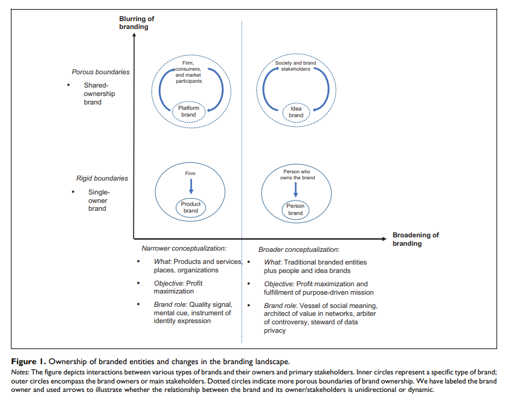
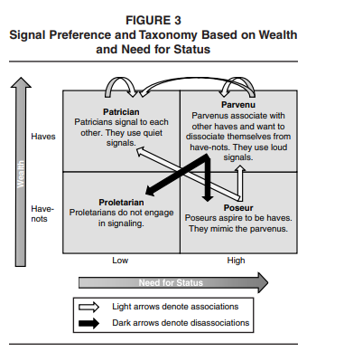
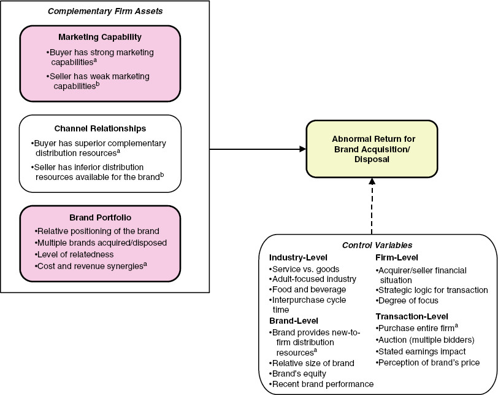

# Branding

Reviews:

[@keller2006]

[@swaminathan2020] Hyperconnected World

-   Hyperconnectivity is "the proliferation of networks of people, devices, and other entities, as well as the continuous access to other people, machines, and organizations, regardless of time or location." (p. 24). 3 aspects

    -   Information availability and speed of info dissemination: reassess models of attention and brands as quality signals

    -   networks of people and devices and the growth of platforms: loss control of brand meaning.

    -   Device-to-device connectivity: branded experiences can be different.

-   Two major changes in this world

    -   Blurring of branding boundaries: Increased access to information and people is enabling more stakeholders to co-create brand experiences and brand meanings alongside conventional brand owners, and as a result, companies are moving away from single to shared ownership.

        -   cocreation of brand meaning

    -   Broadening of branding boundaries: Existing brands can increase their geographic reach and societal functions, while new sorts of branded organizations are expanding the branding landscape even more.

        -   More and more entities are branded

        -   Commercial brands have missions

-   Three theoretical perspectives

    -   Firm

        -   Strategic approach: Actions can be taken by firms strategically

        -   Financial approach: measure the effect of brand equity and branding actions on the stock market value.

    -   Consumer:

        -   Economic approach: brands as market signals

        -   Psychological approach: consumer brand equity

    -   Society

        -   Sociological approach: brands as container of meaning (can be changed)

        -   Cultural approach: "branded goods (as cultural meaning producers) enhance consumers' lives" (p. 26)

-   Rethinking the roles and the functions of brands

    -   Brands as weak quality signals (alternative channels such as online reviews)

    -   Brands as mental cues in info-rich environments (system 1 and 2 need to be reassessed because all senses can be activated)

    -   Brands as instruments of identity expression (consumers can have multiple personae)

    -   Brands as Containers of socially constructed meaning (social brand engagement, stay relevant with social issues)

    -   Brands as architects of value in networks (important to have seamless access within complex network - brand network user experience)

    -   Brands as catalysts of communities (how to serve as gatekeepers)

    -   Brands as Arbiter of Controversy (active brands may benefits, while passive brands will suffer)

    -   Brands as stewards of data privacy

-   Rethinking brand value cocreation

    -   Cocreating brand experiences (beyond product cocreation).

    -   Cocreating brand meaning (e.g., outsourcing designs of ads to consumers). To create new brands in a hyper-connected world, marketers need to care about

        -   Networked communications: how devices communicate

        -   Network value creation: brands are not owned by a sole entity anymore. (question: "What mechanism will replace brand equity to induce loyalty and trust in consumers?" is related to my research on brand equity meta analysis).

        -   Data collection: privacy and customization tradeoff.

-   Rethinking Brand Management

    -   Blurred Control of Brand Positioning and Brand Communication. Changes made by hyperconnectivity

        -   Broader set of competitions

        -   Broader space and ways to communicate brand messages

        -   Outsiders can affect brand positioning

        -   More consumer, and more heterogeneity

        -   Ad placements by algorithms (brand safety)

    -   Blurred Control of Brand Crises

        -   Different stakeholders can have different impact on brand crises and on how consumers attributes blame.

    -   Blurred Control of brands as Identifiers of Intelligent, Interactive and Networked Devices

        -   Branded products in the IoT

        -   Virtual and artificial reality and AI make it hard to create brand experience

    -   Measuring brand value

        -   How to value platform brands? E.g.,

            -   Financial approach: brand value = current profit/(interest rate - profit growth rate). not applicable for young networks, or when profit growth rate \> interest rate

            -   Customer lifetime value for subscription-based brands (based on customer equity theory), but not robust to cancellation

            -   Social capital from each user will create platform brand value

        -   Which structural of the network have the best valuation? (e.g., close-knit or sparse)

-   Rethinking the boundaries of branding

    -   Idea brands: " ideologies, initiatives, or other abstract, noncommercial notions that are identified by their stakeholders and the public at large using the same specific name." (p. 39). How, when and why ideas brands come to life

    -   People brands (e.g., person brand [@fournier2019], human brand [@thomson2006], celebrity brand[@kerrigan2011]): person and brands are intertwined that is hard to distinguish especially under reputational crises.

    -   Place Brands: "a network of associations in the consumers' mind based on the visual, verbal, and behavioral expression of a place, which is embodied through the aims, communication, values, and the general culture of the place's stakeholders and the overall place design [@zenker2010place, p. 5]. Multiple stakeholders involve in the development of place brand.

    -   Organization as brands: organizations other than corporate ones (e.g., nefarious groups).

    -   Metrics for newer branded entities:

{width="100%"}

[@kotler2007] encourage B2B firms to adopt a long-term branding strategy since it is positively correlated with stock performance

@belk1988 posits the construct of extended-self, where possessions contribute and reflect a person's identity (more related to consumer behavior than buyer behavior). We consume products to show our identity such as clothes or music.

Brands (e.g., Nike, Adidas) are getting their own apps instead of using Google Shopping or Amazon [@wichmann2021]

[@muntinga2011] classify three types of consumers' online brand-related activities (COBRAs): (1) Consuming (passive consumption), (2) Contributing (engagement via comment, rating), and (3) Creating (upload, publish, write)

## Brand Elements

### Brand Name

@pogacar2021 found that linguistically feminine brand names increase perceived warmth, in turn, increases attitudes and choice share---both hypothetically and consequentially--- improves brand outcomes/ performance. The positive effect of feminine brand name on brand performance is lower when subjects are male and when products are utilitarian.

[@pavia1993] For technological items, alphanumeric brand names are more acceptable than for nontechnical products.

[@tsai2015] The majority of the gain in sales caused by rebranding is attributable to the brand identities before and after rebranding.

### Brand Logos

[@henderson1998] High-recognition logos are ones that are natural, harmonic, and intricate, whereas high-image logos are ones that are just somewhat intricate and natural. Complex and elaborate logos are more effective at retaining audience interest and favor.

[@park2013] Brands with symbols as logos are more effective at providing self-identity/expression advantages than logos consisting solely of brand names.

### Brand Slogans

[@dahlén2005] Slogans for strong brands are more well-liked and recognizable than slogans for poor brands, independent of respondents' ability to accurately connect them to a brand.

## Brand Marketing

### Brand Advertising

[@sethuraman2011]The average short-term and long-term brand advertising elasticity values are 0.12 and 0.24, respectively. The elasticity of brand advertising has decreased with time, and advertising elasticity is greater for durable products than non-durable goods in the early life cycle stage than in the mature life cycle stage.

[@danaher2008] The advertising elasticity of the focal brand decreases when one or more rival companies run ads during the same week. If all brand advertising were reduced, each brand's advertising would receive more reaction.

### Brand Promotion

[@delvecchio2006] On average, sales campaigns have little effect on brand choice post-promotion.

[@guyt2014] Timing brand promotion out-of-phase with competing chains does not necessarily increase merchants' net revenue gains, especially in areas where brand promotions impact the place of purchase.

[@ailawadi2001] Heavy consumers of out-of-store brand promotions plan their purchases, are prepared to transfer stores but not brands, have ample storage space, and have a low cognitive demand. Retail brand promotion users feel more financially limited, are impulsive, and are not motivated by conformity motive or cognitive need.

## Brand Equity

Brand equity was operationalized as .... of [Perceived Quality], [Brand Associations], [Brand Awareness], [Brand Loyalty](both%20try%20to%20capture%20the%20strength%20of%20connection,%20but%20BRQ%20has%20more%20facets%20to%20capture%20richness%20than%20loyalty):

-   a reflective construct [@yoo2001]

-   a formative construct of [@henseler2017]

-   a consequence/outcome (preferable, and easier to argue with reviewers, but still not the consensus of the field)

-   Quantitative measure of brand equity:

    -   @kamakura1993

    -   @rust2021

    -   [@mitra2006]: (need to read this paper)

-   Qualitative measure of brand equity:

    -   @yoo2001

    -   @lassar1995

    -   @keller1993

brand and psychological distance: Congruence effect: "information is easier to process, which leads consumers to respond more favorably." [@Connors_2020] "consumer spending higher when distance between consumer and brand matched with construal level of marketing communications."

Value-added is the difference between a product's price to consumers and the cost of producing it.

Whereas, brand equity is the difference between a branded product's price to a generic product's price.

This generic product can also have value-added in it in other forms (e.g., convenience)

Brand identity offers a value proposition to customers, where "a brand's value proposition is a statement of the functional, emotional, and self-expressive benefits delivered by the brand that provide value to the customers" [@Aaker_1996, pp.95].

Functional benefits are product attributes that deliver functional utility to customers, while emotional benefits are positive feelings customers feel when using the brand. Ads that provide emotional benefits are higher in effectiveness score compared to functional benefits ads [@Aaker_1996, pp.98].

For example, Evian -- "Another day, another chance to feel healthy" ad - which provides emotional benefits of feeling satisfied after a workout. Moreover, self-expressive benefits are when brands provide a means for consumers to express their self-image. A person/ consumer can have multiple roles which associate with multiple self-concepts. Such as a woman, a mother, an author. The difference between emotional benefits and self-expressive benefits can be subtle. Emotional benefits focus on feelings, private setting (e.g., feeling of watching a TV show), past-oriented (memories), transitory, after-use emotional; In contrast, self-expressive benefits focus on self, public settings (e.g., using cars or clothes to signal), aspiration or future-oriented, permanent (i.e., the self links to person's personality), and during-use (wearing fancy clothes to signify a successful person). (cf. [@Aaker_1996, pp.99])

With the advancement in mass production of high -quality products, quality is no longer a dimension of status signal [@Holt_1998]

In the virality framework, the first and foremost driver is social currency. Social currency refers to things worth sharing. People share so that they can let others know that they are in the know. Sharing a new product to assimilate his or her identity with the product and its brand identity, customers are acquiring social currency. Moreover, brand identity is a driver of brand equity, which refers to the value portion that customers are willing to pay above the product's utility value (practical value). Brand identity offers a value proposition to customers, where "a brand's value proposition is a statement of the functional, emotional, and self-expressive benefits delivered by the brand that provide value to the customers" (Aaker, 1996, p. 95). Functional benefits are product attributes that deliver functional utility to customers, while emotional benefits are positive feelings customers feel when using the brand. Ads that provide emotional benefits are higher in effectiveness score compared to functional benefits ads (Aaker, 1996, p. 99). For example, Evian -- "Another day, another chance to feel healthy" ad - which provides emotional benefits of feeling satisfied after a workout. Moreover, self-expressive benefits are when brands provide a means for consumers to express their self-image. A person/ consumer can have multiple roles which associate with multiple self-concepts. Such as a woman, a mother, an author. The difference between emotional benefits and self-expressive benefits can be subtle. Emotional benefits focus on feelings, private setting (e.g., feeling of watching a TV show), past-oriented (memories), transitory, after-use emotional; In contrast, self-expressive benefits focus on self, public settings (e.g., using cars or clothes to signal), aspiration or future-oriented, permanent (i.e., the self links to person's personality), and during-use (wearing fancy clothes to signify a successful person). (cf. (Aaker, 1996, p. 99)) Hence, one can see that the brand identity portion that provides self-expressive benefits is social currency while exhaustively different from the brand identity portion that provides functional benefits (i.e., the practical value/ usefulness/ utility) .

We acknowledge that some might view usefulness/ utility as a dimension of brand equity (perceived quality): the perceived quality dimension can signal the true practical value. However, the practical value that drives virality is usually understood, experimented, experienced; while perceived quality is subjective comprehension that is hard to demonstrate. Moreover, quality used to be the status signal. However, with the advancement in mass production of high-quality products, quality is no longer a status signal dimension (Holt, 1998). Thus, we believe that the distinction between the two understandings should be appreciated.

[@bharadwaj2011a; @larkin2013; @madden2006; @mizik2008; @rego2009] Customer-based brand equity is positively related to a company's stock returns, market value, credit ratings, and leverage, and adversely related to idiosyncratic risk and earnings volatility.

[@tavassoli2014employee]

-   Employee-based brand equity significantly affects executive pay.

-   Executives value being associated with strong brands and are willing to accept lower pay at firms that own strong brands.

-   This effect is stronger for chief executive officers and younger executives than for other executives.

### Brand Loyalty

-   [@berkowitz1978; @berkowitz1978a] reviews on Brand Loyalty: Measurement and Management by Jacoby and Chestnut 1978, which pioneered the idea of **attitudinal** and **behavioral loyalty**.
-   [The Loyalty Economy](https://hbr.org/2020/01/are-you-undervaluing-your-customers#how-to-value-a-company-by-analyzing-its-customers)
-   [Loyal customers trump powerful brands](https://hbr.org/2015/04/why-strong-customer-relationships-trump-powerful-brands)

### Brand Awareness

also known as brand familiarity

[@homburg2010] found that there exists a correlation between brand awareness and market performance. However, this link is mitigated by market features (product homogeneity and technological volatility) and organizational buyer characteristics (buying center heterogeneity and time pressure in the buying process)

#### Brand Prominence

@butcher2016 found that consumer views of the quality of luxury items are influenced by increased brand prominence, with quality and respondents' status consciousness influencing the emotional value they obtain from luxury goods. Along with the direct influence of brand prominence, this emotional value has a significant impact on purchase intentions.

[@lee2021] reduced emotionality correlates with high-status communication norm, evoking high-status reference groups.

[@han2010]

-   Brand prominence: "reflects the conspicuousness of a brand's mark or logo on a product." (p. 15)

-   Brand prominence is "the extent to which a product has visible markings that help ensure observers recognize the brand." (p.17)

-   Consumers prefer quiet or versus loud branding because they want to associate vs. disassociate themselves with /from different groups of consumers.

-   Luxury goods are those that, in addition to any utilitarian value, confer status on the owner simply by being used or shown.

-   Need for status is the "tendency to purchase goods and services for the status or social prestige value that they confer on their owners." [@eastman1999a, p. 41]

-   What confers status is the evidence of wealth (i.e., wasteful exhibition = conspicuous consumption)

-   Upper-class members spend conspicuous things to distance themselves from the lower class ("invidious comparison"), whereas lower-class members consume conspicuously to align themselves with the higher class ("pecuniary emulation").

-   Studies

    1.  Market data (Bag - LV and Gucci, Car - Mercedes, shoes - LV): inconspicuously branded luxury goods cost more than that of conspicuous branding.

    2.  Market data (knockoffbag.com and confiscated counterfeit goods from Thailand) counterfeiters copy the lower-priced, louder luxury goods to appeal to poseurs that want to emulate parvenus.

    3.  Survey (assume people to belong to certain groups based on zipcodes) Patricians pay a premium for signals that only other patricians can decipher

    4.  Survey (self-categorization to a persona) Social motives explain why groups choose loud or quiet luxury products. Poseurs are more inclined than parvenus to buy fake loud bags when given the chance.

{width="50%"}

### Brand Associations

"different groups of people can have different or even contradictory associations with the same stimulus" (Wheeler & Berger, 2007)

#### Brand Meaning

Brand meaning is a subset of brand associations (brand associations can also have associations regarding attributes - perceived quality)

@batra2019

-   Brand meaning refers to "the complete network of brand associations in consumers' minds, produced by the consumer's interactions with the brand and communications about it." (p. 535)

-   Endorsers are conduits of cultural meaning transfer.

-   Previous researchers conflated brand meaning with the narrower construct - brand personality.

-   Propose possible brand meaning items

-   sources of brand meaning (independent variables):

    -   visual cues (advertising, packaging)

    -   sensory cues (e.g., music)

    -   human cues (e.g., endorsers)

#### Brand Image

Successful brand transferability typically depends on attribute similarity and personality similarity (image similarity). Since customers expect a firm's technological competencies to transfer between products with similar makeups, an antecedent of a successful brand's transferability is that products share similar attributes. On the other hand, image similarity is the "relationship of categories in terms of the images of the brands in them" (Batra et al., 1993). For instance, a brand in the entertainment industry with the image of being fun and exciting can potentially extend to soda production. Aaker and Keller (1990) have shown that transferability is higher for complimentary products and hard-to-make products, and no impact for substitutes products, while Batra et al. (1993) showed that brand transferability is higher for a product with a high match on the image (personality dimension) and on product attributes.

@batra2004

-   Nonverbalized personality association of celebrity endorsers on fun and sophistication (classiness) can increase consumer beliefs about a brand's fun and classiness. (only under social consumption context, and match between brand image beliefs and product category).

-   And ad-created brand image beliefs only influence brand purchase intention, not brand attitudes.

@chu2021

-   Prestigious brands whose brand image is associated with status and luxury, consumers' attitude toward the product becomes more favorable and their willingness to pay a premium for the product grows as the distance between the visual representations of the product and the consumer increases.

-   Popular brands whose brand image is associated with broad appeal and social connectedness, the closer the distance, the more favorable is consumers' attitude and the higher their willingness to pay a premium.

@chernev2015

-   CSR increases not only public relations and customer goodwill, but also customer product evaluation.

-   Consumers perceive that products from companies performed CSR to be better performing (even though they can experience and observe the products or when CSRs are unrelated to the company's core business).

-   This effect is lowered when consumers believe that company's behavior is driven by self-interest as compared to benevolence.

-   Hence, acting good (and people don't know your true intent) can lead to better company's performance.

@liu2020 built BrandImageNet (based on multi-label deep convolutional neural network model) to predict the presence of perceptual brand attributes in the consumer-created images (which is also consistent with consumer brand perception collected from survey). Hence,this model can monitor brand portrayal in real time to understand consumer brand perceptions and attitudes toward their and competitor brands.

#### Brand Personality

@aaker1997

-   5 dimensions of brand personality:

    1.  Sincerity

    2.  Excitement

    3.  Competence

    4.  Sophistication

    5.  Ruggedness

-   Also offers a scale to measure brand personality

-   Brand personality is defined as "the set of human characteristics associated with a brand." (p. 347)

@batra2010

-   Previous research posits that brand with greater brand associations and imagery "fit" will more likely to have successful brand extensions

-   If the brand is "atypical" - associations and imagery are broad and abstract compared to the brand's original product category, the brand will be more likely to succeed

-   This research offers a Bayesian factor model that can measure that brand-level and category-level random effects, which later helps measure a brand's fit and atypicality.

-   Category personality can be masculine or feminine, etc. [@levy]

-   Brand extension considers

    -   Fit

        -   Concrete product attributes

        -   Abstract imagery or personality attributes

    -   Atypicality

@grohmann2009

-   advancement on @aaker1997

-   scale measuring masculine and feminine brand personality

-   Spokespeople shape masculine and feminine brand personality perceptions

-   brand personality-self concept congruence affects affective, attitudinal and behavioral consumer responses.

-   masculine and feminine brand personality contributes to the brand extension perception

More reference on Actual and the Ideal Self: @malär2011

#### Brand Coolness

@warren2014

-   Autonomy refers to "a willingness to pursue one's own course irrespective of the norms, beliefs, and expectations of others" (p. 544)

-   Autonomy means diverging from the norm.

-   Properties of coolness:

    -   Coolness is socially constructed (i.e., "a perception or an attribution bestowed by an audience") (p. 544), which is similar to popularity or status

    -   Coolness is subjective and dynamic: can use consensual assessment technique to measure [@amabile1983], which is similar to creativity.

    -   Coolness is a good thing (positive quality)

    -   Coolness is more than positive perception or desirable

-   Cool is different from good (being liked) is inferred autonomy

-   Autonomy only increase perceptions of coolness under **appropriate context**

-   Coolness is " a subjective and dynamic, socially constructed positive trait attributed to cultural objects (people, brands, products, trends, etc.) inferred to be appropriately autonomous." (p. 544)

-   Autonomy increases coolness when it's appropriate will depend on

    1.  whether a brand diverges from a descriptive or injunctive norm

    2.  the perceived legitimacy of the injunctive norm

    3.  th extent to which a brand diverges from injunctive and descriptive norms

    4.  the extent to which the observer or audience values autonomy

-   **Descriptive norm** is" what most people typically do in a particular context" (p. 545).

    -   People follow descriptive norm because of uncertain or unclear outcome, and the "normal" course of action is already effective. Hence, divergent could sometimes be more effective.

-   **Injunctive norm** is "a cultural ideal or a rule that people are expected to follow" [@cialdini1990]

    -   People follow injunctive norms because it can help build or maintain relationships or social esteem (p. 545)

-   Norm legitimacy moderates the appropriateness of divergence from an injunctive norm

@warren2019

-   Conceptualizes "brand coolness" and a set of characteristics associated with cool brands

-   Cool brands are perceived to be extraordinary, aesthetically appealing, energetic, high status, rebellious, original, authentic, subcultural, iconic, and popular

-   Develops scale items to measure component of brand coolness and its effect on **consumers' attitudes toward brands, satisfaction, intention to talk about, and willing to pay**.

-   Cool brands are dynamic and change over time.

-   Cool brands first to a small niche (subcultural, rebellious, authentic, and original)

-   Later, when adopted by the masses, cool brands acquire iconic and popular attributes.

### Perceived Quality

[@aaker1994] Brand quality influences shareholder wealth positively.

## Brand Authenticity

This construct is to be determined, we still have not consensus whether this is a reflective or formative construct. The first paper [@morhart2015] is a reflective model, but could not find a latent construct of brand authenticity and they have some troubles with the first order dimensions. On the other hand, [@nunes2021] recently introduced the formative measurement scale of authenticity. But their arguments on this paper is still questionable.

@morhart2015

-   Perceived brand authenticity measurement scale

-   "PBA arises from the interplay of objective facts (indexical authenticity), subjective mental associations (iconic authenticity), and existential motives connected to a brand (existential authenticity)." (p. 202)

-   Definition: PBA is "the extent to which consumers perceive a brand to be faithful and true toward itself and its consumers, and to support consumers being true to themselves." (p. 202)

-   Dependent variables: emotional brand attachment, positive WOM

-   PBA is the interplay of

    -   Objective facts (indexical authenticity) - objectivist perceptive

    -   Subjective mental association (iconic authenticity) - constructivist perspective

    -   Existential motives connected to a brand (existential authenticity) - existentialist perspective

-   Four reflective measures:

    -   Continuity

    -   Integrity

    -   Credibility

    -   Symbolism

@nunes2021

-   Authenticity has 6 formative constructs: accuracy, connectedness, integrity, legitimacy, originality, and proficiency

-   Authenticity is defined as "a holistic consumer assessment determined by six component judgments (accuracy, connectedness, integrity, legitimacy originality, and proficiency) whereby the role of each component can change according to the consumption context." (p. 2)

-   Definitions of the six components (p. 3)

-   **Authenticity** is conceptually different from **consumer attitude**

-   Using grounded theory to come up with potential dimension, and verify the measurement model of authenticity based on PLS

-   Dependent variables: attitudes, behavioral intentions.

## Brand Relationship

@fournier1998

-   Brands can serve as relationship partners (p. 344)

    -   Interdependence must be present in a relationship (i..e, partners can affect, define and redefine the relationship). [@Hinde_1979]

    -   Three ways brands are animated (animism):

        -   brand is possessed by the spirit of a past or present other (e.g., spokesperson, significant others who use it, or givers)

        -   Anthropomorphization of the brand object with human qualities such as emotionality, thought and volition (p. 345)

        -   Perform as active relationship partner

-   "Consumer-brand relationships are valid at the level of lived experience" (p. 344)

-   Brand can be defined as "a collection of perceptions held in the mind of the consumer." (p. 345)

-   Sources of relationship meaning: psychological, socio-cultural and relational

    -   5 socio-cultural contexts: age/cohort, life cycle, gender, family/social network, and culture

-   Relationships

    -   as Multiplex phenomena

    -   in Dynamic Perspective

-   **Brand Relationship Quality** BRQ (6 facets):

    -   Love/passion

    -   Self-connection

    -   Commitment

    -   Interdependence

    -   Intimacy

    -   Brand Partner Quality: brand performance in its partnership role.

-   Related to [Brand Loyalty](both%20try%20to%20capture%20the%20strength%20of%20connection,%20but%20BRQ%20has%20more%20facets%20to%20capture%20richness%20than%20loyalty) and [Brand Personality](can%20examine%20the%20mechanism%20behind,%20or%20how%20brand%20personality%20is%20formed%20in%20relationship%20with%20consumers.)

@aggarwal2004

-   When people form a relationship with brands, they use international relationship norms to guide this relationship.

-   There are two relationship types

    -   Exchange relationship: (reciprocal favors)

    -   Communal relationship: benefits are given to show concern for others' needs.

-   Norm violation can influence overall brand evaluations.

-   Initial judgments of social stimuli (e.g., people) depend on inferred, abstract information while initial judgment of nonsocial stimuli (e.g., products) depend on concrete attributes because people use self as a frame of reference when comparing to other people [@fong1982]

-   Norms of exchange relationship (i.e., quid pro quo): expected return, and prompt repayment

-   Norms of communal relationship (to demonstrate a concern for partners and to attend their needs): no expected return, or prompt repayment

-   "When consumers form relationships with brands, brands are evaluated as if they are members of a culture and need to conform to its norm" (p. 89)

-   The relationship between brands and consumers are more in line with celebrity and fan (p. 89)

@aaker2010

-   People use warmth and competence (social judgments of people @fiske2007) to form perceptions of firms.

-   For-profit = competent but less warmth, nonprofits = warm but less competent

-   If we can increase competence (through subtle cues that increase credibility) then we can recover willingness to buy products for nonprofits.

-   "Warmth judgments include perceptions of generosity, kindness, honesty, sincerity, helpfulness, trustworthiness, and thoughtfulness, whereas competence judgments include confidence, effectiveness, intelligence, capability, skillfulness, and competitiveness" (p. 225) [@aaker1997a; @yzerbyt2005]

-   Warmth = other-focused, competence = self-focused [@cuddy2008]

-   People trust non-profits more than for-profits [@hansmann1981b; @uncertai2020]

-   Stereotype is defined as "a shorthand, blanket judgment containing evaluative components." (p. 225)

@puzakova2013

-   The negative side of brand humanization (i.e., anthropomorphization of a brand): it can decrease consumers' brand evaluations when brand faces negative publicity as compared to non-humanized brands.

-   Because brands are living entities (after the humanization process) and attributions are due to stable traits instead of unstable contextual influences in human minds [@gawronski2004], it is seen as having intention and responsibility for its actions

-   The extent of this negative effect depends on consumer-based factor (e.g., implicit theory of personality):

    -   Those who believe in stable human traits (i.e., entity theorists) are more likely to devalue humanized brands because they attribute the wrongdoing to the underlying trait - indicative of future transgression. (p. 82)

    -   "Those who believe personality traits as more malleable (i.e., incremental theorist) don't form impression based on a single transgression and do not deem a single misbehavior a predictor of a future pattern of action" (p. 82)

-   Leveraging perceptual fluency when products are under human schemas, the product can enjoy greater liking [@delbaere2011]

-   Compensation (vs. denial or apology) is the only effective response among entity theorists.

@macinnis2017

-   A summary of "humanizing brands" literature

-   Drivers of Humnaizing brands @epley2007

-   Human-Focused Perspective (Anthropomorphism). Brands can be perceived as .. with consumers:

    -   like

    -   part of

    -   in a relationship

-   Self-Focused Perspective. brands can also be perceived as

    -   congruent or

    -   connected to the self

-   Relationship-Focused Perspective: brand relationships are analogous to human relationships

[@ordabayeva2022]

-   Negative internet reviews from socially distant (but not socially close) individuals may not be as harmful to identity-relevant brands. Because a negative review of an identity-relevant brand can threaten a client's identity, the consumer will seek to strengthen their relationship with the brand.

-   They show that this effect does not appear when the review is positive or when the brand is irrelevant.

[@swaminathan2007]

-   Self-concept is "the amount that the brand contributes to one's identity, values, and goals." (p. 248)

-   Under independent self-construal, self-concept connection (with its focus on the individual) is more important

-   Under interdependent self-construal, brand country-of-origin connections (with its focus on the group) is more important.

[@swaminathan2009]

-   Attachment theory posits two dimensions of attachment style: anxiety and avoidance.

-   Level of avoidance predicts anxiety-related brand personality.

    -   Under high avoidance and anxiety, individuals favor exciting brands; under low avoidance and anxiety, they prefer sincere brands.

[@aggarwal2004] With certain businesses, customers can form enduring relationships that are "humanlike." Strength type (fling vs. partner) and relationship norm (communal vs. exchange) can differ among brand partnerships.

### Brand Love

It exists on the same level as [Brand Equity] and it subsumes Brand Affect

@batra2012

-   Brands are defined as "the totality of perceptions and feelings that consumers have about any item identified by a brand name, including its identity (e.g., its packaging and logos), quality and performance, familiarity, trust, perception about the emotions and values the brand symbolizes, and user imagery." (p. 1)

-   Love emotion is a single, specific feeling, short term and episodic, while love relationship is long-lasting and involves numerous affective, cognitive, and behavioral experiences.

-   Brand love is measured based on reflective measurement (reflective indicators of hierarchical organized factors)

-   Brand love is a component of brand relationships.

@bagozzi2016

-   Developed a parsimonious brand love scale

-   Reflective Higher-order factor

    -   Self-brand integration

    -   Positive emotional connection

    -   Passion driven behavior

-   Used Multitrait-Multimethod Matrix (MTMM) of method bias

## Reputation

Reputation is "a global evaluation of an organization accumulated over a period of time." (quote by [@aaker2010, p. 225]), original by [@fombrun1990].

Reputation can have both competence dimension [@devine2001] and warmth [@aaker2004]

What is the difference between brand equity and brand reputation?

-   Brand equity: belongs to the marketing world, where it means the positive (good) part of the firm.

-   Brand reputation: belongs to the management world, where it means both the positive and negative parts of the firm.

[@proserpio2017] Effect of management responses on consumer reviews

-   Hotels respond after a negative shock to their ratings

-   hotels respond about the same rate to positive, negative, and neutral reviews

-   Responding hotels receive 0.12 stars higher in their ratings

-   When hotels begin to respond, they receive fewer but longer negative reviews because dissatisfied customers are less likely to post short, unjustifiable comments when they anticipate being scrutinized. Therefore, managers must consider a trade-off: fewer bad evaluations at the expense of lengthier and more thorough negative feedback.

-   Data: TripAdvisor hotel ratings.

-   Identification strategy (good paper to follow for endogenous treatment)s:

    -   Since hotels can choose to respond to reviews and how to respond (non-random treatment).

## Brand Evaluation

-   @naylor2012 defined "mere virtual presence" as whether presence of virtual supporters for a brand (e.g., demographic) is revealed. The mere virtual presence can affect a target consumer's brand evaluation and purchase intention. This effect is moderated by the composition of existing supporters and targeted new supporters and (2) and salience of competitor brands when evaluating the focal brand.

## Brand Favorability

[@zhang2021]

-   Account for the measure biases shown by social media posters.

-   Use probabilistic graphical model-based

-   The measure is correlated with traditional survey-based measures

<!-- Barriers to b2b firms to have good brands -->

<!-- -   branding is only about choosing a name, logo and slogan, which we already have. -->

<!-- -   branding costs too much (e.g., consultants' fee, advertising fees) -->

<!-- -   benefits of branding is not short-term and hard to measure -->

<!-- -   can't spare people to spend time to build brands -->

<!-- -   Branding doesn't really matter (especially in b2b marketing0 -->

<!-- Brands that did good: -->

<!-- -   Dupont, IBM and Cisco, other like Morgan Standley. -->

<!-- Steps to build strong brand -->

<!-- -   Understand brand culture, corporate brand strategy -->

<!-- -   frame value perceptions -->

<!-- -   Get more imagery, emotional associations -->

<!-- -   Segmentation of customers to have appropriate branding programs. -->

<!-- Future research direction -->

<!-- -   What kinds of things that help build and manage b2b brands. -->

<!-- -   "How does brand equity flow across b2b and b2c divisions? Does the brand equity built in consumers affect business customers?" -->

<!-- -   How to frame value calculations? -->

<!-- -   How to create imagery and emotional associations? -->

## Branding Portfolio Management

### Brand Architecture/Portfolio

[@aribarg2008]

-   Firms may increase portfolio profitability by eliminating versions of lower-tier brands, but the proportion of upper-tier brands to lower-tier brands moderates benefits.

[@Rao_2004] Corporate branding strategy association with intangible value (Tobin's q)

-   House of brands

-   Branded house: greater efficiency and lower customization and cannibalization, more potential risk[@Rao_2004]

-   Corporate branding strategy is associated with higher Tobin's q, mixed branding strategy is associated with lower values of Tobin's q

[@morgan2009]

-   Brand portfolio characteristics

    -   Number of brand owned

    -   Number of segments

    -   Degree to which the brands compete with one another

    -   Consumer perceptions of the quality and price of the brands

[@strebinger2014]

-   Corporate branding is favored by both service and consumer durables companies than consumer nondurables ones.

[@hsu2015]

-   An extension of [@Rao_2004]

-   House of brands

-   Branded house

<!-- -->

-   Sub-branding (e.g., Intel Pentium): has both the brand and corporate brand name (high risk high return option)

-   Endorsed branding: the second brand is more prominent graphically than the parent brand (reduced risk).

-   Hybrid branding: Combine all four above options.

-   Examine idiosyncratic risk

    -   Brand reputation risk

    -   Brand dilution risk

    -   Brand cannibalization risk

    -   Brand stretch risk

#### Brand and Line extension

-   [@lane1995]: Stock Market Reactions to Brand Extension Announcements

    -   Negative impact: when familiarity is disproportionately higher than esteem or vice versa.

#### Brand alliances and co-branding

-   [@samu1999]: impact of advertising alliances on new brand introductions

    -   Degree of complementary, type of differentiation, processing strategies employed by consumers of ad alliances affect ad effectiveness.

-   [@cao2013]: Stock Market Reactions to the Introduction of Cobranded Products

    -   Consumer react: signal of firm innovativeness, improved quality, trust

    -   Investor react: positively to consistency between co-brand partners and exclusive partnerships.

-   [@robinson2015]: Structure of licensing agreements on shareholder value

-   [@cao2017]: brand value on brand alliance outcome

    -   Moderated by the value differential between partner brands and the level of past exploitation fo the target brand

-   [@rao1999; @simonin1998]: A brand alliance's reputation affects its alliance partners.

-   [@washburn2004]: When judging the quality of a product with an important quality that can't be seen, consumers' views of the product's quality are improved when it is paired with a second brand that is seen as vulnerable to consumer sanctions.

-   [@singh2020a] Preventable, highly controllable, and purposeful crises are bad to the reputation of the culpable ally. Deny reaction is effective in repairing company image despite being inferior to decrease and acknowledge/rebuild responses. In addition, we show that the non-culpable partner suffers from crises only indirectly, as a result of negative post-crisis sentiments against the partnership

[@rindfleisch2001b]

-   Although embeddedness increases both the acquisition and utilization of information in alliances, redundancy decreases the acquisition of information but increases its utilization.

[@swaminathan2009a]: Marketing Alliances

#### Brand acquisitions and disposals

Positive abnormal stock market returns when acquirers have stronger marketing capabilities, low product diversification, higher positioning, high cost synergies and low sales synergies [@swaminathan2022, p. 649]

-   [@bahadir2008]: The value of the target company's brands is favorably influenced by its marketing capabilities and its brand portfolio diversification.

-   [@jitsinghmann2012]: Brand Acquisitions Create Wealth for Acquiring Company Shareholders

-   [@newmeyer2016]: brand acquisitions

[@wiles2012]: The Effect of Brand Acquisition and Disposal on Stock Returns

-   The results of brand acquisition and disposal (not symmetric) depend on

    -   marketing capabilities (stronger)

    -   channel relationships (Sellers with worse channel partnerships and those selling several brands, brands with lower price/quality positioning, and unrelated products have higher abnormal returns)

    -   brand portfolios (buying brands with higher price/quality positioning than their existing portfolio)

-   Investors reward purchasers who find cost savings when integrating new brands, but penalize those who find revenue synergies.

-   This paper is different from [@bahadir2008]

    -   View from the perspective of shareholder (not manager)

    -   Examine brand asset transactions from both the buyer and seller shareholders' perspectives

    -   Brand assets acquisition and disposal is different from sale of entire firms

    -   Examine net shareholder wealth created.

-   Hypotheses

    -   A firm's marketing capability is "its ability to define, develop, and deliver value to customers by combining and deploying its available resources." (p. 40)

    -   A firm's channel relationships is "the extent and nature of its connections with channel partners." (p. 41)

    -   Brand portfolio was looked at from the perspective of quality/price positioning, relative positioning of the brand involved in the transaction and (3) cost vs. revenue synergies

-   Method

    -   See [@srinivasan2004event]

    -   Sample: (n = 322) in 31 B2C industries from 1994 to 2008, exclude non-G7 countries and noncusumser food service channel (not convincing).

    -   Event search: from SDC platinum database, firms' annual reports, investor relations material, press releases on firms' websites, Factiva search.

    -   Event description:

        -   Disposal event: "An announcement of a sale or pending sale of a brand, identified through a Factiva search of company news releases and press reports" (p. 43)

        -   Acquisition event: "An announcement that an agreement has been reached to acquire a brand."

    -   Confounding event: earnings announcements, stock splits, key executive changes, unexpected stock buybacks, changes in dividends within the two-trading day window surrounding the event. [@mcwilliams1997a]

-   Measures

    -   Marketing capability: used an input-output approach

        -   Marketing capability is "its ability to use available resources to create market-based, intangible asset value." (p. 43) following [@srivastava1998]

        -   Use a stochastic frontier estimation (CFE) marketing capability operationalization [@dutta1999], where the (1) resource inputs are each firm's sales, general and admin, ad expense (from compustat) and number of trademarks owned (from the USPTO database) and (2) resource output variable used the intangible asset value of the firm (Tobin's q) following [@simon1993] (might consider using Total Q here) adjusted for the variance accounted for by the firm's technology (R&D spending and the number of patents) and management quality ("maagnement quality" score from Fortune's Most Admired American Companies database where it was available, and top management team compensation relative to the industry average as an alternative management quality indicators for the remaining observations).

        -   Regress technology and management quality indicators on the firm's Tobin's q and used the residual from this regression as the market-based value created by the firm output indicator in the SF.

        -   Need to verify the face validity of the measure by looking at the correlation with firm's future cash flow performance.

    -   Distribution resources and portfolio characteristics and cost vs. revenue synergies measures were weak (based on coders).

    -   Control for diversification in business.

{width="100%"}

[@biraglia2022express]

-   Ten studies demonstrate negative brand reactions can be explained by perceived loss of brand's unique values.

-   Negative effect of acquisitions depends on:

    -   Acquired brand's values

    -   Brand age

    -   Leadership continuity

    -   Alignment between acquiring and acquired brands

-   Research covers a range of methods, designs, product categories, and brands.

-   Explanation for negative brand reactions is based on the "values authenticity account."

[@mukherji2011behemoths]

#### Ingredient Branding

[@swaminathan2011]

-   Significant behavioral spillover impact of cobranded product trial on host and ingredient brands.

    -   This impact is bigger among non-loyal past consumers of the host and ingredient brands and when perceived fit is higher.

-   Data: AC Nielsen scanner panel data

### Brand Extensions

[@aaker1990]

-   The perceived compatibility between the parent brand and an extension product is the single most critical factor in determining the level of success achieved by a brand extension.

[@morrin1999a]

-   Transferring brand equity is made easier when there is a high degree of resemblance between the parent brand and the expansion category.

[@broniarczyk1994]

-   The impact of perceived fit can be overridden by the influence of key brand associations, which can form the basis of fit between a parent brand and an extension brand.

[@heath2011]

-   The reach of high-quality brands can be significantly greater than that of low-quality brands.

[@dacin1994]

[@erdem1998]

[@lane1995]

-   How the stock market reacts to using brands in new ways depends on how well known and respected the brands are.

[@völckner2006] Drivers of Brand Extension Success

[@hsu2015]

-   The most valuable increase in firm value comes from subbranding, but it also has the most risk.

[@swaminathan2001]

-   brand extension is a strategy that a brand attaches its brand name to a new product in a different product category.

-   Contribution:

    -   Empirically, there is a positive reciprocal effects of extension trial on parent brand (more intense for prior non-users of the parent brand). Also evidence for potential negative of extension failure on the parent brand (and again for more loyal customers).

    -   Experience with parent brand influences extension trial, but not extension repeat.

    -   Moderating role of category similarity in the effect of brand extension on parent brand has been seen in an attitudinal context (effect might be overstated in lab setting [@dacin1994]), but non in an actual purchase context.

-   Study 1: main effect (brand extension effect on parent brand choice): use binary logit instead of traditional multinomial logit in brand choice modeling because the latter cannot capture incremental effect of the loyalty coefficient.

-   Limitation: did not consider sequential introduction in the second study, which is later addressed by [@swaminathan2003] (likely similar dataset and the takeaway is that prior experience with the parent brand and intervening extension influences purchase behavior of later brand extension for those with low loyalty towards the parent brand).

[@malhotra2022]

-   Use Twitter followership data, authors identify brand extension or co-branding opportunities based on common followership patterns.

-   Introduce brand **transcendence** construct: "measures the extension which a brand's followers overlap with those of other brands in a new category."

[@mathur2022]

-   Identify conditions in which low fit brand extension that can be beneficial

-   For context dependent individuals, benefit-based on can help increase the evaluation of low fit extensions, but providing attribute-based info can decrease the favorable evaluation of low fit extension via reliance on extension fit

-   For context independent individuals, they base their judgment on extension fit regardless of info provided

-   Not surprisingly, the high fit extension is unaffected by context dependence and type of information.

[@mukherji2011behemoths]

-   Corporate acquisitions are a common means by which large firms enter new markets.

-   Large acquirers' entry into new markets can affect the strategies and performance of incumbent firms in those markets.

-   Incumbent firms are more likely to align their product mix strategy with that of the acquisitive entrant if the incumbent is large, the acquirer's past performance has been strong, and the market served by the incumbent is small. However, large incumbents that deviate from acquirers' product mix strategy perform better than other incumbents do.

## Strategic Branding Decisions

### Brand Crisis/ Recovery

Keywords: brand crisis, product harm, crises, firestorm, negative word of mouth

[@ahluwalia2000a] firms responses to negative events can mitigate brand perceptions

[@an2011] found firms communication can affect news.

[@golmohammadi2021] Complaint Publicization in Social Media

[@borah2016]: nameplate recall effects on another car brand. Brand crises can negatively spill over into other segments and brands within the same brand, and the consequences are more pronounced inside a particular nation.

Other studies:

-   [@cleeren2013]

-   [@vanheerde2007]

-   [@dawar2000]: Customers' past expectations of the company influence how they understand the evidence of the firm's reaction to a brand crisis.

-   [@dutta2011]: Effectiveness of corporate responses to brand crises: The role of crisis type and response strategies

-   [@pfeffer2013]

-   [@hewett2016]: negative news spiral

-   [@dahlén2006]: Crises can affect other brands in the same product category, and this is especially true if the brands are comparable.

-   [@ertekin2018]: Investors respond poorly to trademark infringement cases, but businesses that prevail in them do well over the long run.

-   [@dinner2018]: If a brand crisis occurs in a foreign market, the repercussions relate inverted U-shaped patterns to the mental distance between the home country and the host nation. If a company has built strong marketing capabilities, the impact of psychological distance is greatly lessened.

[@herhausen2022]

-   Active listening and empathy in the firm's response evoke gratitude in high-arousal customers, even if the actual failure is not (yet) recovered.
-   Pre-study interviews: 16 social media managers
-   Data: Facebook brand community listed on the S&P 500 (Oct 1, 2011 and Jan 31th, 2016): 472,995 negative customer posts across 89 brand communities
    -   LIWC text mining dictionary to have intensity of pos and neg words
-   Measurement:
    -   Arousal: text analysis

    -   Strength of structural ties: frequency of communication between users

    -   Degree of linguistic style match (LSM): intensity of each of word categories in negative postings

    -   Intensity of empathy/ explanation: proportion of affect/explanatory words

    -   Control var:

        -   Firm level: industry membership, brand familiarity, brand reputation,

        -   Community level: community size, member attentiveness and expressiveness, firm engagemetn frequency, average structural tie strength among members, variance in linguistic style,

        -   Post level: \# of competing inputs at the time of post, sentiment of previous post, post length, post complexity, frequency of complain

        -   firm response: respond or not, response time

        -   time: year and month

    -   Virality: \# of likes and comments

    -   Dummy var: apology, compensation, suggested communication channel change

### Global Brand Strategy

[@yang2019] When consumers think of themselves as local instead of global, they are more likely to link price to how good they think something is.

[@steenkamp2019] A company's implementation of a global brand strategy is greatly affected by its organizational structure and management methods. The more global a brand is seen to be, the higher its perceived quality and prestige, as well as its association with global citizenship, trust, affect, purchase likelihood, and loyalty.

[@torelli2012] The perceived quality and prestige of a brand, as well as its associations with global citizenship, trust, affect, purchase propensity, and loyalty, increase the more globally recognized it is.

[@gürhan-canli2000] Depending on the vertical dimension of individualism and collectivism, the influence of nation of origin on product choices varies.

[@strizhakova2011] Consumers who believe more strongly in achieving global citizenship through global brands are more inclined to utilize brands as identity markers and symbolic signals.

[@aaker1997b] Processing differs systematically across cultures, and these variances are caused by changes in cue diagnosticity.

#### Perceived Brand Globalness

@emsteenkamp2002

-   Perceived brand globalness affects brand purchase (via brand quality, and prestige)

-   The effect is moderated by consumer ethnocentrism (CET)

    -   CET is "the beliefs held by consumers about the appropriateness, indeed morality, of purchasing foreign-made products' [@shimp1987, p. 280]

-   Alternative route to brand purchase is to become an icon of the local culture

@davvetas2015

-   Validate results from @emsteenkamp2002

@xie2015a

-   Formally introduce perceived brand localness

-   With the construct "brand identity expressiveness", the path of brand quality and brand prestige from previous model become null.

-   Brand identity expressiveness is "the capability of a particular brand to construct and signal a person's self-identity to himself as well as his social identity to important others." (p. 53)

-   Three key needs in defining self-identity [@edsonescalas]:

    -   self-continuity

    -   self-distinctiveness

    -   self-enhancement

@steenkamp2010

-   Introduce two concepts:

    -   Attitude toward global products (AGP)

    -   Attitude toward local products (ALP)

@batra2000

-   In the context of developing countries, brands from a nonlocal country of origin are preferred to those that are local because of **social status**.

    -   This effect is greater for those who have a greater admiration for developed countries lifestyles.

    -   This effect is greater for consumers who are high in susceptibility to normative influence and product categories that carry social signaling values

    -   This effect is greater when products are less familiar

[@bronnenberg2009; @bronnenberg2010]

-   Found pattern of consumer preferences for **local brands**

-   People carry their local preferences to their new location (i.e., preference persistence)

### Competitors

[@zhou2021] found compliments posts (on Twitter) generated over 10x more likes and retweets than their typical content. Hence, complimenting competitors can have a positive effect on sales and reputation, because the complimenters can be seen as warmer, more friendly and trustworthy. This phenomenon is coined as "brand-to-brand praise." In the case of skeptical consumers and for-profit brands (i.e., those were seen not as warm) and authentic and ingenuous compliments, this effect is largest.

[@wedel2004] The influence of national brands on store brands across subcategories is stronger than the impact of store brands on national brands.

[@thomadsen2012] When a moderate number of consumers were underserved before to the launch of the new product and the new product is positioned so that both rivals' goods appeal to similar sets of customers, firms gain from the arrival of a rival the most.

[@paharia2014] Compared to when they are competing with brands that are comparable to them or when consumers perceive them outside of a competitive context, support for small companies rises when they are exposed to a competitive threat from large brands.

[@dubé2005] Advertising's function is to create categories rather than to steal market share (competitive), however the complementary function of advertising is considerably more pronounced in larger markets than in smaller ones.

## Brand-Consumer Interaction

### Brand Experience

[@brakus2009] The brand experience is comprised of sensory, emotional, cognitive, and behavioral impressions and associated behaviors. Brand experience influences brand purchase and loyalty positively.

[@morgan-thomas2013] Positive online experiences are determined by credibility and utility, resulting in gratification and the establishment of an online relationship.

[@zarantonello2013] Consumers place a higher value on brands' functional communications in developing countries, but in developed markets, they place a higher value on brands' experiential communications.

### Brand Cocreation

[@fuchs2013] Cocreation does not improve brand attitudes or brand like in some categories (luxury categories).

[@fuchs2010] Consumer empowerment and brand identity are both boosted through cocreation.

[@paharia2019] When compared to other customer categories, cocreation does not effectively increase brand liking for some consumer types (high power distance and conservative political orientation) (low power distance, liberal political orientation)

### Brand Community

[@muniz2001] Oppositional brand loyalty asserts that support for one brand may occasionally be overshadowed by disdain or disapproval of another.

[@muñizjr.2005] As customers readily appropriate and incorporate a well-known religious mythology into a brand they really adore, maybe even worship, religiosity can be related to brand community.
