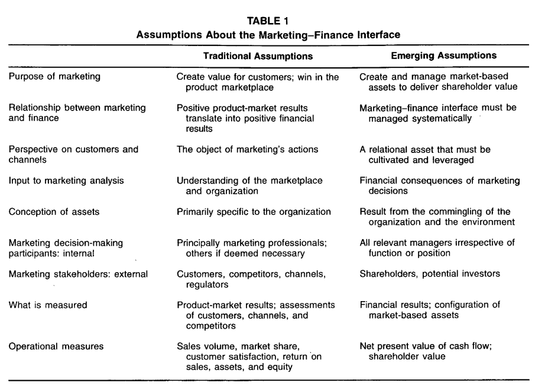
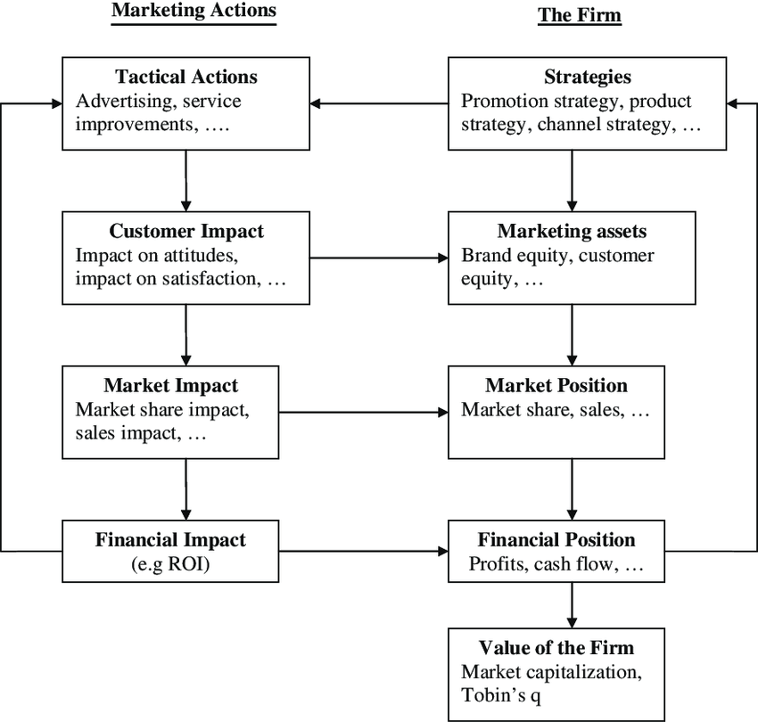
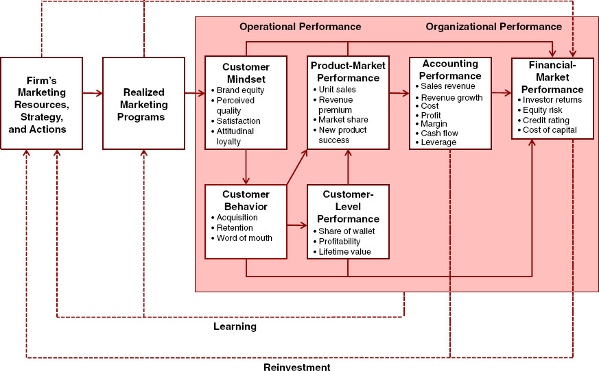

# Marketing-Finance Interface {#marketing-finance}

Review papers

-   [@srinivasan2009; @commenta2009]

-   [@edeling2016]: meta-analysis

![Figure 1 [@srinivasan2009]](images/paste-E4F43EEF.png){width="90%"}

Market efficiency

-   Weak efficiency: historical information only

-   Semi-strong efficiency: historical info + public info in real time

-   Strong Efficiency: historical info + public and private info

In marketing, the general consensus is that market efficiency holds in between its weak and semi-strong form

stock market reward firms with higher stock prices as good news about marketing becomes available and vice versa.

Stock market valuation is in sync with product-market valuation (i.e., actions that drive value in product markets should drive firm value)

Methods

-   Single equation approach based on ECM: (e.g., [@srinivasan2009a]) recognizing random walk

-   Stock return response modeling

-   Persistence Modeling (VAR modeling)

Market-based assets are defined as those "arise from the commingling of the firm with entities in its external environment" [@Srivastava_1998, p. 2]

Assets are "any physical, organizational, or human attribute that enables the firm to generate and implement strategies that improve its efficiency and effectiveness in the marketplace" [@Srivastava_1998, p. 3]

Sustained value creation test

1.  Convertible (firms can exploit assets)
2.  Rare
3.  Imperfectly imitable
4.  No perfect substitutes

Market-based assets are: relational and intellectual.

-   Relational market-based assets are "outcomes of the relationship between a firm and key external stakeholders, including distributors, retailers, end customers, other strategic partners". [@Srivastava_1998]

    -   For example, brand equity = relational assets between firms and their customers, while channel equity - relational assets between firms and their channel partners. Brand equity can be created from advertising and superior product functionality.

-   Intellectual market-based assets are "the types of knowledge a firm possesses about the environment, such as the emerging and the potential state of market conditions and the entities in it, including competitors, customers, channels, suppliers, and social and political interest group." [@Srivastava_1998]

Intangible assets can be thought of as [@Srivastava_1998, p. 5]

-   Stock: "a specific amount or extent of brand equity or knowledge of customers' purchasing criteria possessed by a firm

-   Flow: "the extent to which a stock of a particular asset is augmenting or decaying."

Examples of market-based assets

-   Customer relationships

-   Channel relationships

-   Partner relationships

Market-based assets "increase shareholder value by accelerating and enhancing cash flows, lowering the volaitliity and vulnerability of cash flows, and increasing the residual value of cash flows" [@Srivastava_1998, p. 2]



[@Srivastava_1998, p. 2, table 1]

Market-based assets: 3 propositions

1.  The more market-based assets external entities can develop, the more satisfied and eager they are to work with the firm, and the more valuable they are to the firm.
2.  The more market-based assets pass asset testing, the more external entities benefit.
3.  When a company taps or leverages market-based assets to boost cash flows, shareholder value is created.

Generating Customer Value

![[@Srivastava_1998,p. 9]](images/paste-CDAADBBC.png){width="90%"}

Different from tangible balance-sheet assets, intangible assets can create long-term sustained customer value by

-   satisfying the four resource-based tests (knowledge and relationships pass all the tests)

-   adding the value-generating capability of physical assets (Marketing capabilities inherent in organizational processes, such as new product development, order fulfillment, and speed to market, cannot be generated or utilized without **knowledge** of and **relationships** with external entities, such as customers, distributors, suppliers, and other strategic partners. The successful execution of these competencies extends and enhances knowledge and relationships.)

-   exploiting the benefits of organizational networks (network is "a coordinated set of knowledge sources and cooperative relationships" where the value can be greater than the sum of its individual components [@Srivastava_1998, p. 7])

![[@Srivastava_1998, p. 8 Figure 1]](images/paste-6C526C8B.png){width="90%"}

Asset Valuation Methods and Drivers of Shareholder Value

-   Book value (bad because of historical value)

-   Replacement value (bad because of measurement issue)

-   PE (bad because of accrual accounting measure of firm performance)

-   shareholder value approach (current best): discounted future cash flow.

    -   Present value of cash flows during the value growth period and long-term residual value of the business at the end of the value growth period.

    -   Value of any strategy is determined by

        -   **An acceleration of cash flow**s (today's money is preferred than tomorrow's - less risk)

        -   **An increase in the level of cash flows** (e.g., higher sales, or lower costs, working capital, fixed investments)

        -   **A reduction in risk associated with cash flows** (either via volatility or vulnerability of future cash flows), and firm's cost of capital

        -   **The residual value of the business** (long-term value is improved by larger customer base).

Market-Based Assets and Shareholder value

-   Accelerating cash flow: increasing the responsiveness of the marketplace to marketing activity

    -   Quicker response to ads from greater brand equity (brand awareness), faster product trial [@keller1993]

    -   Speed up product life cycle (time-to-market acceptance) from installed base and more partnership to speed to up the product adoption process[@robertson1993reduce]

-   Enhancing cash flows:

    -   generating higher revenues: e.g., product extension

    -   Lowering costs: extensions can increase market share and advertising efficiency and lower costs.

    -   Lowering working capital requirements: relationship marketing can increase efficiency

    -   Lowering fixed capital requirement: relationship marketing can increase efficiency. Networked market-based assets (from cooperative ventures - co-branding, co-marketing alliances) allow partners to leverage each other's networks including customer base.

-   Vulnerability and Volatility of Cash Flows

    -   The vulnerability of cash flows decreases with increased customer satisfaction loyalty and retention

    -   Customers and channel partners relationships enhance stability in operations (from greater sharing of information, automatic ordering and replenishment, lower inventories).

    -   Net present value of a cash flow is enhanced with increased switching costs, and lowering of capital requirements from operation integration.

-   Residual Value of Cash Flows (those beyond forecast periods)

    -   increase with size, loyalty and quality (purchase more) of customer base

    -   customer base creates barriers fro competition.

-   Cash flow is encouraged to be firm performance measure because of less accrual accounting problems (i.e., historical performance, not adjusted for risk, and easily manipulated)

Marketing actions (e.g, adverting, product innovation) can build long-term assets (e.g., brand equity, customer equity), in turn increase short-term profitability (e.g., increase marketing effectiveness for dollars spent on advertising) [@Rust_2004]

{style="display: block; margin: 1em auto" width="100%"}

The Chain of Marketing Productivity (source [@Rust_2004])

Relationship between marketing and finance [@Srivastava_1998]

Stage 1: Market-based Assets

-   Customer relationships: Brands, installed base.
-   Partner Relationship: channels, co-branding network.

Stage 2:

-   Faster Market penetration
-   Price premium
-   share premium
-   extensions
-   reduce sales/service costs
-   Loyalty/ Retention

Stage 3: Shareholder value:

-   Accelerate Cash Flows
-   Enhance Cash Flows
-   Reduce Volatility and Vulnerability of Cash flows
-   Enhance Residual Value of Cash Flows.

[@Grewal_2010; @McAlister_2016; @Morgan_2009] used Tobin's Q in marketing research. since it is "forward-looking, risk-adjusted, and less easily manipulated by managers" [@Wies_2019]. When probing factors affecting Tobin's Q, it was suggested to control for **financial leverage**, and **cash flows**

```{r, echo=FALSE, eval=FALSE}
# Extended example: reading multiple data files ---------------------------

setwd("stocks")
# get file names
stocks <- list.files()  
# apply read_csv to each file name; return a list
stocks_ls <- lapply(stocks, read_csv)  

names(stocks_ls) <- str_remove(stocks, ".csv")
names(stocks_ls)
stocks_df <- bind_rows(stocks_ls, .id = "stock")

# Let's calculate change from opening to closing price each day
stocks_df$Change <- stocks_df$Open - stocks_df$Close

# first six records
head(stocks_df)

head(stocks_df$Date)
stocks_df$Date <- dmy(stocks_df$Date)

# Dates print like character values but are actually numbers.
head(stocks_df$Date)
head(as.numeric(stocks_df$Date))

# Having the Date properly formatted allows us to extract Day and Month with
# ease.

# Extract day of week and save into new column called "Day"
stocks_df$Day <- wday(stocks_df$Date, label = TRUE)

# Extract month of year and save into new column called "Month"
stocks_df$Month <- month(stocks_df$Date, label = TRUE)


# first six records
head(stocks_df)

# plot closing price over time for all stocks
ggplot(stocks_df, aes(x = Date, y = Close, color = stock)) +
  geom_line() 

# boxplots of change by day of week for each stock
ggplot(stocks_df, aes(x = Day, y = Change)) +
  geom_boxplot() +
  facet_wrap(~stock)

# Extended example: reshape stocks_df to be "long" ------------------------

# If we examine the column headers of stocks_df we can see that we really have
# five variables instead of seven: (1) Stock, (2) Date, (3) price type, (4)
# price, and (5) volume. Below we use gather() to make the data "tidy".

stocks_df
stocks_df_long <- pivot_longer(stocks_df, Open:Close, names_to = "price_type", values_to =  "price")
head(stocks_df_long)

# With our data in "long" format we can create plots like this:
ggplot(filter(stocks_df_long, price_type %in% c("High","Low")), 
       aes(x = Date, y = price, color = price_type)) +
  geom_line() +
  facet_wrap(~stock, scales = "free") 

```

@anderson2018 found that there is a significant improvements from increasing both business skills (marketing and finance). However, the pathway to improve profits from marketing skills is via growth focus (e.g., higher sales, more investments in products, and employees). The pathway to improve profits from the finance skills is via efficiency or cost focus. Hence, the recommendation is that marketing/sales skills have better fit for startups, while finance/accounting skills are more needed in mature companies.

@cheong2021 found that advertising investments is not only beneficial in terms of customers, but also in terms of investors since it reduces stock price synchronicity (i.e., a firm stock price follows closely to its industry moving)

@lacka2021 define price impact as" the impact on the variance of stock price." They estimate the permanent and temporary price impacts of the firm-generated Twitter content of S&P 500 IT firms: firm-generated tweets induce both permanent and temporary price impacts, depending on valence and subject matter. Tweets reflecting **only valence or subject matter** concerning consumer or competitor orientation only have **temporary** price impacts, while those with both attributes generate permanent price impact. Moreover, negative valence tweets about competitors generate the largest permanent price impacts.

[@katsikeas2016] Performance outcomes in marketing

{width="100%"}

[@king2011industry] Impact of Firm Investment Decisions on Industry Growth and Volatility

-   **Research Context:**

    -   Managers' challenge in deciding firm investments aimed at both creating and capturing value.

    -   Proposition: Such investment decisions can shape the growth and volatility of an entire industry.

-   **Objective:**

    -   To determine the impact of aggregate firm investments on the growth and volatility of industry profit and sales.

-   **Methodology:**

    -   Analysis of data from 377 industries spanning a 16-year period.

-   **Key Findings:**

    1.  Firm investments have a noticeable effect on both the growth rate and volatility of their respective industries.

    2.  Investment in value creation and value appropriation has intricate relationships with different facets of the industry environment.

## Marketing Value

[@hanssens2016] argue for marketing value in a firm and how to appropriate assess its effectiveness and efficiency.

## Business Valuation

[@mccarthy2017] Valuing subscription-based business

-   Use DISH network and Sirius XM Holdings data, the authors estimate the overall value of the firm (customer-based corporate valuation)

**Unequal Impact of Zestimate on the Housing Market: We study the impact of Zillow's Zestimate on housing market outcomes and how the impact differs across socioeconomic segments. Zestimate is produced by a machine learning algorithm using large amounts of data and aims to predict a home's market value at any time. Zestimate can potentially help market participants in the housing market as identifying the value of a home is a nontrivial task. However, inaccurate Zestimate could also lead to incorrect beliefs about property values and therefore, suboptimal decisions, which would hinder the selling process. Meanwhile, Zestimate tends to be systematically more accurate for rich neighborhoods than poor neighborhoods, raising concerns that the benefits of Zestimate may accrue largely to the rich, which could widen socioeconomic inequality. Using data on Zestimate and housing sales in the United States, we show that Zestimate overall benefits the housing market as on average, it increases both buyer surplus and seller profit. This is primarily because its uncertainty reduction effect allows sellers to be more patient and set higher reservation prices to wait for buyers who truly value the properties, which improves seller-buyer match quality. Moreover, Zestimate actually reduces socioeconomic inequality as our results reveal that both rich and poor neighborhoods benefit from Zestimate but that the poor neighborhoods benefit more. This is because poor neighborhoods face greater prior uncertainty and therefore, would benefit more from new signals.**

## M&A

[@singh1987]

-   Variable of interest:

    -   DV: cumulative portfolio abnormal returns

    -   IV: relatedness between acquirer and target

-   Similarity is the presence of technological or product-market relationships between acquirer and target

-   Data: 106 mergers (1975 - 1980)

-   Related firms create more value when merging

[@shelton1988]

-   Variable of interest:

    -   DV: merger dollar gains

    -   IV: product-market fit (between acquirer and target)

-   Similarity is the presence of similar target markets, similar products, or both.

-   Data: 218 mergers (1962 - 1983)

-   Related firms create more value when merging

[@harrison1991]

-   Variable of interest:

    -   DV: ROA

    -   IV: Similarity in R&D, capital, and administrative intensities

-   Complementary is differences between acquirers and targets in R&D, capital, debt, and administrative intensity

-   R&D complementarity boosted unrelated acquisitions.

[@datta1992]

-   Variable of interest:

    -   DV: wealth effects

    -   IV: \# of bids, type of financing, and acquisition

-   Similarity is overlap in served markets

-   Data: 41 primary studies

-   Similar firms create more value when merging

[@ramaswamy1997]

-   Variable of interest:

    -   DV: ROA

    -   IV: similarity in market coverage, operational efficiency, marketing activity, client mix, and risk propensity

-   Difference between acquirers and targets was based on a distance metric

-   Sample: 46 horizontal mergers (banking)

-   Differences impede horizontal banking merger success.

[@healy1997takeovers]

-   Returns to buyer's shareholders are connected with managers' equity stakes.

-   Leveraged buyouts (LBOs) that align management and shareholder interests provide value for purchasers.

[@agrawal1992post; @loughran1997long]

-   Cash deals are more popular with investors than stock-financed deals. The bad signaling effect of equity financing suggests managers may offer overvalued stock. This unfavorable stock market reaction to stock financing is permanent.

-   Negative returns for acquirers who paid with equity five years post-takeover.

[@hitt1998]

-   Variable of interest:

    -   DV: ROA

    -   IV: product-market relatedness and resource complementarities

-   Complementarity is the presence of related assets

-   Data: 24 mergers (case study)

-   Resource complementarities contribute to merging success

[@harford1999corporate]

-   Excess cash acquisitions fail. Announcement period returns are negatively associated with an acquirer's cash.

-   A cash reserve eliminates external borrowing. When managers are shielded from the external market, they make irrational investment decisions.

[@larsson1999]

-   Variable of interest

    -   DV: Synergy realization

    -   IV: combination potential, degree of integration achieved, lack of employee resistance

-   Data: 112 mergers (case study)

-   Complementary operations increase synergy, especially with organizational integration.

[@agrawal2000]

-   there is evidence for underperformance after M&A performance

[@mitchell2000managerial]

-   Small acquirers see favorable returns three years post-acquisition.

[@sudarsanam2003glamour]

-   Undervalued acquirers with high book-to-market ratios (value' acquirers) have favorable long-run returns, while overvalued acquirers with low book-to-market ratios have negative returns.

-   The stock market extrapolates management's ability to make solid purchases from the company's finances. "Glamour" acquirers' managers are generally overconfident in their ability to handle an acquisition, and their actions aren't rigorously checked. Value' acquirers, rigorously scrutinized by other stakeholders, are more cautious in appraising possible targets, leading to wiser decisions.

[@megginson2004]

-   Business similarity between merging firms is linked with positive stock performance.

-   Divestitures or spin-offs that dispose of non-core assets or operating divisions boost stockholder value.

[@moeller2004firm]

-   Small acquirers have larger announcement period returns, regardless of target ownership (public/private).

[@fuller2002returns; @conn2005impact]

-   Buyer shareholders enjoyed big gains when the target was a privately owned corporation or a parent-controlled subsidiary.

-   The bidder benefits from the illiquidity discount and enhanced information sharing from concentrated ownership.

-   Bidders using stock transfers and other non-cash means did not underperform and saw positive stock market reactions. Private target managers, who are expected to become major stakeholders in the new business, have a greater motive to supervise the bidder's management, which provides value for the bidder. Deferred tax obligations in a stock offer may lead target ownership to accept a lower price. This leads to increased shareholder returns.

-   A lack of awareness around private bids makes it easier for bidders to abandon discussions, reducing hubris-driven judgments. The stock market favors glamour' businesses bidding for private targets.

[@moeller2005wealth]

-   When inorganic growth is no longer sustainable, serial acquirers with high valuations lose money on their purchases.

[@cosh2006board]

-   CEO ownership increased long-term returns.

[@swaminathan2008] found that when merging organizations have poor strategic emphasis alignment, diversity improves value. In contrast, when merging organizations have strong strategic emphasis alignment, value is enhanced when the merger goal is consolidation.

-   For a summary of M&A research in marketing up until 2008 (see table 1, p. 34)

-   Contributions:

    -   Strategic emphasis alignment is an important variable in merger value creation

    -   Both resource similarity and resource complementarity create value (but under different merger motives)

    -   marketing resources (e..g, advertising relative to R&D) affect M&A value creation.

-   Merger motives (p. 40):

    -   Consolidation: to gain power by combining two firms with similar products and serving similar markets

    -   related diversification: two firms that operate in completely non-overlapping businesses.

    -   unrelated diversification: two firms in closely related industries

        -   "related diversification in which firms gain access to and acquire a related technology"

        -   "related diversification in which firms acquire a related product for product line filling"

-   Data: 206 M&A (electronics, chemicals, foods).

-   Method: event studies

-   Strategic emphasis was operationalized by substracting the firm's R&D expenditures from its advertising expenditures and dividing it by the total assets of the firm in the year preceding the merger (following [@mizik2003])

-   Strategic emphasis alignment: absolute value fo the difference between the acquirer strategic emphasis and that of the target.

[@king2008performance] see [Research and Development]

[@chari2009]

-   Acquirers of domestic targets experience bigger short- and long-term wealth benefits than offshore acquirers. Deals that diversify across borders perform poorly. Returns are higher when the target's domestic product and financial markets move independently of the acquirer's own nation. Stock markets favor developed market acquirers in emerging markets.

-   As developing market spreads grow, acquirer returns rise. When majority ownership is transferred, the acquirer, target, and acquirer's shareholders all enjoy stronger profits, especially in R&D- and brand-intensive businesses where intellectual assets are significant.

[@bouwman2009market]

-   In terms of two- and three-year buy-and-hold returns, bull market acquisitions underperform bear market acquisitions.

-   Managers suffer from hubris during market upswings and overestimate synergies and profits. When the market is pessimistic, managers make more cautious decisions, thus purchases are motivated by realistic prospects of beneficial synergies.

[@swaminathan2009a]

-   Contribution:

    -   alliance announcements create value for firm

    -   When network efficiency and density are moderate, they have the most favorable influence.

    -   Network reputation and network centrality have no effect

    -   marketing alliance capability (firm's ability to management a network of previous marketing alliances), positively influence value creation.

-   Network features:

    -   Network centrality: whether the company has partnerships (\# of firms with which a firm is directly connected)

    -   Network efficiency: The company's network offers new capabilities (the degree to which the firm's network of alliances involves firms that possess non-redundant knowledge, skills, and capabilities)

    -   Network density: the firm's network involves interconnections among firms (the degree of interconnectedness among various actors in a network)

    -   Network reputation: the firm has a strong reputation (aggregate-level quality ascribed to firms in a firm's network).

    -   Marketing alliance capability: The company may handle marketing relationships

-   To construct the network variables, they were used from the period of 5 years before, but other research use 7 years [@gulati1999; @schilling2007]

-   How firm networks influence firm abnormal returns?

    -   Networks multiply alliance benefits

    -   Networks facilitate alliance compliance

    -   Networks signal firms and alliance quality

-   Control variables:

    -   Following [@dutta1999], installed base of customers (firm sales), firm resources devoted to building customer relationships (firm receivables), marketing expenditures (firm selling, general, and administrative expenses), firm advertising expenditures. Then, add technical know-how (R&D expenditure). All of these variables use Koyck lag function, then combine under principal components analysis to avoid multicollinearity.

    -   firm alliance experience

    -   size of alliance partners (ratio of market cap of the firm to the partner)

    -   Intra industry alliances vs. inter industry alliances (following [@rindfleisch2001b])

    -   Repeat partnering

    -   partner network characteristics (same network variables)

-   Selection model and value creation model because partnership may be based on referrals (following [@verbeek1992a]

@umashankar2021 found that M&A decreases customer satisfaction that cannibalize firm value despite potential efficiencies (due to a shift by executives from customers attention to financial issues). The presence of marketing experts in upper echelons can mitigate this negative effect. Customer dissatisfaction with M&As might offset any synergy and efficiency advantages.

@gao2024big

-   High-performing M&A professionals, particularly those early in their career growth, tend to move toward boutique (focused) banks rather than larger, multidivisional bulge bracket firms.

-   This migration is driven by cross-subsidization within bulge bracket firms, where underperformance in non-M&A departments indirectly pushes talent toward focused boutiques.

-   The shift of skilled labor to boutiques enhances boutique sector performance and influences M&A deal outcomes, highlighting how organizational structure and talent movement shape industry trends.

## Stock Return Response Modeling

Valuation model

$$
MarketCap_{it} = \sum_{T = t}^\infty (\frac{1}{1 + r_{it}})^{T-t} E(CF_T)
$$

Equivalently,

$$
MarketCap_{it} = (1 + Eret_{it}) MarketCap_{it-1}+ \sum_{T=t}^\infty (\frac{1}{1+r_{it}})^{T-t} \Delta E(CF_{iT})
$$

where0

-   $Eret$ = expected rate of return for an asset

-   $\Delta E(CF_{iT})$ = change in the expected cash flows

Hence, the stock return can be written as

$$
StockReturn_{it} = 
$$

## Tobin's Q

Traditional Tobin's q [@Rao_2004]

$$
q = \frac{MVE + PS + DEBT}{TA}
$$

where

-   MVE = share price x number of common stock outstanding

-   PS = liquidating value of the firm's preferred stock

-   DEBT = (short-term liabilities - short-term assets) + book value of long-term debt

-   TA = book value of total assets

Tobin's q is scale independent. Hence, it's a good measure of relative market performance

[@peters2017] Peters and Taylor Total Q

-   The neoclassical theory of investment can still be applied to intangible assets.

-   Propose a new Tobin's q proxy that accounts for intangible capital, which is called **total q**

    -   = the firm's market value divided by the sum of its physical and intangible capital stocks

    -   Firm's intangible capital = sum of its knowledge capital and organizational capital

        -   R&D spending = an investment in knowledge capital (using the perpetual -inventory method to a firm's past R&D to measure the replacement cost of its knowledge capital)

        -   Fraction of past selling, general, and administrative (SG&A) spending is organization capital, which includes human capital, brand, customer relationship,s and distribution systems.

        -   A firm's total capital as the sum of its physical and intangible capital (measured at replacement cost

-   Intangible capital is costlier than physical capital to adjust

-   [Download Data from WRDS](https://wrds-www.wharton.upenn.edu/pages/get-data/peters-and-taylor-total-q/peters-and-taylor-total-q/)

-   Sample excludes utilities (SIC 4900-4999), financial firms (6000-6999), others (9000+), missing or non-positive book value of assets or sales, and firms with less than \$5mil in physical capital. Winsorize all regression variables at the 1% level to remove outliers.

Proposed total q

$$
\begin{aligned}
q^{tot}_{it} &= \frac{V_{it}}{K_{it}^{phy} + K_{it}^{int}} \\
&= \frac{prcc_f \times csho + dltt + dlc- act}{ppegt + K_{it}^{int}}
\end{aligned}
$$

where

-   $V_{it}$ = firm's market value = outshining equity (prcc_f times csho)+ book value of debt (dltt + dlc) - firm's current assets (act)

-   $K_{it}^{phy}$ = replacement cost of physical capital = ppegt

-   $K_{it}^{int}$ = replacement cost of intangible capital

Previous Tobin's q measure did not include the intangible part [@fazzari1987] [@erickson2011a]

Intangible capital can be

-   Created internally

    -   knowledge knowledge (e.g., patents, software): using perpetual inventory method $G_{it} = (1- \delta_{RD}) G_{i, t-1} + RD_{it}$

        -   $G_{it}$ = the end-of-period stock of knowledge capital (for $G_{i0}$ can assume to be 0)

        -   $\delta_{RD}$ =depreciation rate (use BEA's industry-specific R&D depreciation rates [@li2018] and 15% for missing data)

        -   $RD_{it}$ = real expenditures on R&D during the year (if missing treat as 0, [@lev]

    -   brand capital (advertising under selling expense within SG&A)

    -   human capital (employee training under general or admin expense within SG&A)

    -   Others: Other Intangible Assets (intano) in Compustat

-   Purchased externally

    -   Goodwill (not separately identifiable e.g., human capital is booked under goodwill).

    -   Other Intangible Asset: (e..g, patent, software if separately identifiable)

[@bendle2018misuse]

-   **Definition of AATQ:** Accounting-Based Approximations of Tobin's q (AATQ) use accounting data to estimate asset replacement costs, differing from Tobin's original concept.

-   **Core Issue:** AATQ overlook valuable, unrecorded market-based assets (e.g., brand equity, customer satisfaction).

-   **Key Criticisms:**

    -   **Lack of Comparability:** AATQ are not comparable across industries.

    -   **Asset Inclusion:** They do not focus solely on tangible assets in their calculations.

    -   **Equilibrium Misconception:** AATQ should not be expected to stabilize at 1, contrary to some assumptions.

-   **Performance Measurement Flaws:**

    -   AATQ can reflect positive performance but also respond to performance-neutral strategies.

    -   When AATQ exceeds 1 (common in practice), it can increase even with wasted investments.

-   **Bias Toward Market-Based Assets:** AATQ are biased, often overstating the effectiveness of investments in market-based assets.

-   **Call to Action:** Marketing scholars should reassess the theoretical foundations of AATQ and be cautious in their application as performance metrics.

## Corporate Agility

-   Corporate agility defined as "a firm's ability to adapt to environmental changes"

-   [@lehn2021] hypothesizes that firm agility increases firms' survival rates.

-   Since firms have to report accurately to the SEC, this measure is reliable.

-   Agility measured as the sensitivity of its responsive strategies to rivals' threats.

    -   "A firm's corporate agility is estimated as the sensitivity of its product similarity or dissimilarity (to its rival's products) to the rivals' product similarity (to the firm's products." (p. 9)

-   Agility is different from firm flexibility

## Firm Complexity

[@hoitash2017] Accounting Reporting Complexity

-   Accounting complexity is defined as "the difficulty to understand, prepare, audit, and analyze the financial reports." (p. 262)

-   Accounting reporting complexity (ARC) is based on the count of accounting items disclosed in eXtensible Business Reporting Language (XBRL) 10-K filings.

-   Operating complexity: measured by the number of business and geographic segments and the existence of foreign operations as measure of complexity

-   Linguistic complexity of financial reports (i.e., readability)

    -   Fog Index [@gunning1952technique]

    -   Length of 10-K filings

-   Data

    -   XBRL from Calbench, criteria:

        -   2011-2014 that filed within 150 days of the fiscal year-end

        -   merge with compustat

        -   positive sales, and non-missing common shares outstanding

        -   assets \> 10 mil

        -   Exclude missing data on material weaknesses, audit fess, restatements from Audit Analytics

-   ARC is inversely associated with financial reporting quality

-   ARC is positively associated with audit delay and audit fees

[@hoitash2022] Firm complexity

-   ARC was used to measure firm complexity

    -   It can be dis aggregated to measure the complexity of specific economic activities, (e.g., derivatives or leases)

-   Even though [@loughran2020; @loughran2020a] measure firm complexity using dictionary-based approach, the texts can sometimes refer to other companies' activities, whereas accounting line items belong to the focal firm

-   Accounting disclosures comprise the majority of economic and corporate activity. Consequently, these disclosures can reflect company complexity holistically.

-   Other measures of complexity: such as number of operating segments (e.g., <https://gist.github.com/joosti/213050de42d6e78f1634>) using BUSSEG (business segments) and OPSEG (operating segment) in compustat.

-   [@hoitash2021] find that when complexity increases, analysts struggle to create accurate forecasts.

    -   [@garcia2020] find that CSR are positively correlated with greater ARC.

## Initial Coin Offerings

Data sources

-   [@czaja2021]

-   [@lyandres2022]

-   [@hsieh2021]

-   <https://research.tokendata.io/>

-   [@momtaz2020]

-   [@belitski2021]

-   [@campino2022]

-   <https://zenodo.org/record/4034258#.YzdQbXbMLq4>

## Venture Capital

@rieger2024express

-   Trademark applications are essential early signals to VCs, enhancing new ventures' chances of obtaining seed funding.

-   This effect is strongest within the first 100 days and is more pronounced in low-tech uncertainty industries and non-clustered locations.

-   A Crunchbase and USPTO dataset on 5,370 ventures shows that ventures with trademarks are likelier to secure VC funding.

## Initial Public Offerings

[New era for IPO](https://sloanreview.mit.edu/article/ipo-disclosures-are-ripe-for-reform/)

-   Businesses focus on more growth (e.g., number of users) than traditional financial measures and take longer to go public (double the age before going public as compared to 1980s).

-   More retail investors due to lo-cost trading platforms.

-   Longer but still uninformative data. Proposed triggered disclosure

[@cao2022express]

-   Firms can use their innovation potential as a credible signal of their quality at the time of an initial public offering (IPO).

-   Innovation potential is positively associated with the initial value of the IPO and with first-day IPO returns, and negatively associated with the extent to which insiders sell their shares at the time of the IPO.

-   Patents have a stronger impact on insider sales than preannouncements and generic references to future innovation, while preannouncements have the strongest impact on first-day IPO returns.

**How Does Going Public Affect Employee Satisfaction? Evidence from Glassdoor Reviews: We examine how initial public offerings (IPOs) influence employees' satisfaction with their employers. Using millions of company reviews and a generalized difference-in-differences method, we document that employees become less satisfied after their employers go public. The effect is driven by employees who joined the company before the IPO rather than those who joined after it and is stronger for employees whose tasks relate to regulatory compliance, for smaller firms, and firms with Big 4 auditors at the IPO. The effect is weaker for IPO firms in industries with low environmental, social, and governance (especially social) reputation risk. Using the 2012 Jumpstart Our Business Startups Act to explore changes in regulatory burdens associated with an IPO, we find that the adverse effect of an IPO on employee satisfaction is weaker for IPO firms that benefit from reduced regulatory burden. Overall, our findings provide novel insights into how going public can affect employee welfare and one potential mechanism behind this effect.**
