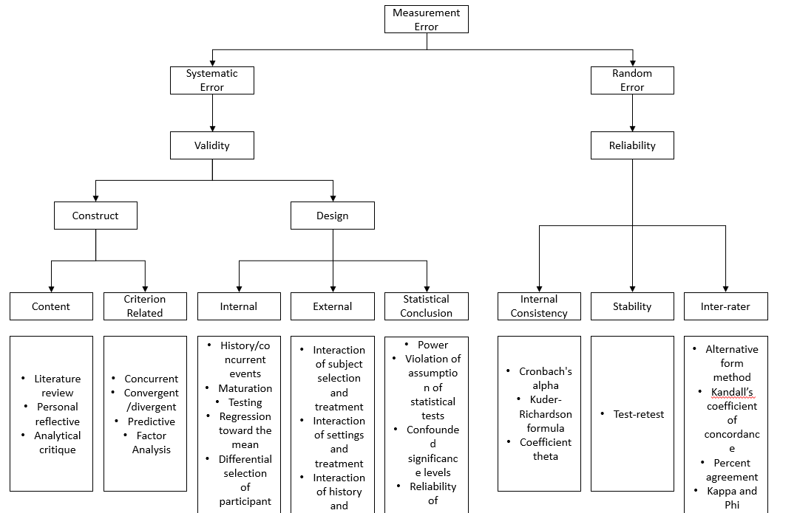
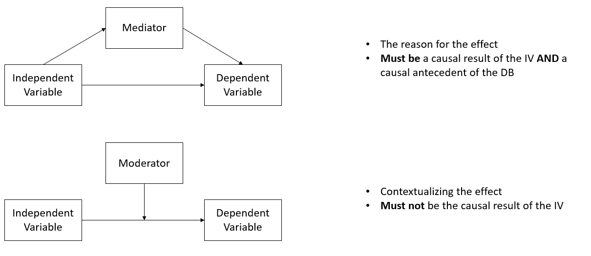
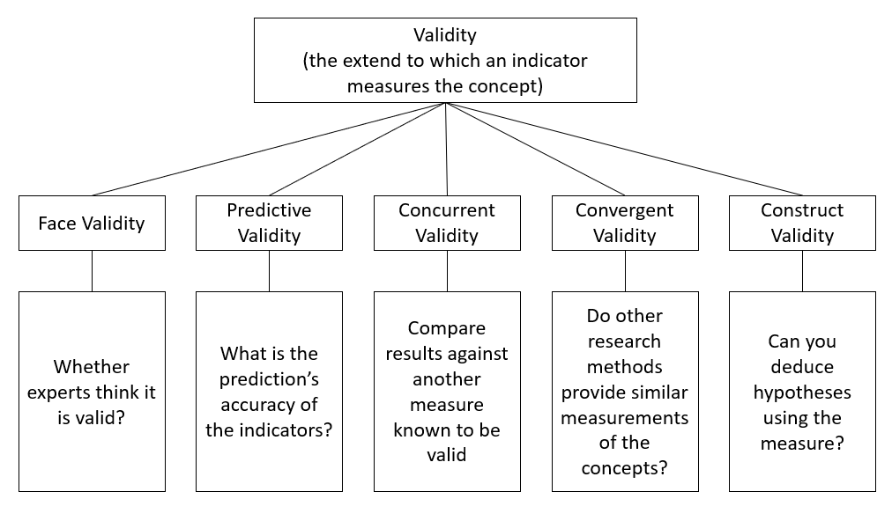
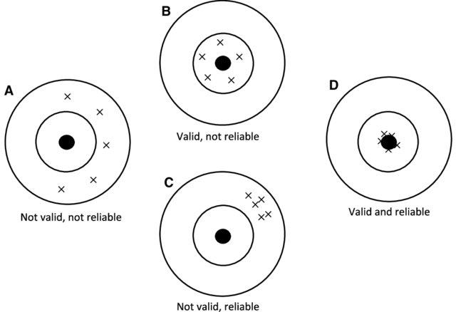

# Surveys

|         | Sampling                        | Interviews            | Data environment |
|---------|---------------------------------|-----------------------|------------------|
| 1st era | area probability                | face-to-face          | stand-alone      |
| 2nd ear | random digital dial probability | telephone             | stand-alone      |
| 3rd era | non-probability                 | computer-administered | linked           |

: SICSS Summer 2020 -Survey Research in the Digital Age by professor **Matthew Salganik**

Total survey error framework [@Groves_2010]

Insight:

1.  Errors can come from bias or variance
2.  Total survey error = Measurement error + representation error

[@Groves_2010, Fig. 3]

 

Probability and Non-probability Sampling

-   Probability sample: every unit from a frame population has a known and non-zero probability of inclusion
-   With weighting, we can recover bias in your sampling.

<!-- -->

-   Non-response problem

Horvitz-Thompson estimator (or bias estimator):

$$
\hat{\bar{y}} = \frac{\sum_{i \in s}y_i / \pi_i}{N}
$$

where $\pi_i$ = person i's probability of inclusion (we have to estimate)

[Wiki Survey](https://www.allourideas.org/)

-   Create a survey that leverages the power of people

Mass Collaboration

-   Human Computation: Train People -\> Train Lots of People -\> Train Machine

    -   Cleaning

    -   De-biasing

    -   Combining

-   Open Call:

    -   solutions are easier to check than generate

    -   required specialized skills

-   Distributed Data Collection:

    -   People go out and collect data

    -   quality check

[Fragile family challenges](https://www.fragilefamilieschallenge.org/)

# Construct vs. Variable

+----------+-------+------------------+------------------+
|          |       | Reality          |                  |
+:========:+:=====:+:================:+:================:+
|          |       | True             | False            |
+----------+-------+------------------+------------------+
| Measured | True  | Correct          | Type 1 error     |
|          |       |                  |                  |
|          |       |                  | (False positive) |
+----------+-------+------------------+------------------+
|          | False | Type 2 error     | Correct          |
|          |       |                  |                  |
|          |       | (False Negative) |                  |
+----------+-------+------------------+------------------+

: measured or perceived vs. reality

picture from [@Irvine_2019]

 

# Experiment

Things to consider:

-   Validity

    -   statistical conclusion validity
    -   internal validity
    -   construct validity: whether you operationalize your construct correctly
    -   external validity: generalization

-   Heterogeneity of treatment effects

    -   average (aggregate) effect can be artificially constructed.

-   Mechanisms

 

More things to consider

-   cost
-   control
-   realism
-   ethics

 

The Principles of Humane Experimental Technique by Russell and Burch (1959): 3Rs

-   Replace: with natural (less invasive)
-   Refine: less harmful
-   Reduce: min number of participants

 

Before running experiments, to make sure that you did not tamper with the data, or hypotheses (i.e., change them after the fact), you should always pre-register your research. A website that allows you to do this and automatically provides you with time stamp is [aspredicted](https://aspredicted.org/)

This way then you can show to reviewers that you did hypothesize before running analysis.

 

To combat replication crisis in psychology, we can advocate for open research in which researchers public their data and analyses. Popular websites include:

-   [ResearchBox](https://researchbox.org/index.php)

-   <https://osf.io/>

To see whether authors temper with their data, we can use [p-curve](http://p-curve.com/) to inspect. [1](https://datacolada.org/66) [2](https://datacolada.org/67) [3](https://datacolada.org/49) [4](https://datacolada.org/45) [5](https://datacolada.org/91)

[Interaction Effects Need Interaction Controls](https://datacolada.org/80) (basically, you can't just control for main effects).
