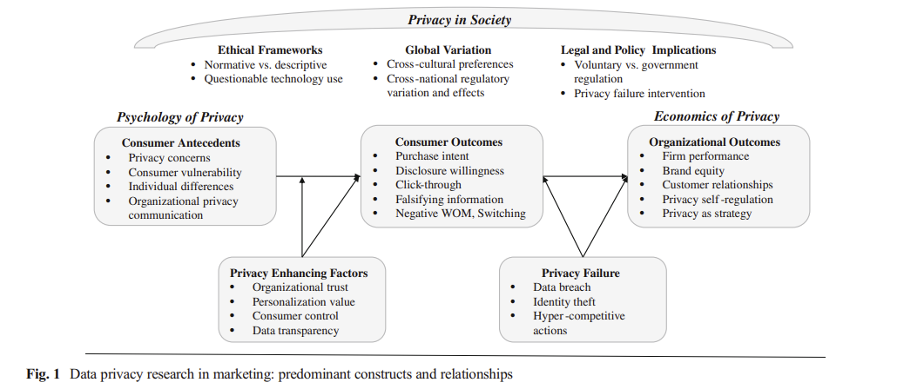
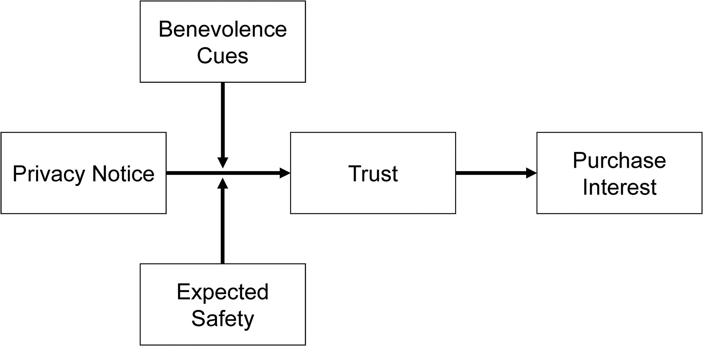

# Privacy

Reviews:

-   Retailing: [@martin2020; @martin2020a]

[@martin2016] Data privacy in marketing

Definitions of privacy

-   Privacy as "a limited access to a consumer's information" [@westin1967f] with 4 substates: anonymity, solitude, reserve, and intimacy

-   claim to control personal information flows

Consumer info privacy: "control of dissemination and use of consumer information including, but not limited to demographic, search history and personal profile information" (p. 136). Examples of consumer privacy violations are unwanted marketing communication, highly targeted advertisements, online tracking.

Privacy concerns are proxies for measuring consumer privacy that is often operationalized as consumers' beliefs, attitudes, and perceptions bout their privacy (survey data) [@malhotra2004internet].

Privacy paradox: the disconnect between consumers' declared privacy desires and their actual privacy policies (even though people say that they are concerned about privacy, they still hare their sensitive personal information freely).

Privacy failure (e.g., data breach, hacking intrusion, company loss company): [@malhotra2011evaluating; @martin2017data]

Privacy can be a dimension for firms to differentiate [@casadesus2015competing; @rust2002customer]

Privacy in society:

-   Federal Trade Commission (FTC) regulates consumer info privacy issues using 2 frameworks

    -   Notice-and-Choice Model (including Fair Info Practice Principles)

    -   Harm-Based Model (whether harms occurs)

-   European Union (EU) Data Protection Directive is a set of consumer info privacy protections (more comprehensive than U.S.-based).

    -   The default approach to address consumer information privacy concerns is still industry self-regulation (but after the article was published, EU has GDPR but nothing in the US).

-   When firms lack privacy regulations, consumer demand more government intervention [@milberg2000]

-   advertising effectiveness is diminished after EU Data protection directive was implemented [@goldfarb2011online]

Theoretical perspectives of privacy:

-   Social Contract Theory: A moral contract regulates the fundamental principles and agreements between a society and an individual. Consumers believe that marketers have kept their end of the social contract when the company gives them with additional value through personalized products or monetary compensation.

-   Justice Theory: Procedures designed to preserve customer privacy represent the procedural justice dimension, whereas the outcome of a marketing interaction with privacy implications represents the distributive justice dimension. Fair access to and utilization of information are characteristics of procedural fairness. Fair-appearing policies can address privacy concerns.

    -   Theoretical outcomes of distributive justice include any benefits consumers obtain for disclosing their personal information, so jeopardizing their privacy. Common outcomes include customized goods, personalized value, faster customer-business interaction, complimentary services, and even monetary compensation.

    -   Parallel privacy paradox indicates that customers like the outcomes delivered by these marketers while simultaneously feeling vulnerable when releasing personal information. [@awad2006]

    -   Complex privacy policies that impede customer comprehension are perceived as less fair and, thus, decrease consumer confidence and trust in the company [@vail2008empirical]. Procedural privacy is about not only firms' privacy policies but also consumers' interpretation of them.

-   Power-Responsibility Equilibrium Theory/ Control Theory: The social obligation of the more powerful partner in a partnership is to foster a sense of equality (trust and confidence). Consumers respond defensively to perceived power inequalities (i.e., threats to their information privacy). As a result, they may withhold facts or supply false information to a company.

-   Social Exchange Theory: When perceived benefits exceed perceived costs, people will disclose personal information. Benefits include individualized marketing offerings or even free services (e.g., consumers regard more frequent marketing communication and targeted advertisements as a trade-off for valuable services supplied by the marketer).

    -   When consumers sense greater personalization value from an information exchange, they are more likely to believe marketers have met their end of the social contract governing the transaction [@chellappa2005].

-   Reactance Theory: Privacy concerns heighten reactance

    -   Some consumers fear that highly targeted and individualized marketing communications violate their privacy [@tucker2013]

    -   Ultimately, consumer responses to tailored and personalized marketing communications might appear as communication avoidance, information falsification, unfavorable word-of-mouth, and other negative behaviors [@white2008getting]

-   Behavioral Decision Theory: Consumer perceptions and behaviors about privacy are influenced by multidimensional rational calculations.

{width="90%"}

Consumer privacy concerns:

-   "a proxy for understanding consumers' feeling about their information privacy" (p. 145)

-   Survey scales: see [@smith1996information], more updated version [@malhotra2004internet] which includes

    -   information collection

    -   unauthorized secondary use (internal and external)

    -   improper access

    -   error protection

-   Alternatively, [@sheehan2000dimensions] use a somewhat similar set of dimensions

    -   Awareness of information collection

    -   Information use

    -   Information sensitivity

    -   Familiarity with entity

    -   Compensation

-   Privacy concerns increase over time among both older and younger consumers (but more for older) [@goldfarb2011online]

-   privacy concern is a mediators of a website's personalization increasing click-through [@bleier2015importance]

-   Firm signals (e.g., privacy seals) increase consumers' willingness to reveal info, and promote positive perceptions about the org [@miyazaki2002internet]

-   The broadcast of a privacy policy reduces customer disclosure. In addition, people are inclined to share greater sensitive information when they feel that others have already done so, indicating a decreased risk of disclosure [@acquisti2012impact]

-   Privacy policy declarations boost the benevolence and integrity elements of trust, but do not increase purchase intent (p. 146)

-   Increased purchasing from websites with more stringent privacy practices (i.e., Customers are willing to pay more for privacy) [@tsai2011effect]

Trust:

-   In contrast to measures to alleviate privacy concerns, which are reactive procedures, firm initiatives to increase trust serve as proactive mechanisms [@wirtz2009regulatory]

-   In situations where retailers have personalized or targeted consumer material, trust plays an important role in assuaging privacy worries [@aguirre2016]

-   People do read privacy policies, and those policies influence their trust in that firm [@milne2004strategies] (84% in the sample of 2500 consumers)

-   [@martin2017data] privacy policies can be a good proxy for firms transparency and control, and they are related to firm performance and consumer behaviors.

Personalization:

-   Mixed effects on consumers outcome (p. 147)

-   Key question: Whether information was provided voluntarily or unwillingly, given marketers' ability to gather data overtly or secretly through a variety of methods.

Control

-   Personalized and targeted ad effectiveness is greater when consumers have greater ability (or at least perceived) to control their privacy [@tucker2013]

-   Consumers' perceived information is the mediator through which self-protection, industry self-regulation, and government mandates reduce privacy concerns. [@xu2012research]

    -   But consumers can also disclose too much info, leaving them vulnerable, when they have greater perceived controls [@brandimarte2012economics]

Propositions:

-   "Firms that prioritize data privacy in an authentic way will experience positive performance"

-   "Firms that involve their customers in the info privacy dialogue will experience positive performance"

-   "Firms that implement privacy promoting practices will experiences positive performance under the condition that they align data privacy practices across all aspects of the firm"

-   "Firms that focus on what they do right with respect to data privacy will experience positive performance"

-   "Firms that commit to data privacy practices over the long-term will experience positive performance"

-   "Firms that embody these privacy as strategy tenets will experience higher consumer trust."

## Psychology of Privacy

[@brough2022] Consumers' response to privacy notices (bulletproof glass effect)

-   Study 1: Managers expect a privacy notice will make customers feel more secure

    -   Since managers see that privacy notices as formal legal contract (i.e., binding agreements that dictate how a firm can collect, use and store data), they would expect that this formal contract-based approach can enhance consumers' comfort in purchasing a firm's product.

-   Studies 2, 3, 5: consistent with bulletproof glass increasing feelings of vulnerability (despite the protection offers), formal privacy notices can decrease consumer trust, and purchase interest (despite objective protection emphasis)

    -   On the one hand, privacy is considered a social contract (Consumer perception of privacy invasion versus respect is governed by norm), and firms that respect these expectation can increase consumers' trust [@mccole2010trust] and increase purchase intention[@eastlick2006understanding], and those that violate these norms will receive negative WOM [@miyazaki2009perceived]. Benefits for consumers would not negate this negative reactions [@kim2019seeing]. These social contracts can enhance trust [@kim2019seeing]

    -   On the other hand, formal contracts (instead of social contract) can undermine trust (similar to the bulletproof in unusual settings) [@malhotra2002effects]: Evidence from that multi-round trust game that consumers are less likely to trust when a formal contract was created in the first round than without the contract.

-   Study 4: when consumers had a priori that they should be distrustful, the unintended consequence of privacy notice did not materialize.

    -   When consumers do not have potential harm in mind, when seeing a bulletproof glass (i.e., in unexpected situations), they will react more negatively than when some potential harm is expected

-   Study 5 and 6: when benevolence cues were added to privacy notices, the unintended consequence of privacy notice did not materialize

    -   To increase trust, one can increase either benevolence or competence. Because benevolence-trust can induce consumers to view privacy notices as social contracts rather than formal contracts (as compared to using competence-trust).

    -   Since benevolence-trust is affective where as ability-trust is cognitive, we can use LIWC to score whether a privacy notice regarding its proportion of words that reflect affect process and proportion of words that reflect cognitive process

-   Study 7: the presence and conspicuous absence of privacy info are enough too in decrease purchase intent.

    -   Use Apple's privacy nutrition labels to examine the presence and conspicuous absence of a privacy notice in terms of triggering decreased purchase interest.

    -   Apps were not required to include privacy notices (between 08/2017 and 05/2018), only half of the apps included a privacy policy link [@story2018apps]). In 12/2020, Apple mandated privacy labels in the App Store. Hence, [@brough2022] found that apps with a privacy notice conspicuously absence or present decease app downloads as compared to those without privacy notice.

{width="90%"}

Even though previous study posits that transparency regarding customer data can **reduce** perceived vulnerability [@martin2017data], [@brough2022] posit that privacy notices can make costumers feel **more** vulnerable (similar to the bulletproof glass analogy)

The "bulletproof glass effect" is the increased purchase interest resulting from exposure to a privacy notice" [@brough2022, p. 740]

-   When consumers notice that their data have been collected without consent, click-through rates decrease [@kim2019seeing; @aguirre2015unraveling]

-   Consumers prefer to purchase from website with higher levels of privacy protection [@tsai2011effect]

-   Even though consumers were predicted to be rational in their response to privacy-related info, consumers are more malleable and less intuitive: Consumers are willing to tradeoff privacy in response to

    -   architecture and framing [@adjerid2019choice; @brandimarte2013misplaced]

    -   small inconveniences or incentives [@athey2017digital]

    -   greater perceived control over personal info [@mourey2020past; @tucker2013]

## Organizational Perspective

[@martin2017data]: The impacts of a data breach on a company's performance are mitigated by the provision of transparency and control, which compensate for the vulnerabilities highlighted by consumers and mitigate the impact of a data breach on firm performance.

[@martin2016] The low likelihood of litigation paired with the backdrop of a data breach (a potentially rare event in some industries) suggests that businesses would continue to advocate modest consumer information privacy regulation, keeping the privacy management parts under their control.

## Privacy Paradox

disconnect between consumers' declared privacy desires and their actual privacy policies (even though people say that they are concerned about privacy, they still hare their sensitive personal information freely). [@martin2016]

[@aguirre2016]

-   Privacy concerns can stem from firm leveraging collected customer data to provide personalized communication.

    -   Heighten customer risk perception and decrease trust [@slyke2006]

    -   increase skepticism toward and avoidance of ad [@baek2012]

    -   negative consumer actions [@son2008]

-   Privacy can be consider a commodity where consumers can make risk-benefit tradeoff [@sultan2009]

[@norberg2007privacy] the privacy paradox

[@johnson2020]

-   Even though consumers express strong privacy concerns in survey, only 0.23% of American ad impressions arise from users who opted out of online behavioral advertising.
-   Opt-out users ads get 52% less revenue than that of users with behavioral targeting.
-   Without target ads, per American opt-out consumers, publishers and the exchange lose about \$8.58
-   Opt-out users tend to be more tech savvy.
-   Opt-out rates are higher in older and wealthier American cities.

### Tradeoff

[@chellappa2005]

-   This study examines the usage of online personalization after the tradeoff between personalization value and privacy concerns. More specifically, they found that value for personalization will increase the likelihood of using personalized services, but concern for privacy will decrease the likelihood of using personalized services.

    -   Trust in vendor positively moderates the use of personalization. Hence, online vendors can leverage trust building activities to acquire and use customer info.

-   This study provides support for orthogonality of personalization and privacy, vendors can independently develop personalized products and strategies to alleviate consumers' privacy concerns.

-   Personalization is defined as "the ability to proactively tailor products and purchase experience to the tastes of individual consumers based upon their personal and preference information." (p. 181), which depends on

    -   Vendors' ability to acquire and process consumer info

    -   Consumers' willingness to share info and use personalized services.

-   Personalization can increase switching cost (filling out more information if one switches to another competitor) and loyalty [@alba1997interactive]. In the offline it is used to extract implicit price premiums, but in the online context, vendors are expected to do so (p. 183).

    -   Online personalization's main benefits are product or service fit and proactive delivery.

-   Privacy concerns:

    -   "consumer is willing to share her preference information in exchange for apparent benefits, such as convenience, from using personalized products and services" (p. 186). This is a type of social exchange where consumers expect that their expected (personalization) gain is greater than their (privacy) loss

    -   Privacy is defined as "an individual's ability to control the terms by which their personal information is acquired and used." (p. 186)

[@white2004consumer]

-   Although individuals with somewhat deep connection views were more likely to reveal "privacy-related" material, they were less likely to reveal humiliating information.

-   Although loyal customers found the exchange of privacy-related personal information for customized benefit offerings (relative to noncustomized offerings) attractive, the opposite was true for embarrassing information; these participants appeared to find the exchange of customized offerings for this type of information unattractive.

[@wattal2012]

-   Consumers respond favorably when businesses employ product-based personalisation (where the usage of information is not explicitly mentioned).

-   Consumers, on the other side, react unfavorably when businesses are explicit about how they use personally identifiable information (i.e., a personalized greeting).

-   consumer familiarity with businesses moderates consumers' unfavorable reactions to personalized greetings.

### No tradeoff

[@tucker2013] personalized ad and privacy controls in social networks

-   found that personalized ad was ineffective before Facebook's introduction of privacy controls, but was twice as effective at attracting users after the shift in Facebook's policy (because they have more control over their personal info)

-   when sites can assure consumers that they are in control of their privacy, personalization can generate higher click-through rates.

-   DiD from Facebook introduction of more privacy controls for users.

[@walrave2016] personalization and privacy in social network ad

Contributions:

-   Even though this study hypothesize that a moderate level of personalization is optimal in ad effectiveness, they found the highest personalisation condition yielded the most positive response, and privacy concerns did not mitigate its impacts (authors justify that maybe persoanlization is not high enough to trigger the persuasion knowledge). In short, there is no tradeoff between personalization and privacy on brand engagement.

Definitions:

-   Personalization in the marketing communication context is defined as "creating persuasive messages that refer to aspects of a person's self" [@maslowska2011]

-   Evidence of positive impact of personalization on performance

    -   on brand responses [@bauer2014]

    -   on campaign responses [@kim2012]

    -   traditional banner ad context, more positive persuasive effects [@tam2005web]

    -   email newsletters, more positive persuasive effects [@maslowska2011effectiveness]

    -   personalized mobile coupons are evaluated positively and more likely to be redeemed [@xu2008combining]

    -   Positive relationship with brand engagement [@chu2011viral]

-   U-shaped impact of personalization on ad performance:

    -   Positive: Personalization can evoke central information processing due to its high self-relevant [@cho2004people]. According to information processing theory, consumers are driven to elaborate on relevant messages, which increases attention, elaboration, and strong attitudes [@petty1986]. Hence, more personalization, more positive ad response.

    -   Negative: personalization increases skepticism toward ad due to the persuasion knowledge model [@friestad1994]. Knowing that a brand tries to persuade, one triggers persuasion knowledge which diminish persuasion effects. For example, people resist personalized emails when personal info is highly distintive [@white2008getting]

        -   Consumers privacy concerns can enhance this negative relationship (i.e., reactance).

-   Privacy is defined as a "selective control of access to the self or to one's group" [@altman1976conceptual]

    -   People want to strive a balance between openness and closeness (p. 604). When people feel their privacy concerns is threatened by personalization, they have coping strategies to protect their privacy from marketers [@youn2009determinants; @grant2005young]

## Privacy Calculus/ Economics of Privacy

[@bol2018]

Privacy self-regulation [@martin2016]: more prevalent in the US than EU.

[@bowie2006]

[@conitzer2012]

-   A monopolist model with a continuum of heterogeneous consumers and the option for them to remain anonymous and avoid being recognized as prior customers, maybe at a cost.

-   When customers have the option to keep their anonymity, they all prefer to do so on an individual basis, which generates the most profit for the monopolist.

-   Consumers can gain from higher anonymity costs, but only up to a point when the effect turns against them.

-   It frequently harms consumers if the monopolist or an unaffiliated third party controls the cost of anonymity.

## GDPR

To code up privacy notice (i.e., detect privacy-related text or not), we can use [@chang2019automated] to detect privacy policy under GDPR.

[@janssen2022gdpr]

-   Data: 4.1 mil apps on Google Play Store (2016-2019)

-   GDPR forces a third of apps exit and app introduction fell by half.

-   GPDR reduces

    -   consumer surplus

    -   app usage

-   There is a tradeoff between privacy and innovation.

[@martin2017data]

-   Data: mobile app market

-   Volatility is defined as the the volatity in top-ranking charts at the category level (a proxy for the competition intensity among apps).

-   GDPR increases the volatility of the free app market (pro-competitive effect)

-   GDPR decreases the volatility in the paid app market (anti-competitive effect)

-   Data privacy regulation

    -   Anti-competitive (high compliance costs)

        -   Fewer entries

        -   more exists

        -   Harder for smaller business

    -   Pro-competitive (Challenges of data collection of utilization)

        -   fines under GDPR is costlier for bigger firms

        -   more difficult for established firms to ensure third-party's compliance.

[@kollnig2021before]

-   Data: 2 mil Android apps

-   GPDR has limited change in the presence of third-party tracking in apps.

-   There are still a few big gatekeeper corporations with a disproportionate amount of tracking capability both before and after GDPR

[@betzing2020impact]

-   when privacy policies are transparent, there is a greater understanding of how data is processed (i.e., comprehension of data processing), but acceptance percentages do not change.

[@kreuter2020collecting]

-   Data: 4,300 invitees and 650 participants

-   People are willing to share their data freely even after GDPR.

-   No matter how different data requests are made, people are still willing share their data regardless

-   Explanations regarding data collection and usage are not read carefully.

[@godinho2022consumer]

-   The General Data Protection Regulation (GDPR) is a significant shift in global privacy regulation.

-   Focuses on enhanced consumer consent requirements for transparent data allowances.

-   Evaluation of the impact of enhanced consent on consumer opt-in behavior and firm behavior and outcomes.

-   Utilizing an experiment at a telecommunications provider in Europe, the study finds:

    -   Increased opt-in for different data types and uses with GDPR-compliant consent.

    -   Consumers did not uniformly increase data allowances and continued to restrict permissions for sensitive information.

    -   Increased sales, efficacy of marketing communications, and contractual lock-in after new data allowances provided by consumers.

    -   These gains to the firm resulted from the ability to increase targeted marketing efforts for households that were receptive.

-   Similar to GPDR, California Consumer Privacy Act (US), The General Data privacy law (Brazil)
