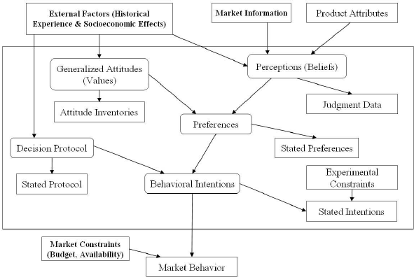

# Industrial Organization

Books:

-   <https://eml.berkeley.edu/~train/books.html>
-   Structural Econometric Modeling in Industrial Organization and Quantitative Marketing: Theory and Applications Ali Hortaçsu, Joonhwi Joo

### Book Outline

#### Part I: Foundations of Industrial Organization

1.  Markets and Competition

    -   Perfect Competition

    -   Monopolistic Competition

    -   Oligopoly

    -   Monopoly

2.  Market Structures

    -   Homogeneous vs. Differentiated Products

    -   Entry and Exit Barriers

    -   Market Concentration

3.  Consumer Behavior

    -   Utility Theory

    -   Information Asymmetry

    -   Behavioral Economics

#### Part II: Marketing Strategies in Different Industrial Structures

1.  Price Strategies

    -   Price Discrimination

    -   Price Skimming

    -   Penetration Pricing

2.  Product Strategies

    -   Product Differentiation

    -   Branding

    -   Product Lifecycle

3.  Placement Strategies

    -   Channel Marketing

    -   Online vs Offline

    -   Supply Chain Management

4.  Promotion Strategies

    -   Advertising

    -   Sales Promotions

    -   Public Relations

#### Part III: Case Studies

1.  Fast-Moving Consumer Goods (FMCG)

2.  Technology Sector

3.  Automobile Industry

4.  Pharmaceuticals

5.  Services Industry

#### Part IV: Contemporary Issues

1.  Digital Transformation

2.  Sustainability in Industrial Marketing

3.  Globalization and Market Dynamics

# Key Questions in Industrial Organization

## Core Questions

1.  Why do firms behave the way that we observe?
2.  What are the effects of firm behavior (or business strategy) on consumers, other firms, and employees? What welfare standards should be used for evaluation?
3.  How can we design better business strategies for firms and formulate public policies for regulatory agencies?

## Methodological Approaches

-   Theoretical Approach: Modeling + Predictions
-   Empirical Approach: Data Analysis + Testing + Counterfactual & Welfare Analysis
-   Experimental and Behavioral Approaches

These approaches are complementary.

## Building an IO Model

### Starting Points

A. Ideas/Issues/Questions\
- From the Literature (IO and related fields)\
- From Other Sources (newspapers, magazines, TV news, conversations, consulting, etc.)

B. [Modeling Tools in IO]

### Modeling Tools in IO

1.  [Modeling Consumer Demands] for Products/Services

2.  Profit Maximization Subject to [Constraints]

    -   Constraints: Technology, Arbitrage, Incentives, Self-Selection, etc.

3.  [Game-Theoretic Models] of Competition

4.  [Comparative Static Analysis]

#### Modeling Consumer Demands

-   Single or Multiple Products?
    -   Classical Consumer Theory
-   Single or Multiple Units?
    -   Discrete Choice Theory
-   Are Products Differentiated?
    -   Complementary or Substitute?
    -   Vertically or Horizontally Differentiated?

Notes on Demand Complementarities

-   As the price of one product increases, the demand for that product decreases
    -   A monopolist charges lower prices than two independent firms would
    -   Complementarities can be a barrier to entry
-   Network Effects
-   Multi-Sided Markets
-   Ecosystems

#### Unconstrained or Constrained Profit Maximization

-   Choice Variables and Objective Function
-   Technology Constraints
-   Consumer Participation Constraints
    -   Bundling and Tied Selling
    -   Contract as a Barrier to Entry
    -   Arbitrage Constraints
-   Incentive Constraints (Principal-Agent Models)
    -   Second-Degree Price Discrimination
    -   Franchise Contracts

#### Game-Theoretic Models

##### A. Non-Cooperative Game-Theoretic Models

1.  Games in Normal Form (Simultaneous Moves)
    -   A Variety of Strategic Variables
    -   A Number of Players
    -   A Set of Strategies for Each Player
    -   A Payoff Function for Each Player
2.  Games in Extensive Form (Sequential Moves)
    -   First-Move Advantages
    -   Entry Deterrence
    -   Collusion through Repeated Interactions

##### B. Cooperative Game-Theoretic Models

-   Nash Bargaining
    -   Payoff Choice Set
    -   Bargaining Power
    -   Threat Point
-   Nash-in-Nash Bargaining

#### Comparative Static Analysis

-   A Model with Exogenous Parameters and Endogenous Variables
-   Behavioral Assumptions: Maximization or Equilibrium
-   How Do Optimal Solutions or Equilibrium Strategies Change with Respect to Exogenous Parameters or Policy Variables?

## Conclusions

-   Issues/Questions + Tools -\> Results/Findings
-   Time to Consider Whether the Results Make Intuitive Sense

## Presenting/Writing an IO Paper

1.  Describe how interesting and important the ideas/issues/questions are
    -   Examples, Statistical Numbers, Previous Studies, Policy Implementations, etc.
2.  Describe Your Approach and Summarize Major Findings
3.  Construct Your Model
4.  Conduct Your Analysis
    -   Determine Optimal Solutions or Equilibrium and Conduct Comparative Static Analysis
5.  Concluding Remarks
    -   Summary of the Analysis, Limitations, and Future Work

# Consumer Demands

## Questions

1.  How can we describe and formally model consumers' demands for certain products in response to firms' offers such as prices, quality, versions, advertising, warranty, and so on?

2.  What properties do demand systems (more than one product) possess?

3.  How can we estimate the demand system and compute own- and cross-price elasticities, diversion ratios?

## Approaches to Consumer Demand Systems

-   Business is a matching process between:

    -   A population of consumers with certain preferences (both observable and unobservable characteristics)

    -   A set of products and/or services (with specific observable and unobservable characteristics)

-   The microeconomics/IO literature offers three approaches:

    1.  Classical consumer theory with continuous choices

    2.  Discrete choice models with heterogeneity of consumer tastes

        -   Horizontal differentiation

        -   Vertical differentiation

        -   A combination of the above

    3.  A combination of discrete and continuous choices

## Part I: Classical Consumer Theory

-   A representative consumer with a utility function $U(q_0, q_1, \dots, q_n)$ and income $I$, facing a profile of prices $\mathbf{p} = (p_1, \dots, p_n)$, chooses a vector of continuous quantities $\mathbf{q} = (q_1, \dots, q_n)$ to maximize their utility subject to a budget constraint:

$$
\max_{q_0, \dots, q_n} U(q_0, q_1, \dots, q_n)
$$

subject to

$$
q_0 + \sum_{i=1}^n p_i q_i \le I
$$

where $q_0$ is a numeraire good with a normalized price $p_0 = 1$.

-   The solution to this constrained optimization problem yields the Walrasian (or Marshallian) demand system:

$$
q_i = D_i (\mathbf{p}, I), i = 1, 2, \dots, n
$$

Indirect utility function

$$
U(q_0^*, q^*) = V (p, I)
$$

Roy's Identity and Slutsky Equation

The Walrasian (or Marshallian) demand system satisfies the following properties:

-   Roy's Identity:

$$
-\frac{\partial V}{\partial p_i} / \frac{\partial V}{\partial I} = q_i (\mathbf{p}, I)
$$

where$V$is the maximum (indirect) utility.

-   Slutsky Equation:

$$
\frac{\partial h_i (\mathbf{p}, u)}{\partial p_j} = \frac{\partial q_i (\mathbf{p}, I)}{\partial p_j} + \frac{\partial q_i (\mathbf{p}, I)}{\partial I} q_j (\mathbf{p}, I)
$$

holds and forms the Slutsky substitution matrix, which is symmetric and negative semi-definite.

### A Special Case: CES Sub-utility and CES Demand System

-   Consider a special case:

$$
U = U(q_0, Q)
$$

For example, $U = q_0 Q$ where

$$
Q = (\sum_{i = 1}^n q_i^\rho)^{1/\rho}, \rho \le 1
$$

is a CES sub-utility function.

-   This leads to the CES demand system.

-   This functional form is handy when studying product diversity/variety.

#### CES Utility and Demand System

Consider a representative consumer with the following CES utility function over $n+1$ goods:

$$
U = q_0 [\sum_{i = 1}^n q_i^\rho]^{1/\rho}
$$

where $\rho \in (0,1)$, $q_0$ is the numeraire good.

To derive the demand systems, we will start with the utility maximization problem with the following budget constraint:

$$
P_0 q_0 + \sum_{i = 1}^n P_i q_i = M
$$

The Lagrangian for this problem is:

$$
\mathcal{L} = q_0 \left[ \sum_{i = 1}^n q_i^\rho \right]^{1/\rho} + \lambda \left( M - P_0 q_0 - \sum_{i = 1}^n P_i q_i \right)
$$

Taking the partial derivative with respect to $q_0$:

$$
\frac{\partial \mathcal{L}}{\partial q_0} = \left[ \sum_{i = 1}^n q_i^\rho \right]^{1/\rho} - P_0 \lambda
$$

From which we get:

$$
\left[ \sum_{i = 1}^n q_i^\rho \right]^{1/\rho} = P_0 \lambda
$$

For $q_i$:

$$
\frac{\partial \mathcal{L}}{\partial q_i} = q_0 \left[ \sum_{i = 1}^n q_i^\rho \right]^{1/\rho - 1} q_i^{\rho - 1} - P_i \lambda
$$

Which gives:

$$
q_0 \left[ \sum_{i = 1}^n q_i^\rho \right]^{1/\rho - 1} q_i^{\rho - 1} = P_i \lambda
$$

Combining the above expressions will give the direct demand function. Solving for $P_i$ gives the inverse demand function.

Lastly, for substitutability or complementarity of the goods: Given $\rho \in (0,1)$, the goods in the CES utility function are substitutes. This is because a value of $\rho$ between 0 and 1 indicates the elasticity of substitution between any two goods exceeds one, suggesting they are imperfect substitutes.

### Quasi-linear Utility and No Income Effect

-   Consider another special class: quasi-linear utility function

$$
U = q_0 + u(q_1 , \dots, q_n)
$$

-   The constrained maximization is equivalent to:

$$
\max_{q_1, \dots, q_n} u (q_1, \dots, q_n) - \sum_{i = 1}^n p_i q_i + I
$$

Hence,

$$
FOC: \frac{\partial u}{\partial q_i} = p_i, i = 1, 2, \dots, n
$$

-   The demands for the$n$products are independent of income $I$, as long as the income is sufficiently large.

Indirect utility function for this case is $U(q^*_1(\mathbf{p}) , \dots, q^*_n(\mathbf{p}) - \sum_{i=1}^n p_i q_i^* (\mathbf{p})$ = consumer surplus

-   The (indirect) maximum utility function is $V = v(p_1, \dots, p_n) + I$, which is useful for welfare analysis.

-   The relationship between demands and consumer surplus:

$$
- \frac{\partial v}{ \partial p_i} = q_i (\mathbf{p})
$$

which is a special case of Roy's Identity.

-   The Jacobian of the demand system:

$$
J = \left( \frac{\partial q_i (\mathbf{p})}{\partial p_j} \right) _{n \times n}
$$

is symmetric and negative semi-definite, which is a special case of the Slutsky equation.

Recover the utility function (Reverse engineer)

-   Suppose the Jacobian of the observed demand system

$$
J = \left( \frac{\partial q_i (\mathbf{p})}{\partial p_j} \right)_{n \times n}
$$

is symmetric and negative definite

-   Then the demand system can be derived from a representative consumer maximizing a (quasi-linear) concave utility function

-   Substitute the inverse demand system into the FOCs and solve a system of partial differential equations:

$$
\frac{\partial u}{\partial q_i} = p_i (q), i = 1, 2, \dots, n
$$

-   This can help with welfare analysis

Demand Substitutes vs. Complements

Consider $n = 2$

-   The two products are demand-substitutes if the demand for product $j$ increases with price $p_i$

-   The two products are demand-complements if the demand for product $j$ decreases with price $p_i$

-   Applying the Cramer's rule the first-order condition of the utility maximization leads to

$$
|J| \frac{\partial q_1}{\partial p_2} = |J| \frac{\partial q_2}{\partial p_1} = -u_{12} = -u_{21}
$$

where $|J|$ is the determinant of $J$ and is positive due to the negative definiteness of $J$ (or the strict concavity of the utility function)

-   Thus, under the quasi-linear utility, the products are

    -   demand-substitutes if $u_{12} = u_{21} <0$

    -   demand-complements if $u_{12} = u_{21} > 0$

Diversion Ratio

Consider $n = 2$ and imperfect substitutes

-   As price $p_1$ increases, how much demand reduction of product 1 is diverted to the consumption of product 2?

$$
d_{12} = \frac{\frac{\partial q_2}{\partial p_1}}{- \frac{\partial q_1}{\partial p_1}} > 0
$$

Negative definite substitution matrix (or the strict concavity of the utility function) implies that

$$
\frac{\partial q_1}{\partial p_1} \frac{\partial q_2}{\partial p_2} - \frac{\partial q_2}{\partial p_1} \frac{\partial q_1}{\partial p_2} >0
$$

or equivalently

$$
d_{12} d_{21} <1
$$

The Diversion Ratio shows how much of one product's demand shifts to another product if the first is unavailable. If you prefer coffee Brand A but switch to Brand B when A is out of stock, then sales have "diverted" from Brand A to Brand B.

Two products, $A$ and $B$, have quantities $Q_A$ and $Q_B$, and prices $P_A$ and $P_B$.

The Diversion Ratio $D_{AB}$ is:

$$
D_{AB} = \frac{\Delta Q_B / \Delta P_A}{\Delta Q_A / \Delta P_A}
$$

This measures the change in quantity of $B$ for a change in the price of $A$, normalized by the change in quantity of $A$ for the same price change.

```{r}
# Simulating data
set.seed(123)
n = 100
price_A = runif(n, 5, 10)
price_B = runif(n, 5, 10)
quantity_A = 100 - 5 * price_A + rnorm(n)
quantity_B = 80 - 4 * price_B + rnorm(n)

# Estimating Diversion Ratio
delta_QA = diff(quantity_A)
delta_PA = diff(price_A)
delta_QB = diff(quantity_B)

D_AB = mean(delta_QB / delta_PA) / mean(delta_QA / delta_PA)
D_AB
```

```{r}
library(ggplot2)
# Plotting
data = data.frame(delta_QA, delta_PA, delta_QB)
ggplot(data, aes(x = delta_PA)) +
  geom_point(aes(y = delta_QA), color = 'blue', alpha = 0.5) +
  geom_point(aes(y = delta_QB), color = 'red', alpha = 0.5) +
  geom_smooth(aes(y = delta_QA), method = 'lm', color = 'blue', se = FALSE) +
  geom_smooth(aes(y = delta_QB), method = 'lm', color = 'red', se = FALSE) +
  labs(x = "Change in Price of A",
       y = "Change in Quantity",
       title = "Change in Quantity vs Change in Price",
       subtitle = "Blue: Product A, Red: Product B") +
    causalverse::ama_theme()
```

### Representative Consumer Utility Maximization with Quasi-linear Quadratic Utility (and Linear Demand System)

Consider a representative consumer with the following quasi-linear utility function over three goods:

$$
U(q_0, q_1, q_2) = q_0 + \alpha_1 q_1 + \alpha_2 q_2 - [\beta_1 q_1^2 + 2 \gamma q_1 q_2 + \beta_2 q_2^2]/2
$$

with $\alpha_i >0, \beta_i >0, \beta_1 \beta_2 - \gamma^2 >0$ and $q_0$ is the numeraire good

Then the first-order conditions becomes

$$
p_1 = \alpha_1 - \beta_1 q_1 - \gamma q_2
$$

$$
p_2 = \alpha_2 - \beta_2 q_2 - \gamma q_1
$$

Solving the system of linear equations leads to a regular linear demand system and constant diversion ratios

#### Shubik and Levitan (1980) Form

Suppose $u(q_1, \dots, q_n)$ is a quadratic function as follow:

$$
u(q_1, \dots, q_n) = \alpha \sum_{i=1}^n q_i - \frac{n}{2(1 + \gamma)}[\sum_{i=1}^n q_i^2 + \frac{\gamma}{n} (\sum_{i = 1}^n q_i)^2]
$$

with $\alpha >0$ and $\gamma \in [0, \infty)$ is the degree of sustainability

This leads to the following linear demand system:

$$
q_i = \frac{1}{n}[ \alpha - p_i (1 + \gamma) + \frac{\gamma}{n} \sum_{j = 1}^n p_j]
$$

Two nice properties of this demand system:

1.  The aggregate demand, $Q = \sum_{i = 1}^nq_i = \alpha- \frac{1}{n}\sum_{j = 1}^n p_j$ does not depend on the degree of substitution among the products
2.  When the prices are symmetric ($p_i = p$), the aggregate demand, $Q = \alpha - p$ does not depend on the number of the products.

##### Application 1: Maximizing Buyer's Surplus subject to a Market-share Constraint

-   Consider a downstream buyer with a revenue function over two products $u(q_1, q_2)$ facing a pair of per-unit prices, $p_1, p_2$

-   However, the seller of product 1 sets a market-share based restriction: $q_1 / (q_1+ q_2) \ge s$ or $q_1 = 0$, where $s \in [0,1]$ is offered by firm 1.

-   A special case: $s = 1$ means an exclusive contract.

-   The buyer solves the following constrained surplus maximization:

$$
\max_{q_1, q_2} u(q_1, q_2) - p_1 q_1 - p_2 q_2
$$

such that $q_1 / (q_1 + q_2) \ge s$ or $q_1 = 0$

What properties does this demand system $q(p,s)$ have with respect to $p$ and $s$

Use the linear quadratic utility to solve this demand system.

##### Application 2: Strong Complements

Consider a quasi linear utility function $q_0 + u(q_1, \dots, q_n)$ and the demand system $q^*(p) = (q_1^* (p), \dots, q_n^* (p))$ for the $n$ products

The following two statements are equivalent:

1.  The demand system $q^*(p)$ satisfies the strong complement property: for $i = 2, \dots, n, q_i^*(p) /q_1^*(p)$ is independent of $p_1$
2.  For any constant marginal cost $c_i >0$ for $i = 1, 2, \dots, n$ the solution to a monopoly profit-maximization problem

$$
\max_p \sum_{i=1}^n [(p_i - c_i) q_i^*(p)]
$$

involves $p_i^* = c_i$ for $i = 2, \dots, n$

-   Let $v(p) = u (q^*(p)) - \sum_{i = 1}^n p_i q_i^*(p)$ be the indirect utility. The max profit conditional on offering the consumer at least $u$

$$
\pi(u) = \max_p \{ \sum_{i = 1}^n (p_i - c_i)q_i^*(p) 
$$

such that $v(p) \ge u$

is decreasing and concave

#### Consumers' Demands

To derive the consumer's demands for goods 1 and 2.

Differentiate the utility function with respect to $q_1$ and $q_2$:

1)  With respect to $q_1$:

$$
\frac{\partial U}{\partial q_1} = \alpha_1 - \beta_1 q_1 - \gamma q_2 = 0
$$

2)  With respect to $q_2$:

$$
\frac{\partial U}{\partial q_2} = \alpha_2 - \gamma q_1 - \beta_2 q_2 = 0
$$

From these equations, we can express $q_1$ and $q_2$ in terms of the parameters:

1)  $q_1$ in terms of $\alpha_1, \beta_1, \gamma, q_2$:

$$
q_1 = \frac{\alpha_1 - \gamma q_2}{\beta_1}
$$

2)  $q_2$ in terms of $\alpha_2, \beta_2, \gamma, q_1$:

$$
q_2 = \frac{\alpha_2 - \gamma q_1}{\beta_2}
$$

1)  Inverse demand for $q_1$:

$$
p_1 = \alpha_1 - \beta_1 q_1 - \gamma q_2
$$

2)  Inverse demand for $q_2$:

$$
p_2 = \alpha_2 - \gamma q_1 - \beta_2 q_2
$$

These equations represent how the prices of goods 1 and 2 (i.e., $p_1$ and $p_2$) change with the quantities consumed.

#### Degree of Substitutability/Complementarity

When considering how to parameterize the demand system to capture the degree of substitution or complementarity between goods $q_1$ and $q_2$, it's important to remember that:

-   A positive cross-partial derivative $\frac{\partial^2 U}{\partial q_1 \partial q_2}$ indicates that the two goods are complements.
-   A negative cross-partial derivative indicates that the two goods are substitutes.

Given the utility function, the cross-partial derivative is:

$$
\frac{\partial^2 U}{\partial q_1 \partial q_2} = \gamma 
$$

So the value and sign of $\gamma$ directly tells us about the substitution/complementarity relationship between $q_1$ and $q_2$:

-   Using $\gamma$ as an independent parameter: This approach directly captures the nature of the relationship between $q_1$ and $q_2$. A positive $\gamma$ would indicate complementarity, while a negative $\gamma$ would indicate substitutability.
-   Setting $\beta_1 = \beta_2 = 1 - \gamma$: This approach indirectly captures the relationship by tying the curvature of the utility function with respect to $q_1$ and $q_2$ to $\gamma$. If $\gamma$ increases while $\beta_1$ and $\beta_2$ decrease, the nature of the relationship between $q_1$ and $q_2$ can change. However, this choice might seem arbitrary and can limit the flexibility of the model, as it imposes restrictions on the curvature of the utility function in relation to $\gamma$.

#### Consumer's surplus

To derive the consumer's surplus for $q_1$ and $q_2$:

1.  Consumer's Surplus for $q_1$:

From the condition where marginal utility equals price, we get:

$$
\frac{\partial U}{\partial q_1} = p_1
$$

$$
\alpha_1 - \beta_1 q_1 - \gamma q_2 = p_1
$$

This gives the inverse demand function $p_1 = p_1(q_1, q_2)$.

The consumer's surplus for $q_1$ is:

$$
CS_1 = \int_0^{q_1} p_1(q_1', q_2) \, dq_1' - p_1 q_1
$$

2.  Consumer's Surplus for $q_2$:

Similarly, for $q_2$:

$$
\frac{\partial U}{\partial q_2} = p_2
$$

$$
\alpha_2 - \gamma q_1 - \beta_2 q_2 = p_2
$$

This gives the inverse demand function $p_2 = p_2(q_1, q_2)$.

The consumer's surplus for $q_2$ is:

$$
CS_2 = \int_0^{q_2} p_2(q_1, q_2') \, dq_2' - p_2 q_2
$$

The total consumer's surplus is:

$$
CS = CS_1 + CS_2
$$

#### Bertrand-Nash Equilibrium

Two firms produce 2 goods at constant marginal cost $c_1$ and $c_2$. We want to compute the Bertrand-Nash equilibrium when the firms compete by setting prices simultaneously. Additionally, we aim to determine their own and cross cost-pass-through (CPT) rates. Firm's Profit Maximization Problem

Firm 1's profit function is:

$$ \pi_1(p_1, p_2) = (p_1 - c_1) q_1(p_1, p_2) $$

The first order condition for firm 1's profit maximization is:

$$ q_1 + (p_1 - c_1) \frac{\partial q_1}{\partial p_1} = 0 $$

Similarly, for firm 2:

$$ q_2 + (p_2 - c_2) \frac{\partial q_2}{\partial p_2} = 0 $$

These equations will yield the Bertrand-Nash equilibrium prices $p_1^*$ and $p_2^*$.

Cost-Pass-Through (CPT) Rates

The own and cross CPT rates are:

$$ CPT_{11} = \frac{\partial p_1^*}{\partial c_1} $$ $$ CPT_{22} = \frac{\partial p_2^*}{\partial c_2} $$ $$ CPT_{12} = \frac{\partial p_1^*}{\partial c_2} $$ $$ CPT_{21} = \frac{\partial p_2^*}{\partial c_1} $$

#### Monopolist

When the two firms merge or collude to set prices, the firm becomes a monopolist over both goods. The monopolist's objective is to maximize the joint profits across both products, accounting for the cross-price effects.

The monopolist's profit function is given by: $$ \pi(p_1, p_2) = (p_1 - c_1) q_1(p_1, p_2) + (p_2 - c_2) q_2(p_1, p_2) $$

The first order conditions for maximizing this profit function are:

1\. $$ \frac{\partial \pi}{\partial p_1} = q_1 + (p_1 - c_1) \frac{\partial q_1}{\partial p_1} + (p_2 - c_2) \frac{\partial q_2}{\partial p_1} = 0 $$ 2. $$ \frac{\partial \pi}{\partial p_2} = q_2 + (p_1 - c_1) \frac{\partial q_1}{\partial p_2} + (p_2 - c_2) \frac{\partial q_2}{\partial p_2} = 0 $$

From these first order conditions, one can derive the joint-profit-maximizing prices, $p_1^M$ and $p_2^M$.

Cost-Pass-Through (CPT) Rates for the Monopolist

The CPT rates under monopoly are defined as:

$CPT_{11}^M = \frac{\partial p_1^M}{\partial c_1}$

$CPT_{22}^M = \frac{\partial p_2^M}{\partial c_2}$

$CPT_{12}^M = \frac{\partial p_1^M}{\partial c_2}$

$CPT_{21}^M = \frac{\partial p_2^M}{\partial c_1}$

Explanation

-   Monopoly vs. Competition: Typically, prices under monopoly (or collusion) are higher than under Bertrand competition due to the absence of competitive pressures.

-   CPT Rates: Under monopoly, the CPT rates may differ from the competitive scenario because the monopolist internalizes the cross-effects between the two goods.

-   Strategic Complements and Substitutes: Depending on the nature of the two products, the monopolist may treat them as strategic complements or substitutes when setting prices.

### Properties of Demand

1.  Single product $q= q(p), q = D(p)$
    1.  Downward-sloping: $q'(p) <0$
    2.  Price Elasticity: $\epsilon (p) = - q'(p) \frac{p}{q}$
2.  Multiple products

Given the linear demand system

$$
\begin{aligned}
q_1 &= q_1(p_1, p_2) =  \alpha_1 - \beta_{11} p_1 + \gamma_{12} p_2 + \dots \\
q_2 &= q_2(p_1, p_2) = \alpha_2 - \beta_{22} p_2 + \gamma_{21} p_1 + \dots
\end{aligned}
$$

$$
\begin{aligned}
q_1 &= q_1 (p_1, p_2) \\
q_2 &= q_2 (p_1, p_2)
\end{aligned}
$$

Own-price effect (similar to the single product case)

$$
\frac{\partial q_1}{\partial p_1} <0 
\frac{\partial q_2}{\partial q_2} <0
$$

Cross-price effects

$$
\begin{aligned}
\frac{\partial q_1}{\partial p_2}  \\
\frac{\partial q_2}{\partial q_1} 
\end{aligned}
$$

and

$$
\frac{\partial q_1}{\partial p_2}  = \frac{\partial q_2}{\partial q_1} 
$$

when

-   2 products are perfect substitute

-   2 products are perfect complement

-   2 products are independent

-   consumers have quasi-linear utility (and no income effect)

And the cross-price effects are positive if substitutes and negative if complements

Suppose we have quasi-linear utility maximization

$$
\max_{q_1, q_2} u(q_1, q_2) = p_1 q_1 - p_2 q_2
$$

FOCs

$$
u_1 = p_1 
u_2 = p2
$$

$$
\frac{q_1^*}{q_2^*}
$$

$$
\begin{aligned}
u_1 (q_1^*, q_2^*) = p_1 \\
u_2 (q_1^*, q_2^*) = p_2
\end{aligned}
$$

Differentiate with respect to $p_1$

$$
u_{11} \frac{\partial q_1^*}{\partial p_1} + u_{12} \frac{\partial q_2^*}{p_1} = 1 
u_{21} \frac{\partial q_1^*}{\partial p_1} + u_{22} \frac{\partial q_2^*}{\partial p_1} = 0
$$

To get

$$
\frac{\partial q_2^*}{\partial p_1} = - \frac{u_{21}}{u_{11} u_{22} - u_{12} u_{21} }
$$

Similarly,

$$
\frac{\partial q_1^*}{\partial p_2} = - \frac{u_{12}}{u_{11} u_{22} - u_{12} u_{21} }
$$

Whenever you have cross partial, you have $u_{12} = u_{21}$, then

$$
\frac{\partial q_1^*}{\partial p_2}  = \frac{\partial q_2^*}{\partial q_1} 
$$

Hence, whenever you assume that consumers have quasi-linear utility maximization function, the above equation will always hold (i.e.., cross-effects are equal).

From the Slutsky's equation, anytime we don't have the income effect, the cross-effects are equal.

However, when we have the income effects, we don't' know the size of $\frac{\partial q_i}{\partial I} q_j$ and other way around for product $j$. If they were to be equal then we have

$$
\frac{\partial h_i}{\partial p_j} = \frac{q_i}{p_j} + \frac{\partial p_i}{\partial I} q_j \equiv \frac{\partial h_j}{\partial p_i} = \frac{q_j}{p_i} + \frac{\partial p_j}{\partial I} q_i
$$

If this also holds,

$$
\frac{q_i}{\partial I} /q_i = \frac{q_j}{\partial I} /q_j
$$ then we have equal cross-price effects

In sum, if from our data, we have evidence for equal cross-price effects, we can say we have consistent evidence for either

-   the no income effect.

-   When income increases, then the consumption of two goods are the increasing similarly. As income increases (when you are richer), the additional products that you consume for the two products are similar.

Compare the cross-price effects with the own-price effects in 2 ways:

1.  Assume $- \frac{\partial q_i}{\partial p_i} > \frac{\partial q_j}{\partial p_i}$ so that the diversion ratio is less than 1
2.  Assume $- \frac{\partial q_i}{\partial p_i} > \frac{\partial q_i}{\partial p_j}$ so that the indirect diversion ratio is less than 1

And the own-price elasticities and cross-price elasticities are similarly defined

Remarks on the continuous approach

-   The classical approach has many advantages

    -   Nice properties of the demand system allow to derive intersecting pricing strategies.

    -   However, the approach does not pay much attention to the characteristics of products: quality, location, time, availability, consumers' info about its existence and quality, etc.

    -   Moreover, this approach does not formally model heterogeneity of consumer preferences

-   Discrete choice models are deigned to address some of the issues

#### Application 3: Properties of the Buyer's surplus Function

-   based on @armstrong2018multiproduct

-   Consumer optimization

    -   Representative consumer has same quasi-linear utility function: $u(q)$ where $u(0) = 0$, increasing and strictly concave

    -   Consumer optimization: $\max_q u(q) - p \times x$

    -   inverse demand function: $p_i(q) = \partial u(x) / \partial q_i$ or $p(q) \equiv \nabla u(q)$

    -   Total revenue from quantity $q$: $R(q) = q \times \nabla u(q)$

-   Consumer surplus from quantity $q$

$$
s(q) = u(q) - q \times \nabla u (q)
$$

### A Family of Utility and Homoerotic Consumer Surplus

Proposition [@armstrong2018multiproduct]

Consumer surplus $s(q)$ is homothetic in $q$ if and only if

$$
u(q) = h(q) + g(f(q))
$$

where $h$ and $f$ are homogeneous degree 1, and $g$ is concave with $g(0) = 0$

-   This is a much wider class than those where consumer surplus is homothetic in prices, which can be expressed simply as the homothetic $u(q)$ where $h = 0$

-   3 degrees of freedom in the family of tractable multi-product demand systems: $f(q), h(q), g(.)$

-   The advantages of homothetic $s$ and homogeneous $f, h$

Proof

-   "If" ($\leftarrow$): From consumer optimization, we have inverse demand

$$
p(q) = \nabla h(q) + g' (f(q)) \nabla f(q)
$$

since $q \times \nabla h(q) \equiv h(q)$ for a homogeneous degree 1 function

$$
R(q) = h(q) + g' (f(q))f(q)
$$

and hence consumer surplus is

$$
s(q) = g(f(q)) - g' (f(q)) f(q)
$$

and it is a monotonic function of the homogeneous function $f(q)$

Variable Decomposition Technique

Write quantities in "polar coordinates" form

$$
q = f(q) . \frac{q}{f(q)}
$$

-   $\frac{q}{f(q)}$ is homogeneous degree 0 and depends only on the ray from origin.

-   $f(q)$ measures how far along that ray $q$ lies

-   refer to $f(q)$ as "composite quantity" and $\frac{q}{f(q)}$ as "relative quantities"

Consumer Choice: A Two-stage Optimization

-   Consumer surplus with prices $p$ and quantities $q$ is

$$
u(q) - pq = g(f(q)) - f(q) \frac{pq - h(q)}{f(q)}
$$

-   in terms of two coordinates $f(q)$ and $\frac{q}{f(q)}$

-   for any given $f(q)$ surplus is maximized by minimizing $\frac{pq - h(q)}{f(q)}$

Let

$$
\phi(p) \equiv \min_{q \ge 0}: \frac{pq - h(q)}{f(q)}
$$

which is increasing and concave in $p$. Then, by the envelope theorem, the optimal relative quantities $q^r(p) \equiv \nabla \phi(p)$

The consumer facing price $p$ chooses relative quantities $q^r(p)$

given the relative quantities, $q^r(p)$, the consumer then chooses optimal composite quantity, $Q$, that maximizes

$$
g(Q) - Q \phi (p)
$$

which is concave in $Q$

$\hat{Q}(\phi(p))$ is the demand for composite quantity given $p$

So consumer demand function is

$$
q(p) = \hat{Q} (\phi (p)) \times q^r(p)
$$

$\phi(p)$ is the "composite price"

-   all prices with the same $\phi(p)$ induce the same composite quantity

-   inverse demand for composite quantity is $\phi(p) = g'(\hat{Q})$

Example 1: Linear Demand System

$$
u(q) = aq - \frac{1}{2} q^T B q
$$

$$
p(q) = a - Bq
$$

where $a >0$ and $B$ is a positive definite matrix

The utility unction can be decomposed as follows:

$$
h(q) = aq
$$

$$
f(q) = \sqrt{q^T B q}
$$

$$
g(f) = - \frac{1}{2} f^2
$$

$$
s(q) = \frac{f(q)^2}{2}
$$

Example 2: Logit Demand System

$$
q_i(p) = \frac{e^{(a_i - p_i)/\mu}}{k + \sum_j e^{(a_i - p_i)/\mu}}
$$

which corresponds to the consumer surplus function

$$
v(p) = \mu \log ( 1 + \frac{1}{k} \sum_j e^{(a_i - p_i)/\mu})
$$

Utility function representation:

$$
u(q) = aq + (\mu \log k)q + \mu \sum_i q_i \log \frac{f(q)}{q_i} + g(f(q))
$$

where

-   $h(q) = aq + (\mu \log k)q + \mu \sum_i q_i \log \frac{f(q)}{q_i}$

-   $f(q) \equiv \sum_j q_j$ (total quantity)

-   $g(f) = - \mu(f \log f + (1 - f) \log (1-f))$

-   $s(q) = - \mu\log(1 - f(q))$

Example 3: Complementary Products

-   Some consumption requires prior purchase of a base product ("access" or hardware)

-   Suppose the consumer enjoys utility $\hat{u}(y)$ from complementary services $y$

-   If $q_1$ is the number of accesses or hardware, and each requires complementary services, $y = q_2 /q_1$, where $q_2$ is the total supply of complementary services, then gross utility has the form

$$
\begin{aligned}
u(q_1, q_2) &= q_1 \hat{u}(y) + g(q_1) \\
&= q_1 \hat{u}(q_2 /q_1) + g(q_1)
\end{aligned}
$$

This is an example with $f(q) = q_1$ so consumer surplus is simply a function of the number of accesses or hardware.

Note that the ratio of the two demands, $q_2/q_1$ is indepdent of price $p_1$. This would have an important implication for monopoly profit maximization.

**Remarks on the Continuous Approach**

-   The classification approach has many advantages.

    -   Nice proprieties of the demand system allow to derive interesting pricing strategies

    -   But the approach does not pay much attention to the characteristic of products: quality, location time, availability, consumers' information about its existence and quality, etc.

    -   It does not formally model heterogeneity of consumer preferences

-   Discrete choice models are designed to address some of the issues.

## Part II: Vertical Differentiation: Quality

Differentiation is said to be **vertical**, if all consumers benefit when the level of the product's characteristics is augmented in the product space.

Consumers agree over the most preferred mix of characteristics such as quality

Example:

$$
u = 
\begin{cases}
\theta s - p & \text{if buys a good with quality s at price p}\\
0 & \text{does not buy}
\end{cases}
$$

1.  $u$ is the surplus derived from the consumption of the good
2.  $s > 0$ describes the quality of the good, which is common knowledge
3.  Utility is separable in quality and price
4.  Heterogeneity of consumers' tastes: $\theta >0$ is a taste parameter which may differ across consumers (unknown to firms). Firms only know that $\theta$ is distributed according to ta density function $f(\theta)$ and cumulative distribution $F(\theta), \theta \in [\underline{\theta}, \bar{\theta}]$

The key feature is that all consumers prefer higher quality to lower quality

Demand

1.  One Quality
    1.  When only one quality $s$ is offered at price $p$, the consumer with type $\theta$ purchases if and only if $\theta s - p \ge 0$ (i.e., $\theta \ge p/s$)

    2.  Let $N$ be the total number of identical consumers. The demand is\

        $$ D(p) = N [1 - F(\frac{p}{s})] $$

        which is downward sloping

    3.  In the case of uniform distribution,\
        $$D(p) = \begin{cases} N[1 - p/s] , \text{if } p \le s\\ 0, \text{if } p > s \end{cases}$$

    4.  Unlike the classical consumer theory, product quality is now explicitly incorpoated into the demand
2.  Two Qualities
    1.  Product line selection may help to extract more consumer surplus
    2.  Supposes two qualities are offered: $s_1 < s_2$. Without loss of generality assume $p_1 < p_2$
    3.  A consumer of type $\theta$ buys $s_1$ if and only if\
        $$\begin{cases} \theta s_1 - p_1 \ge 0 \\ \theta s_1 - p_1 \ge \theta s_2 - p_2 \end{cases}$$\
        buys $s_2$ if and only if\
        $$\begin{cases} \theta s_2 - p_ \ge 0 \\ \theta s_2 - p_2 \ge  \theta s_1 - p_1 \end{cases}$$
    4.  We can find out three critical points $p_1 / s_1, p_2 / s_2 , (p_2 - p_1)/(s_2 - s_1)$, which partition consumer types among 3 options.
    5.  There are two cases to be considered
        1.  Quality per dollar is higher for $s_2$, i.e.,\
            $$\frac{p_2}{s_2} \le \frac{p_1}{s_1}$$\
            $$\frac{s_2}{p_2} \ge \frac{s_1}{p_1}$$\
            $$\theta s_2 \ge \theta s_1 - p_1 \to \theta \ge \frac{p_2 - p_1}{s_2 - s_1} \equiv \theta^*$$\
            $$\begin{cases} D_2 (p_1, p_2) = N[1 - F(\frac{p_2}{s_2})]\\ D_1 (p_1, p_2) = 0 \end{cases}$$
        2.  Case 2:\
            $$\frac{p_2}{s_2} < \frac{p_1}{s_1}$$\
            $$\frac{s_2}{p_2} > \frac{s_1}{p_1}$$\
            $$\theta^* \equiv \frac{p_2 - p_1}{s_2 - s_1} >\frac{p_2}{s_2}$$\
            $$\begin{cases} D_2 (p_1, p_2) = N[F(\frac{p_2 - p_1}{s_2 - s_1}) - F(\frac{p_1}{s_1})]\\ D_1 (p_1, p_2) = N[1 - F(\frac{p_2-p_1}{s_2 - s_1})] \end{cases}$$
        3.  Put the above two cases together:

$$
D_1 (p_1, p_2) =
\begin{cases}
0 & \text{if } \frac{p_1}{p_2} \ge \frac{s_1}{s_2} \\
N[F(\frac{p_2 - p_1}{s_2 - s_1}) - F(\frac{p_1}{s_1})] & \text{if } \frac{p_1}{p_2} < \frac{s_1}{s_2}
\end{cases}
$$

$$
D_2 (p_1, p_2) = 
\begin{cases}
N[1 - F(\frac{p_2}{s_2})] & \text{if } \frac{p_1}{p_2} \ge \frac{s_1}{s_2} \\
N[1 - F(\frac{p_2 - p_1}{s_2 - s_1})] & \text{if } \frac{p_1}{p_2} < \frac{s_1}{s_2}
\end{cases}
$$

Example

$F(\theta) = \theta, \theta \in [0,1]$

$$ D_1 (p_1, p_2) = \begin{cases} 0 & \text{if } \frac{p_1}{p_2} \ge \frac{s_1}{s_2} \\ N[(\frac{p_2 - p_1}{s_2 - s_1}) - (\frac{p_1}{s_1})] & \text{if } \frac{p_1}{p_2} < \frac{s_1}{s_2} \end{cases} $$

$$ D_2 (p_1, p_2) =  \begin{cases} N[1 - (\frac{p_2}{s_2})] & \text{if } \frac{p_1}{p_2} \ge \frac{s_1}{s_2} \\ N[1 - (\frac{p_2 - p_1}{s_2 - s_1})] & \text{if } \frac{p_1}{p_2} < \frac{s_1}{s_2} \end{cases} $$

$$
\frac{\partial D_1}{\partial p_2} = 
\begin{cases}
0 \\
\frac{N}{s_2 - s_1} >0
\end{cases}
$$

$$
\frac{\partial D_2}{\partial p_1} =
\begin{cases}
0 \\ 
\frac{N}{s_2 - s_1} >0
\end{cases}
$$

They are substitutes. It depends on quality difference

A remarks on consumer heterogeneity

-   $\theta$ can be interpreted as consumer's willingness to pay for quality

-   Consumer's type $\theta$ can be related to income, which is a measurable characteristic to describe heterogeneity of consumers

-   Consumers differ by income, e.g.,\
    $U = u (I - p ) +s$\
    By Taylor's approximation

## Review

### [@mcfadden1986choice] The Choice Theory Approach to Market Research

-   Paper surveys economic choice theory.

-   Emphasizes developments allowing for use of psychometric and conjoint experiment data for market demand forecasts.

-   Discusses alternatives to the popular multinomial logit model.

-   Introduces a new method for estimating multinomial probits.

-   Describes an integration of choice models with:

    -   Attitudinal scaling

    -   Perceptual mapping

    -   Within a latent variable system.

-   Explores estimation of these systems with:

    -   "Random effects" or

    -   "Fixed effects" descriptions of individual heterogeneity.

-   Addresses issues in using choice models for responses from conjoint experiments.

-   Introduces new regression diagnostic tests for the consistency of multinomial logit representations.

1.  Market-oriented Market Research



-   Economists often depict the consumer as an "optimizing black box".

    -   Inputs: product attributes, socioeconomic features, market info, historical data, and market constraints.

    -   Outputs: purchase decisions, consumption levels, market behavior.

-   Economic choice theory provides quantitative forecasts with statistical properties.

-   Focus is on innovative uses of choice theory for experimental market research data.

-   Ideal situation: use a detailed black box model to predict sales & profitability without diving deep into its mechanism.

-   Practical challenges: historical experiments might not reflect outcomes of new product designs or marketing strategies.

-   Solution: Model the cognitive processes in the black box, using experimental data on consumer cognition.

-   Key constructs in decision modeling:

    -   Product perceptions/beliefs.

    -   General attitudes/values.

    -   Product preferences.

    -   Decision protocols.

    -   Behavioral intentions for choice.

-   Psychometric methods provide insights into these theoretical constructs.

    -   Multidimensional scaling: indicators for perceptions.

    -   Factor analysis: indicators for tastes.

    -   Verbal protocols: indicators of decision-making.

    -   Conjoint analysis: data on preferences and intentions.

-   Main challenge: Use psychometric data to quantify theoretical constructs and then simulate decision-making to forecast market behavior.

-   Issues to tackle:

    1.  Design lab techniques that elicit reliable market behavior info.

    2.  Develop methods to turn experimental data into market forecasts.

    3.  Validate resulting forecasts.

-   Econometricians face similar challenges, with the difference being in experimental design vs. deciphering natural experiments.

-   Query: Is it essential to describe individual decision-makers' behavior instead of focusing on market segments?

-   Pros of individual modeling: If the individual adheres to stable psychological patterns and when market observations get affected by various shifts.

-   Cons: Individual quirks may get averaged out in aggregate data; deriving market demand from individual models may introduce errors.

-   Using experiments instead of field surveys to gather demand data has merits:

    -   Precise environment specification.

    -   Studying innovations in services.

    -   Cost-effective data collection.

-   Concern: Does lab behavior predict real-world behavior?

    -   Only field validation is fully convincing.

    -   Existing literature indicates potential issues with experimental elicitation when incentives are small.

2.  Economic Choice Theory

-   Economic choice theory posits individuals base market behavior on preference maximization.

    -   Preferences influenced by factors like perceptions, attitudes, and past decisions.

    -   Commodities and their attributes central to these choices.

    -   External factors (e.g., demographics) can alter preferences.

    -   Random preferences tied to market reactions using axiomatic structures.

        -   Two principles:

            1.  Reactions based on measurable variables.

            2.  Reactions validated through real market behaviors.

-   Historical view: choices rooted in perceived utility.

    -   Post-1930s: utility static, consumer seen as optimization machine, sidelining perceptual errors.

-   Psychologists explored choice behavior:

    -   1927, Thurstone: introduced random utility, choice based on most beneficial alternative at a given moment.

-   1959, Luce: presented individual choice theory, connected with Thurstone's random utility.

    -   Brought perception errors back into economic choice theory.

-   1960s: commodities seen in multidimensional attribute space.

    -   By 1965, multinomial logit model developed.

        -   Combined attribute-based evaluation with random utility maximization.

        -   Integrated traditional economic principles with stochastic elements.

        -   Catered to market variables; analyzed effects of product attribute changes.

3.  Choice Models

-   **Random Utility Models Development**:

    -   Rapid advancement in econometrics over the past decade.

    -   Growing use in social science and business.

-   **Application in Marketing**:

    -   Used extensively for new product design.

    -   Tool for summarizing psychometric data.

-   **Choice Models**:

    -   Discrete choice behavior (e.g., purchase decisions, brand choice)

    -   Continuous decisions (e.g., quantity purchased, duration of spells)

-   **Notable Works on Applications**:

    -   Amemiya (1985), Dhrymes (1986), Dubin and McFadden (1984), Maddala (1983, 1986).

-   **Multinomial Logit (MNL) Model**:

    -   Widely used random utility model.

    -   Set of available alternatives, with probability of choosing each.

$$ P_C(i) = \frac{\exp(V_i)}{\sum_{j \in C} \exp (V_j)} $$

where $C = 1, \dots, M$ is a set of alternatives, $P$ is the probability of choosing $i$,

-   **Scale Values** $V$ (i.e., strict utilities):

    1.  Functions of attributes of alternatives.

    2.  Can interact with individual characteristics and choice set features.

    3.  Usually have an additively separable linear form (e.g., $V_i = \mathbf{X}_{i}\mathbf{\beta}$)

-   **Luce's Independence from Irrelevant Alternatives (IIA) axiom**:

    -   $\frac{P_A(i)}{P_A(j)} = \frac{P_C(i)}{P_C(j)} \forall i, j \in A \subseteq C$

    -   Sometimes unrealistic

    -   Advantages

        -   Allows inference from multiple alternatives using paired comparisons.

        -   Enables easier demand forecasting for new alternatives.

        -   Gives relationship between choice probabilities and ranking data (good for conjoin)

        -   Because you assume the error term is double exponential distributed, you can have closed-form solution.

    -   Disadvantages

        -   Implies a consistent response to attribute changes in one alternative, which is at odds with the diverse patterns of similarities in reality. This also stems from the assumption on the error term.

-   **Addressing IIA Restriction**:

    1.  Empirical testing for its satisfaction.

    2.  Modify the MNL model (let scale value depends on features of the choice set).

    3.  Switch to other models like

        1.  Multinomial Probit (both direct and random coefficients forms).

        2.  Nested Multinomial Logit (mostly use in marketing to mitigate IIA problem). Still has IIA within clusters.

        3.  Generalized Extreme Value.

        4.  Hierarchical Elimination by Aspects (HEBA).

        5.  Elimination by Strategy.

        6.  Address consumer heterogeneity

            1.  Random Coefficients Multinomial Logit (mostly use in marketing to mitigate IIA problem)

            2.  Fixed Coef

            3.  Hierarchical Bayesian

-   **Estimation Techniques**:

    -   Normally done by maximum likelihood estimation.

    -   Some models require more intensive computation.

-   **Hierarchical Models**:

    -   Alternatives are arranged in a preference tree.

    -   Choice proceeds by eliminating clusters until a final alternative is chosen.

    -   Examples include Nested MNL and HEBA.

-   **Multinomial Probit (MNP) Model**:

    -   Allows for varied patterns of similarities across alternatives.

    -   A random utility model with normally distributed utilities.

    -   Calculation for large choice sets can be computationally challenging.

<!-- -->

-   **Low-dimensional Factor Analytic Structure on the Covariance Matrix**:

    -   Can be applied to direct, random coefficient MNP models, or hybrid models.

    -   Hybrid model proposed by Westin (1974) and Talvitie (1972):

        -   Choice probabilities are multinomial logit with scale values linear in random taste parameters.

-   **Monte Carlo Simulation for MNP Model Computation**:

    -   Used for both estimation and forecasting.

    -   RCMNP model defined using equations with U values.

    -   Model can simulate MNP choice probabilities at any parameter values.

    -   Lerman and Manski (1981):

        -   Simulated moments estimator for the MNP model by McFadden (1986a).

        -   Consistent, asymptotically normal, requires one Monte Carlo draw per observation.

        -   Practical for high-dimensional problems.

    -   [@mcfadden1986method] provides methods:

        -   Choosing instruments that are computationally practical.

        -   Solving the given equation.

        -   Estimating covariance matrix for hypothesis testing.

-   **Simulation of Market Demand from Economic Choice Model**:

    -   Straightforward but may be tedious.

    -   Demand = sum of individual choice probabilities.

    -   Approximated by:

        -   Monte Carlo random sampling, called microsimulation.

        -   Segmenting population and summing representative choice probabilities over segments.

    -   Microsimulation method is more flexible.

    -   Reflects impact of population heterogeneity on demand if model contains "fixed effect" parameters.

-   **Forecasting**:

    -   Requires external forecasts of dependent variables like prices, item attributes, population demographics, and population size.

    -   McFadden, Cosslett, Duguay, and Jung (1977) and Ben-Akiva, Macke, and Hsu (1984) provide methods for constructing auxiliary forecasts.

    -   Goett and McFadden (1984) and Cowing and McFadden (1984) offer methods to control sampling variation when estimating these impacts.

4.  Incorporating Psychometric Data in Choice Models

-   Econometric studies infrequently utilize psychometric data on perceptions and tastes.

-   Psychometric data can shape the utility function and product attribute scales.

-   Behavior in marketing is influenced by consumer information, perceptions, and attitudes.

-   The importance of integrating attitudes, perceptions, and decision behavior is highlighted.

<!-- -->

-   **Methodology**:

    -   A prototype model is presented to statistically analyze psychometric data and discrete response data.

    -   The model integrates research from various researchers including Green, Carroll, and Joreskog.

    -   Potential to quantify links between promotional campaigns, perceptions, and market decisions.

    -   Emphasis on the structure of unobserved heterogeneities in the model.

-   **Model Assumptions**:

    -   Perceptions and attitudes can be scaled metrically.

    -   Introduction of notation for various attributes such as cost, quality, and external factors.

-   **Model Equations**:

    -   The model is described through equations (14)-(19) linking latent variables to measured causes and indicators.

    -   The utility-maximizing protocol for choice is provided in equation (19).

-   **Population Homogeneity**:

    -   The model describes individual behavior.

    -   Homogeneous model describes behavior across individuals.

    -   Distinction between fixed effects and random effects models.

-   **Random vs Fixed Effects**:

    -   Psychometricians favor fixed effect models.

    -   Marketing favors random effects models for its parsimony, forecast accuracy, and flexibility.

-   **Statistical Analysis**:

    -   The homogeneous case without subject effects is examined.

    -   Reduced form utility model integrates equations (14) and (15) into (16).

    -   Psychometric indicators can offer additional information.

    -   Equations (22) and (23) can be estimated by regression methods.

    -   Covariance structure needs additional restrictions for identification.

-   **Conclusion**:

    -   It's possible to forecast market response to changes in product attributes using the outlined equations.

    -   Estimating choice models treating non-stochastic variables might introduce statistical inconsistencies.

    -   However, the impact on parameter estimates may be negligible with a sufficient sample size.

<!-- -->

-   **Sequential Estimation**:

    -   Good forecasts can be achieved by first estimating (22) and (23) via regression.

    -   This provides parameter estimates for (14) and (15).

    -   Then, estimate the choice model based on (16) using fitted values of the latent variables.

-   **Adjusting for Measurement Error**:

    -   An estimator for the choice model can be adopted that accounts for measurement error in the latent variables.

    -   The method by Train, McFadden, and Goett integrates expectation of the choice model considering the distribution of latent variables.

    -   Estimation is done using maximum likelihood methods.

    -   An alternative, less computationally intensive method: simulated moments estimator (details in McFadden 1986b).

5.  Conjoint Analysis and Choice Model Representation

6.  **Data Collection**: Conjoint analysis gathers both laboratory choice data in simulated market environments and self-explicated data that evaluates the scaling and significance of attributes.

7.  **Relevance**: Respondents are often asked to choose from realistic sets of alternatives, resembling actual market scenarios. This kind of data can be used similarly as real-world market data for market forecasting.

8.  **Accuracy & Issues**: Several factors can affect the accuracy and validity of forecasts based on conjoint data:

    -   Stability of preferences in different situations, including changes in task presentation and incentives.

    -   How consistent preferences remain across a series of tasks, given that factors like learning or boredom could influence them.

    -   Structure of the preference map and the cognitive congruence of market and experimental tasks.

    -   The use of ratings and rankings can offer more insight into preferences. However, using human probability judgements can be risky due to potential biases.

9.  **Rankings vs. Choices**: The text delves deep into the statistical relationships between ranking probabilities and choice probabilities, referencing various formulas and models like the multinomial logit model.

10. **Validation and Omission**: Ensuring the validity of market forecasts involves checking for omitted variables in experimental design and data interpretation. Ignored or overlooked attributes can introduce noise or bias.

11. **Choice Model Selection**: Deciding on the right model to summarize data and forecast markets is crucial. The trend is to use a combination of conjoint data and multinomial logit models, where self-explicated scales of desirability and importance guide the model.

12. **Compatibility Concerns**: The scales from conjoint experiments might not align perfectly with market behavior. The choice model's functional form might also not be appropriate.

13. **Heterogeneity of Tastes**: Conjoint analysis often focuses on individual differences. While this can provide in-depth insights, it also presents challenges in determining fixed effects accurately. An alternative approach is a random subject effect model, which focuses on the behavior of population aggregates rather than individual preferences.

14. Testing Representation of Conjoint Data by the MNL Model

-   **Multinomial Logit (MNL) Model & IIA**:

    -   Offers computational benefits for analyzing conjoint data and market demand forecasting.

    -   Requires statistical testing due to its limiting properties.

    -   Testing ensures empirical pattern consistency in real-world applications.

-   **Statistical Testing via Regression**:

    -   Methods exist to determine if variables have been incorrectly excluded from MNL model.

    -   Equations (32) and (33) provide specifics for testing.

    -   Regression helps to identify omitted variables, such as personal characteristics or variable interactions.

-   **Tests for IIA Property**:

    -   McFadden, Tye, and Train (1976) and Hausman and McFadden (1984) suggested various tests.

    -   Tests involve auxiliary regressions and variable interactions, as detailed in equation (34).

    -   The power of these tests can be influenced by the variables already present in the base model.

-   **Comparing MNL to Other Models**:

    -   The MNL can be tested against the MNP and nested MNL models.

    -   Tests utilize auxiliary regression methods with defined excluded variables.

    -   There are joint tests that use multiple sets of excluded variables for comprehensive analysis.

    -   Certain tests can pinpoint which hierarchical tree structures are optimal.

-   **Real-world Application & Testing**:

    -   Goett, McFadden, and Woo (1986) applied the method to a study on consumer preferences over electricity costs.

    -   The study included various factors like outage frequency, duration, notice, and charge percentages.

    -   Based on self-rated attribute levels, certain transformations were applied to fit a basic MNL model.

    -   The auxiliary regression test helped identify omitted interactions and other deviations from the model's assumptions.

Conjoint is nice because everything is exogenous. The gold standard is choice-based conjoint in research (mimic reality better).

### Estimating Discrete-Choice Models of Product Differentiation @berry1994estimating

-   **Unobserved Demand Factors**:

    -   Structural interpretation suggests these represent unobserved demand influences.

    -   Correlation between price and these demand errors can lead to anomalies like upward sloping demand curves.

-   **Differentiated Products Markets**:

    -   Issues arise when product characteristics are unobserved.

    -   Characteristics like style, which are hard to quantify, influence demand.

    -   Products may be similar but differ in consumer perception of quality, durability, etc.

    -   Often, more characteristics are crucial to consumers than what the econometrician can observe.

-   **Endogeneity of Prices**:

    -   Not merely an econometric concern.

    -   Ignoring the correlation between price and unobserved product features can lead to misleading conclusions.

    -   Trajtenberg's study of CT scanners reveals anomalies in price's effect on demand due to unobserved product quality.

    -   Research on the automobile industry (Berry, Levinsohn, and Pakes) supports the significance of considering unobserved product characteristics.

-   **Estimation Methods**:

    -   For homogeneous goods, demand parameters can be estimated with traditional instrumental variables methods despite unobserved demand factors.

    -   In discrete-choice models, prices and unobserved product features influence demand non-linearly, complicating instrumental variables' application.

-   **Mean Utility Method**:

    -   Introduced as a solution to the nonlinear instrumental variables issue.

    -   Inverts the market shares function to find the mean utility levels defined by model primitives.

    -   This method relates mean utility levels to product features and prices through instrumental variables techniques.

    -   Applicable to various discrete-choice models, does not require a unique equilibrium, and is often less computationally intensive than other methods.

<!-- -->

-   **Simple Approach to Endogenous Prices**:

    -   Aggregate demand curves in differentiated products industry indicate quantity demanded:

        -   Decreases with a firm's own price.

        -   Increases with the price of rivals.

    -   Example provided is the constant elasticity framework:

        $\ln(q_j) = \alpha_j + \sum_k \eta_{jk} \ln(p_k) + \epsilon_j$

        -   where $\eta_{jk}$ is the elasticity of good $j$ with respect to the price of good $k$

    -   If $\epsilon$ and $p$ are correlated, the demand system can be estimated using traditional variable techniques.**Empirical Study Reference**:

        -   Bresnahan (1987) employs a discrete-choice model focusing on vertically differentiated products in the automobile market.

        -   Consumers value product quality based on observed product characteristics.

    -   **Features in Bresnahan's Model**:

        -   Consumer utility is modeled based on product characteristics.

        -   Consumers can opt for an "outside good".

        -   The model makes explicit use of first-order conditions of price-setting firms.

    -   **Shared Defect with Bresnahan's Model**:

        -   Like most empirical studies of differentiated products, product characteristics are treated as exogenous.

        -   However, product prices are determined within the model.

    -   Challenge: A system of $N$ goods results in $N^2$ elasticities, making estimation challenging for many real-world applications.

-   **Avoiding "Too Many Elasticities" Problem**:

    -   Place a priori restrictions on cross-price elasticities.

    -   Some might assume certain cross-price elasticities equal zero or some sets equal each other.

    -   This approach can be arbitrary, with economic theory often providing limited guidance.

-   **Structuring the Demand Problem**:

    -   To reduce the number of demand parameters, assumptions are made on consumer utility:

        -   Depends on product characteristics.

        -   Influenced by random consumer "tastes".

        -   A small set of parameters for estimation.

    -   Market demand results from aggregating individual consumer choices.

    -   Benefits:

        -   Derives all relevant demand elasticities from fewer utility parameters.

        -   Predicts demand for new and dissimilar products in different markets.

        -   Allows transitioning between aggregate demand and consumer utility statements.

-   **Discrete-choice Models**:

    -   Provide a method to structure demand effectively.

    -   Limitations:

        -   Rules out purchasing multiple items.

        -   Doesn't easily account for dynamic aspects of demand.

        -   Often places significant parametric restrictions on demand structure.

    -   Have a long history in econometrics, notably influenced by McFadden (1974).

    -   Increasing attention in theoretical literature on differentiated products oligopoly.

-   **Empirical Study Reference**:

    -   Bresnahan (1987) employs a discrete-choice model focusing on vertically differentiated products in the automobile market.

    -   Consumers value product quality based on observed product characteristics.

-   **Features in Bresnahan's Model that are also used in the paper**:

    -   Consumer utility is modeled based on product characteristics.

    -   Consumers can opt for an "outside good".

    -   The model makes explicit use of first-order conditions of price-setting firms.

-   **Shared Defect with Bresnahan's Model**:

    -   Product characteristics are treated as exogenous.

    -   However, product prices are determined within the model.

-   **Primitives of the Model**:

    -   Characteristics of products.

    -   Consumer preferences.

    -   Equilibrium notion.

-   **Assumptions for Participants**:

    -   All product characteristics and decisions are observable to all market participants.

-   **Limitations for the Econometrician**:

    -   Not all product characteristics are observable.

    -   Decisions of individual consumers may be unobserved.

-   **Econometrician's Observations**:

    -   Market outcomes including:

        -   Price.

        -   Quantities sold by each firm.

A large number $R$ independent markets.

$N_r$ firms in market $r$, with each firm producing 1 product

For product $j$ in market $r$, $z_{jr} \in R^{K_z}$ are **observed** characteristics, where this vector contains elements that can affect demand $x_j$ and marginal cost $w_j$

The characteristic of all firms in the market are $\mathbf{z} = (z_i, \dots, z_N)$

$(\xi_j, \omega_j)$ are **unobserved** characteristics of product $j$

-   $\xi_j$ is unobserved demand characteristic

-   $\omega_j$ is unobserved cost variable.

-   They are assumed to be mean independent of observed characteristics and independent across market (i.e., $\mathbf{z}, \mathbf{\xi}, \mathbf{\omega}$ are exogenous to the firm's pricing decisions)

The discrete choice model: The utility of consumer $i$ for product $j$ depends on the characteristics of the product ad the consumer $U(x_j, \xi_j, p_j, \nu_i, \theta_d)$ where

-   $x_j,\xi_j, p_j, \theta_d$ are observed product characteristics, unobserved product characteristics, price, and demand parameters

-   $\nu_i$ is consumer specific terms.

-   **Estimator Requirements**:

    -   Need for parametric assumptions on consumer-specific variables.

    -   These assumptions are similar to choosing a functional form for a homogeneous goods demand equation.

-   **Impact of Choices**:

    -   The selection of a utility function and the density of $\nu$ greatly influence the final model.

-   **Utility Specification**:

    -   The article focuses on a simple random coefficients specification for utility.

    -   Utility for consumer $i$ and product $j$ is defined by this specification:

$$
u_{ij} = x_j \tilde{\beta} - \alpha p_j + \xi_j + \epsilon_{ij}
$$

where

-   the consumer-specific taste parameters are $\tilde{\beta}, \epsilon_{ij}$

-   $\alpha$ is invariant across consumer.

-   $\xi_j$ is the mean of consumers' valuations of an unobserved product characteristic (e.g., product quality)

-   $\epsilon_{ij}$ is the distribution of consumer preferences about this mean

Consumer $i$'s taste parameter for characteristic $k$ is

$$
\tilde{\beta} = \beta_k + \sigma_k \zeta_{ik}
$$

where $\beta_k$ is the mean level of the taste parameter for product $k$ and and the mean-zero $\zeta_{ik}$ has i.i.d standard normal distribution across individuals and characteristics. Then

$$
u_{ij} = x_j \beta + \xi_j - \alpha p_j + \nu_{ij}
$$

with

$$
\nu_{ij} = \sum_k x_{jk} \sigma_k \zeta_{ik} + \epsilon_{ij}
$$

where $\nu_{ij}$ is mean-zero, heteroskedastic error that is the effects of the random taste parameters.

The mean utility level of product $j$ is

$$
\delta_j \equiv x_j \beta - \alpha p_j + \xi_j
$$

### Economic choices @mcfadden2001economic

[@cosguner2022dynamic] Dynamic Pricing for New Products Using a Utility-Based Generalization of the Bass Diffusion Model

-   **Objective**: Address the limitations of the Generalized Bass Model (GBM) in handling marketing variables for optimal dynamic pricing and advertising.

-   **Bass Model (BM)**:

    -   Strength: Renowned for new product sales forecasting.

    -   Shortcoming: GBM, an extension of BM, is limited in its prescriptive use. It only accounts for percentage changes in marketing variables, not their actual values. This limitation makes it hard to determine the ideal launch price for a product.

-   **Proposed Models**:

    1.  **Bass-Gumbel Diffusion Model (BGDM)**

    2.  **Bass-Logit Diffusion Model (BLDM)**

        -   Previously recognized and utilized.

        -   Utility-based extensions that offer prescriptions for both launch price and post-launch price trajectory.

-   **Performance**:

    -   Using empirical data across four product categories, both BGDM and BLDM notably surpass GBM in predicting new product sales.

-   **Estimation in Data Absence**: Discuss methodologies to estimate BGDM and BLDM when lacking prior sales data.

-   **Optimal Pricing Policy**:

    -   Contrast the BLDM's pricing policy with that of GBM.

    -   Extract optimal pricing strategies as suggested by BLDM across various model parameter ranges.

-   **Dynamic Pricing Approach**:

    -   Provides a computational-friendly method for managers to determine the best marketing strategies.

    -   Extended to cater to competitive, multiproduct scenarios.

[@cosguner2017behavioral] Behavioral Price Discrimination in Distribution Channels

-   **Objective**: Examine the strategic consequences of behavioral price discrimination (BPD) on manufacturers and retailers considering consumer switching costs.

-   **Differentiating Factor**:

    -   Unlike prior studies that consider only price elasticity differences among customers, this study also accounts for price elasticity variations over time due to switching costs.

-   **Data & Method**:

    -   Dynamic pricing model estimation using data from the cola category.

-   **Key Findings**:

    1.  **Retailer's Best Strategy**:

        -   It's more profitable for retailers to delegate data analytics and coupon customization to manufacturers rather than actively managing coupons themselves.

    2.  **Retailer as an Information Broker**:

        -   Retailers can profit significantly by selling their customer databases to manufacturers.

    3.  **Manufacturers' Disadvantage**:

        -   Despite having access to data, manufacturers face reduced profits, indicating the retailer's heightened channel power due to customer information.

    4.  **Simplicity in BPD**:

        -   Using just the most recent purchase data of customers can greatly affect firms' profitability. This method of BPD is easy and cost-effective for both manufacturers and retailers.

-   **Implications**:

    -   Customer information, especially recent purchase behavior, plays a pivotal role in channel dynamics.

    -   Retailers can harness this information not only for direct profit but also as a tool for channel leverage against manufacturers.

    -   Simplicity in data utilization can still yield significant benefits in a BPD strategy.

[@zhang2017dynamically] Email Marketing and Profitability

-   **Introduction**:

    -   Despite its profitability and ubiquity, email marketing is understudied in marketing literature.

    -   Previous research predominantly looks at either customer email responses or the mean effect of emails on purchases.

-   **Methodology**:

    -   Utilized data from a U.S. home improvement retailer.

    -   Employed a unified hidden Markov and copula framework to analyze customer email open behaviors alongside purchase patterns.

-   **Key Findings**:

    1.  **Discrepancy Between Email Activity and Purchases**:

        -   Active email readers don't necessarily translate to active buyers and vice versa.

    2.  **Non-linear Effect of Email Volume**:

        -   The number of emails dispatched by the retailer influences short- and long-term profitability in a non-linear manner.

-   **Counterfactual Insights**:

    -   The study introduces a decision support system aiding retailers in optimizing email contact strategies.

    -   Pinpointing the right volume of emails is crucial for sustaining profitability in the long run.

        -   Sending four emails (as opposed to the optimal seven) can lead to a 32% loss in lifetime profit per customer.

        -   Sending ten emails (versus the optimal seven) can result in a 16% dip in lifetime profit per customer.

-   **Implications**:

    -   Retailers must go beyond conventional wisdom and understand the nuanced relationship between email engagement and purchase behavior.

    -   It's vital to strike a balance in email frequency to maximize long-term profitability. Over or under-communicating can have significant profit implications.

[@chintagunta2010effects] Analyzing the Impact of Online User Reviews on Local Box Office Performance

-   **Objective**:

    -   Assess the effects (valence, volume, and variance) of nationwide online user reviews on the local box office sales performance of movies at the Designated Market Area (DMA) level.

-   **Complications Addressed**:

    1.  **Spatial Aggregation**: Aggregating data across diverse markets.

    2.  **Endogenous Rollout**: Serial correlation arising from the staged release of films.

    3.  **Other Serial Correlations**: Other unobserved factors potentially affecting the influence of user reviews.

-   **Data and Method**:

    -   Analyzed daily box office ticket sales for 148 movies out of 874 released in the U.S. over a 16-month span.

    -   Used user review data from Yahoo! Movies.

    -   Controlled for other potential factors influencing box office sales.

    -   Employed instruments for user ratings based on the staged release of movies across markets.

-   **Key Findings**:

    1.  **Valence Over Volume**: Unlike prior studies that highlighted volume as the primary determinant, this study found valence (sentiment) of reviews to be more impactful.

    2.  **Insignificance of Endogenous Rollout**: Overlooking the staged release pattern didn't significantly alter DMA-level results.

    3.  **Contrast with National Data**: Using aggregated national data yielded results similar to past studies, emphasizing volume over valence. The study further explored reasons for this discrepancy.

-   **Significance for Marketing Managers**:

    -   Allows assessment of a DMA's responsiveness to:

        -   Firm-initiated marketing (advertising).

        -   Consumer-generated marketing (online word-of-mouth).

    -   Provides actionable insights for studios and distributors in formulating product rollout strategies.

-   **Generalizability**:

    -   While the study primarily focuses on the motion picture industry, the approach to tackling the endogeneity of reviews can be applied to other sectors with sequential product releases.

### Automobile Prices in Market Equilibrium [@berry1995automobile]

### Differentiated products demand systems from a combination of micro and macro data: The new car market [@berry2004differentiated]

### Random-Coefficients Logit Demand Estimation with Zero-Valued Market Shares [@dube2021random]

-   Many purchase datasets display products with zero sales.

-   New estimator proposed for datasets with zero-valued market shares.

-   Uses pairwise-differencing for demand parameter identification.

-   Corrects for biases in zero sales incidences and endogeneity of marketing variables.

-   Berry (1994) and Berry et al. (1995) catalyzed empirical studies estimating discrete choice demand considering endogenous marketing variables.

-   Traditional model assumes nonzero choice probabilities for each product, implying each product has positive market share.

-   In reality, many products exhibit zero market shares, even with large consumer populations.

-   Observation of zero-valued market shares contradicts Berry et al.'s model.

-   Researchers often use ad hoc data modifications to ensure positive market shares.

    -   product aggregation

    -   time aggregation

    -   selective trimming of the data sample

-   Common retail data sources (like IRI and Nielsen) often exclude products with zero sales, potentially introducing bias.

-   A new discrete choice demand model is proposed to address zero-market-share problem.

    -   Model incorporates regime-switching to determine if a product has zero or positive market share.

-   Identification is based on modifying moment conditions from Berry et al. (1995).

-   The model corrects for price endogeneity and unobserved shocks affecting market shares.

-   Utilizes two instrument sets:

    -   For price endogeneity

    -   "consideration instruments", for products considered by consumers.

-   The paper introduces pairwise-difference estimation in demand estimation context.

-   A three-step estimation procedure is outlined:

    1.  Estimate reduced form of prices.

    2.  Estimate product selection process nonparametrically.

    3.  Estimate demand using a pairwise-differenced, weighted GMM estimator (PDWGMM).

-   An empirical case study on the ice cream category was conducted.

    -   PDWGMM offers more elastic demand estimates than other methods.

    -   PDWGMM better fits observed product margins compared to ad hoc solutions.

-   The research contributes by accommodating zero market shares in aggregate discrete-choice demand estimation.

-   The framework can also extend to the CES demand system.

Random Coefficients Logit Demand System

Consideration set of available substitute products $J = \{1, \dots, J + 1\}$ with prices $\mathbf{p} = (p_1, \dots, p_{J +1})$ where

$J +1$ is an outside option (or no purchase) with price $p_{J +1} = 0$

Consumer $h$ spends budget $y$ to maximize a utility function $U (\mathbf{q}, y; \mathbf{\theta}^h)$ defined over her consumption choices $\mathbf{q} = (q_1 , \dots, q_{J + 1})$ and expenditure on essential numerarie good $q_0$:

$$
U(\mathbf{q}, y; \mathbf{\theta}^h) = \sum_{j = 1}^{J+ 1}(\chi_j^h q_j)\exp(\alpha^h q_0)
$$

where

-   $\chi_j^h$ is household $h$'s perceive quality of product $j$

    -   Assume $\chi_j^h = \exp(\mathbf{x}_j' \beta^h + \xi_j + \epsilon_j^h)$ and $\chi_j^h = \exp(\epsilon_{j +1}^h)$ where $\epsilon_j^h \sim_{iid} EV(0,1) \forall j$

    -   $\mathbf{x}_j$ is a vector of exogenous product attributes

    -   $\xi_j$ is a scalr vertical characteristic that is unobserved by the researcher

    -   $\beta^h$ are taste parameters for the charactersticsi

-   $\alpha^h$ is the preference for the essential numeraire good.

When consumption is discrete, $q_j \in \{0, 1\}$ consumer $h$ faces the followign choice-specific indirect utilities (in logs):

$$
u_j^h = \alpha^h (y - p_j) + \mathbf{x}_j' \beta^h + \xi_j + \epsilon_j^h
$$

$$
u_{j + 1}^h = \alpha^ y + \epsilon_{J +1}^h
$$

Assume household $h$'s preferences $\mathbf{\theta}^h := \binom{\alpha^h}{\beta^h} \sim F_\theta(\theta^h, \Theta)$ parameterized by $\Theta$

The household-specific mean utility of alternative $j$:

$$
\bar{u}_j^h \equiv \bar{u}_j^h (\alpha^h, \beta^h) = \alpha^h(y - p_j)+ \mathbf{x}_j' \beta^h + \xi_j
$$

The predicted market share for product $j$ is

$$
\begin{aligned}
\pi_j(\mathbf{p}, \mathbf{x}, \xi, \Theta) &= \int\int_{\{\theta^h, \epsilon_j^h|u_j^h \ge u_k^h \forall k \neq j \}} dF_\epsilon( \epsilon^h) dF_\theta(\theta^h, \Theta)\\
&= \int \frac{\exp(\alpha^h p_j + \mathbf{x}_j'\beta^h + \xi_j)}{1 + \sum_{k = 1}^J \exp (\alpha^h p_k + \mathbf{x}'\beta^h + \xi_k) } dF_\theta (\theta^h, \Theta)
\end{aligned}
$$

Note: market shares always positive $\pi_j(\mathbf{p}, \mathbf{x} \xi; \Theta) >0 \forall j$

Product Selection

For each of $j = 1, \dots, J$ products, $d_j \in \{0, 1\}$ indicates whether prodcut $j$ enters the choice sets

Let $C = \{j \in J | d_j = 1 \text{ or } j = J +1\}$ denote those products that enter consumers' choice sets.

To model the selection process through which the products enter consumers' choice sets, let

$$
d_j = \mathbf{1} (\phi(p_j, \mathbf{x}_j, \tilde{\mathbf{w}}_j) + \eta_j > 0), j = 1, \dots, J
$$

where $\tilde{\mathbf{w}}_j$ is a vector of observed selection-generating factors (e.g., stock-outs, promotional factors - feature ad and in-store displays) that are excluded from

-   the consumer's choice-specific utility and

-   the firm's pricing decision process.

These can shift a product's choice propensity but not consumption value [@mehta2003price]

$\eta_j \sim G_\eta(.)$ is a random selection shock with continous and strictly increasing distribution $G_\eta(.)$

The paper looks at the regime-switching process selects a product out of the choice set $d_j = 0$

$$
\pi_j (\mathbf{p}, \mathbf{x}, \xi, \Theta) = 
\begin{cases}
\int \frac{\exp(\alpha^h p_j + \mathbf{x}_j' \beta^h + \xi_j)}{1 + \sum_{k \in C} \exp(\alpha^h p_k + \mathbf{x}_k' \beta^h + \xi_k) } & d_j = 1 \\
0 & d_j = 0
\end{cases}
$$

-   **Key Concern**: Demand shocks and selection shocks can be correlated $cov(\xi_j, \eta_j) ≠ 0$.

-   **Examples:**

    -   Locally-sourced items are seen as superior quality by buyers. These high-quality items get less visible shelf space, making them harder to spot.

    -   **Inventory Concern**: Retailers might keep a limited stock of locally-sourced items, leading to more frequent stockouts.

-   If shelf space or inventory and local sourcing data aren't available to researchers, then we have $cov(\xi_j, \eta_j) ≠ 0$

Reduced-form equilibrium prices

$$
p_j = \Pi(\mathbf{r}_j; \mathbb{g}) + \upsilon_j
$$

where

-   $\mathbf{r}_j = ( \mathbf{x}_j , \tilde{\mathbf{r}}_j)$ includes both the product characteristics, and supply-side variables that shift prices but are excluded from the choice-specific utilites.

-   $\upsilon_j \sim F_\upsilon(.)$ is a random supply shock.

-   Assume additivity (reasonable in grocery context because of cost-plus margin pricing)

    -   Will come in handy for control function solution to endogenous prices (e.g., $cov(\upsilon_j, \xi_j) \neq 0$ or $cov(\upsilon_j, \eta_j \neq 0)$

Identification

BLP's Moment Conditions and Zero shares

Moment conditions:

$$
E(\xi_j |\mathbf{z}_j) = 0
$$

where

-   $\mathbf{z}_j$ is the product attributes $\mathbf{x}_j$ and some of the excluded price-shifting variables $\tilde{\mathbf{r}}$

Let $\mathbf{s} = (s_1, \dots, s_{J + 1})$ be the vector of observed market shares.

Map between the demand shocks $\xi$ and the observed shares

$$
s_j = \pi_j (\mathbf{p}, \mathbf{x}, \xi; \Theta)
$$

@berry1994estimating proves that the above equations are invertible in the demand shocks: $\xi(\Theta) = \pi^{-1} (\mathbf{x}, \mathbf{s}; \Theta)$

@berry1995 propose a GMM estimator using the empirical moments:

$$
E(\xi_j (\Theta) |\mathbf{z}_j) = 0
$$

With at least 1 product with no market shares ($s_j = 0$), the current demand system and inversion procedure fail.

-   Common solutions:

    -   

        (i) Impute a tiny value when $d_j = 0$ (e.g., $s_j = 1e^{-12}$ if $d_j =0$).

        -   Potential bias due to specific "small number" used for imputation.

    -   

        (ii) Exclude observations with $d_j = 0$ (i.e., assume $j \notin J$).

<!-- -->

-   **Recent Proposal by Gandhi et al. (2020):**

    -   Zero-valued market shares may come from small markets.

    -   Market shares might not accurately reflect expected unconditional choice probabilities

    -   They provide lower and upper bounds for $\pi_j$ using $s_j$

    -   Incorporate a Laplace "correction factor" to ensure $s_j \in (0, 1)$

    -   Use established bounds estimation techniques to create an estimator.

The second solution uses this moment condition:

$$
E[\xi_j | \mathbf{z}_j , d_j = 1] = 0
$$

This moment condition will hold if no selection on unobservable product characteristics ($cov(\xi_j, \eta_j) = 0$) (i.e., observations with $d_j =0$ are missing at random.

In cases where $cov(\xi_j, \eta_j) \neq 0$, we have seelction bias from dropping zero shares: $E[ \xi_j|\mathbf{z}_j, d_j = 1] \neq 0$ and GMM for the above equation is no longer consistent.

Accommodating Zero-Valued Shares

Using moment conditions based on differences (in the pairwise-difference estimation literature)

Let $\mu_j$ denote the propensity score for alternative $j$ not being selected into the choice set

Assume that $\mu_j$ is continuously distiubted and smooth, strictly increasing function $\iota(.)$ such that the demand shocks are

$$
\xi_j = \iota(\mu_j) + \zeta_j
$$

with $E[\zeta_j |\mu_j, \mathbf{z}] = 0$.

In cases where $E[\xi_j |\mathbf{z}_j, d_j = 1] \neq0$, an alternative moment condtion based on differences between the demand shocks of two goods $i$ and $j$

$$
E[\xi_i - \xi_j |\mathbf{z}_i, \mathbf{z}_j, \mu_i = \mu_j, d_i = d_j = 1] = 0
$$

To demonstrate, consider the homogeneous logit model of demand that has a degenerate distribution of random coefficients. We can invert the demand model

$$
\ln(\frac{s_j}{s_0}) = \alpha p_j + \mathbf{x}_j' \beta + \iota (\mu_j) + \zeta_j
$$

Consider a pair of product $i$ and $j$ with the same non selection propensities $\mu_i = \mu_j$, hence $\iota(\mu_i) = \iota(\mu_j)$

$$
\ln(\frac{s_i}{s_0}) = \alpha p_i + \mathbf{x}_i' \beta + \iota (\mu_i) + \zeta_i
$$

$$
\ln(\frac{s_j}{s_0}) = \alpha p_j + \mathbf{x}_j' \beta + \iota (\mu_j) + \zeta_j
$$

Taking differences yields

$$
\ln(\frac{s_i}{s_0}) - \ln(\frac{s_j}{s_0}) = \alpha (p_i - p_j) + (\mathbf{x}_i - \mathbf{x}_j)' \beta + (\zeta_i - \zeta_j)
$$

Then the conditional moment for esitmation is

$$
\begin{aligned}
0 &= E[\zeta_i - \zeta_j | \mathbf{z}_i , \mathbf{z}-j, \mu_i = \mu_j, d_i = d_j = 1]\\
&= E[\xi_i - \xi_j | \mathbf{z}_i , \mathbf{z}-j, \mu_i = \mu_j, d_i = d_j = 1]
\end{aligned}
$$

Limitation: can't identify intercept of the indirect utility function. So, $\hat{\xi}_j$ contain

-   Absorbed intercept term

-   Factors driving selection on unobservables

Nonselection Propensities

Nonselection propensity score $\mu_j$ is the expecation of the selction variable $1 -d_j$

$$
\mu_j = 1 - E[d_j |\upsilon_j, \tilde{\mathbf{r}}_j , \mathbf{x}_j, \tilde{\mathbf{w}}_j]
$$

Distributional exclusion restriction:

$$
\begin{aligned}
P(\eta_j < \eta | p_j, \mathbf{r}_j , \tilde{\mathbf{w}}_j) &= P(\eta_j < \eta | \upsilon_j, \tilde{\mathbf{w}}_j)\\
&\equiv G_\eta(- \phi(\mathbf{w}_j))
\end{aligned}
$$

where $\mathbf{w}_j = (\upsilon_j, \tilde{\mathbf{w}}_j)$ and $\phi(.)$ is an unknown function

Using the distributional exclusion restriction and the control variable, the propensity for product $j$ is

$$
\begin{aligned}
\mu(\mathbf{w}_j) &= 1 - E[d_j |\mathbf{w}_j] \\
&= 1 - E[\mathbf{1}\phi(\mathbf{w}_j) + \eta_j >0 ) | \mathbf{w}_j] \\
&= 1 - G_\eta (- \phi(\mathbf{w}_j))
\end{aligned}
$$

Three-step estimator with a nonparametric selection stage

1.  Estimate the reduced form of prices: then construct a control function
2.  Using the control function, obtain a nonparametric estiamte of binary selection process.
3.  Estimates the structural of interest $\Theta$ using a constrained optimization procedure

Stage 1: Pricing Equation

$$
p_j = \Pi(\mathbf{r}_j; g)+ \upsilon_j
$$

where the function form of $\Pi(\mathbf{r}_j, g)$ is known to the researcher.

Suppose $\hat{g}$ is a $\sqrt{n}$ consistent estimator of $\hat{g}$.

-   The residual is

$$
\hat{\upsilon}_j = p_j - \Pi (\mathbf{r}_j; \hat{g})
$$

We construct an instrument matrix $\mathbf{W}$ with $j$th row $\mathbf{w}_j' := (\hat{\upsilon}_j \tilde{\mathbf{w}}_j')$.

The selection process is influenced by prices and product product characteristics. Based on the distributional exclusion restriction, we don't include $p_j$ or $\mathbf{x}_j$ in $\mathbf{w}_j$

Stage 2: Selection Stage: Nonparametric Estimation of the Control Function

Selection model for product $j$ is

$$
\mu(\mathbf{w}_j) = 1 - E[\mathbf{1} (\phi(\mathbf{w}_j) + \eta_j >0)|\mathbf{w}_j]
$$

The functional form of $\phi(.)$ is unknown (because we don't observe selection process, just aggregate market share).

Assume $\eta_j$ is an increasing continuous distribuiton, we can esitmate $\mu_j$ nonparametrically for each observation $j$ using the Nadaraya-Watson kernel regression estimator:

$$
\hat{\mu}_j \equiv \hat{\mu}(\mathbf{w}_j) = 1 - \frac{\sum_k d_j H( \frac{\mathbf{w}_k - \mathbf{w}_j}{b_n})}{\sum_k H(\frac{\mathbf{w}_k - \mathbf{w}_j}{b_n})}
$$

where $H(.)$ is a multivariate kernel function

$b_n$ is a bandwidth sequence for a sample size $n$

Stage 3: Random-Coefficients Estimator with Nonparametric Selection Correction

Define a differencing operator $\Delta$

If $\Delta$ is applied to a (column) vector/matrix of a wihtout an index, it is a (column) vector/matrix of a collection of pairwise-differenced rows.

For example, suppose $\mathbf{Z}$ is an $n \times p$ matrix. Then $\Delta \mathbf{Z}$ is the $\binom{n}{2} \times p$ matrix where the first row of $\Delta \mathbf{Z}$ is $\Delta \mathbf{z}_{1,2}'$, second row is $\Delta \mathbf{z}_{1,3}'$ and so on.

The pairwise-dffiferencing estimator uses the sample analogue of this moment condition:

$$
E[\Delta \mathbf{z}_{i,j}\Delta \xi_{i,j} | \mu_i = \mu_j, d_i = d_j = 1] = 0
$$

Since $\mu_i$ is continuously distributed, $\mu_i \neq\mu_j$. Hence, we can modify to use kernel weights that assign more weight to pairs of boservatiosn $i$ and $j$ when $\hat{\mu}_i$ and $\hat{\mu}_j$ are close.

Kernel weights:

$$
\hat{w}_{i, j}= \frac{1}{h_{n_d}}\kappa(\frac{\hat{\mu}_i - \hat{\mu}_j}{h_{n_d}})
$$

where

-   $\kappa(.)$ is a kernel function

-   $h_{n_d}$ is a bandwidth seequence for a sample size $n_d$ ($h_{n_d} \to 0$ as $n_d \to \infty$)

Let $\Phi$ be a GMM weighting matrix constructed from the pairwise-differenced instrument matrix $\Delta \mathbf{Z}$

Let $g_{i,j}(\Theta) = \Delta \mathbf{z}_{i,j} \Delta \xi_{i,j}(\Theta)$ be the sampel analog of the moment condtions. THen the pairwise-dffiference weighted GMM esitmator is the solution of the following cosntrianted optimizaiton problem:

$$
\Theta^{PDWGMM} = \arg\min_{(\Theta, \xi)} \frac{2}{n(n-1)} \sum_{i = 1}^{n - 1} \sum_{j = i + 1}^n \hat{w}_{i,j} \mathbf{g}_{i,j} (\Theta)' \Phi\mathbf{g}_{i,j} (\Theta)
$$

s.t. $\mathbf{s} = \pi(\mathbf{p, x, \xi; \Theta})$ (market share when it's positive)

where $\hat{w}_{i,j}$ are the weights

**Monte Carlo Results**

-   Monte Carlo experiments are conducted to compare PDWGMM against drop-zero and impute-zero estimators.

-   Linear utility, selection equation, and prices are assumed.

-   Three data-generating processes:

**Scenario (a): Zero Shares Selected on Unobserved Demand**

-   Introduces selection-on-unobservables in the demand process.

-   Results: PDWGMM provides accurate mean parameter estimates, whereas the drop-zero estimator shows significant selection bias.

**Scenario (b): Zero Shares NOT Selected on Unobserved Demand**

-   Allows for zero market shares but removes selection-on-unobservables.

-   Zero shares are missing at random in this scenario.

**Scenario (c): Strictly Positive Market Shares**

-   Assumes all products have positive shares.

-   Provides more information than the first two scenarios.

**Notable Finding**

**Scenario (a): Zero Shares Selected on Unobserved Demand**

-   the drop-zero estimator significantly overestimates the price coefficient (by around 150%) when zero shares are selected based on observed demand aspects.

**Scenario (b): Zero Shares Missing at Random**

-   Both PDWGMM and drop-zero estimators provide accurate estimates of true model parameters.

-   PDWGMM maintains its precision and accuracy compared to drop-zero when there's no selection on unobservables.

**Scenario (c): No Observed Zero Market Shares**

-   PDWGMM doesn't require the first two stages due to the nature of the data.

-   Estimates from scenario (c) are similar to those from scenario (b) for both PDWGMM and drop-zero.

**Application: Scanner Data with Many Zeros**

**Data and Evidence of Selection on Zero-Valued Market Shares**

-   **Case Study**: Focus on the ice cream category.

-   **Source**: Data from a midwestern chain with daily prices, sales, unit costs, and advertisements for each product (UPC) at each store.

-   **Unique Feature**: Daily data which provides exact prices charged daily. Contrasts with weekly data that averages prices.

-   **Data Extent**: 25 stores, 18 months, 2.7 million UPC-store-day observations.

-   **Specifics**:

    -   Concentration on nonpremium ice cream brands: Breyers, Deans, Edy's, and the store brand (26.3% of total category sales).

    -   Focus on 48-oz pack size since 98.5% sales come from this size.

    -   Data from two stores, only Thursdays, from January 2013 to June 2014.

    -   Total: 14,907 product-store observations (130 products and 131 markets).

-   **Market Size Construction**: Based on Thursday's total customer count, scaled for visits to nonpremium ice cream section.

-   **Outside Good Share**: Potential trips where no nonpremium ice cream packs were sold.

Cont

-   **Zero-Valued Shares**:

    -   30.7% of store-day-product observations record no sales.

    -   Frequencies of zero-valued shares change when data is collapsed to daily, weekly, monthly, etc.

    -   Zero-valued shares persist even in large consumer populations.

-   **Sampling Error Rejection**: Sampling error unlikely to explain the high zero-valued shares, even in aggregated data. Patterns indicate systematic nonselection for certain products.

-   **Attributes**:

    -   Product attributes: Vanilla, Chocolate, Yogurt, Caramel, Mint, Gelato, Fruit.

    -   Caloric content observed for each product.

-   **Endogeneity**: Addressed using the unit cost and its square as price instruments.

-   **Selection on Consideration**: UPC and brand-level feature advertisements used as consideration instruments.

**Estimation and Results Analysis**

Six different estimators

-   "Random Coefficient Logit" includes:

    1.  PDWGMM selection correction

    2.  Drop-zero estimators

-   "Homogeneous Logit" features:

    1.  PDWGMM

    2.  Heckman correction

    3.  Drop-zero

    4.  Impute-zero

**Key Takeaways:**

1.  The imputed share correction was unstable.

2.  The PDWGMM estimator's mean price coefficient was significantly lower than the drop-zero's.

3.  At a 5% significance level, the hypothesis of equal mean elasticities was rejected.

4.  Heckman two-step estimator results resembled the drop-zero estimator.

### The effects of competition and entry in multi-sided markets [@tan2021effects]

-   Extension above discrete choice model: the utility of a consumer incorporates externalities (as a function of within platforms' sides) $\phi_i(\mathbf{x}^k)$
