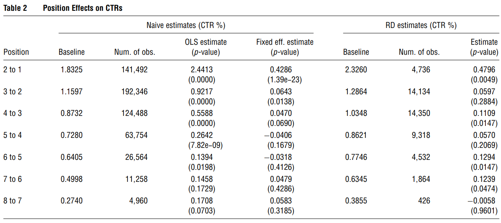
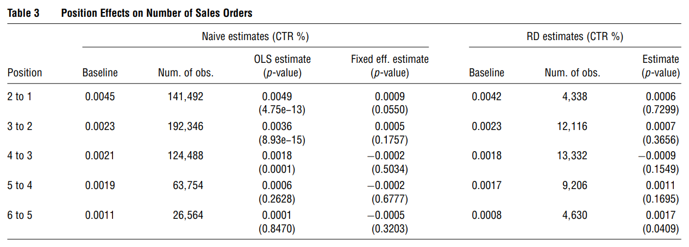

# Marketing Mix Models

Taxonomy of models:

1.  Descriptive: describe relationships between observables
2.  Structural: estimate features of a data generating process (i.e., a model) that are unaffected by the changes in the variables of interest

Any type of causal inference is a form of structural estimation. (All causal identification/estimation/inference is always special case structural identification/estimation/inference).

All quantity of interest (TT, ATE, LATE, etc.) are always under some assumptions, there is no such thing as "model free"

Reduced Form: is a functional/stochastic mapping for which the inputs are

1.  Exogenous variables
2.  Unobservables ("structural errors")

and outputs are endogenous variables (satisfy independence condition wrt unobservables) (e..g, $Y = f(X,Z,U)$)

Reduced form is obtain by solving a structural model for each endogenous variable as a function of the exogenous observables and structural errors

For example,

The perfectly competitive supply and demand

$$
\begin{cases}
Q &= D(P, X,U_d) \\
P&= MC(Q, Z, U_s)
\end{cases}
$$

after solving for equilibrium, we derive the reduced form relations

$$
\begin{cases}
P & = p (Z, X,U_s, U_d) \\
Q &= q(Z, X, U_s, U_d)
\end{cases}
$$

Reduced Form is also under structural models. Some also say "reduced form structural model"

Reduced form is not recommended in applied econ because it's either wrong or logically incoherent

You always need to name your unobservable(s) under the error terms.

[Identification](http://www.econ.yale.edu/~pah29/intro.pdf) (p. 29):

-   a **structure** $S$ is a data generating process (i.e., a set of probabilistic or functional relationships between the observable and latent variables that implies ("generates") a joint distribution of the observables

-   Let $\mathcal{S}$ be the set of all structures; $S_0 \in \mathcal{S}$ the true structure

-   a **hypothesis** is any nonempty subset of $\mathcal{S}$

-   hypothesis $\mathcal{H}$ is true if $S_0 \in \mathcal{H}$

-   a structural feature $\theta(S_0)$ is a functional of the true structure

-   A structural feature $\theta(S_0)$ is **identified** under the hypothesis $\mathcal{H}$ if $\theta(S_0)$ is uniquely determined within the set $\{\theta(S): S \in \mathcal{H}\}$ by the joint distribution of observables

Analyze

1.  Transaction history:

    -   Examples:

        -   Purchase incident, brand choice, quantity. The product of these three things can give demand.

        -   Prescription history -\> Demand

        -   Casino visits, spending in casino -\> Demand

Modeling Issues. Why are we doing this?:

1.  We model demand because we want to relate demand to marketing activity.
2.  We also want to optimize and target

**Heterogeneity** is at the heart of marketing (especially in the brand choice models)

-   Unobserved heterogeneity:

    -   Differences in taste and **preferences**

    -   Differences in **responsiveness** to marketing lever

    -   Structural heterogeneity: The decision making process are not the same (newer one).

-   A priori segmentation: estimation problem is easy (if you don't the problem of $p >> n$ and you actually observed heterogeneity)

    -   Firms segment based on characteristics, and they are different.

Two ways to handle heterogeneity

1.  Latent Class Models
2.  Individual Level Heterogeneity

Endogeneity

-   structural component allows for jointly modeling demand and supply

## Discrete Choice Models and Continuous Heterogeneity

-   Discrete and Continuous Heterogeneity

-   Price Customization

-   Targeting

Models:

-   Random Coefficients Logit

-   Purchase Incidence

-   Brand Choice Models

[@chintagunta2011]

-   Goals of demand analysis (which affect model-form)

    -   Forecast: (not much causal inference)

        -   Examples:

            -   Aggregate: [@Bass_1969]; [@dekimpe1995]

            -   Individual: [@guadagni1983]

        -   Descriptive model in stable environments

        -   Structural for **radically different counterfactuals**

    -   Measurement

        -   usually used under experiments and causal inference

        -   Structural models

        -   Reduced-form, causal effects models

    -   Testing

        -   Reduced-form, causal effects models

-   Demand, supply, and marketing mix are endogenously determined.

    -   Best case: find exogenous shocks to the system to estimate

    -   Impose supply model into the demand estimation step (p. 980)

-   Counterintuitive to assume utility maximization for estimating consumer-level models, instead of firms. But we observe evidence of well-fitting model for the demand-side, but not yet in the supply side. But lack thereof evidence still does not mean that it's wrong, it's just mean we need more development.

-   Building blocks of individual-level demand models

    -   Direct utility specification of demand system

    -   Indirect utility specification of demand systems.

[@lehmann2011]

-   Tradeoff between rigor (sophistication) and relevance

-   Basic discipline migrated and viewed as more sophisticated, which lead to arms race. (cascade more and more sophisticated)

-   Execution rigor \> idea quality. We should view analytical rigor and substantive content equally.

-   Impact:

    -   Citation

        -   Breadth and reach (to other disciplines)

        -   Game the system: cite reviewers.

-   A good research paper should be (p.162)

    -   reasonably realistic/general

    -   relatively simple and robust

    -   insightful

    -   reasonably communicable

-   More complex methods are only appropriate when (p. 163)

[@chintagunta2005]

-   Try to understand the role of potential weekly brand-specific characteristics that influence consumer choices, but they are unobserved

-   Endogeneity

-   Inclusion of the UBC

UBC: they are the first guys to do it in the dis aggregate model.

[@zhang2009]

[@dong2009]

-   What is the benefit of individual-level targeting in the presence of strategic behavior by other firms?

-   Setting

    -   Pharmaceutical industry

    -   Individual-level targeting to physicians

    -   Targeted ad (i.e., detailing)

-   Model

    -   Physician response: capture the responsiveness each physician to targeting

    -   Firm detailing choices: firms strategically target and how much ad

[@nair2017]

## Structural Models, Endogeneity

Good Empirical Research requires

1.  Good Data

    1.  Original

    2.  Cool results

    3.  Exogenous

2.  Good Theory

    1.  Interesting Hypotheses

3.  Cool new approach

Analysis

1.  Descriptive
2.  Predictive
3.  Causal
4.  Prescriptive or policy-oriented.

Both 3 and 4, you need structural or experimental research.

Structural Equation Modeling is different Structural Equation

Causal as in experiments, there

In the structural model, we still want to make causal inference.

-   Endogeneity

Models:

-   Instrumental Variables

-   Joint Estimation of Supply and Demand Models

-   Empirical Bargaining Models

Ask:

-   Bounds analyses:

    -   [@ellickson2011a]

    -   [@manski2002]

### Background {#background-structural-models}

[@reiss2011]

Types of Empirical models in marketing

-   Descriptive (no need to concern for endogeneity): covert data into info

    1.  Statements about facts

    2.  High-quality and relevant data

    3.  Accurate Interpretation

-   Structural (also known as latent/ path models)

-   Experimental (including quasi-experimental)

The data and research questions should always determine methodological approach.

Under structural models, we rely on

1.  Formal formal specification linking Y and X

2.  Stochastic specification connects theoretical model to data. Ex: heterogeneity helps explain the imperfect fit by including

    1.  Consumer preference

    2.  Consumer decision-making errors

    3.  Measurement errors

Structural models help recover counterfactuals.

Structural models differ from descriptive models because it can recover the structural parameters using reduced from.

Reduced form regression means that you know the structure of the data generating process.

A reduced from only exist with an underlying structural model. When researchers say they use "reduced-form analysis" when they only do regression: They erroneously assign a causal interpretation to the regression coefficients.

[@rossi2014]

-   IV methods even with valid instruments can still have poor sampling properties (finite sample bias, large sampling errors).

-   Problems with Instrumental variables in marketing

-   It's hard to find instrument for **advertising** and **promotional** variables

-   Lagged marketing variables are invalid instruments when advertising and promotional variables are unobserved.

-   Control functions can still work under nonlinear demand model (e.g., choice model).

-   Endogenous variables in marketing:

    -   Price, advertising, promotion, entry order, distributions, market structure, market share, revenue, networks

    -   Instruments:

        -   lagged variables,

        -   costs (input and wholesale prices).

            -   Cost input: Theoretically good instrument for endogenous price, but hard to measure (especially marginal cost measured by BLS that has high measurement error) (p. 666).

            -   Wholesales price to deal with price endogeneity is plausible (but people can still argue that wholesalers set price in anticipation of adveritsing and promotion). But they have less variation (frequency of changes is lower than retail price) hence using wholesale price as an instrument, you account for the difference between long-run and short-run effects of price, instead of endogeneity.

        -   other products. Good instrument for endogenous price when unobserved demand shocks (that vary by market and time, for those shocks that only vary by market, but not only time, FE can only fix) are uncorrelated across market (exogeneity), but costs are correlated across market (relevance).

        -   fixed effects (brand, time dummies). Good but only for linear models.

            -   Price endogeneity: [@villas-boas1999] (another flaw - no heterogeniety and state-dependence for packaged goods panel) uses lag price as instruments, but it is bad (unmatched time) and is not supported.

        -   demographics (bad instruments),

        -   product characteristics [@berry1995],

        -   price indices,

        -   display and features.

    -   People tend to use lagged variables to fix endogenous price (price correlates with unobserved quality, which induces downward endogenous in price sensitivity).

-   The Hausman test can only be used to determine the validity of one set of instruments based on the validity of another set of instruments.

### Examples

[@berry2004]

-   Second-choice data as an instrument: if consumers hadn't purchased their cars, what would have been their second choice. But you still need high variation in this variable to estimate the model

-   General Motors data set: second choice = substitution pattern. (This might only help with non-parametric estimate)

-   Prior models: To estimate substitution coefficient (pattern): match consumer attributes to consumer choices (observables).

    -   Identification: estimation based on **changes across markets (or across time)**.

    -   Assume the distribution of consumers' underlying tastes, conditional on an observed distribution of consumer incomes and demographics (i.e., observables) is **constant** across markets and time.

    -   Hence, substitution coefficient is estimated from the data on changes in (1) characteristics and number of product, and (2) changes in observed consumer attributes across markets.

    -   In other words, estimation is based on

        -   $1$ switchers of consumers (i.e., people buy different product when there are changes in product prices, choice set, or other characteristics).

        -   $2$ different people (distribution of consumer attributes) will choose different product for a set of product.

-   But the prior models are without unobserved heterogeneity and only with observed consumer attributes are actually bad at replicating the substitution pattern observed in the second-choice data.

-   This paper identification strategy is based on the second-choice data

    -   Advantages:

        -   (1): direct data-driven substitution pattern.

        -   $2$ more identification power without the exogenous changes in choice sets.

    -   Disadvantages:

        -   Since second-choice data is available for single market (i.e., not across market), we can't estimate across-market pattern of substitution.

-   Future research:

    -   Combine across market second-choice data (i.e., SUVs switch to minivan).

Baseline model [@berry1995]

$$
u_{ij} = \sum_{k} x_{jk} \tilde{\beta}_{ik} + \xi_j + \epsilon_{ij}
$$

where

-   $u_{ij}$ = linear utility of consumer $i$ consuming product $j$ ($j \in [0, J]$ where $j =0$ means the consumer did not buy from any of the competing market

-   $k$ = observed product characteristics

-   $r$ = observed household attributes.

-   $x_{jk}$ = observed product characteristics

-   $\xi_j$ = unobserved product characteristics (pick up all the impact that weren't observed, but it might also correlate with the observe, in which case results in small price elasticities).

-   $\epsilon_{ij}$ = individual preferences (independent of the product attributes and each other).

-   $\tilde{\beta}_{ik} = \bar{\beta}_k + + \sum_{r} \mathbf{z}_{ir} \beta_{kr}^o + \beta_k^u \mathbf{v}_{ik}$ (consumer taste)

    -   $\mathbf{z}_i$ = vectors of observed consumer attributes

    -   $\mathbf{v}_{ik}$ = vector of unobserved consumer attributes

    -   This model also assumes that there is only one unobserved characteristics (i.e., without subscript $r$) per household.

Substitute the above two equation

$$
u_{ij} = \delta_j + \sum_{kr} x_{jk} \mathbf{z}_{ir} \beta_{kr}^o + \sum_{k} x_{jk} \mathbf{v}_{ik} \beta_k^u +\mathbf{\epsilon}_{ij}
$$

where

-   $\delta_j = \sum_k x_{jk} \bar{\beta}_k + \xi_j$ (choice-specific constant). (equation 4)

Without any additional assumption on $\xi$ (i.e., product characteristics), we can have consistent estimators of $\mathbf{\theta = (\delta, \beta^o, \beta^u)}$

But we need to know the identifying assumption of $\xi_j$ to be able to estimate $\bar{\beta}$:

-   $\epsilon_j$ are mean independent of the *nonprice* characteristics of all the products.

Estimation

-   2 choices to estimate $\xi_j$:

    1.  Estimate $\mathbf{\theta = (\beta^o, \beta^u, \delta)}$ (always consistent)

    2.  Restrict the joint distribution of $(\xi, \mathbf{x})$ and estimate only $(\mathbf{\beta^o, \beta^u, \bar{\beta}})$ (efficient if there the restrictions are true, but inconsistent if the restrictions are wrong). Hence, better off with first choice.

-   Choice of estimation methods:

    -   ML: computationally costly

    -   Method of moments: matched on 3 sets of moments

        1.  Covariances of the observed first-choice product characteristics ($\mathbf{x}$)with the observed consumer attributes ($\mathbf{z}$) for estimating $\mathbf{\beta}^o$: help identify $\mathbf{\beta}^o, \mathbf{x,z}$

        2.  Covariances of first choice product characteristics and second-choice product characteristics: help identify unobserved consumer characteristics.

        3.  Market share of $J$ products: help identify $\mathbf{\delta}$ (choice-specific constant).

(BLP) [@berry1995]

Question:

-   Hand-waving: "For computational simplicity, ..., $\epsilon_{ij}$ have an independently and identically distributed extreme value "double exponential" distribution". Basically it was modeled this way to have a tractable form of the model's choice probabilities conditional on $(\mathbf{z,v})$: $P(y_i^1 = j | \mathbf{z}_i, \mathbf{v}_i, \mathbf{\theta}, \mathbf{x})$

    -   Closed-form solution: pretty close to the normal distribution (see MacFadden).

-   To construct the choice set: the car characteristics: the authors only used modal vehicle (combinations of options that was most commonly purchased). and price was average price of the model vehicle.

    -   Defensible thing to do

-   Python implementation of this paper: [@conlon2020]

[@draganska2010]

-   How do we measure power in the distribution channel?

-   Between manufacturers and retailers

    -   Manufacturers

        -   Bargain over profit margins with retailer

        -   Bounded by agreement with retailer

        -   Bargaining power comes form size of manufacturer and supplying product for retailers

    -   Retailers:

        -   Intense composition in mature coffee market

        -   bounded by consumer price sensitivity

-   A shift of bargaining power from manufacturers to retailers

-   Standard models are good to measure distribution channel power.

-   Bargaining position: stand to lose more (endogenously determined by the substitution patterns on the demand side)

-   Bargaining power: negation skills, patience, risk tolerance (exogenous - depends on negotiation partners).

-   Channel margin and split = f(bargaining position, bargaining power)

-   Contributions:

    -   Bargaining power is still with manufacturer (manufacturer gets over half of the pie).

    -   Overall profit of the distribution channel is not a zero-sum game

    -   Quantify the effects of bargaining power on channel profits

        -   Bargaining power predominantly affects manufacturers

        -   Bargaining power weakly affects retailers. retailer margins tied down by pricing power over consumers

[@ozturk2019]

-   Impact of Chapter 11 on consumer demand for the bankrupt firms' competitors

-   Possibilities:

    -   Consumers go to the competitions (competitive effect)

    -   reduced demand also fro the competitors (negative info about the industry: contagion effect)

-   Research question: temporally local effect of chapter 11 on demand for rival firms

-   Data: dealer-model-day level

-   Challenge:

    -   General decline in economic condition: Great Recession

    -   "Cash for Clunkers" program: anticipation for the program may decrease demand

-   Remedies: regression discontinuity in time (RDiT)

    -   Control variables (price, ads, recalls, Macroeconomic conditions)

    -   Competitors' sales patterns in Canada (where Chrysler didn't file)

-   Results: Negative effect on competitors.

-   The mechanism:

    -   Increased consumer uncertainty about car purchases

    -   Decreased cross-traffic form the bankrupt firm's dealers to competitors' dealers

Jayarajan et al. (2021) Changing the Power Equation: A Structural Analysis of the Impact of Used Car Markets on the Automobile Retail Channel

Main idea: study the automobile retail channel where retailers sell new and used cars

Structural model:

-   Demand: used and new cars, heterogeneity, price endogeneity (IV)

-   Supply: Oligopolistic structure with multiple retailers and dealers

Outcomes: profits, margins and power in the distribution channel

Counterfactual analysis: What if we change used cars' quality and availability?

Main result: selling used cars are important for retailers profits and bargain power.

## **Cross-Category and Store Choice Models**

-   **Models: Restricted Boltzman Machine Learning Models**

How would you name the topic for this week?

Store Choice Model -\> Category Choice Model -\> Brand choice -\> Quantity

### Background

[@seetharaman2005]

-   Typically outcome variables of interest:

    -   store choice (Which store visited?)

    -   Incidence (whether the product category was purchased)

    -   brand choice (which brand)

    -   quantity (how many?)

Incidence Outcomes in Multiple Categories

1.  Multi-category "whether to Buy" models

-   Base Model:

    -   [@manchanda1999]: assumed **joint** distribution (not independent normal dist from the binary probit model) of two products (underestimate cross-category correlation and overestimates the effectiveness of the marketing mix as compared to [@chib])

    -   [@chib]: 12 products category, and find that accounting the effects of unobserved heterogeneity across households can recover the overestimated cross-category correlation and underestimated effectiveness of marketing mix.

    -   [@ma2012] (publish 5 years later) address the spurious correlation due to 0 outcome (i.e., no purchase) by the multivariate logit model.

2.  Multi-category "When to to Buy" models

-   Multivariate Hazard model

    -   [@chintagunta1998]: bivariate hazard model with only positive correlation between two timing outcomes

    -   Ma and Seetharaman (2004) used Multivariate Proportional Hazard Model to account for both positive and negative pair-wise correlations in the outcomes.

3.  Bundle Choice Models

-   whether or not to buy a bundle

    -   [@chung2003] uses nested logit with error terms follow a joint Gumbel distribution, assumes:

        -   Degree of comparability among product categories

            -   Fully comparable attributes (e..g, brand reliability)

            -   Partially comparable attributes

            -   Non-comparable attributes

        -   Two types of attributes:

            -   Non-balancing attributes

            -   balancing attributes

    -   [@jedidi2003]: consumer's (random) utility = sum of reservation price + random component

        -   Multinomial probit

Brand choice outcome models in multiple categories

1.  Correlated marketing mix sensitivities across categories

-   [@ainslie1998]: Multinomial Probit model of brand choice. Found correlation between responsiveness to price and feature advertising across product categories

-   [@seetharaman1999] found household inertia is correlated among product categories

-   [@iyengar2003]: high coefficients across categories, leveraging info across categories (one observed, focal wasn't)

2.  Correlated Brand Preferences across categories

[@russell1997]: Poisson model for brand's purchase volume, they found Inter-category correlation in purchase volume

[@erdem1998] [@erdem1998a]:using multinational logit brand choice model: signaling theory of umbrella branding explains correlated quality perceptions among product categories

Other papers: [@singh2005] [@hansen2006]

Models of Multiple Outcomes in Multiple Categories

1.  Incidence and Brand Choice

    1.  Incidence as an alternative in a multiple choice model:

        1.  Deepak et al. (2002): used Multivariate Probit (MVP) of incidence and brand choice outcomes.

        2.  [@manchanda1999] found cross-category correlations in marketing mix sensitivities of household

        3.  Ma, Seetharaman and Narasimhan (2005): used Multivariate Logit Model to model incidence and brand choice outcome.

    2.  Incidence and Brand choice as 2 decision stages:

        1.  [@mehta2007]: Simultaneous model of incidence and brand choice

        2.  Chib et al. (2005): Brand choice within each product category

2.  Incidence and Quantity

    1.  [@niraj2008] Two-stage bivariate logit model

3.  Incidence, brand choice and quantity

    1.  [@song2007]: simultaneous model: cross-category effects come from the incidence and brand choice outcomes, not from the quantity outcomes

Estimation: Bayesian framework is a better fit for this type of models. (see [@albert1993])

Store Choice Outcomes:

-   [@bell1998]

-   [@bell1998a]

### Examples

#### [@bucklin2008]

-   Changes in the intensity of mature distribution networks (by car make) influence consumer choice.

-   Three measures for intensity level (for each make)

    -   Dealer **accessibility** (buyer's distance to the nearest outlet): prefer closer

    -   Dealer **concentration** (i.e.,the distance required to encircle a given number of same make dealers around a given buyer) (number of dealers near a buyer): prefer more dealers

    -   Dealer **spread** (dispersion of the multiple dealers relative to the buyer's locations): prefer skewed toward the buyer (think of the circle). Using Gini coefficient from the Lorenz curve).

-   Used logit choice model to model the correlation of the three measure with new car choices.

-   found significant correlation between measures and car choice.

-   Motivations:

    -   Want to infer causation between distribution coverage/ intensity and sales

        -   It's hard. It might depend on product categories (e..g, convenience, shopping or specialty goods).

-   Focus: relationship between distribution intensity and buyer choice in consumer durables market

-   Leveraging slow changes in the distribution channel, the authors probe the effect of distribution intensity on choice.

-   But because it was cross sectional, need to include constant heterogeneity in preferences and other marketing mix effects to avoid confounds.

-   Data: individual-level purchase record by Power Information Network (PIN), under J. Power and Associates from 1997 to 2004 in Cali.

-   Different from previous literature: instead of store choice, brand choice was modeled as a function of outlet locations.

Utility:

$$
U_{it}^h = \alpha_i^h + \Sigma_j \beta_j^h X^h_{ijt}
$$

where

-   $U_{it}^h$ = buyer $h$'s utility for $i$ at time $t$

-   $X_{ijt}^h$ = attribute $j$'s value at time $t$ by buyer $h$

-   $\alpha_i^h$ = product-specific constant (vary by household) (i.e., brand preference)

Heterogeneity is modeled at the zip-code level (buyers in the same zip code share $\alpha, \beta$

Endogeneity:

1.  Measurement Level: individual data, less measurement error.

2.  Simultaneity: Not much changes in distribution network (with empirical evidence). Hence, unlikely

3.  Sample selection: large and representative sample of Cali market.

4.  Omitted variable bias:

    1.  Include heterogeneity at the dis aggregate level (capture unobserved geographical effects)

    2.  Since model at the make level, we have less correlation with the unobserved model-level factors

    3.  Individual makes have less correlation with manufacturer unobserved variables.

Logit choice probability

$$
P_{it}^h = \frac{\exp(U^h_{it})}{\sum_k\exp(U_{kt}^h)}
$$

Using Hierarchical Bayes

Choice probability buyer $h$ in zip code $z$ pick make $i$ at time $t$

$$
\text{Prob}_t^h(i | \mathbf{\beta}^z, X_{it}^h) = \frac{\exp(\mathbf{\beta}^{\mathbf{Z}}X^h_{it})}{\sum_j\exp(\mathbf{\beta}^{\mathbf{Z}}\mathbf{X}^h_{jt})}
$$

where

-   $\mathbf{\beta}^{\mathbf{Z}}$ = a zip-code-specific parameter vector ($\mathbf{\beta}^{\mathbf{Z}} \sim MVN (\mathbf{\mu}, \mathbf{\Sigma})$

    -   $\mathbf{\mu} \sim MVN (\mathbf{\eta}, \mathbf{C})$

    -   $\mathbf{\Sigma}^{-1} \sim \text{Wishart}[(\rho R)^{-1}, \rho]$

[@ngwe2017]

-   Structural model:

    -   Demand: sensitivity to travel distance and taste for new product

    -   Supply: responses to changes in store locations.

-   Outlets focus on lower-value consumers with lower desire for newness (correlation between travel sensitivity and taste for new products).

-   Outlets help regular store introduce more new products (possibly improve quality).

#### [@donnelly2021]

-   Model for estimating single product choice from alternatives:

    -   Heterogeneity in Individual preferences for product attributes and price sensitivity (across products).

    -   Account for time-varying product attributes, and out-of-stock.

-   Improvement from traditional model due to:

    -   estimate heterogeneity in individual preferences.

    -   estimate preferences of infrequent (purchase) custeomers

#### [@gabel2021]

-   Deep network model accounts for

    -   cross-product relationships,

    -   time-series filters to capture purchase dynamics for product with varying inter-purchase times

## Policy Applications of **Discrete Choice Models**

### [@khan2016a]

-   Variation: prices vary wiht fat content level (

-   Price is determined at a regional level, and independent of local demand conditions (i.e., exogenous shocks)

-   Examine price sensitivity and substitution patterns (heterogeneous for different socioeconomic groups).

-   Higher price leads to more likely consumption of lower calorie milk.

    -   Especially for low-income households.

-   Recommendation: tax scheme based on relative prices of healthier options.

-   Interesting choice of presenting data in the introduction section

-   Data: IRI

### [@rao2017]

-   Demand reduced after the termination of the claims, (12 - 67 % monthly loss in revenue)

    -   The decline effects come mainly from newcomers.

### [@tuchman2019]

-   Descriptive evidence for e-cig ads reducing traditional cig (i.e., e-cig is a sub of traditional cig)

-   From structural models, propose counterfactual evidence for banning e-cig ad (but might increase traditional cig demand again)

### [@seiler2021]

-   Examine the impact of sugar-sweetened beverages (SBB) tax on Philadelphia, where they found that cross-shopping to stores outside the area accounted for half the reduction in sales and decreases the net reduction in sales 22%

-   Key findings:

    -   Tax pass through at an average rate of 97% (i.e., 34% price increase)

    -   Price increase reduce quantity purchased by 46% (but half went to other stores outside of the city). Hence, the net sales of SSB decreased by 22%

    -   Bottled water is not a substitute for SSB, but natural juices might.

    -   Low income neighborhood just decreased demand (no increase in cross-shopping) due to limitation of transportation.

-   Counterfactuals:

    -   15 cents per ounce is close to the revenue-maximizing tax rate (but 2 cents higher could be optimal because it lowers sales while costs marginally to tax revenue).

    -   Initial plan of 3 cents per ounce could be detrimental (tax revenue decreases by 75%)

-   The authors have to argue for the paper's contribution above the one studied in Berkeley and other places (i.e., representative demographics, and results)

-   Tax on distributors and only on artificial sweetener because of financial purposes

-   Data: IRI retail point-of-sale data 2015-2018, tax date = Jan 2017

-   Product aggregate at the brand/diet status/pack size level. (i.e., total units sold and quantity-weighted prices at the product/store/week level.

    -   861 products (489 taxed, 372 untaxed)

    -   data cover 28% of sales of taxed beverages

-   Demo data from Census Bureau and obesity rates from the CDC

-   Dif-n-dif research design:

    -   Treatment; tax area

    -   Control: 3-digit surrounding zipcode - 6-mile away (non-taxed)

-   Parallel trend pretax data.

$$
y_{st} = \alpha(\text{Philly}_s \times \text{AfterTax}_t) + \gamma_s + \delta_t + \epsilon_{st}
$$

where

-   $y_{st}$ = quantity sold and price

-   $\gamma_s$ = store fixed effect

-   $\delta_t$ = week fixed effect

-   $\epsilon_{st}$ = error

-   $\alpha$ = dif-in-dif coefficient

To assess heterogeneity

$$
y_{st} = \tilde{\alpha}_0 (\text{Philly}_s \times \text{AfterTax}_t) + (\text{Philly}_s \times \text{AfterTax}_t \times \mathbf{X}_s)' \tilde{\alpha}_1  + (\text{afterTax}_t \times \mathbf{X}_s)' \tilde{\mathbf{\beta}} + \tilde{\epsilon}_{st}
$$

where

-   $\tilde{\gamma}_s$ = store fixed effects

-   $\tilde{\delta}_t$ = week fixed effects

-   $\mathbf{X}_s$ = a set of store characteristics

-   $\tilde{\mathbf{\beta}}$ = vector of coefficients capturing the change in the outcome in stores outside of Philly after the tax took effect as a function of $\mathbf{X}_s$

-   $\mathbf{\tilde{\alpha}}_1$ = the differential change in the outcome in Philly stores relative to control group as a function of $\mathbf{X}_s$

-   $\tilde{\mathbf{\alpha}}_0$ = baseline (i.e., uninteracted dif-in-dif estimate)

-   two-way clustered SE at the store and the week level

No single-term $\mathbf{X}_s$ because fixed store effects already absorb all store characteristics.

Quantity:

The reason why drugstores and convenience stores experience modest to no decrease in quantity sold is because

1.  They already have higher pretax price level
2.  Consumers who buy at those places are less price sensitive

"Quantity decreases more in high-income areas" (contrary to intuition, high-income should respond less to changes in price, may be because of lower transportation costs).

"Obesity rates do not predict a differential quantity response."

Provided evidence for revenue maximum relating quantity sold and price elasticity.

## Frontier Papers

### [@neumann2019frontiers]

-   19 data brokers , 6 buying platforms, 90 third-party segments

-   Descriptive Analysis

-   Study 1:

    -   Examine performance of an ad campaign with the support of data (to target customers)

    -   Automated system can only delivery 59% to the target market.

    -   Audience accuracy varies between platforms.

-   Study 2:

    -   Examine the optimization of DSPs (Demand-side platforms) for selecting data sources and ad placements.

    -   Delivering performance = f(audience selection, quality of the profiles by data brokers, and other factors).

    -   This study only focuses on the quality of profiles by data brokers.

    -   Optimization is worse than random selection (because average accuracy of identifying the true subject is 24.4% which is less than 26.5% according to the natural distribution of the two attributes - age and gender).

    -   Households with children significantly reduce the performance accuracy (due to potential usage by multiple members)

-   Study 3:

    -   Audience interest-based data are the new type of target (besides age and gender)

        -   Sports interested

        -   fitness interested

        -   travel interested

    -   High accuracy for this interest-based (but still variation by data brokers)

-   Cost-benefit analysis

    -   Cost = fixed (third-party audience info) + variable costs (cost-per-mille of online ads)

    -   Ad optimization is more costly than banner (about 151% more), but compared to the gain, third party solution is still economical.

## Advertising Response Measurement

-   Structural, Experimental and Quasi Experimental Approaches

### [@terui2011]

-   Previous studies assume that advertising has a direct and lagged effect on consumer utility

-   This study found evidence that there is no direct effect of advertising on consumer utility for mature brands.

-   Data: scanner panel (laundry detergent and instant coffee)

-   Advertising affect consideration sets, not the marginal utility of offering (i.e., previous studies did not account for consideration set formation, and just take the advertising effect on customer utility, later underestimate the effect of advertising on sales)

    -   Hence, we should use **brand consideration as the dependent variable when studying the advertising effect**.

-   Periodic advertising is still beneficial because it raises the advertising stock to be above the threshold level for brand inclusion in the consideration set.

-   Contribution:

    -   Account for heterogeneous consumer response to advertising and consideration set formation

    -   Include a hard constraint on brand inclusion in the consideration set which helps distinguish considerations from choice in the model likelihood.

-   Base model: [@gilbride2004]

-   Future research: can use this paper for structural models of consideration for price.

-   Question: is it applicable to high-involvement products?

Model Development:

Let $N$ be the number of choice alternatives

Consumer $h$ has advertising stock $AS_{jht}$ for each alternative ($j = 1, \dots, N$)

Alternative $j$ can be in the consideration set, $C_{ht}^{AS_{jht} \ge r_h}$ , of consumer $h$ at time $t$ when $AS_{jht} \ge r_h$ (where $r_h$ is the threshold value of consumer $h$ across choice alternative and time invariant. also known as **effective advertising stock**)

Elements in $C_{ht}^{AS_{jht} \ge r_h}$ can change over time with changes in $AS$

Consumer $h$ utility for the alternatives in the consideration set is

$$
u_{jht} = x'_{jht} \beta_h + \epsilon_{jht}
$$

where

-   $\epsilon_{jht} \sim N(0, \sigma^2_j = 1)$ for $j \in C_{ht}^{AS_{jht} \ge r_h}$

The choice probability of an alternative in the consideration set is

$$
P(j)_{ht} = P\{ u_{jht} = \max \{ u_{kht} : k \in C_{ht}^{AS_{jht} \ge r_h} \}\}
$$

To make the model solvable, if a person did not watch any ad, but still purchase a brand, then his or her $r_h \approx 0$

Advertising stock is modeled based on [@bass1972], [@clarke1976]:

$$
AS_{jht} = \sum_{g=0} ^ \infty \alpha_{jht- g} \rho_h^g 
$$

where

-   $\alpha_{jht-g}$ is when consumer $h$ is exposed to adverting for brand $j$ at time $t-g$

-   $\rho_h$ is advertising diminishing effect ($0 \le \rho_h <1$)

Advertising effect occurs instantly and diminished exponentially (to the $g$ order), which was evidenced in experiential research design [@lodish1995] [@little1979]

Two other stock variables:

**Brand Loyalty** [@guadagni2008logit] [@erdem1996]:

$$
BL_{jht} = \sum_{g=1}^\infty y_{jht-g} \tau_h^g
$$

where

-   $y_{jht-g}$ is the purchase variable for brand $j$

-   $0 \le \tau <1$

-   Threshold $\lambda_h$

Display Stock

$$
DS_{jht} = \sum_{g=9}^\infty d_{jht- g} \phi_h^g
$$

where

-   $0 \le \phi_h <1$

-   Threshold $\kappa_h$

### [@narayanan2015]

-   Causal effect of position in search engine advertising listing on click-through rates and sales

-   Because of selection bias, causal inference is difficult (experiments can't model bidding behavior).

-   Without addressing for these selection biases, position effects on click-through rates and sales are huge, but with RD design, the estimates are smaller.

-   Position effects are

    -   stronger for small advertiser, or consumer with little experience with the keyword for the advertiser.

    -   weaker brand or production info is included in the keyword, on weekends compared to weekdays.

-   Position could affect click-through rate and purchase behavior via

    -   signalling: advertising expenses signal product quality

    -   consumer expectation

    -   sequential search: learned experience by costumers that better results are higher in the search engine.

    -   attention: consumers only pay attention certain parts of the screen.

-   Endogeneity problems:

    -   Brands target keywords with high conversions. (inflate the causal effect of viewing ad on conversions)

    -   Position is determined by online auction. (randomization of bid would not lead to randomization of position)

        -   Cannot use parametric selection equations because positioning is determined by complex processes

-   Solution: RD

    -   Running variable: adrank = f(advertisers' bids, quality score) -\> (sharp cutoff)

    -   nonobservability of competitors' adrank prevents selection into treatment by the focal firms. Hence, unless you have both focal and competitors bids and Adrank, you can't do RD here (but the authors they have both a focal advertiser and its main competitors - before M&A).

-   Moderators (Decision by the advertisers):

    -   Match: Exact vs. Broad (for keywords)

    -   Advertisers: e.g., higher vs. lower quality firms

    -   Experience and advertising are substitute [@narayanan2009]: recent consumers are not going to change their probability of buying when exposed to ads, as compared to those who have not recently experienced the product.

    -   Category vs. brand terms: prior literature shows category terms precede brand terms (people use broad search terms = novices = rely more on ad position).

    -   Weekday vs. weekend: search cost lower on the weekends. Thus position effects are stronger on weekdays.

-   Selection Issues:

    -   Selection on observables:

        -   Differences in keywords, match types, advertisers

    -   Selection on unobserveable:

        -   Bidding behaviors by advertisers (both ways: positive - higher CRT invest more and negative - higher CTR invest less).

        -   Competition:

-   Possible Solutions:

    -   Experiments: but cannot control/randomize competitors.

    -   Model selection parametrically: hard to believe

    -   Latent Instrument: but rely on a single latent instrument, outcomes are normal (hard to believe)

-   RD:

    -   Assumptions:

        -   Brands can't manipulate its position: unobservability of competitors Adrank even ex-post

        -   Forcing variable is continuous: Adrank

    -   Procedure:

        -   Selection of observation (those close to the cutoff)

        -   Selection of the bandwidth (how wide the window, bias and variance trade-off)

        -   Use local linear regression within the bandwidth

        -   Test different bandwidth using "leave-one-out cross validation"

-   Data: 28.5 mil daily obs -\> 13.1 mils (with 2 firms involved) -\> 414,310 obs with adjacent observations.

-   Results:

    -   Both OLS and Fixed Effect inflate the effect of position.

-   OLS estimates are positively biased (selection on observables and unobservables),

-   Fixed effects correct for selection of observables (a little lower than OLS) (selection on unobservables causes negative bias)

-   With varying selection bias by position, it's unlikely that parametric approaches or instrumental variables can accommodate for this.

-   The effect of position on CTR and later on sales is not straight forward. And only moving from 6 to 5 has a significant difference to sales. (which is right above the page fold, or it might be due to consumer perceive top 5 as higher quality).

### [@Lewis_2015]

-   Individual sales data are volatile which leads to high experiments cost to require precise estimate.

-   Data on 25 field experiments (cost \$2.8 mil in digital marketing)

-   Evidence that observational methods (i.e., control for observables) are untrustworthy to measure returns to advertising.

-   Economic universe

-   Weak evidence of advertising effectiveness.

### [@gordon2019]

-   Compare experiments results with observational models, where observational methods do not show the same effect as the randomized experiments.

-   Demand (click-through rate) universe
