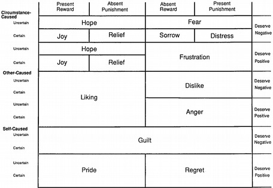
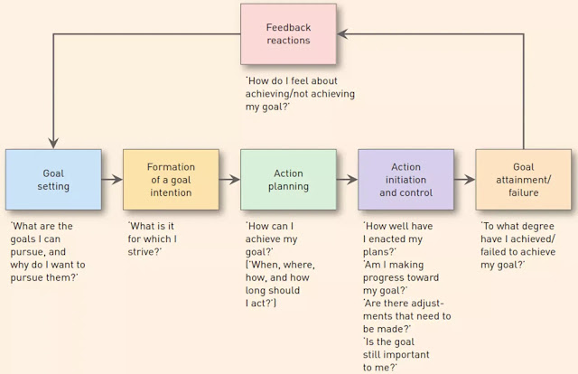

# CB Seminar

"Cognitive perspective-taking refers to the ability to make inferences about others' thoughts and beliefs."

"Affective perspective-taking is the ability to make inferences about others' emotions and feelings" [\@healey2018]

## Overview

[@simonson2001]:

-   Behavioral Decision Theory (i.e., study judgment and decisions) (Kahnenman & Tversky) vs Social Cognition

    -   Both use mediation and path analysis

-   Positivist (focuses on causation) Versus Postmordern (focuses on interpretation)

+------------------+--------------------------------------------------------------+-------------------------------------------------------------------------+
|                  | Behavioral Decision Theory                                   | Social Cognition                                                        |
+==================+==============================================================+=========================================================================+
| Underlying model | decision-making model, (e.g., determinants of choice)        | response hierarchy model (i.e., how judgments and attitudes are formed) |
+------------------+--------------------------------------------------------------+-------------------------------------------------------------------------+
| Phenomena/ Task  | Stimulus-based                                               | Memory-based                                                            |
+------------------+--------------------------------------------------------------+-------------------------------------------------------------------------+
| Measures         | Information acquisition, verbal protocols, and response time | Cognitive response                                                      |
+------------------+--------------------------------------------------------------+-------------------------------------------------------------------------+

Types fo Consumer Research:

-   Theory Development

-   Theory Application

    -   limited impact on managerial practice

Theory-Testing vs. Substantive Phenomena-Driven Consumer Research

[@janiszewski2016]

-   Deductive-Conceptual Knowledge

    -   A theory is "a statement of concepts and their interrelationships that shows how and/or why a phenomenon occurs." [@corley2011]

    -   Knowledge Creation Strategies:

        -   Bridging disciplines

        -   Challenging assumptions

        -   Introducing mediators and moderators

        -   Contrastive explanation

        -   Borrowing and blending

    -   Knowledge Appreciation

        -   Quality of the contribution

            -   depends on rigor, and execution of research method

        -   Benefit of the contribution

            -   Originality / Novelty

            -   Interestingness

            -   Changes in core understanding/beliefs

-   Integration (i.e., tree of knowledge)

## Social Influence

[@mcferran2010]

-   body type of others influences one's food consumption

    -   moderated by body type (undesirable reference group) of the other consumers

    -   low appearance self-esteem or cognitive load also moderate this relationship

-   Anchoring and adjustment processes

-   Social Influence and Food Choice

    -   people conform to group average (anchor)

-   Study 1: Social influence effects is present regardless of food perception (healthy vs. unhealthy). People eat more when there is another person, but the magnitude is moderated by the other's body type (consume less when seeing obese others - undesirable group). The effect persists after social influence.

-   Study 2: Presence of other increases food quantity.

    -   High anchor (obese person takes high quantity), participants take less.

    -   Low anchor (obese person takes small quantity), participants take more

-   Study 3: People with low appearance self-esteem and high processing resources will attenuate more

[@moreau2010]

-   Social comparison: people want to gain self-knowledge.

    -   Self-designed products are based on:

        -   comparison with the characteristics of other comparable products

        -   comparison with skills, talents, and expertise of the other designers.

-   Since professional designers are expert, consumer designers face upward comparison

-   Study 1:

    -   Self-deigned product evaluation is lower when compared to professional default product, than consumer designed default design

    -   Firm guidance moderates this effect

    -   There is a premium for self-designed product.

-   Study 2: Defensive vs. Nondefensive processing

    -   need to protect self-esteem/ self-image.

    -   At low defensive processing, evaluations of self-designed products are lower when the default product is professionally designed than consumer designed

    -   defensive processing reduces negative comparison

-   Study 3: The behavioral consequences of social comparison in self-design.

    -   Public prize (visibility) enhance self-evaluations.

    -   Repair opportunity affects the evaluation of self-designed products

[@hamilton2003]

-   Influence based on context effects (suggesting other unlikely alternative)

    -   moderated by the belief whether others are trying to manipulate the choice context.

-   People understand context effects (e.g., choice set construction).

-   To influence others, people construct a set of unattractive alternatives (attraction effect), or a compromise between two other alternatives (compromise effect).

-   Author hypothesized: People correct the contextual effects when they know constructors' intentions (to influence them).

-   Results: "Subjects' beliefs that menus had been created **(by their friends)** to influence their choices seemed to enhance rather than limit the effectiveness of the menus." (p. 498) likely due to homophily bias.

    -   Evaluated the target more favorably.

-   Source credibility, expertise, trustworthiness, attractiveness, and similarity can influence the effectiveness of persuasion attempt [@wilson1993]

-   Hypothesis: ulterior motive of persuader moderates increase the resistant effect of chooser than group-oriented motive.

    -   Subjects are likely to agree (choose) when they know the menu is created by their friends

    -   knowing that the menu has been created by a stranger, under compromise strategy, subjects still choose the middle alternative.

-   Attraction strategy is more likely to be used than compromise strategy

-   Even if subjects understand contextual effects (manipulation), they do not resist because

    -   it's hard to recognize characteristics of a local set from the characteristics of a global set. [@simonson1993]

    -   If subjects assume that the most attractive option has been eliminated, they have to choose the best among alternatives.

[@argo2005]

-   Non interactive social presence in the consumption context.

-   social forces has greatest influence [@latan?1981]:

    -   number (social size) (large \> small):

        -   emotions and behaviors: (e.g., stage fright, crowding)

    -   immediacy (proximity) (closer \> far)

    -   social source strength (importance) (high \> low)

-   Social Impact Theory

-   Study 1:

    -   0 -\> 1 person increased positive emotions

    -   1 -\> 3 person decreased positive emotions

-   Study 2:

    -   proximity moderates the impact of social size on emotions and brand selection.

## Interpersonal perception and consumer lay beliefs

[@folkes2003]

-   Info valence: **Negativity bias for products** (negative info about a product has greater influence on brand perceptions than positive info). [@herr1991]

-   **Positivity bias for services** (positive experience from a service provider can lead customers to infer positivity about the brand as a whole than negative experience).

    -   Could be because service is more heterogeneous.

    -   this effect is greater for novice consumer.

-   Study 1: First time car insurance buyers

    -   Alternative explanation: Subtyping [@weber1983], or occupational stereotype consistency, question order are all ruled out.

-   Study 2: replicate study 1: compare the effect of info about individual service provider to that of others who is not from the firm.

    -   Subjects perceive focal firm employee more positively and consider negative experience from the other firms' agents as outliers.

-   Because consumers are predisposed to think that a service encounter in general should be more positive than negative [@fornell2005], this assumption could explain why consumers consider positive experience as typical and generalize it to the brand, and negative experience as outliers.

-   3 sources that affect consumers' beliefs:

    -   general perceptions of services

    -   beliefs specific to a firm

    -   beliefs specific to an occupation

-   Study 3 used a critical incident method to examine the following hypothesis: the positive effect is moderated by consumer experience (e.g., stronger for less experience consumers).

    -   Valence affects perceived typicality , but experience with a firm did not influence typicality (cant find support for H3)

-   Study 4: Replicate study 1 and 2 in a natural setting

[@brough2016]

-   Men are less likely to buy environmentally friendly products than women because the close association between green behavior and femininity (perceived by both men and women, and both users and observers).

    -   Prior research attribute this gap to personality traits (women are more prosocial altruistic [@lee1999], and stronger ethic of care [@zelezny2000])

    -   The link between greenness and femininity could be explained by

        -   target of green marketing usually involved women (e.g., cleaning, laundry).

        -   caring and nurturing from greenness are feminine traits

-   Since men are more concerned with gender -identity maintenance (which is kinda surprising from my view), they avoid purchasing green products which might jeopardize their macho image.

    -   From social-identity theory: self-concept is also derived from perceived group membership [@turner1986]

[@wang2016]

-   Smile affects 2 social judgments: warmth and competence

    -   Broader smile leads to more warmth, but less competent

        -   Consumers focus moderates this effect

            -   Promotion-focused consumers (and low-risk consumption) like bigger smile on warmth

            -   Prevention-focused consumers (and high-risk consumption) like slight smile (signal competent)

-   Based on stereotype content model (SCM) of social judgments [@fiske2002a]

-   Facial configuration has evolutionary proposes.

[@haws2017]

-   Consumers believe healthier foods are more expensive than less healthy foods.

-   Due to the dual process model, intuitions based on biased information (processed heuristically) will lead consumers evaluating healthy claims with higher standard (e.g., higher standard for intuition-inconsistent than consistent claim).

-   Lay theories or lay beliefs about food = expensive intuition affects consumer decision making process, because this process is low involvement one.

## Emotions, mood and affect

[@bagozzi1999]

-   Emotions are "mental states of readiness that arise from appraisals of events or one's own thoughts" (p. 184)

-   Affect is defined as "a set of more specific mental processes including emotions, moods, and (possibly) attitudes." (p. 184)

-   Moods (also known as affect transfer) are longer lasting and lower in intensity and non-intentional than emotions (intentional)

-   Attitudes are instances of affect defined as an evaluative judgments (also known as appraisals and under appraisal theories in psychology), and have two components:

    -   affective

    -   cognitive (evaluative)

-   Under appraisals theory, there are two appraisal at the emotion formation stage (Lazarus 1991

    -   emotions and adaption):

    -   goal relevance

    -   goal congruence

{style="display: block; margin: 1em auto" width="100%"}

[@pham2001]

-   Under moderately complex and consciously accessible stimuli, conscious monitoring of feelings facilitates (1) faster, (2) more stable and homogeneous (among individuals), and (3) more predictive of the quantity and valance of people's thoughts than reason-based assessment.

-   Affect-as-information framework posits that feelings contain valuable judgmental information (Schwarz, 1990). People knowingly create overall evaluation based on momentary feelings toward the target. These feelings are consequences of either

    -   mental representation fo the target (produced integrally)

    -   preexisting o contextually-induced mood produced by experience (produced incidentally)

-   Two components of attitudes:

    -   cognitive component (also known as utilitarian or instrumental)

    -   affective component (also known as hedonic or consummatory).

-   Two types of affect:

    -   Type I affect: innate programs

    -   Type II affect: conditioned stimulus that triggers emotional response

    -   Type III affect: controlled appraisal of the stimulus

-   Integral Feelings vs. Reason-based assessment (also known as descriptively-based evaluation

    -   Relative speed: feeling faster than reason-based assessment (Type I affect, and Type II), but not under type III

    -   Interpersonal Agreement: people more likely to agree on their feeling-based responses as compared to reason-based responses (under type I and type II, not type III)

    -   Relation to thought generation: number and valence are better predicted by feeling responses.

[@isen2001]

-   Positive affect increases problem solving and facilitates decision making in the sense of flexibility, innovation, and creativity, efficiency.

-   Positive affect also increases helping, generosity, and interpersonal understanding.

[@raghunathan2001]

-   Pleasantness of the product context is "the degree to which a product context makes the respondent happy." (p. 355)

-   Domain match is "the extent to which the target product is from the same domain (or category) as that of the product context. (p. 355-356)

-   Under domain match, exposure to pleasant and improving -sequence (compared to less pleasant and worsening) will lower happiness with the target product.

-   Under domain mismatch, exposure to pleasant and improving will increase happiness with the target product

## Persuasion and attitude change

@friestad1994

-   The persuasion knowledge model

-   Target (Audience), Agent (persuasion message creator)

-   People can switch roles fluently between target and agent but the knowledge remain intact.

-   Beliefs about:

    -   Psychological mediators

    -   Marketers' Tactics

    -   The Effectiveness and Appropriateness of Marketers' Tactics

    -   Marketers' persuasion goals and one's own coping goals

-   two dimension of overall persuasion competence evaluation:

    -   Perceived effectiveness

    -   perceived appropriateness of the persuasion tactic

{style="display: block; margin: 1em auto" width="100%"}

@campbell2000

-   Persuasion knowledge refers to "consumers' theories about persuasion and includes beliefs about marketers' motives, strategies, an tactics" (p. 69)

-   Both accessibility and cognitive capacity affect inferences of persuasion motives, which then affect the perception of agent from consumers' perspective.

    -   Cognitive capacity:

        -   Characterization stage = perceptual and automatic

        -   Correction stage = higher-order attributional processing

    -   Usually, target has more mental load and less cognitive capacity than observers

    -   Accessibility of ulterior motives, affected by:

        -   expectations

        -   strength of association

        -   frequency of activation

        -   recency of activation

-   Under high ulterior persuasion motive, both cognitively busy and unbusy target use persuasion knowledge to evaluate

-   Under low ulterior motive, cognitively busy targets are less likely to use persuasion knowledge when evaluating the salesperson.

-   If the persuasion tactic is recognized as having ulterior motive, then it's persuasion knowledge.

@ahluwalia2000

@bacamotes2013

-   Commitment in this research was only symbolic (given a lapel pin to symbolize guests' commitment). But guests were more likely to engage in environmentally friendly behavior.

-   "Attitude change does not always equate to behavior change" (Ajzen and Fishbein 1977)

-   Proposed solution to change guests' behaviors:

    -   Reciprocity concern

    -   referencing social norms

-   This study posits that individuals' personal values have better predictive power than beliefs in external norms (Viscusi, Huber, and Bell 2011) (p. 1071) based on the principle internal consistency to avoid cognitive dissonance

-   Using signaling theory, the authors prime consumers to stay consistent with their signaled commitment.

-   They have competing needs

    -   They want to be lazy

    -   But they also want to be perceived as environmentally friendly because I said to others already.

@thompson2013

-   Propose **skepticism-identification model** of ad creator influence

-   There are two opposing effects:

    -   Skepticism about the creator's competence

    -   Identification with the creator

-   Factors that affect the two effects:

    -   Cognitive resources (to scrutinize the message)

    -   Increased source similarity

    -   loyalty toward the brand

@isaac2016

@campbell2013

## Judgment and decision making and behavioral pricing

@tversky1974

3 heuristics that are used to assess probabilities and predict values:

-   **Representativeness** heuristic: "the degree to which A resembles B." (p. 1124) (also known as similarity)

    -   **Insensitivity to prior probability (base rate) of outcomes**: (neglected and only take into consideration similarity). With no specific evidence, prior prob is considered, with worthless (misleading) evidence, prior prob is ignored

    -   **Insensitivity to sample size**: (1) smaller hospitals are more likely to stray from 50% prop of boys (hence, more likely to obtain more than 60% boys), (2) Even with smaller sample, if the proportion is greater, one can still infer posterior prob to be higher (unaccounted for equal prior prob), which is known as "conservatism."

    -   **Misconceptions of chance**: local representativeness (local characteristics represent global ones). *Gambler's fallacy*: "chance is commonly viewed as a self-correcting process in which a deviation in one direction induces a deviation in the opposite direction to restore the equilibrium." (p. 1125) *Law of small numbers*: "even small samples are highly representative of the populations from which they are drawn." (p. 1125)

    -   **Insensitivity to predictability**: predictions based on favorability of the description (or attributes), but it violates the *normative statistical theory* (predictability here is strictly related to information, the range of predictions and extremeness should depend on the range of information, not on uninformative info).

    -   **The illusion of validity**: people are confidence in their prediction when they are presented with strong similarity between input and the selected outcomes), which persists even in cases that the judge understands factors that limit his predictions' accuracy. This illusion can be caused by *internal consistency* (highly consistent patterns). Redundancy (or correlation) among inputs decreases accuracy while it increases confidence.

    -   **Misconceptions of regression**: regression toward the mean (e.g., flight instructors praise or scold on previous landing can "predict" the next landing).

-   **Availability** heuristic: The ease at which instances or concurrences come to mind.

    -   **Biases due to the retrievability of instances**: Factors affect retrievability are familiarity, and salience (p. 1127) (recent occurrence \> remote, and more vivid instance \> less vivid).

    -   **Biases due to the effectiveness of a search set**: how easy it is for you to recall your search set matters. (e.g., abstract vs. concrete words [@galbraith1973])

    -   **Biases of imaginability**: the ease with which an instance can be constructed. (evidence in constructing committee based on imagination).

    -   **Illusory correlation** (frequency with which two events co-occur): "the associative connection between events are strengthened when the events frequently co-occur." (p. 1128).

-   **Adjustment** and **anchoring**:

    -   **Insufficient adjustment**: under anchoring effect, (e.g., African countries in UN, and long calculations based on insufficient calculation).

    -   **Biases in the evaluation of conjunctive and disjunctive events**: people prefer conjunctive events over simple events (because overestimate of conjunctive events), and simple events over disjunctive events (because underestimate of disjunctive events), which might lead to underestimate the length in planning (because it usually involves successive events - conjunctive events). Similarly, evaluation of risk are conjunctive events, which we will underestimate. "The chain-like structure of conjunctions leads to overestimation, the funnel-like structure of disjunctions leads to underestimation." (p. 1129).

    -   **Anchoring in the assessment of subjective probability distributions**: regardless of expertise (e.g., sophisticated or native subjects), people usually overly narrow confidence intervals (which reflect more certainty), than is justified by knowledge about the assessed quantities (p. 1129). People have 2 ways to derive subjective probability distributions for a quantity:

        1.  Select values that correspond to specified percentiles of his probability distribution

        2.  Asses the probability that the true value of the quantity will exceed some specified values

Interestingly, the second procedure yields less extreme odds than the first procedure.

@thaler1985

Internal accounting

Let $z= \{z_1, \dots, z_i, \dots, z_n \}$ be vector of goods at prices $p = \{p_1, \dots, p_i, \dots, p_n \}$

Consider consumer's utility function

$$
\max_{z} U(z) \text{ s.t.} \sum p_i z_i \le I
$$

where $I$ is the individual's wealth.

Using Lagrange multipliers

$$
\max_{z} U(z) - \lambda (\sum p_i z_i - I)
$$

which is the original model of economic which takes into account of prices and products characteristics (normative prescriptions of economic theory), while ignoring the "framing" effects proposed by [@tversky1981]

This paper proposes:

1.  **Value function** $v(.)$ from prospect theory
2.  Price is changed into **reference price**
3.  Relax the principle of **fungibility**

Assumptions:

1.  "People respond more to perceived changes than to absolute levels." (p. 201). Hence, we have reference point to infer losses and gains.

2.  Concave for gains ($v''(x)<0,x>0$) and convex for losses ($v''(x) >0, x<0$)

3.  Losses loom larger than gains (also known as endowment effect): loss function is steeper than the gain function $v(x) < -v(-x), x>0$

Joint outcome $(x,y)$ can be valued

1.  Jointly as $v(x+y)$ known as integrated
2.  Separately as $v(x) + v(y)$ known as segregated.

And the joint outcome $(x,y)$ can have 4 combinations:

+-----------------------------+---------------------------------------------+-------------------------------------+
| Outcomes                    | Math                                        | Preference                          |
+=============================+=============================================+=====================================+
| Multiple gains              | $x>0,y>0$                                   | Segregation                         |
|                             |                                             |                                     |
|                             | $v(x) + v(y) > v(x+y)$ ($v$ is concave      |                                     |
+-----------------------------+---------------------------------------------+-------------------------------------+
| Multiple losses             | $v(-x)+v(-y)<v(-(x+y))$                     | Integration                         |
+-----------------------------+---------------------------------------------+-------------------------------------+
| Mixed gain                  | Consider $(x,-y)$ where $x>y$ (net gain).   | Integration                         |
|                             |                                             |                                     |
| (cancellation)              | $v(x) + v(-y)<v(x-y)$                       |                                     |
+-----------------------------+---------------------------------------------+-------------------------------------+
| Mixed loss                  | Consider $(x,-y)$ where $x<y$ (net loss)    | Segregation if $v(x)> v(x-y)-v(-y)$ |
|                             |                                             |                                     |
| ("silver lining" principle) | $v(x) +v(-y) \ge \le v(x-y)$ (undetermined) |                                     |
+-----------------------------+---------------------------------------------+-------------------------------------+

To incorporate the notice of reference outcomes (or reference price), instead of $y$, we will substitute it with $\Delta x$ (which is changes in the expected outcome).

We label reference outcome as $(x+\Delta x:x)$

When individuals encountered a decision (transaction) as a pleasure maximizing machine, they will

-   Stage 1: evaluate potential transactions (i.e., judgment process)

-   Stage 2: whether to approve each potential transaction (i.e., decision process)

Transactions

3 price concepts regarding good $z$:

1.  $p$ = actual price

2.  $\bar{p}$ = value equivalent of $z$ (i.e.., money that the individual would be indifferent between receiving $\bar{p}$ or $z$ as a gift)

3.  $p^*$ = reference price (i.e., expected or "just" price for $z$), determined by:

    -   Fairness

2 kinds of utility:

1.  **Acquisition utility**: "value of the good received compared to the outlay"

    -   Acquisition utility equals the net utility from the trade of $p$ to obtain $z$ (valued at $\bar{p}$)

    -   Compound outcome $(z,-p)= (\bar{p}, -p)$, with value function $v(\bar{p}, -p)$ (usually coded as **integrated**, hence cost of good is not treated as a loss)

2.  **Transaction utility**: perceived merits

    -   Transaction utility equals price paid compared to reference price

    -   Reference outcome $v(-p: -p^*)$

3.  **Total utility** equals the sum of acquisition utility and transaction utility

    -   $w(z, p, p^*)= v(p, -p) + \beta v(-p:-p^*)$

    -   where $\beta$ is the weight of transaction utility (can be thought of as consumer surplus in the standard theory). Hence, pathological bargain hunters have $\beta >1$

For multiple accounts (i.e., multiple goods categories), people will purchase iff

$$
\frac{w(z_i, p_i,p_i^*)}{p_i} \ge k
$$

where $k$ is a constant (similar to $\lambda$ in the standard model)

-   High $k$'s are observed for seductive or additive goods (apply to luxury goods as gifts as well)

-   Low $k$'s are observed for goods that are desirable in the long run (e.g., exercise or education).

and individuals seek to maximize $\sum w(.)$ subject to $\sum p_i z_i \le I$

Due to **local optimization** (i.e., constraint of time and category specific budget constraints, decision process is that people will buy good $z$ at price $p$ iff

$$
\frac{(w,p,p^*)}{p}> k_{it}
$$

where $k_{it}$ is the budget constraint for category $i$ in time period $t$

Alternatively, **global optimization** would require $k_{it}$ to be constant (but ppl don't act this way).

3 implications:

1.  Compounding rule

2.  Transaction utility:

    1.  Sellouts and scalping

    2.  Methods of raising price:

        1.  Increase the perceived reference price

        2.  increase the min purchase required or tie the sale to something else

        3.  obscure reference price (hence, transaction disutility less salient)

        4.  Suggested retail price

3.  Budgeting: Theory of gift giving (give something that recipients already consume in positive quantities)

@lichtenstein1989

-   Consistency and distinctiveness influence internal price standard and purchase evaluations.

@simonson1992

-   Effect of context on choice:

    -   Tradeoff contrast: preference for an alternative is enhanced based on the tradeoffs withing the set under consideration are favorable.

    -   Extremeness aversion: the attractiveness of an option is increased if is an intermediate option, while decreased if it is an extreme option.

@weber2009

-   Summary of mindful judgment and decision making

\
@sokolova2020

-   Left-digit bias (e.g., Difference between \$4 and \$2.99 is larger than between \$4.01 and \$3) is a cognitive bias we all have (independent of culture).

-   Left-digit bias is stronger in stimulus based price evaluation (people see focal and reference price at the same time) because people rely on perceptual representation of prices without rounding them

-   Left-digit bias is weaker in memory-based price evaluations (people can retrieve at least one price from memory) because people rely on conceptual representations, which makes them more likely to round the prices.

-   Perceptually, 2.99 is represented as a sequence of digits, so it's represented as 2.99 itself.

-   Conceptually, 2.99 is coded as 3 (nearest accessible round number)\

## Goals and Motivation

Difference between goal and wants: you make progress (strive) for goal, but you do not necessarily make progress on your want (in the literature, there isn't want0

Difference between goal and motivation: goal is regarding progress, while motivation is related to wish, and desire. (similar to wants). In the literature, sometimes interchangeable. But used to be that goal (end state), motivation (the drive to the end state)

Goal can be salient or not.

@kunda1990

-   Motivated reasoning

-   Motivation is mediated cognitive processes to affect reasoning.

-   Motivation is defined as "any wish, desire, or preference that concerns the outcome for a given reasoning task." (p. 480)

-   Reasoning tasks include: forming impressions, determining one's beliefs and attitudes, evaluating evidence, and making decisions.

-   Motivated reasoning phenomena include:

    -   those in which the motive is to arrive at an accurate conclusion

    -   those in which the motive is to arrive at a particular, directional conclusions.

-   Both kinds of goal "affect reasoning by including the choice of beliefs and strategies applied to a given problem." (p. 481)

    -   Accuracy goal uses most appropriate beliefs and strategies

    -   Directional goal uses those that most likely yield the desired conclusion

-   Reasoning Driven by **Accuracy** goals:

    -   People are more driven in terms of cognitive effort when you want accuracy-driven reasoning

    -   People are motivated to be accurate when (p.481)

        -   They are evaluated

        -   expected to justify their judgments

        -   expected their judgments to be made public

        -   expected their evaluation to affect th evaluated person's life

    -   But it does not remove bias or improve reasoning

-   Reasoning Driven by **Directional** goals:

    -   people have "illusion of objectivity" to search for or create accessed knowledge to construct beliefs that support the desired conclusion

-   Biased Accessing of Beliefs

    -   Dissonance research: when holding two contradictory cognition, people encounter unpleasant state of cognitive dissonance that they strive to reduce by changing or or more of the relevant conditions (Festinger, 1957). But studies on dissonance can also be reinterpreted from self-perception: subject infer their attitudes from their behaviors due to limited access to attitudes (but people still accept attitude change in dissonance experiments are from motivation). **Arousal is important for motivated reasoning**

-   Cognitive processes can't fully account for self-serving biases, but it helps motivation affect reasoning.

@bagozzi1999a

-   **Goal Setting**: answers (1) What are the goals I can pursue?" (2) Why do I want or not want to pursue them?", which can be activated either

    -   Externally: opportunities present

    -   Internally (or imperative): consumers construct goal schemas, or choose form self-generated alternatives.

-   Types of goal pursuit activities:

    -   **Habitual** goal-directed behavior (though deliberative processing or learning via classical or operant conditioning)

    -   **Impulsive** goal-directed behavior

    -   **Volitional** goal-directed behavior: Goal intentions as

        -   End performances: (use theory of reasoned action, but the author of the theory stated that it should not be used for outcome for end-state goals (Ajzen and Fishbein 1980, p 29-30) ), also termed "behavioral intention"

        -   Instrumental acts or implementation intention (defined as "intention to perform a goal-directed behavior given that future contingencies occur" (p. 21))

-   Goal Setting can occur

    -   **Consciously**: can arise from

        -   Coercion or reward power, or virtue of others' position

        -   Automatically due to biological, emotional or ethical forces

        -   reasoned reactions to external stimuli, or internal stijli.

    -   **Unconsciously**: see Bargh (1990) auto-motive model, which include habituated actions

-   Knowledge in the cognitive system is derived from Barsalou (1991)

    -   Exemplar learning (bottom-up, automatic process)

    -   Conceptual combination (manipulation of existing knowledge) : where goal-derived categories come from.

-   Goal Striving

    -   Intention is the the bridge between goal setting and goal striving

-   When decisions are fulfilled long after intention was formed, we called delayed intentions: which requires

    -   prospective memory: remember to perform an action at a future point in time

    -   retrospective memory remember the content of the action to perform and the conditions for its execution.

-   General representation of goal hierarchy: subordinate goals $\to$ Focal goal $\to$ Superordinate goals

(p. 20)

{style="display: block; margin: 1em auto" width="100%"}

@fishbach2005

-   Goals are seen as "cognitive structures that can be represented in terms of movement and progress toward some abstract and desirable end state or in terms of commitment to a fixed and desirable end state" (p. 370).

<!-- -->

-   Consumer have multiple goals (instead of a single goal from the original self-regulation process literature)

-   "**actions that are used to infer goal progress** act to liberate the individual and thereby **increase the likelihood of pursuing incongruent actions**, whereas the same actions interpreted in terms of goal commitment elicit a tendency to subsequently maintain the pursuit of the focal goal." (p. 370)

-   Goals as excuses or guides: goal progress vs. goal commitment.

    -   Goal commitment is defined as " an inference concerning the strength of a goal" (p. 370)

    -   Goal progress refers to "the pursuit of a previously defined goal." (p. 370)

    -   Goals include long-term objectives and salient short-term temptations [@trope2000]

-   The order of actions to pursue different goals does not matter, but future progress are subject to cognitive and motivational biases, then we overestimate their future goal progress, then more likely to switch to pursuing another goal.

@chernev2004

-   Choice between either

    -   Preserve the status quo

    -   Departure from the status quo

-   Preference for the status is a function of goal orientation, which is more pronounced fro prevention-focused than for promotion-focused consumers.

-   Goal orientation on status quo preference is independent of loss aversion

@dalton2012a

-   Implemental planning increase perceived difficulty of executing multiple goals, which undermines commitment to goals, and their success.

-   Framing the execution of multiple goals can reduce this negative effect

@etkin2015

-   Perceived greater conflict between goals increases the feeling of time constrain (mediated by stress and anxiety)

-   Solution (questionable):

    -   Slow breathing

    -   Anxiety reappraisal

-   People naturally encounter goal conflict

-   Goal conflict increases with stress and anxiety [@riediger2004]

-   Stress and anxiety increases feel pressed for time (p. 395)

-   Feeling time constrained increase consumers' valuation of their time more highly (more willing to pay to save time)

-   Authors used Mturk for study 1 and 2

## Culture and consumer behavior

@markus1991

-   In Asian cultures, people prefer relatedness and interdependence, while American culture values independence (i.e., focus on the self and expressive of inner attributes)

@aaker1997b

-   Prediction of dual process models is evaluated in the context of cross-culture: it's robust across culture

    -   Elaboration LIkelihood Model [@petty1979]

    -   Heuristic-Systematic Model [@chaiken1980]

    -   The concurrent occurrence of both are called "additivity". It happens when both both heuristic cue-related and attribute-related thoughts are generated (which likely under cases where one does not have contradictory info).

    -   When systematic processing dominates (i.e., overriding heuristics), we call "attenuation"

    -   Heuristics cues can be consensus info (which is more prevalent in collectivist culture)

-   "Perceptual differences in cue diagnosticity account for systematic differences in persuasive effects."

-   In layman's term, the model is transferable across cultures, but should incorporate cue diagnosticity in the model.

    -   Cue diagnosticity refers to "the extent to which consumers perceive that inferences based on the information alone would be adequate to achieve their objective." (p. 322)

-   Individualism-Collectivism [@cousins1989; @singelis1994; @triandis1989]

    -   Individualism: separateness, internal attributes, uniqueness of individuals

    -   connectedness, social context, relationship

@rodas2021

-   Paradox brands (i.e., brands that have contradictory brand meanings) are more appealing to bicultural consumers (due to greater cognitive flexibility, especially those who use an acculturation strategy).

-   "a paradox brand as a brand identity that includes brand associations that appear to be contradictory in nature." (p. 2)

    -   where associations can be either specific (e.g., product benefits) or abstract/symbolic (e.g., brand personalities, value, image).

-   "brand identity" refers to "a set of brand associations that are selected by marketers to represent what the brand stands for and/or aspires to be." (p. 2)

-   brand identity (only positive association) is from firms' perspectives, whereas the brand image (both positive and negative association) is from consumers' perspectives.

-   Contradiction can emerge from the unlikelihood of certain brand associations co-occurrence.

-   Brand values are defined under @schwartz1992 (Value structure)

-   Greater cognitively flexible can lead to greater engagement in paradox brands even for monocultural consumers.

@chen2005

-   Cross-cultural effect on future evaluation: Westerners are more impatient thus discount the future more than Easterners. In other words, Westerners value immediate consumption more than Easterners.

-   "Easterners are faced with the threat of a delay in receiving a product (i.e., a prevention loss), they are more impatient, whereas when Westerners are faced with the threat of not being able to enjoy a product early (i.e., a promotion loss), their impatience increases." (p. 291)

@triandis1988

-   U.S. individualism is reflected in

    -   self-reliance with competition

    -   Low concern for ingroups

    -   Distance from ingroups

-   While allocentric person feel that they receive more and better quality from their social support, idiocentric person feel more lonely .

@nisbett2001

-   East Asians are more holistic with focus on assigning causality to the whole field and disregard categories and formal logic because they rely on "dialectical" reasoning

-   Westerners are more analytic because they focus on object and its category, and use formal logic.

-   "Social organization and social practices can directly affect the plausibility of metaphysical assumptions" (p. 292)

-   "Social organization and social practices can influence directly the development and use of cognitive processes" (p. 292)

## Prosocial behavior and morality

@sachdeva2009

-   An internal balancing of moral self-wroth can result in moral or immoral behavior.

    -   If people perceive their moral identity is affirmed (i.e., perceive that they are good), then they feel that they are justified to act immorally

    -   If people perceive their moral identity is threatened (i.e., perceive that they are immoral), then they want to regain moral identity by performing moral behavior

@yin2020

-   Based on field and lab experiments, the effectiveness of pregiving incentives (PGIs) (e.g., either low-value monetary - coins, and non-monetary - greeting cards) depends on the organization's goals.

-   For direct mail campaigns, monetary PGIs increase response rates (in donor acquisition campaigns) and likelihood to open a read acquisition letter (vs. a non-monetary or no PGIs)

-   ROI and average donations for monetary PGIs (for direct mail campaigns) is lower than (that of non-monetary or no PGI) due to the fact that monetary PGIs increase exchange norms, and decrease communal norms (even accounting for manipulative intent, anchoring and adjustment heuristics).

@chernev2015

-   CSR increases not only public relations and customer goodwill, but also customer product evaluation.

-   Consumers perceive that products from companies performed CSR to be better performing (even though they can experience and observe the products or when CSRs are unrelated to the company's core business).

-   This effect is lowered when consumers believe that company's behavior is driven by self-interest as compared to benevolence.

-   Hence, acting good (and people don't know your true intent) can lead to better company's performance.

@graham2009

-   5 sets of moral intuitions:

    -   Harm/care

    -   Fairness/reciprocity

    -   Ingroup/loyalty

    -   Authority/respect

    -   Purity/sanctity

-   Liberals put more weights on the first two foundations (i.e., Harm/care, and Fairness/reciprocity)

-   Conservatives weight all 5 foundations equally.

-   This difference is due to abstract assessments of violence or loyalty, moral judgments of statements and scenarios , etc.

@haidt2001

-   From the perspective of rationalists, moral judgment is the result of moral reasoning.

-   This article argues that moral reasoning is a post-hoc construction of judgments.

-   From the intuitionists' view, reasoning is not only based on individual assessment, but also social and cultural influences.

@tangney2007

-   Moral emotions can influence the link between moral standards and moral behavior.

-   Negatively valenced "self-conscious" emotions include shame, guilt, and embarrassment.

-   A review on shame and guilt.

@kristofferson2013

-   Subsequent helping behaviors after initial support token depends on:

    -   Impression management

    -   Desire to be consistent with one's own values.

-   Under private initial support, consumers are more likely to exhibit greater helping later as compared to public display.

## Consumer well-being & Food Consumption Decisions

[@norton2012ikea]

-   The IKEA effect: increase in volaution of self-made products

-   People evaluate their own creation similar in value to that of experts, and expect other to have similar opinions

-   Labor leads to love only when one has successful task completion

    -   When the task is destroyed or incomplete, there is no IKEA effects

@raghunathan2006a

-   The portrayal of unhealthy product increases food's inferred, and actual taste, and more preferable when the is more hedonically salient.

-   This result is robust among those who believe the negative correlation between healthiness and tastiness as well as those who do believe in such correlation.

-   To change this negative correlation beliefs, authors suggest that we can educate consumers with better information about the definition of "healthy"

-   The unhealthy = tasty intuition can come from

    -   Internal source (e.g., personal; experience and self-observation). There is an inverse relationship (compensatory) between wholeness and hedonic potential

    -   External source (e.g., environmental cues)

@shah2014

-   (Price) Surcharge or Unhealthy label along cannot change the demand for unhealthy food

-   The combination of both can reduce demand for unhealthy food.

-   Among women, unhealthy label can be as effective as unhealthy label + surcharge

-   Among men, unhealthy label increases the demand for unhealthy foods as compared to unhealthy label + surcharge.

@berry2017

-   Since there is no formal definition of "natural", companies exploited this loopholes.

-   based on activation theory and inferential processing, the mediation path from natural claims to product evaluation is via consumers' attribute inferences.

@liu2019

-   Consumers use type as the primary dimension and quantity as the secondary dimension in judging food's healthiness

@woolley2020

-   Magnitude estimates refers to when "consumers judge whether something has"very few" to "many" calories" (p. 147).

    -   Under which, people think that a smaller portion of healthy food has more calories than a larger portion of healthier food

    -   Sensitive to type (healthy vs. unhealthy)

-   Numeric estimates refers when "consumers estimate a number of calories" (p. 147)

    -   Under which , people think that a larger portion of healthier food has more calories than a small proportion of healthy food.

    -   Sensitive to type (healthy vs. unhealthy) and quantity (large vs. small)

-   Food healthiness is processed before quantity.

-   The two modes will converge if quantity information is made first (primary) or in an intuitive way.

@moorman1990

-   Consumers characteristics (familiarity and motivation) and stimulus characteristics (info format and content) influence information processing and decision quality of how they use nutrition information

@haws2019a

-   People choose any-size-same-price beverage because they think they can get more value (in financial terms). This effect is so strong that with calorie postings, this demand is still intact.

    -   Finding is robust under diet vs. non-diet beverage (rule out that customers don't see value in getting more calories, but only from saving money).

-   Graphic health intervention can still have an effect on the appeal of larger sizes

Other resources:

-   @robitaille2021

-   @longoni2019

-   @vanepps2021

-   @woolley2020

## Digital marketing and WOM

@berger2012a

-   Positive emotional valence content is more likely to be shared

-   Activation = physiological arousal induces action.

    -   Low arousal = deactivation = relaxation [@feldmanbarrett1998]

    -   HIgh arousal = activation = activity [@theneur1997]

1.  Examine 7000 articles from thew New York Times

    1.  Examine emotionality, prominent features, interest evoked can affect likelihood to make the most email list. (controlling for practically content usefulness, interestingness, surprise, release timing and author fame (using hits for first author's full name from the number of Google hits), writing complexity, author gender, article length and day dummies).

    2.  Robustness: control for article's general topic.

2.  Lab experiments

    1.  Amusement case (fictitious): high arousal

    2.  Anger case (real): high arousal

    3.  Sadness (real vs. fictitious): low arousal

All hypotheses are confirmed

Potential confounders: structural virality

How likely they would share a story? (no social risk involved - risk to other weak ties, hence the effect might be inflated, the same thing with the New York Times study )

All experiments have low participant numbers

@tellis2019

Two field studies

-   Information-focused content is less likely to be shared (exception risky contexts)

-   Positive emotions (e.g., amusement, excitement, inspiration, warmth) are more likely to be shared

-   Drama elements (e.g., surprise, plot, characters, babies, animals, celebrities) increase arousal, which in turn increases sharing.

-   Prominent placement of brand name (brand prominence)

-   Emotional ads are shared more on general platforms (Facebook, Twitter) as compared to professional one (e.g., LinkedIn), while informational ads are more likely to be shared on professional ones.

-   Optimal length is 1.2 to 1.7 min ads.

Third study: identifies predictors of sharing

@lovett2013

@melumad2020

@vosoughi2018

@moore2012

@naylor2012

@nguyen2020

## Experiential consumption and time

@weingarten2020

-   When compared to material items, purchasing experiences bring consumers more enjoyment.

-   The meta analysis found that it's possible that the experiential advantage has less to do with happiness and willingness to pay and more to do with relatedness.

-   Negative experiences, isolated experiences, lower socioeconomic status consumers, and when experiences deliver a similar amount of utilitarian advantages as material items lessen the experiential advantage.

@oh2021

-   Experience of fun depends on

    -   Hedonic engagement

    -   A sense of liberation

-   4 situational facilitators:

    -   Novelty

    -   Social Connectedness

    -   Spontaneity

    -   Spatial/temporal boundedness

-   Fun is different from happiness (can view this article for arguments)

@huang2009

-   The Internet blurs the lines between search and experience goods by lowering the costs of acquiring and sharing information and providing new methods to learn about products before purchasing them. Similarly, disparities in the types of information sought for search and experience products can lead to differences in the way customers gather information and make decisions online. In traditional retail locations, there are significant variations in customers' perceived capacity to evaluate product quality before purchase between search and experience items, but these distinctions are obscured in online environments

-   Consumers spend equal amounts of time online obtaining information for both search and experiential products, but their browsing and purchasing behavior for these two types of goods differs significantly.

-   Experience goods need more depth (time per page) and less breadth (total number of pages) of searching than search goods. Furthermore, for experience products, free riding (buying from a shop other than the primary source of product information) is less common than for search goods. Finally, the existence of other consumers' product reviews and multimedia that allow consumers to interact with products prior to purchase has a higher impact on consumer decision-making.

-   The inclusion of other customers' product reviews and multimedia that allows consumers to interact with products prior to purchase has a bigger impact on consumer search and purchase behavior for experiences than for search goods.

@gilovich2015

-   Experiential purchases provide more satisfaction and happiness than material purchases:

    -   Purchases of experiences improve social relations more quickly and effectively than purchases of tangible stuff.

    -   Experiential purchases are important in shaping a person's identity.

    -   Experiential purchases are judged on their own merits and do not elicit as many social comparisons as material purchases.

@chan2016

-   Regardless of whether the gift giver and recipient consume the item together, experiential gifts increase relationship strength more than financial gifts.

-   The boost in relationships that receivers get from experience gifts is due to the depth of emotion created when they consume the presents, rather than when they get them.

-   As a result, giving experiential gifts has been highlighted as a particularly successful kind of prosocial spending.

@tully2017

-   Even though experiential purchases have a shorter physical lifespan, consumers are more likely to borrow for them than for material expenditures.

-   When a transaction is framed as more experience than material, people are more inclined to borrow.

    -   This effect emerges because customers' sensitivity to missing out on scheduled consumption makes purchase time more essential for experience purchases.

@dai2019

-   Based on Amazon reviews and experiments, Consumer reviews are less likely to be trusted for experiential purchases than they are for material ones.

-   This impact stems from the idea that ratings of experiences are less representative of the purchase's objective quality than reviews of actual objects. These findings reveal not only how **word of mouth** influences different types of purchases, but also the psychological mechanisms that underpin customers' reliance on consumer reviews. Furthermore, these findings imply that people are less responsive to being instructed what to do than what to have, as one of the first examinations into how people choose among numerous experience and material buying possibilities.
