# Marketing Strategy

## Intro

[@morgan2018]

Marketing strategy = central construct of strategic marketing, where strategic marketing = the general field of study

Marketing strategy is "an organization's integrated pattern of decisions that specify its crucial choices concerning products, markets, marketing activities and marketing resources in the creation, communication and/or delivery of products that offer value to customers in exchanges with the organization and thereby enables the organization to achieve specific objectives." (Varadarajan 2010, p. 119)

marketing strategy "encompasses the"what" strategy decisions and actions and "how" strategy-making and realization processes concerning a firm's desired goals." (p. 7)

Methods:

Contributions

1.  In the past 19 years, marketing strategy as a field focuses on marketing tactics, resources, capabilities
2.  4 sub-domains under marketing strategy
    1.  formulation-content: figuring out what to do + strategy decisions: studies goals that a marketing strategy is designed to deliver and the major broad strategic decisions related to how these are to be achieved.

    2.  formulation-process: figuring out what to do + strategy making and strategy realization: studies the mechanism used to develop marketing strategy goals and pick the broad strategic means (i.e., market target, required value proposition, desired positioning, timing).

    3.  implementation-content: doing it + strategy decisions: studies the detailed integrated marketing program tactics decisions, actions, and resource deployments.

    4.  implementation-process: doing it + strategy making and strategy realization: studies "the mechanism used to identify, select, and realize integrated marketing program tactics designed to deliver marketing strategy content decisions."

Insights:

-   Most studies focused on individual marketing mix (i.e., individual tactics), not marketing strategies and integrated marketing programs.

-   Half of the studies are logic or data-driven. Hence, lack of theory.

-   Papers typically use multiple theories, instead of a single theory.

-   Qualitative method is rare and trending to 0.

[@zeithaml2019]

What is Theories-in-use?

-   A TIU is "a person's mental model of how things work in a particular context." [@argyris1974theory]

-   individual's TIU is a set of "if-then" relationships among actions and outcomes. [@zaltman1982theory]

-   Espoused theories are "the mental models individuals claim or purport to have." It's different from TIU in the sense that individuals might have TIU, but they can't articulate it.

-   TIU is grounded in both the researcher and the interviewees' mindsets.

When TIU approach is appropriate?

-   To construct organic marketing theories

-   To extend extant perspectives and address ambiguities

-   To guide empirical efforts

Implementing a TIU approach

{width="100%"}

Intro

-   Most cited papers in marketing typically use the TIU approach. However, marketing as a field usually borrow theory from other disciplines such as econ or psych.

Questions:

-   What is the different between grounded theory and TIU? Is it that TIU just a special case of grounded theory, while there are other approaches such as case study and ethnography?

Advanced Guidelines:

-   Construct development - Abstraction:

    -   Identify elements that are part of a a broader, more abstract element

    -   Identify elements that likely co-occur (or covary)

    -   Identify elements that are neither subset of one of the elements nor do they necessarily co-occur.

-   Proposition development:

    -   Axial coding: linking two or more concepts

-   Argument development

-   Pull it all together: choose a parsimonious set of proposition - selective coding.

TIU Tradecraft

-   Extensive Iteration

-   Active Listening

-   Brief Suspension

-   Depth over Breadth

-   Openness to New Issues

-   Conflict Appreciation

-   Mosaic Filling

-   Bias Recognition

-   Demarcation of TIU Study Limits

-   Crafting Research papers

Evaluate rigor in TIU research:

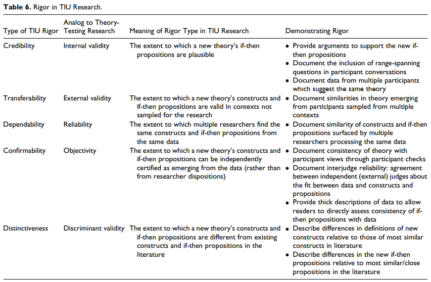{width="100%"}

TIU limitation:

-   not suited for theory testing

-   Participants' lack of knowledge (but can still have espouse theories)

Future research

-   Meta domains:

    -   An underlying assumption that may be reexamined

    -   Conflicting firm and customer viewpoints

    -   Conflict among key stakeholders

-   Possible content domains:

    -   Role of marketing in the firm

    -   Digital transformation of the firm

    -   consumer privacy

    -   Health care policy

    -   Government involvement and regulation

-   TIU method:

    -   Optimal sample size

    -   Eliciting causal connection

    -   Alternative probing techniques

[@moorman2016]

-   Marketing excellence is "a superior ability to perform essential customer-facing activities that improve customer, financial, stock market, and societal outcomes." (p. 6)

    -   superior ability to perform the 7As

-   4 elements of marketing organization (MARORG)

    -   Capabilities: "complex bundles of firm-level skills and knowledge that carry out marketing tasks and firm adaptation to marketplace changes." (p. 6)

    -   Configuration: the organizational structures, metrics, and incentives/control systems that shape marketing activities." (p. 6)

    -   Human capital: "creates, implement,s and evaluates a firm's strategy." (p. 6)

    -   Culture: "guides thinking and actions throughout the firm." (p. 6). Forms of organizational culture:

        -   Culture as the pattern of shared values and beliefs

        -   Culture as behaviors

        -   Culture presented by cultural artifacts (e.g., stories, rituals).

-   4 elements are mobilized through 7 marketing activities:

    -   **anticipating** marketplace changes

    -   **adapting** the firm to such changes

    -   **aligning** processes, structures, and people

    -   **activating** efficient and effective individual and organizational behaviors

    -   creating **accountability** for marketing performance

    -   **attracting** important financial, human and other resources

    -   engaging in **asset management** that develops and deploys marketing assets

[@kohli1990]

-   Market orientation "is the implementation of the marketing concept" (p. 1)

-   Market orientation is "the organizationwide **generation** of market intelligence pertaining to current and future customer needs, **dissemination** of the intelligence across departments, and **responsiveness** to it." (p. 6)

-   Core themes / pillars of the marketing concept

    -   Custoemr focus: Market intelligence is a broad concept that includes

        -   exogenous market factors that affect customer needs and preferences

        -   current and future needs of customers

    -   Coordinated marketing: one or more departments engaging in activities geared towards developing an understanding across departments

    -   Profitability: is a consequence of a market orientation rather than a part of it

-   Marketing orientation \< market orientation (less politically charged and focus on market).

{width="100%"}

{width="100%"}

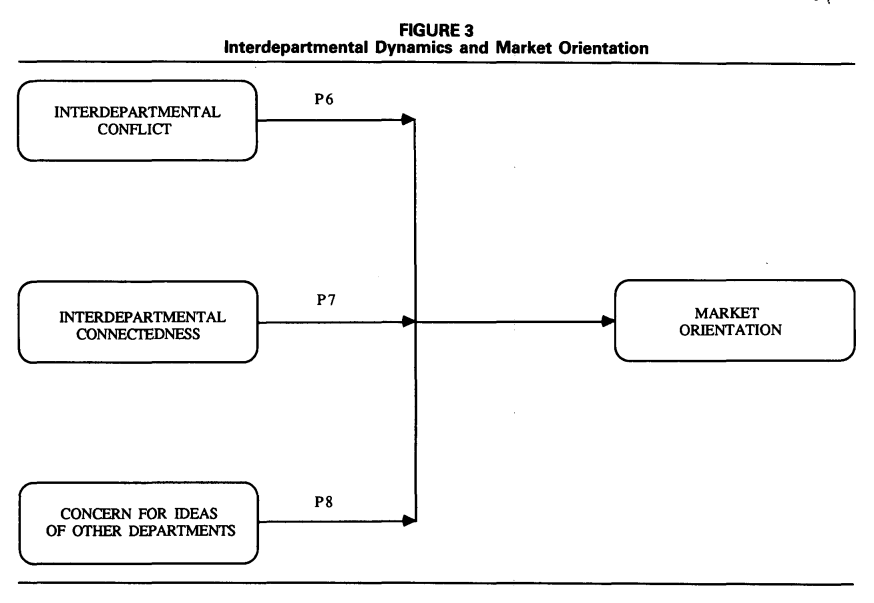{width="100%"}

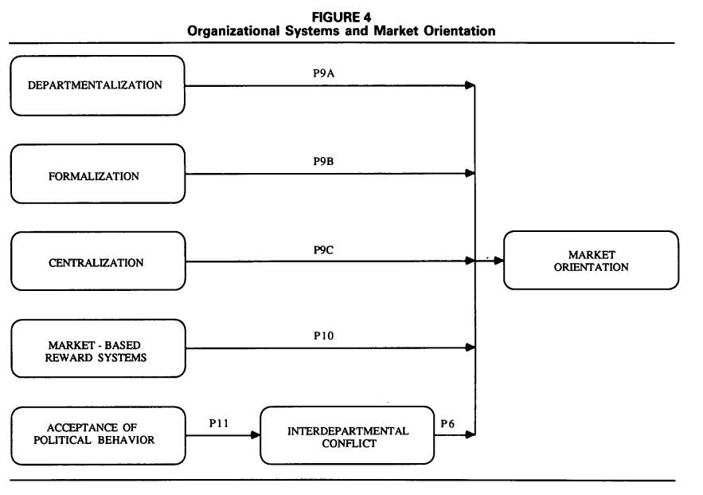{width="100%"}

## Branding

[@swaminathan2022]

-   Branding-finance literature review:

    -   [@srivastava1998]

    -   [@keller2006]

    -   [@edeling2016]

    -   [@edeling2021]

-   From a comprehensive search process with 4 criteria, 114 journal articles that look at the brand-related actions and stock market-based outcomes and 38 more with accounting-based metrics

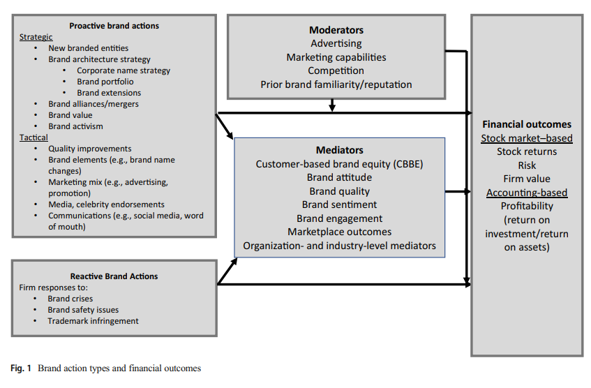{width="100%"}

Measuring the financial impact of brands

-   Stock returns (event studies)

-   Stock returns (response models) to examine continuous events.

-   Idiosyncratic and systematic risk

-   Firm value (Tobin's q) = the ratio of the market value of a firm to the replacement cost of its assets. Even though criticism regarding this metric has been raised [@bendle2018], there are answers [@peters2017]. Factors impact brand Tobin's q:

    -   corporate branding strategy [@Rao_2004]

    -   characteristics of a brand portfolio [@morgan2009]

    -   advertising [@wang2008]

-   Accounting-based performance and related outcomes are important for understanding the indirect effect f brand actions on financial value.

Categorizing brand actions by scope and cause

-   Cause (proactive vs. reactive)

    -   Proactive actions can be more positive than reactive actions.

    -   Even though managers are paid to be proactive, but is it always good to be proactive? Researchers have over-researched actions that can be taken by managers, but what if we play by the status quo (idea by Taleb)?

        -   bias toward intervention (naive interventionism: intervention that produces small visible gains, while creating the possibility off large - later harm): restraint from inaction is not likely to be rewarded.

-   Scope (strategic vs. tactical)

    -   Strategic actions focus on broader and longer-term goals (targeting, segmentation, diversification, new product introduction, rebranding, brand architecture, and brand acquisitions)

    -   Tactical actions focus on short-term expected implications (e.g., marketing mix)

Brand-finance interface:

-   Theoretical perspectives:

    -   Signaling theory/ info economics theory: brands are signals of quality to both investors and consumers [@connelly2010]. (call for research on signal environment and signal feedback dimension)

        -   Signaler: Types of actions and firms

        -   Signal: signal quality (credibility)

        -   receiver of signal: type of signal

        -   signaling environment (e.g., social media platforms)

        -   feedback from receiver to signaler

    -   Resource-based theory: A business's ability to generate value depends on its resources, whether they are valuable, rare, and costly to replicate, and if the organization is organized to get value from them. And if a resource has these components, it can create sustained competitive advantage.

-   Mediators

    -   Brand quality perceptions

    -   attitudes

    -   engagement: receives less attention

    -   marketplace outcomes (e.g., customer lifetime value, market share)

    -   organization-focused processes:

    -   industry-based processes (e.g., barriers to entry, threat of competition, analyst converge, relative market share): receives less attention

-   Moderators (then what is the difference between the organization factors as mediators and moderators):

    -   advertising (and other marketing mix variables)

    -   Prior brand strength

    -   organization factors (e..g., marketing capabilities)

    -   industry factors (e.g., competition)

Financial consequences of brand actions based on the scope and cause of actions

-   Proactive-strategic brand actions

    -   brand introduction and brand innovation: are value-creating activities (on revenue, profitability, firm value)

    -   brand architecture (e.g., new products in new and existing markets, brand naming strategy, target market)

        -   2 corporate naming strategies

            -   House of brands

            -   Branded house: greater efficiency and lower customization and cannibalization, more potential risk[@Rao_2004]

    -   leverage brand (e..g, leverage brand reputation to appeal to newer segments of consumers)

    -   Brand image and reputational capital:

        -   reputational capital: "an organization's stock of perceptual and social assets." (p. 649)

        -   Corporate social performance: "doing well while doing good." But the impact of its on firm performance is still under debate, which means we might be able to find moderators for this relationship.

        -   Sociopolitical activism (CSA): can be negative.

    -   Further research: new brand type (e.g., digital brand, sharing platform), or global branding, cocreation.

-   Proactive-tactical brand actions

    -   Brand tactical actions (Keller and Swaminathan, 2019):

        -   choice of brand elements (e.g., brand names, URLs, logos, symbols, characters, spokespeople, slogans, jingles, packages,signage).

        -   marketing-mix activities (4Ps)

        -   secondary associations (linking to other people, places, or things).

    -   Brand tactical actions by this paper:

        -   Name changes: good signal for changes in strategic direction.

        -   Brand quality improvement: positive effect on firm perofrmnace

        -   Advertising: direct (signalling and spillover on investors) and indirect effect (brand meaning and brand strength) on firm performance

        -   Social Media Communications: earned and owned social media influence brand awareness, purchase intent, and customer satisfaction then stock performance.

        -   WOM communication: using social tagging to assess brand image.

        -   pricing and channels: pricing and brand image have inverse relationship, while distribution intensity has a positive impacts on brand equity.

        -   celebrity endorsement: can have positive and negative impact on firm performance

    -   Further research: mostly stem from info rich environment.

-   Reactive brand actions

    -   Product recalls: negatively affect stock return, but prior reputation and advertising strength can mitigate this negative impact. And it can spillover to competitors as well. Prior reputation can serve as both a benefit (dampen unintentional impact), but a liability (exacerbate intentional impact - e.g., corporate social irresponsibility).

    -   Trademark disputes and protection: always good for plaintiff (regardless of thee verdict), bad for defendant in casae of unfavorable verdict.

    -   Brand crises: e.g., #DeleteUber

    -   Further Research: resolve double-edge sword of prior reputation; when and how advertising can mitigate crises; whether and when firms should be proactive vs. reactive) in regard to brand crises.

-   Additional research on contingent factors

    -   Number and strength of competitors can be a moderator of the impact of brand actions on CBBE (in my research, I look at both the impact of competition on brand actions e.g., social media adoption, and as a moderator between brand action and brand reputation).

    -   The quality of brand actions

    -   The speed of brand actions: (e.g., first -mover advantage)

[@swaminathan2020]

## Channels and Customer Management

[@hadida2018] The temporary marketing organization

-   A temporary organization is defined as "temporally bounded group of interdependent actors formed to perform a complex task." [@burke2016, p. 1237]

    -   "temporally bounded" = "institutionalized termination"

-   "Stand-Alone" Temporary Organization: Discrete time horizon (also known as stand-alone)

    -   Different from Joint venture (no past), Start-up (no past), Permanent organization.

    -   Absent of (1) history of interaction between members (might induce info asymmetry regarding task ability -\> self-selection to send signals, and require more enforcement mechanisms, but also because of the discreteness nature, this can be hard) (2) future.

-   Hybrids and fully embedded temporary organizations: the role of context

    -   Temporary can acquire a post or a future using

        -   its members' prior relationships

        -   Being embedded within a permanent organization with organizational context (but have to be careful, because "strong" prior ties can have limited information access[@granovetter1973], but can also serve as a good quality control - enforcement mechanisms, reducing principal-agent discrepancy)

-   Temporary organization drivers

    -   Task: reason for being: "The greater the novelty of the task, the greater the need for organization-specific selection and enforcement mechanism, and the higher the likelihood of using a stand-alone temporary organization relative to hybrid and fully embedded forms." (p. 7)

    -   Time "The shorter the duration of the task, the lower the feasibility of crafting organization-specific selection and enforcement mechanisms and the higher the likelihood of using a hybrid temporary organization relative to standalone and fully embedded forms." (p. 8)

    -   Team (composition - heterogeneity of its members): "The greater the heterogeneity of the team, the greater the need for enforcement through low-powered incentives and the higher the likelihood of using a fully embedded temporary organization relative to hybrid and stand-alone forms

-   Portability and Exogenous Selection and Enforcement Effects

    -   Portability: "selection and enforcement needs of a temporary organization may be portable or supplied exogenous, either from preexisting agent relationships (hybrid) or form the features of a permanent organization (fully embedded)" (p. 8).

    -   "The greater the novelty of the task, the lower the portability of the selection benefits from a hybrid temporary organization and the greater the need for organization-specific selection mechanisms." (p. 9)

    -   "For a hybrid temporary organization, enforcement benefits are portable regardless of the nature of the task." (p. 9)

    -   "The portability of a fully embedded temporary organization's selection and enforcement benefits is weaker than for those of a hybrid." (p. 10)

-   Performance Outcomes of the Temporary Marketing Organization

    -   Output Creativity (inherently linked to selection): "The closer the match between the novelty of a temporary marketing organization's task and its selection efforts, the greater the creativity of its output." (p. 10)

    -   Decision-making speed (inherently linked to enforcement): ""The closer the match between the novelty of a temporary marketing organization's task and its enforcement efforts, the greater its decision-making speed." (p. 11)

        -   The over-organization in term of enforcement can have adverse consequences on decision-making speed (due to reactance - lower instrinsic motivation).

-   Managerial Implications: Task novelty, time pressures, team heterogeneity, as temporary organization form's inputs.

-   Future Research Directions

    -   Different forms of temporary organizations: current study's classification based on dyadic vs. organization-levels norms might not be sufficient for future fine-grained analysis.

    -   Structural embeddedness: different from relational embeddedness (between a principal and an agent) where structural embeddedness is about connections among mutual contacts.

    -   Multilevel relationships (e.g., upstream suppliers, producers, downstream customer).

    -   Micro level proprieties and processes:

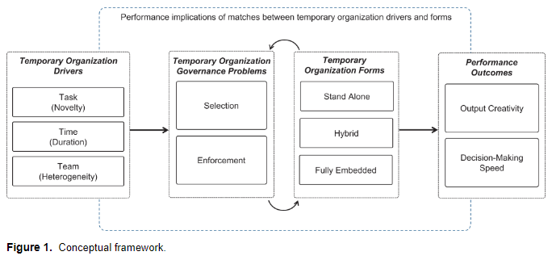{width="100%"}

[@rindfleisch1997]

-   TCA has many applications in marketing because

    -   it focuses on exchange

    -   survey-data

-   Problems to underutilized

    -   Refinements to the theory are no well known

    -   Empirical works are not well integrated

-   TCA is under the "New Insititutional Economics" paradigm (supplanted neoclassical economics)

-   TCA views firm as a governance structure

-   Assumptions

| Behavioral Assumptions | Transactional dimension   |
|------------------------|---------------------------|
| Bounded rationality    | Environmental uncertainty |
| Opportunism            | Asset specificity         |
| Risk Neutraliity       | Transaction Frequency     |

-   Logic

    -   If adaptability, performance evaluation, and safeguarding costs are absent or minimal, economic actors will choose market governance.

    -   If internal organization expenses exceed market production cost benefits, enterprises will choose this.

-   Contexts to apply TCA

    -   Vertical integration

    -   Vertical inter-organizational relationships

    -   Horizontal inter-organizational relationships

[@palmatier2013]

-   Commitment velocity: the rate and direction of change in commitment

-   Data

-   Study 1

    -   Data: longitudinal (6 years)

    -   Method: latent growth curve analysis

    -   Commitment velocity is a predictor of performance

-   Study :

    -   Data: Matched multiple-source data to see the antecedents of commitment velocity

    -   Found customer trust and dynamic capabilities as antecedents, but less impactful as a relationship ages where as investment capabilities become more important.

-   Tenets

    -   Exchange performance is influenced by both static and dynamic elements of relationship constructs, although dynamic elements are more important than static components for forecasting future behaviors and performance.

    -   Depending on the relative contributions of a construct-specific collection of underlying time-varying processes, the growth trajectories of relational constructs (such as trust, commitment, and relational norms) are distinctive and path-dependent.

    -   As relationships change, so do (a) the connections between relational constructs and (b) the relative weight of relational constructs in determining how trade outcomes are influenced.

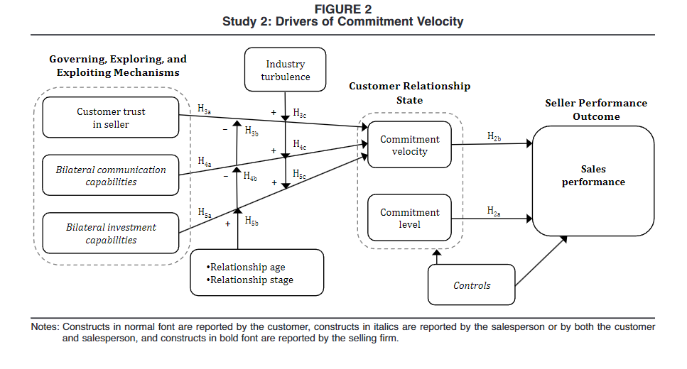{width="100%"}

[@harmeling2016]

-   Customer engagement marketing: "a firm's deliberate effort to motivate, empower, and measure customer contributions to marketing functions" (p. 312)

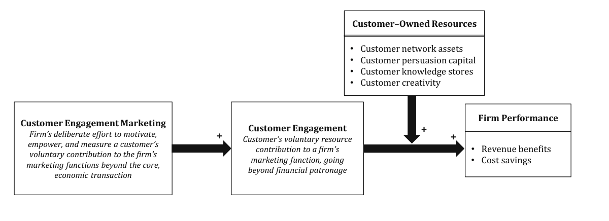{width="100%"}

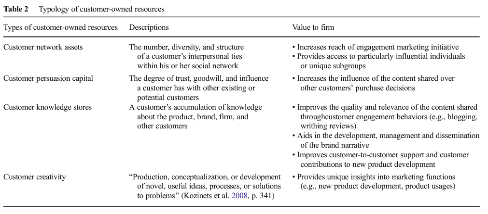{width="100%"}

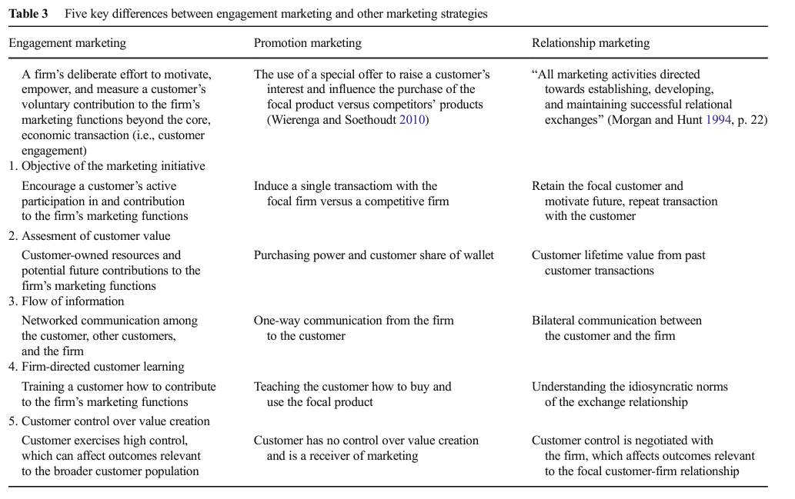{width="100%"}

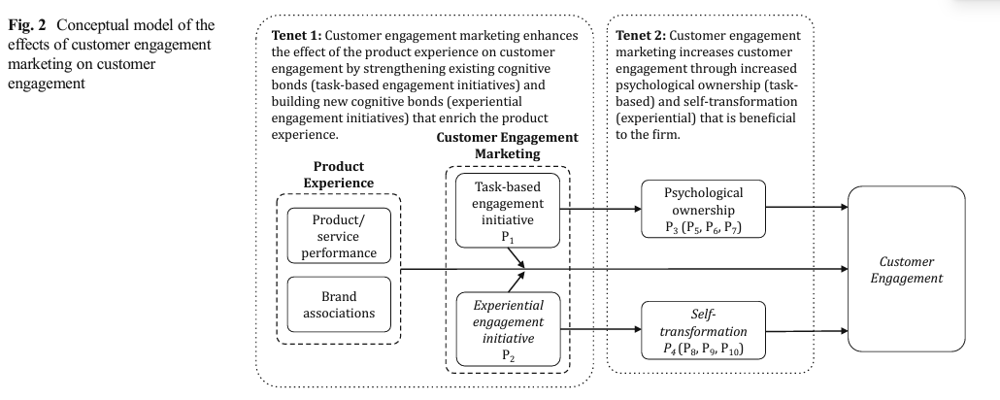{width="100%"}

## Human Capital

[@nath2008] CMO presence

[@germann2015]

-   Performance (Tobin's q) of firms that have a CMO is 15% greater than that of firms without a CMO

-   An extension of [@nath2008]

    -   Time horizon: more years

    -   Industry: more industries

    -   Models: panel data and instrumental variables

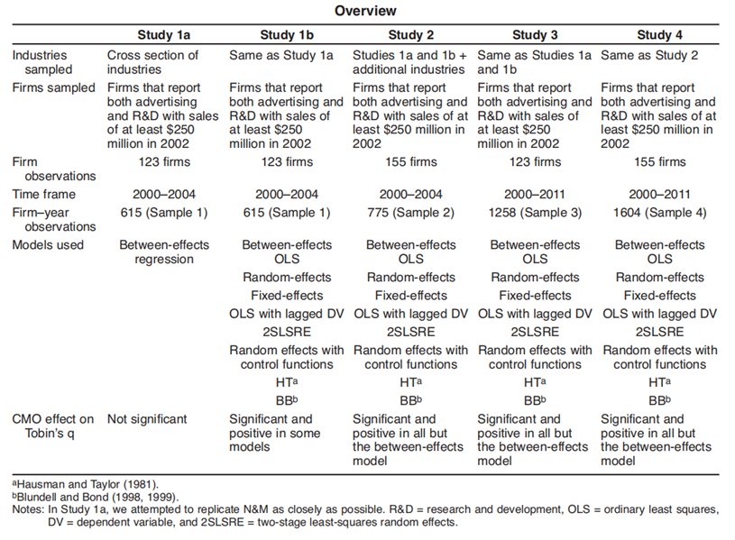{width="90%"}
