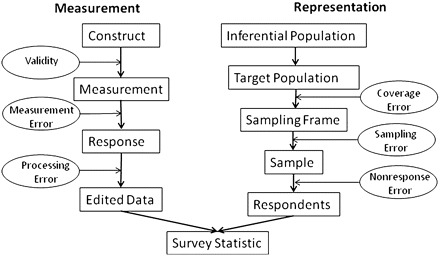

# Surveys

@chandon2005 posits that "self-generated validity" can obscure the link between purchase intentions and purchase behavior. On average, the link between latent intentions and purchase behavior is 58% stronger among survey consumers that that of nonsurveyed consumers.

@sheppard1988 found that the link between intentions and behavior is about 0.53

A little more improvement can be achieved in predictive power if we use segmentation before forecasting sales based on historical purchases and purchase intention @morwitz1992

|         | Sampling                        | Interviews            | Data environment |
|---------|---------------------------------|-----------------------|------------------|
| 1st era | area probability                | face-to-face          | stand-alone      |
| 2nd ear | random digital dial probability | telephone             | stand-alone      |
| 3rd era | non-probability                 | computer-administered | linked           |

: SICSS Summer 2020 -Survey Research in the Digital Age by professor **Matthew Salganik**

Total survey error framework [@Groves_2010]

Insight:

1.  Errors can come from bias or variance
2.  Total survey error = Measurement error + representation error

{style="display: block; margin: 1em auto" width="100%"}

\[@Groves_2010, Fig. 3\]


Probability and Non-probability Sampling

-   Probability sample: every unit from a frame population has a known and non-zero probability of inclusion
-   With weighting, we can recover bias in your sampling.

<!-- -->

-   Non-response problem

Horvitz-Thompson estimator (or bias estimator):

$$
\hat{\bar{y}} = \frac{\sum_{i \in s}y_i / \pi_i}{N}
$$

where $\pi_i$ = person i's probability of inclusion (we have to estimate)

[Wiki Survey](https://www.allourideas.org/)

-   Create a survey that leverages the power of people

Mass Collaboration

-   Human Computation: Train People -> Train Lots of People -> Train Machine

    -   Cleaning

    -   De-biasing

    -   Combining

-   Open Call:

    -   solutions are easier to check than generate

    -   required specialized skills

-   Distributed Data Collection:

    -   People go out and collect data

    -   quality check

[Fragile family challenges](https://www.fragilefamilieschallenge.org/)


## Anchoring Vignettes

-   Problem of interpersonal incomparability

-   Resources:

    -   [@king2004]

    -   [@king2007]

    -   [@hopkins2010]

    -   [Examples](https://gking.harvard.edu/vign/eg)

-   Help with 2 questions:

    -   Different respondents understand the same question differently: Incomparaability in Survey Responses ("DIF"). Agreement on theoretical concept is almost nearly impossible.

    -   How can we measure concepts that can only be defined by examples

-   Measure like usually, then subtract the incomparable portion. (i.e., using the assessment from the same respondents for a particular example/case to correct/adjust for the self-assessment).

-   Varying vignette assessments give us DIF (i.e., **differential item functioning**)

-   Since we created the anchors (i.e., examples), we know the true vignette assessments are fixed over respondents


### Nonparametric method

Code the relative ranking of self-assessment in accordance to vignettes.

Inconsistencies would be considered ties.

Measurement Assumptions:

-   **Response consistency**: Each responder approaches the self-assessment and vignette categories in a same manner across questions.

-   **Vignette Equivalence**: For every vignette, the real level is the same for all respondents.

Used Ordered Probit to estimate.

### Parametric method

The more vignettes that we have better identification. But it will introduce measurement errors.

-   Also use an ordinal probit model

-   with varying thresholds and a random effect.


```r
# install.packages("anchors")
library(anchors)

# Example from the package's authors
data("freedom")
head(freedom)
a1 <-
    anchors(self ~ vign2 + vign3 + vign4 + vign5 + vign6, freedom, method = "C")
summary(a1)
```


# Experiment

Things to consider:

-   Validity

    -   statistical conclusion validity
    -   internal validity
    -   construct validity: whether you operationalize your construct correctly
    -   external validity: generalization

-   Heterogeneity of treatment effects

    -   average (aggregate) effect can be artificially constructed.

-   Mechanisms


More things to consider

-   cost
-   control
-   realism
-   ethics


The Principles of Humane Experimental Technique by Russell and Burch (1959): 3Rs

-   Replace: with natural (less invasive)
-   Refine: less harmful
-   Reduce: min number of participants


Before running experiments, to make sure that you did not tamper with the data, or hypotheses (i.e., change them after the fact), you should always pre-register your research. A website that allows you to do this and automatically provides you with time stamp is [aspredicted](https://aspredicted.org/)

This way then you can show to reviewers that you did hypothesize before running analysis.


To combat replication crisis in psychology, we can advocate for open research in which researchers public their data and analyses. Popular websites include:

-   [ResearchBox](https://researchbox.org/index.php)

-   <https://osf.io/>

To see whether authors temper with their data, we can use [p-curve](http://p-curve.com/) to inspect. [1](https://datacolada.org/66) [2](https://datacolada.org/67) [3](https://datacolada.org/49) [4](https://datacolada.org/45) [5](https://datacolada.org/91)

[Interaction Effects Need Interaction Controls](https://datacolada.org/80) (basically, you can't just control for main effects).
