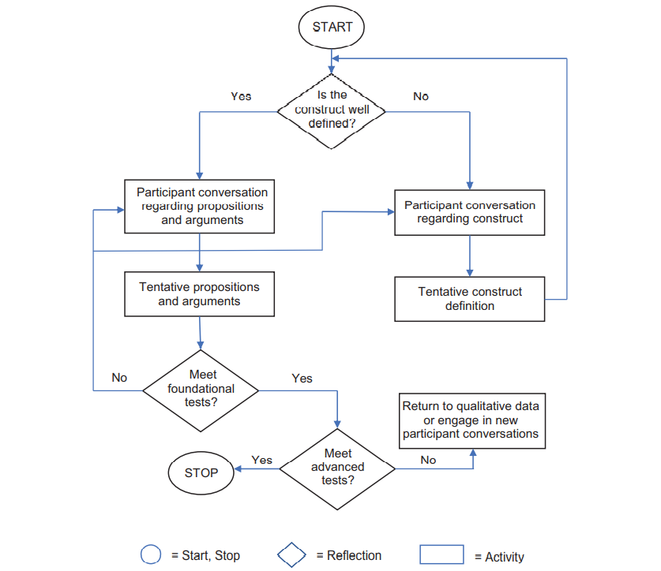
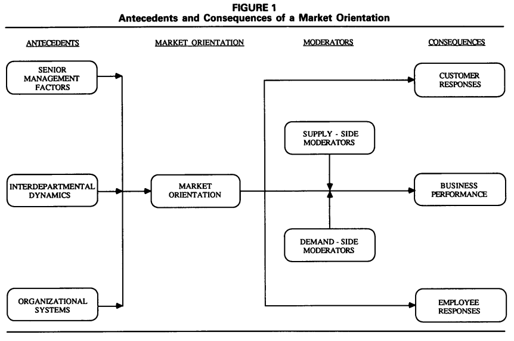
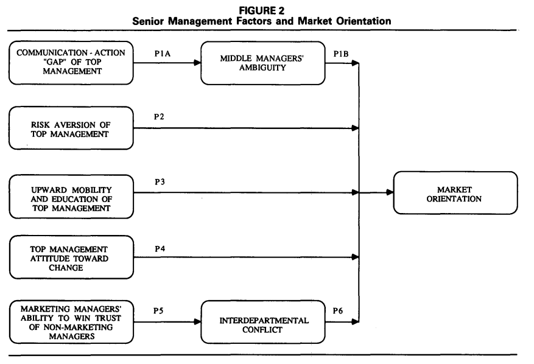

# Marketing Strategy

## Intro

[@morgan2018]

Marketing strategy = central construct of strategic marketing, where strategic marketing = the general field of study

Marketing strategy is "an organization's integrated pattern of decisions that specify its crucial choices concerning products, markets, marketing activities and marketing resources in the creation, communication and/or delivery of products that offer value to customers in exchanges with the organization and thereby enables the organization to achieve specific objectives." (Varadarajan 2010, p. 119)

marketing strategy "encompasses the"what" strategy decisions and actions and "how" strategy-making and realization processes concerning a firm's desired goals." (p. 7)

Methods:

Contributions

1.  In the past 19 years, marketing strategy as a field focuses on marketing tactics, resources, capabilities
2.  4 sub-domains under marketing strategy
    1.  formulation-content: figuring out what to do + strategy decisions: studies goals that a marketing strategy is designed to deliver and the major broad strategic decisions related to how these are to be achieved.

    2.  formulation-process: figuring out what to do + strategy making and strategy realization: studies the mechanism used to develop marketing strategy goals and pick the broad strategic means (i.e., market target, required value proposition, desired positioning, timing).

    3.  implementation-content: doing it + strategy decisions: studies the detailed integrated marketing program tactics decisions, actions, and resource deployments.

    4.  implementation-process: doing it + strategy making and strategy realization: studies "the mechanism used to identify, select, and realize integrated marketing program tactics designed to deliver marketing strategy content decisions."

Insights:

-   Most studies focused on individual marketing mix (i.e., individual tactics), not marketing strategies and integrated marketing programs.

-   Half of the studies are logic or data-driven. Hence, lack of theory.

-   Papers typically use multiple theories, instead of a single theory.

-   Qualitative method is rare and trending to 0.

[@zeithaml2019]

What is Theories-in-use?

-   A TIU is "a person's mental model of how things work in a particular context." [@argyris1974theory]

-   individual's TIU is a set of "if-then" relationships among actions and outcomes. [@zaltman1982theory]

-   Espoused theories are "the mental models individuals claim or purport to have." It's different from TIU in the sense that individuals might have TIU, but they can't articulate it.

-   TIU is grounded in both the researcher and the interviewees' mindsets.

When TIU approach is appropriate?

-   To construct organic marketing theories

-   To extend extant perspectives and address ambiguities

-   To guide empirical efforts

Implementing a TIU approach

{width="100%"}

Intro

-   Most cited papers in marketing typically use the TIU approach. However, marketing as a field usually borrow theory from other disciplines such as econ or psych.

Questions:

-   What is the different between grounded theory and TIU? Is it that TIU just a special case of grounded theory, while there are other approaches such as case study and ethnography?

Advanced Guidelines:

-   Construct development - Abstraction:

    -   Identify elements that are part of a a broader, more abstract element

    -   Identify elements that likely co-occur (or covary)

    -   Identify elements that are neither subset of one of the elements nor do they necessarily co-occur.

-   Proposition development:

    -   Axial coding: linking two or more concepts

-   Argument development

-   Pull it all together: choose a parsimonious set of proposition - selective coding.

TIU Tradecraft

-   Extensive Iteration

-   Active Listening

-   Brief Suspension

-   Depth over Breadth

-   Openness to New Issues

-   Conflict Appreciation

-   Mosaic Filling

-   Bias Recognition

-   Demarcation of TIU Study Limits

-   Crafting Research papers

Evaluate rigor in TIU research:

{width="100%"}

TIU limitation:

-   not suited for theory testing

-   Participants' lack of knowledge (but can still have espouse theories)

Future research

-   Meta domains:

    -   An underlying assumption that may be reexamined

    -   Conflicting firm and customer viewpoints

    -   Conflict among key stakeholders

-   Possible content domains:

    -   Role of marketing in the firm

    -   Digital transformation of the firm

    -   consumer privacy

    -   Health care policy

    -   Government involvement and regulation

-   TIU method:

    -   Optimal sample size

    -   Eliciting causal connection

    -   Alternative probing techniques

[@moorman2016]

-   Marketing excellence is "a superior ability to perform essential customer-facing activities that improve customer, financial, stock market, and societal outcomes." (p. 6)

    -   superior ability to perform the 7As

-   4 elements of marketing organization (MARORG)

    -   Capabilities: "complex bundles of firm-level skills and knowledge that carry out marketing tasks and firm adaptation to marketplace changes." (p. 6)

    -   Configuration: the organizational structures, metrics, and incentives/control systems that shape marketing activities." (p. 6)

    -   Human capital: "creates, implement,s and evaluates a firm's strategy." (p. 6)

    -   Culture: "guides thinking and actions throughout the firm." (p. 6). Forms of organizational culture:

        -   Culture as the pattern of shared values and beliefs

        -   Culture as behaviors

        -   Culture presented by cultural artifacts (e.g., stories, rituals).

-   4 elements are mobilized through 7 marketing activities:

    -   **anticipating** marketplace changes

    -   **adapting** the firm to such changes

    -   **aligning** processes, structures, and people

    -   **activating** efficient and effective individual and organizational behaviors

    -   creating **accountability** for marketing performance

    -   **attracting** important financial, human and other resources

    -   engaging in **asset management** that develops and deploys marketing assets

[@kohli1990]

-   Market orientation "is the implementation of the marketing concept" (p. 1)

-   Market orientation is "the organizationwide **generation** of market intelligence pertaining to current and future customer needs, **dissemination** of the intelligence across departments, and **responsiveness** to it." (p. 6)

-   Core themes / pillars of the marketing concept

    -   Custoemr focus: Market intelligence is a broad concept that includes

        -   exogenous market factors that affect customer needs and preferences

        -   current and future needs of customers

    -   Coordinated marketing: one or more departments engaging in activities geared towards developing an understanding across departments

    -   Profitability: is a consequence of a market orientation rather than a part of it

-   Marketing orientation \< market orientation (less politically charged and focus on market).

{width="100%"}

{width="100%"}

{width="100%"}

{width="100%"}
